# API Integration

<cite>
**Referenced Files in This Document**
- [main.js](file://nutricoach/frontend/src/main.js)
- [App.vue](file://nutricoach/frontend/src/App.vue)
- [router.js](file://nutricoach/frontend/src/router.js)
- [LandingPage.vue](file://nutricoach/frontend/components/LandingPage.vue)
- [Dashboard.vue](file://nutricoach/frontend/components/Dashboard.vue)
- [package.json](file://nutricoach/frontend/package.json)
- [vite.config.js](file://nutricoach/frontend/vite.config.js)
- [app.py](file://nutricoach/backend/app.py)
- [API.md](file://nutricoach/backend/API.md)
- [init_db.py](file://nutricoach/backend/init_db.py)
- [schema.sql](file://nutricoach/backend/schema.sql)
- [README.md](file://nutricoach/README.md)
</cite>

## Table of Contents
1. [Introduction](#introduction)
2. [Project Structure](#project-structure)
3. [Core Components](#core-components)
4. [Architecture Overview](#architecture-overview)
5. [Detailed Component Analysis](#detailed-component-analysis)
6. [Dependency Analysis](#dependency-analysis)
7. [Performance Considerations](#performance-considerations)
8. [Troubleshooting Guide](#troubleshooting-guide)
9. [Conclusion](#conclusion)
10. [Appendices](#appendices)

## Introduction
This document describes the API integration between the NutriCoach AI frontend (Vue.js) and backend (Python Flask). It covers HTTP request/response patterns, axios usage, CORS configuration, authentication flow, error handling, data transformations, and practical examples of consuming APIs from Vue components. It also includes debugging and performance optimization guidance tailored to this codebase.

## Project Structure
The project is split into two primary parts:
- Frontend: Vue 3 application bootstrapped with Vite, routing via vue-router, and HTTP client via axios.
- Backend: Flask application exposing REST endpoints, with SQLite persistence and CORS enabled.

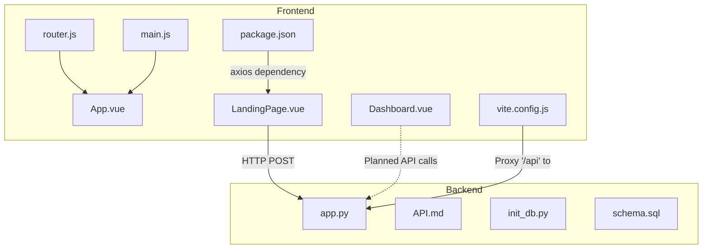

**Diagram sources**
- [main.js:1-6](file://nutricoach/frontend/src/main.js#L1-L6)
- [App.vue:1-11](file://nutricoach/frontend/src/App.vue#L1-L11)
- [router.js:1-14](file://nutricoach/frontend/src/router.js#L1-L14)
- [LandingPage.vue:1-92](file://nutricoach/frontend/components/LandingPage.vue#L1-L92)
- [Dashboard.vue:1-46](file://nutricoach/frontend/components/Dashboard.vue#L1-L46)
- [package.json:1-19](file://nutricoach/frontend/package.json#L1-L19)
- [vite.config.js:1-17](file://nutricoach/frontend/vite.config.js#L1-L17)
- [app.py:1-31](file://nutricoach/backend/app.py#L1-L31)
- [API.md:1-59](file://nutricoach/backend/API.md#L1-L59)
- [init_db.py:1-47](file://nutricoach/backend/init_db.py#L1-L47)
- [schema.sql:1-25](file://nutricoach/backend/schema.sql#L1-L25)

**Section sources**
- [main.js:1-6](file://nutricoach/frontend/src/main.js#L1-L6)
- [router.js:1-14](file://nutricoach/frontend/src/router.js#L1-L14)
- [package.json:1-19](file://nutricoach/frontend/package.json#L1-L19)
- [vite.config.js:1-17](file://nutricoach/frontend/vite.config.js#L1-L17)
- [app.py:1-31](file://nutricoach/backend/app.py#L1-L31)
- [API.md:1-59](file://nutricoach/backend/API.md#L1-L59)
- [init_db.py:1-47](file://nutricoach/backend/init_db.py#L1-L47)
- [schema.sql:1-25](file://nutricoach/backend/schema.sql#L1-L25)

## Core Components
- Axios client usage in Vue components for HTTP requests.
- Vite proxy configuration to route API traffic to the Flask backend.
- Flask endpoints for user creation and CORS-enabled responses.
- Database initialization scripts for SQLite tables.

Key integration points:
- Axios dependency declared in the frontend package manifest.
- Proxy configuration in Vite to avoid CORS issues during development.
- Flask CORS enabled globally and a user creation endpoint implemented.
- Database schema and initialization scripts for persistence.

**Section sources**
- [package.json:10-13](file://nutricoach/frontend/package.json#L10-L13)
- [vite.config.js:9-14](file://nutricoach/frontend/vite.config.js#L9-L14)
- [app.py:1-31](file://nutricoach/backend/app.py#L1-L31)
- [init_db.py:1-47](file://nutricoach/backend/init_db.py#L1-L47)
- [schema.sql:1-25](file://nutricoach/backend/schema.sql#L1-L25)

## Architecture Overview
The frontend communicates with the backend using axios. During development, Vite proxies requests prefixed with "/api" to the Flask backend. The backend exposes a user creation endpoint and enables CORS for cross-origin requests.

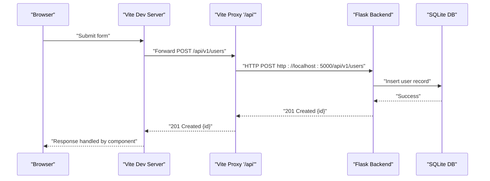

**Diagram sources**
- [vite.config.js:9-14](file://nutricoach/frontend/vite.config.js#L9-L14)
- [app.py:16-26](file://nutricoach/backend/app.py#L16-L26)
- [LandingPage.vue:39-53](file://nutricoach/frontend/components/LandingPage.vue#L39-L53)

## Detailed Component Analysis

### Frontend Bootstrapping and Routing
- The Vue app is created and mounted, with router integration.
- Routes define navigation targets; the landing page is the default route.

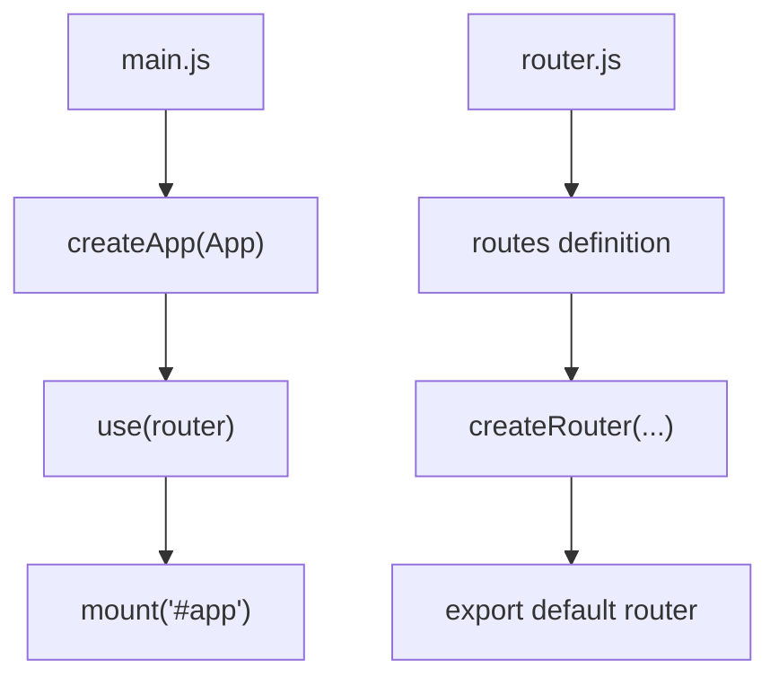

**Diagram sources**
- [main.js:1-6](file://nutricoach/frontend/src/main.js#L1-L6)
- [router.js:1-14](file://nutricoach/frontend/src/router.js#L1-L14)

**Section sources**
- [main.js:1-6](file://nutricoach/frontend/src/main.js#L1-L6)
- [router.js:1-14](file://nutricoach/frontend/src/router.js#L1-L14)
- [App.vue:1-11](file://nutricoach/frontend/src/App.vue#L1-L11)

### Axios Configuration and Request Patterns
- Axios is imported in the landing page component to perform HTTP requests.
- The component constructs a user payload and posts it to the backend endpoint.
- Error handling is performed via try/catch around the axios call.

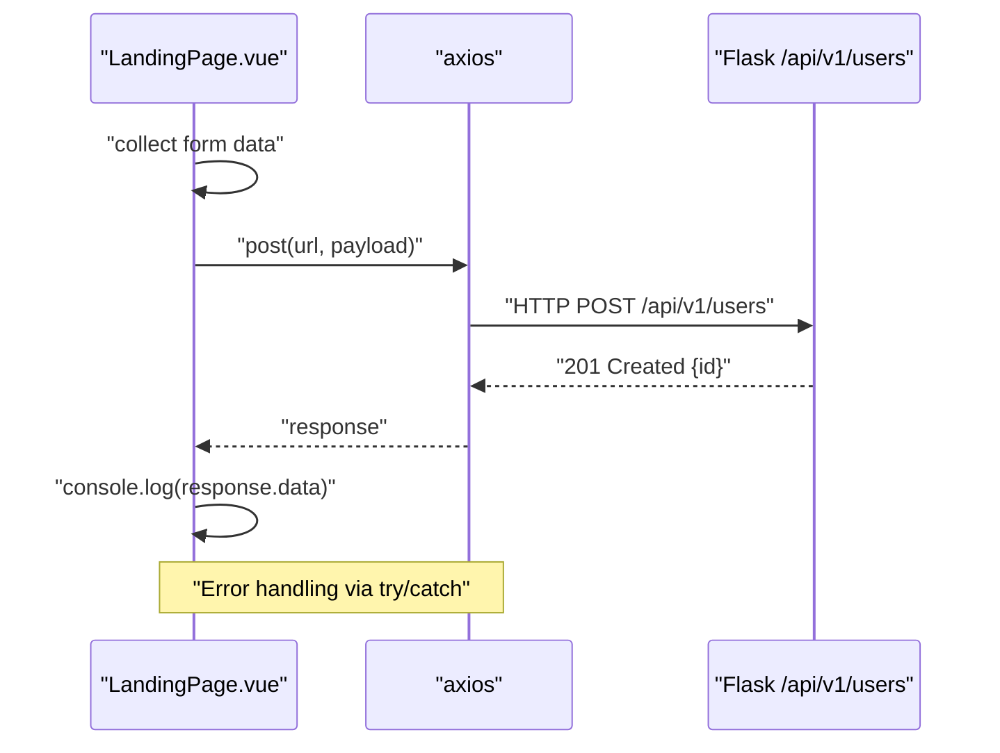

**Diagram sources**
- [LandingPage.vue:28-55](file://nutricoach/frontend/components/LandingPage.vue#L28-L55)
- [app.py:16-26](file://nutricoach/backend/app.py#L16-L26)

**Section sources**
- [LandingPage.vue:28-55](file://nutricoach/frontend/components/LandingPage.vue#L28-L55)
- [package.json:13-13](file://nutricoach/frontend/package.json#L13-L13)

### Vite Proxy and CORS Handling
- Vite’s dev server proxies "/api" to the Flask backend running on localhost:5000.
- Flask enables CORS globally, allowing cross-origin requests from the frontend origin.

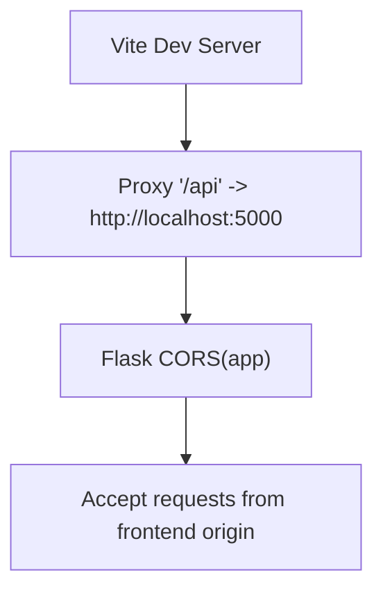

**Diagram sources**
- [vite.config.js:9-14](file://nutricoach/frontend/vite.config.js#L9-L14)
- [app.py:2-7](file://nutricoach/backend/app.py#L2-L7)

**Section sources**
- [vite.config.js:1-17](file://nutricoach/frontend/vite.config.js#L1-L17)
- [app.py:1-31](file://nutricoach/backend/app.py#L1-L31)

### Backend Endpoints and Data Models
- The backend defines a user creation endpoint under "/api/v1/users".
- The API specification outlines base URL, endpoints, and data models for users, diet preferences, and meal plans.
- The database schema includes users, diet_preferences, and meal_plans tables.

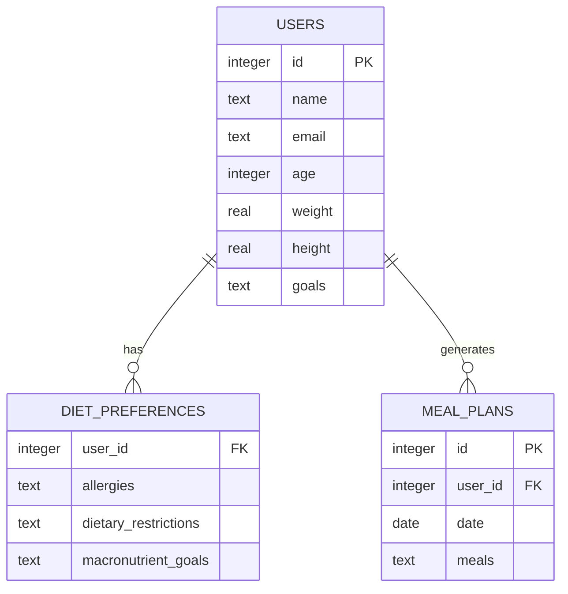

**Diagram sources**
- [API.md:27-59](file://nutricoach/backend/API.md#L27-L59)
- [schema.sql:1-25](file://nutricoach/backend/schema.sql#L1-L25)

**Section sources**
- [app.py:16-26](file://nutricoach/backend/app.py#L16-L26)
- [API.md:1-59](file://nutricoach/backend/API.md#L1-L59)
- [init_db.py:1-47](file://nutricoach/backend/init_db.py#L1-L47)
- [schema.sql:1-25](file://nutricoach/backend/schema.sql#L1-L25)

### Authentication Flow and Token Management
- The API specification includes authentication endpoints for registration and login.
- The current frontend implementation does not yet consume authentication endpoints or manage tokens.
- Recommended approach:
  - On successful login, store the returned token (e.g., JWT) in secure storage.
  - Attach Authorization headers to protected requests.
  - Redirect unauthenticated users to the login route.

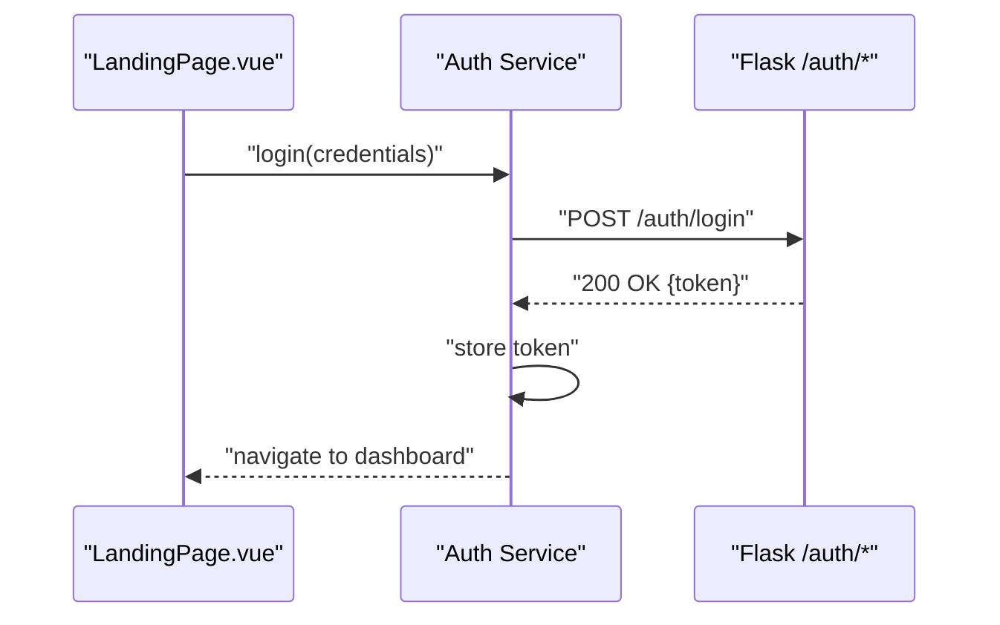

**Diagram sources**
- [API.md:21-24](file://nutricoach/backend/API.md#L21-L24)

**Section sources**
- [API.md:21-24](file://nutricoach/backend/API.md#L21-L24)

### Protected Endpoint Access
- After obtaining a token, set Authorization headers for protected endpoints.
- Example header: Authorization: Bearer <token>.
- Apply guards in the router to protect routes requiring authentication.

[No sources needed since this section provides general guidance]

### Error Handling Strategies
- Network failures: axios throws errors caught in try/catch; log and present user-friendly messages.
- API errors: inspect response status and body; surface meaningful errors to users.
- Validation responses: expect 422/400 responses with validation details; render field-specific messages.

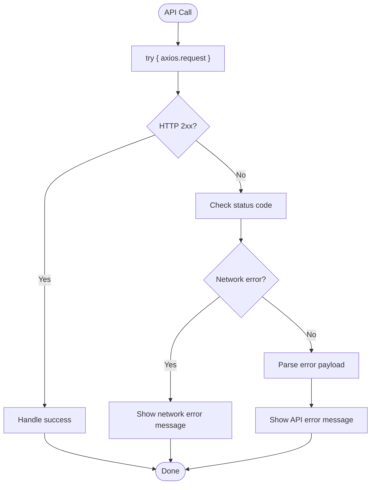

**Diagram sources**
- [LandingPage.vue:47-52](file://nutricoach/frontend/components/LandingPage.vue#L47-L52)

**Section sources**
- [LandingPage.vue:47-52](file://nutricoach/frontend/components/LandingPage.vue#L47-L52)

### Data Transformation Between Frontend and Backend
- Frontend forms send JSON payloads to backend endpoints.
- Backend expects specific keys (e.g., name, email, age, weight, goals) for user creation.
- Normalize data types (numbers, booleans) before sending to backend.

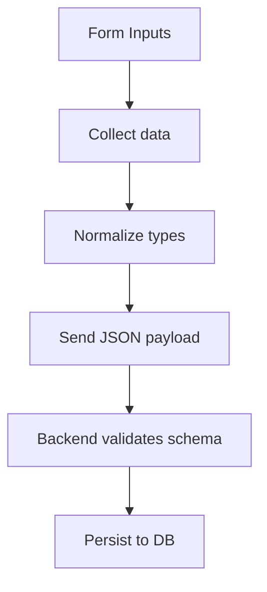

**Diagram sources**
- [LandingPage.vue:39-46](file://nutricoach/frontend/components/LandingPage.vue#L39-L46)
- [app.py:16-26](file://nutricoach/backend/app.py#L16-L26)

**Section sources**
- [LandingPage.vue:39-46](file://nutricoach/frontend/components/LandingPage.vue#L39-L46)
- [app.py:16-26](file://nutricoach/backend/app.py#L16-L26)

### Practical Examples of API Consumption from Vue Components
- Form submission:
  - Collect form data, construct payload, and post to "/api/v1/users".
  - Handle success and error branches.
- Data fetching:
  - Use axios.get to retrieve user details, diet preferences, or meal plans.
  - Update component state with received data.
- Real-time updates:
  - Poll endpoints periodically or integrate WebSocket support in the future.

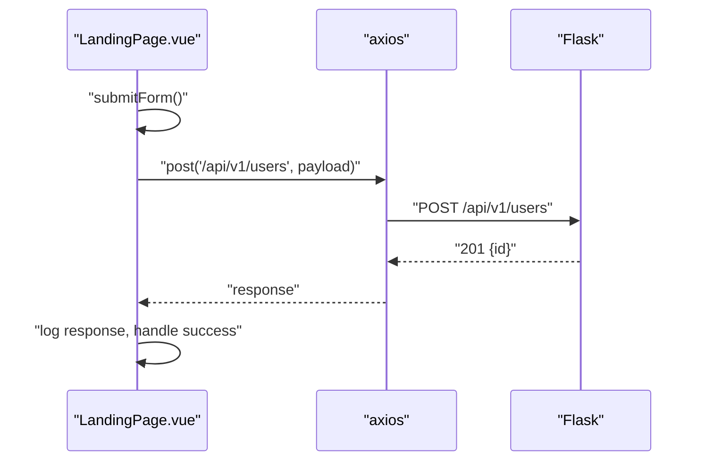

**Diagram sources**
- [LandingPage.vue:39-53](file://nutricoach/frontend/components/LandingPage.vue#L39-L53)
- [app.py:16-26](file://nutricoach/backend/app.py#L16-L26)

**Section sources**
- [LandingPage.vue:39-53](file://nutricoach/frontend/components/LandingPage.vue#L39-L53)
- [API.md:6-24](file://nutricoach/backend/API.md#L6-L24)

## Dependency Analysis
- Frontend depends on Vue, vue-router, and axios.
- Backend depends on Flask and flask-cors.
- Vite proxy bridges frontend and backend during development.

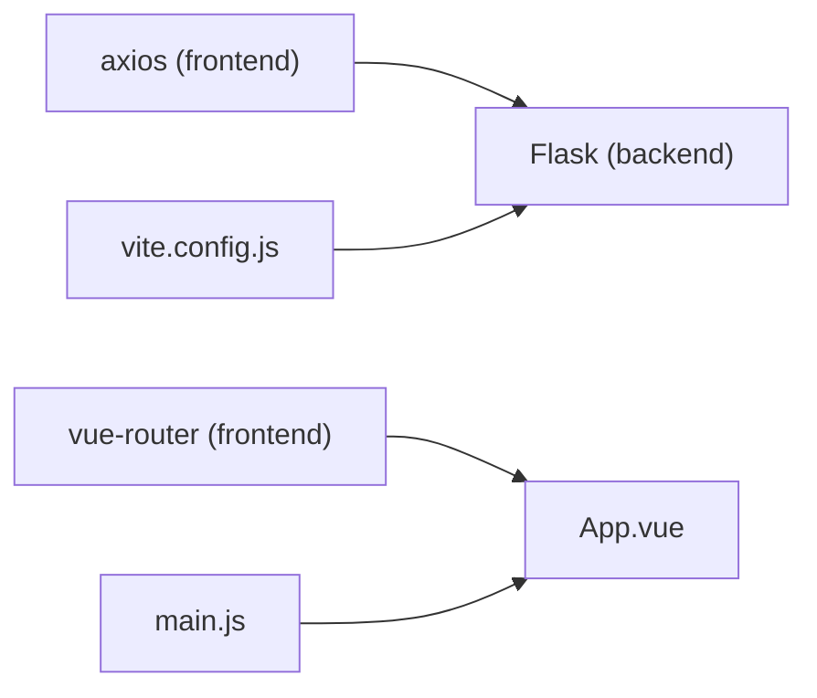

**Diagram sources**
- [package.json:10-13](file://nutricoach/frontend/package.json#L10-L13)
- [app.py:1-7](file://nutricoach/backend/app.py#L1-L7)
- [vite.config.js:9-14](file://nutricoach/frontend/vite.config.js#L9-L14)
- [main.js:1-6](file://nutricoach/frontend/src/main.js#L1-L6)

**Section sources**
- [package.json:10-13](file://nutricoach/frontend/package.json#L10-L13)
- [app.py:1-7](file://nutricoach/backend/app.py#L1-L7)
- [vite.config.js:1-17](file://nutricoach/frontend/vite.config.js#L1-L17)
- [main.js:1-6](file://nutricoach/frontend/src/main.js#L1-L6)

## Performance Considerations
- Minimize payload sizes by sending only required fields.
- Debounce rapid user inputs before triggering API calls.
- Cache frequently accessed data (e.g., user profile) to reduce redundant requests.
- Use pagination for lists (e.g., meal plan history).
- Monitor network tab in browser devtools to identify slow endpoints.

[No sources needed since this section provides general guidance]

## Troubleshooting Guide
Common issues and resolutions:
- CORS errors in development:
  - Ensure Vite proxy is configured for "/api" and Flask CORS is enabled.
- Backend not reachable:
  - Verify Flask runs on host 0.0.0.0 and port 5000.
- Database initialization:
  - Run the initialization script to create tables before starting the backend.
- Network failures:
  - Check axios error messages and status codes; implement retry logic for transient failures.
- Authentication:
  - Confirm login endpoint returns a token and that Authorization headers are attached to protected requests.

**Section sources**
- [vite.config.js:9-14](file://nutricoach/frontend/vite.config.js#L9-L14)
- [app.py:2-7](file://nutricoach/backend/app.py#L2-L7)
- [init_db.py:1-47](file://nutricoach/backend/init_db.py#L1-L47)
- [LandingPage.vue:47-52](file://nutricoach/frontend/components/LandingPage.vue#L47-L52)
- [API.md:21-24](file://nutricoach/backend/API.md#L21-L24)

## Conclusion
NutriCoach AI integrates a Vue frontend with a Flask backend using axios for HTTP communication. Vite’s proxy and Flask’s CORS configuration enable seamless development. The current implementation focuses on user creation; extending it with authentication, protected endpoints, and robust error handling will complete the API integration story. Following the patterns and recommendations in this document will help maintain clean, reliable, and performant frontend-backend communication.

## Appendices
- Development startup steps and base URLs are documented in the project README.

**Section sources**
- [README.md:25-77](file://nutricoach/README.md#L25-L77)