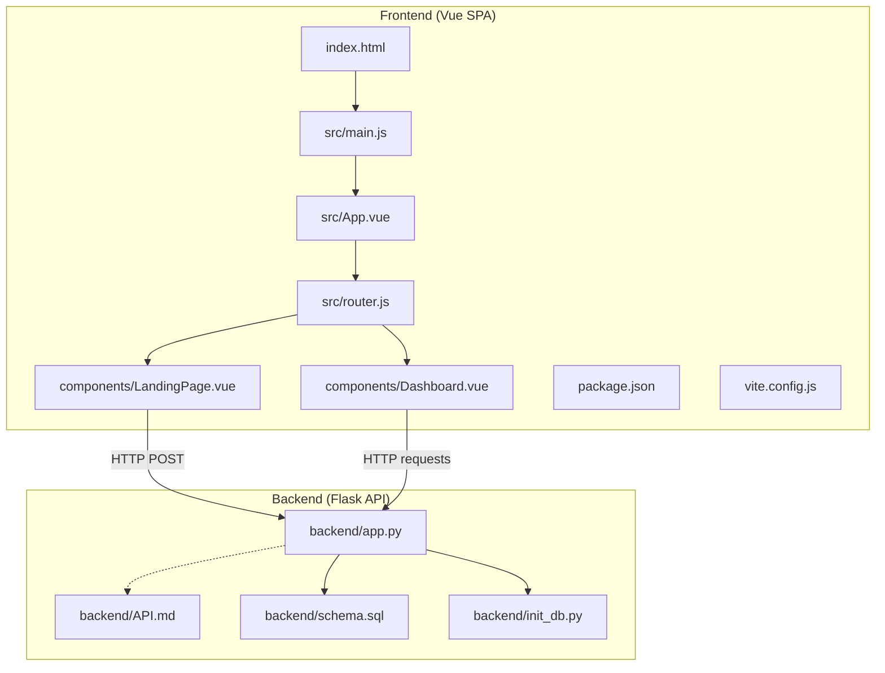
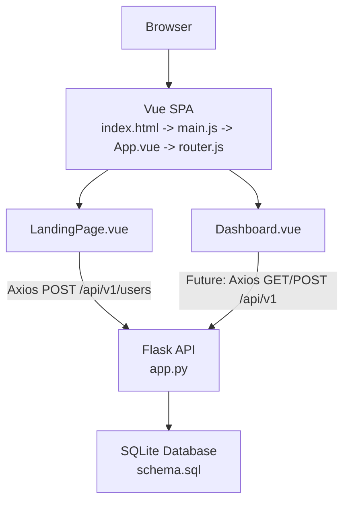
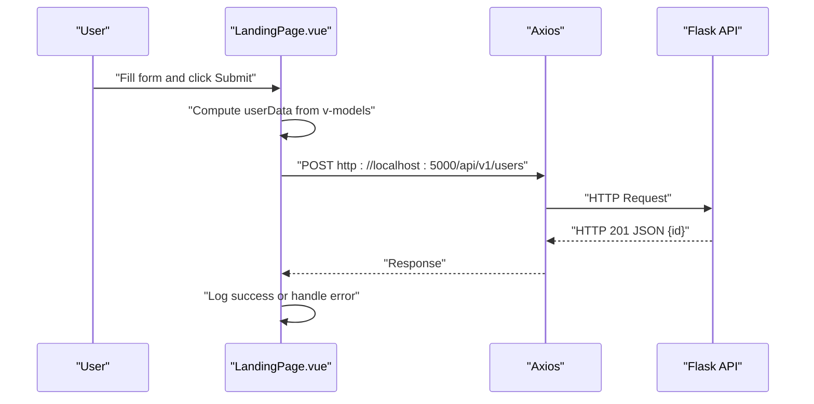
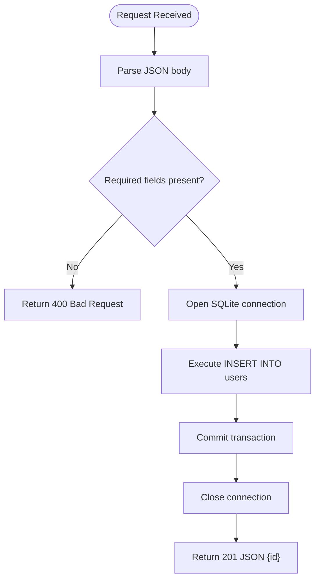
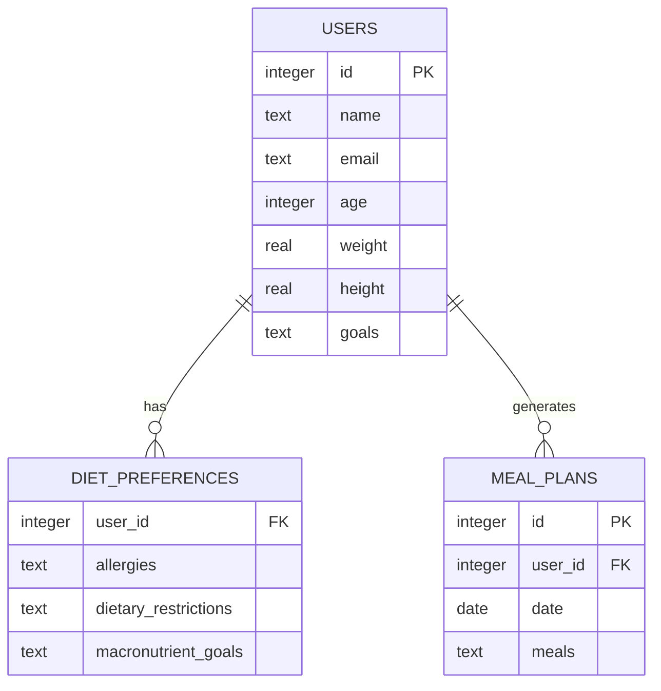
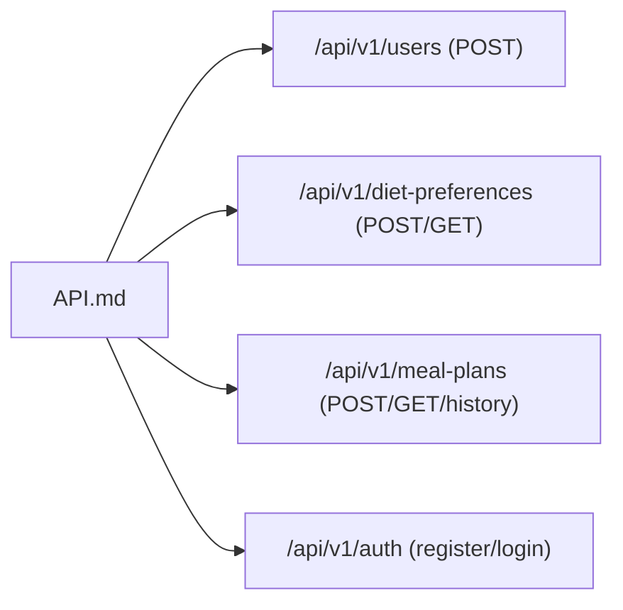
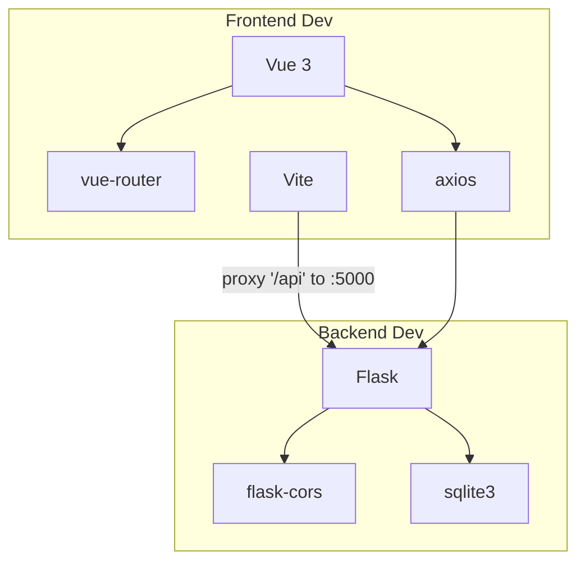

# Architecture Overview

<cite>
**Referenced Files in This Document**
- [README.md](file://README.md)
- [backend/app.py](file://nutricoach/backend/app.py)
- [backend/API.md](file://nutricoach/backend/API.md)
- [backend/schema.sql](file://nutricoach/backend/schema.sql)
- [backend/init_db.py](file://nutricoach/backend/init_db.py)
- [frontend/src/main.js](file://nutricoach/frontend/src/main.js)
- [frontend/src/App.vue](file://nutricoach/frontend/src/App.vue)
- [frontend/src/router.js](file://nutricoach/frontend/src/router.js)
- [frontend/components/LandingPage.vue](file://nutricoach/frontend/components/LandingPage.vue)
- [frontend/components/Dashboard.vue](file://nutricoach/frontend/components/Dashboard.vue)
- [frontend/package.json](file://nutricoach/frontend/package.json)
- [frontend/vite.config.js](file://nutricoach/frontend/vite.config.js)
- [frontend/index.html](file://nutricoach/frontend/index.html)
</cite>

## Table of Contents
1. [Introduction](#introduction)
2. [Project Structure](#project-structure)
3. [Core Components](#core-components)
4. [Architecture Overview](#architecture-overview)
5. [Detailed Component Analysis](#detailed-component-analysis)
6. [Dependency Analysis](#dependency-analysis)
7. [Performance Considerations](#performance-considerations)
8. [Troubleshooting Guide](#troubleshooting-guide)
9. [Conclusion](#conclusion)

## Introduction
This document describes the architectural design of NutriCoach AI, a web application that generates personalized diet plans. The system follows a client-server model:
- Frontend: Vue.js Single Page Application (SPA) with reactive components and client-side routing.
- Backend: Flask REST API service exposing versioned endpoints for user management, diet preferences, and meal plans.
- Data persistence: SQLite database initialized via schema scripts and programmatic creation utilities.
- Build tooling: Vite for fast development and optimized builds.

The document explains how user input flows from the frontend through API calls to the backend and database, and how responses are handled to update the UI. It also covers CORS configuration, API proxy setup, and development workflow.

## Project Structure
The repository is organized into two primary modules:
- Backend: Flask application, API documentation, database schema, and initialization scripts.
- Frontend: Vue 3 SPA with routing, components, Vite configuration, and package scripts.

**Diagram sources**
- [frontend/index.html:1-14](file://nutricoach/frontend/index.html#L1-L14)
- [frontend/src/main.js:1-6](file://nutricoach/frontend/src/main.js#L1-L6)
- [frontend/src/App.vue:1-11](file://nutricoach/frontend/src/App.vue#L1-L11)
- [frontend/src/router.js:1-14](file://nutricoach/frontend/src/router.js#L1-L14)
- [frontend/components/LandingPage.vue:1-92](file://nutricoach/frontend/components/LandingPage.vue#L1-L92)
- [frontend/components/Dashboard.vue:1-46](file://nutricoach/frontend/components/Dashboard.vue#L1-L46)
- [frontend/package.json:1-19](file://nutricoach/frontend/package.json#L1-L19)
- [frontend/vite.config.js:1-17](file://nutricoach/frontend/vite.config.js#L1-L17)
- [backend/app.py:1-31](file://nutricoach/backend/app.py#L1-L31)
- [backend/API.md:1-59](file://nutricoach/backend/API.md#L1-L59)
- [backend/schema.sql:1-25](file://nutricoach/backend/schema.sql#L1-L25)
- [backend/init_db.py:1-47](file://nutricoach/backend/init_db.py#L1-L47)

**Section sources**
- [README.md:1-77](file://README.md#L1-L77)
- [frontend/package.json:1-19](file://nutricoach/frontend/package.json#L1-L19)
- [backend/API.md:1-59](file://nutricoach/backend/API.md#L1-L59)

## Core Components
- Frontend SPA bootstrap and routing:
  - Application entry initializes Vue app, installs router, and mounts to DOM.
  - Router defines client-side routes and history mode.
- Landing page component:
  - Reactive form collects user input (age, weight, goal).
  - Submits data to backend via HTTP POST using Axios.
- Dashboard component:
  - Navigation to different views and placeholders for meal plan and progress tracking.
- Backend API:
  - Flask app with CORS enabled.
  - SQLite connection helper and a single user creation endpoint under /api/v1.
- Database:
  - Schema defines users, diet_preferences, and meal_plans tables with foreign keys.
  - Initialization script creates tables and seeds minimal user data.

**Section sources**
- [frontend/src/main.js:1-6](file://nutricoach/frontend/src/main.js#L1-L6)
- [frontend/src/router.js:1-14](file://nutricoach/frontend/src/router.js#L1-L14)
- [frontend/components/LandingPage.vue:1-92](file://nutricoach/frontend/components/LandingPage.vue#L1-L92)
- [frontend/components/Dashboard.vue:1-46](file://nutricoach/frontend/components/Dashboard.vue#L1-L46)
- [backend/app.py:1-31](file://nutricoach/backend/app.py#L1-L31)
- [backend/schema.sql:1-25](file://nutricoach/backend/schema.sql#L1-L25)
- [backend/init_db.py:1-47](file://nutricoach/backend/init_db.py#L1-L47)

## Architecture Overview
High-level system boundaries:
- Client boundary: Browser hosting the Vue SPA.
- API boundary: Flask REST endpoints exposed under /api/v1.
- Persistence boundary: SQLite database managed by the backend.

**Diagram sources**
- [frontend/index.html:1-14](file://nutricoach/frontend/index.html#L1-L14)
- [frontend/src/main.js:1-6](file://nutricoach/frontend/src/main.js#L1-L6)
- [frontend/src/App.vue:1-11](file://nutricoach/frontend/src/App.vue#L1-L11)
- [frontend/src/router.js:1-14](file://nutricoach/frontend/src/router.js#L1-L14)
- [frontend/components/LandingPage.vue:1-92](file://nutricoach/frontend/components/LandingPage.vue#L1-L92)
- [frontend/components/Dashboard.vue:1-46](file://nutricoach/frontend/components/Dashboard.vue#L1-L46)
- [backend/app.py:1-31](file://nutricoach/backend/app.py#L1-L31)
- [backend/schema.sql:1-25](file://nutricoach/backend/schema.sql#L1-L25)

## Detailed Component Analysis

### Frontend: Vue SPA and Routing
- Entry point initializes the Vue application and installs the router.
- App component renders the active route via router-view.
- Router configures history mode and a single route for the landing page.
- Landing page component:
  - Reactive form binds inputs to component data.
  - Submit handler constructs a payload and posts to the backend.
- Dashboard component:
  - Navigation links to other views.
  - Placeholder methods for generating plans and rendering progress.

**Diagram sources**
- [frontend/components/LandingPage.vue:1-92](file://nutricoach/frontend/components/LandingPage.vue#L1-L92)
- [backend/app.py:16-26](file://nutricoach/backend/app.py#L16-L26)

**Section sources**
- [frontend/src/main.js:1-6](file://nutricoach/frontend/src/main.js#L1-L6)
- [frontend/src/App.vue:1-11](file://nutricoach/frontend/src/App.vue#L1-L11)
- [frontend/src/router.js:1-14](file://nutricoach/frontend/src/router.js#L1-L14)
- [frontend/components/LandingPage.vue:1-92](file://nutricoach/frontend/components/LandingPage.vue#L1-L92)
- [frontend/components/Dashboard.vue:1-46](file://nutricoach/frontend/components/Dashboard.vue#L1-L46)

### Backend: Flask REST API
- CORS is enabled globally to support cross-origin requests from the frontend.
- Database connection helper returns a connection with row factory for dict-like access.
- Endpoint definition:
  - POST /api/v1/users creates a new user and returns the new identifier.
- Development server runs on host 0.0.0.0, port 5000.

**Diagram sources**
- [backend/app.py:11-26](file://nutricoach/backend/app.py#L11-L26)

**Section sources**
- [backend/app.py:1-31](file://nutricoach/backend/app.py#L1-L31)

### Database Schema and Initialization
- Schema defines three tables:
  - users: stores personal info and goals.
  - diet_preferences: stores user-specific preferences with a foreign key to users.
  - meal_plans: stores generated plans linked to users.
- Initialization script creates tables and seeds minimal user data for early development.

**Diagram sources**
- [backend/schema.sql:1-25](file://nutricoach/backend/schema.sql#L1-L25)
- [backend/init_db.py:1-47](file://nutricoach/backend/init_db.py#L1-L47)

**Section sources**
- [backend/schema.sql:1-25](file://nutricoach/backend/schema.sql#L1-L25)
- [backend/init_db.py:1-47](file://nutricoach/backend/init_db.py#L1-L47)

### API Contract and Future Endpoints
- API base path is /api/v1.
- Current endpoint documented: POST /users.
- Additional endpoints planned for diet preferences and meal plans, as described in the API documentation.

**Diagram sources**
- [backend/API.md:1-59](file://nutricoach/backend/API.md#L1-L59)

**Section sources**
- [backend/API.md:1-59](file://nutricoach/backend/API.md#L1-L59)

## Dependency Analysis
- Frontend dependencies:
  - Vue 3 and vue-router for reactive UI and client-side routing.
  - Axios for HTTP requests to the backend.
  - Vite for development server and build tooling.
- Backend dependencies:
  - Flask for the web framework.
  - flask-cors for enabling cross-origin requests.
  - sqlite3 for local database connectivity.
- Build and runtime:
  - Vite proxies API requests from the frontend dev server to the backend.

**Diagram sources**
- [frontend/package.json:1-19](file://nutricoach/frontend/package.json#L1-L19)
- [frontend/vite.config.js:1-17](file://nutricoach/frontend/vite.config.js#L1-L17)
- [backend/app.py:1-7](file://nutricoach/backend/app.py#L1-L7)

**Section sources**
- [frontend/package.json:1-19](file://nutricoach/frontend/package.json#L1-L19)
- [frontend/vite.config.js:1-17](file://nutricoach/frontend/vite.config.js#L1-L17)
- [backend/app.py:1-7](file://nutricoach/backend/app.py#L1-L7)

## Performance Considerations
- Use the Vite proxy during development to avoid CORS complications and reduce network overhead.
- Keep database operations minimal in hot paths; batch writes when appropriate.
- For larger datasets, consider pagination and caching strategies in the frontend.
- Optimize frontend bundle size by tree-shaking and lazy-loading routes/components as the application grows.

## Troubleshooting Guide
- CORS errors in development:
  - Ensure flask-cors is imported and applied to the Flask app.
  - Verify the frontend dev server proxy targets the backend host and port.
- API request failures:
  - Confirm the backend is running and listening on the expected host/port.
  - Check that the frontend is sending the correct base URL and path per API.md.
- Database initialization:
  - Run the initialization script to create tables before making requests.
  - Verify the database path and permissions.

**Section sources**
- [backend/app.py:1-7](file://nutricoach/backend/app.py#L1-L7)
- [frontend/vite.config.js:7-15](file://nutricoach/frontend/vite.config.js#L7-L15)
- [backend/init_db.py:1-47](file://nutricoach/backend/init_db.py#L1-L47)

## Conclusion
NutriCoach AI employs a clean separation of concerns:
- The frontend handles UI composition, routing, and user interactions.
- The backend exposes a RESTful API with a clear contract and manages data persistence.
- Vite streamlines development with a proxy and hot module replacement.
- The current implementation demonstrates a solid foundation for extending endpoints, integrating authentication, and enriching the UI with additional components.