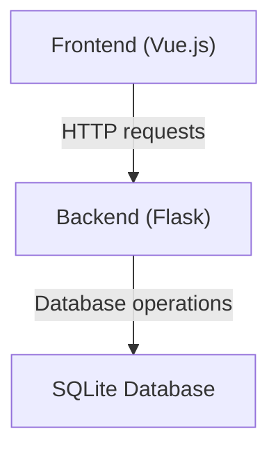
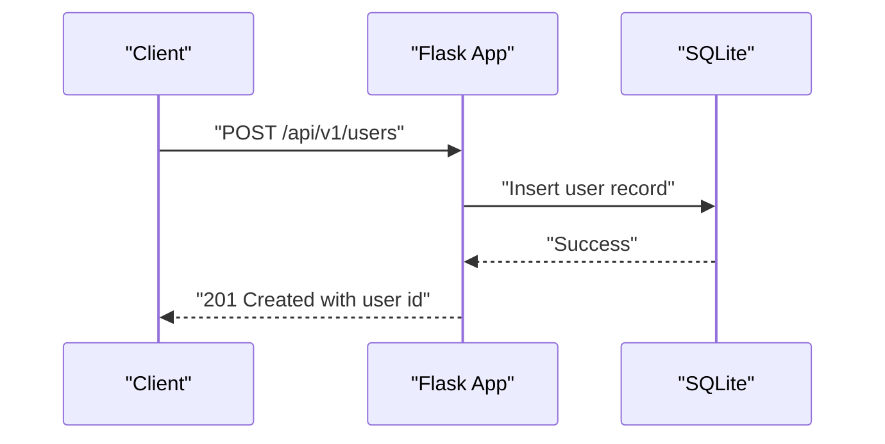
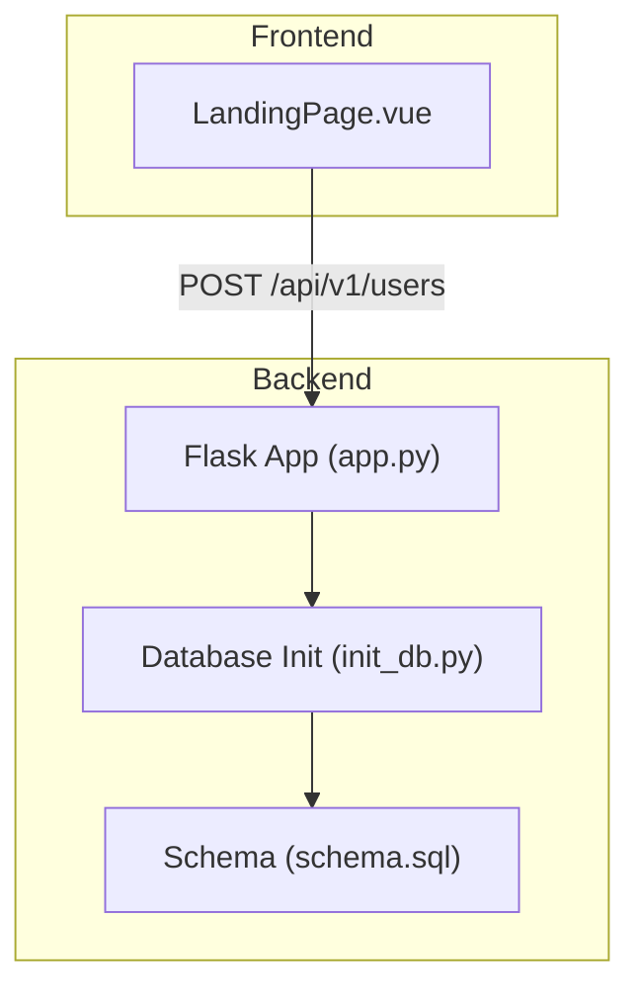

# API Endpoints Reference

<cite>
**Referenced Files in This Document**
- [API.md](file://nutricoach/backend/API.md)
- [app.py](file://nutricoach/backend/app.py)
- [init_db.py](file://nutricoach/backend/init_db.py)
- [schema.sql](file://nutricoach/backend/schema.sql)
- [LandingPage.vue](file://nutricoach/frontend/components/LandingPage.vue)
- [README.md](file://nutricoach/README.md)
</cite>

## Table of Contents
1. [Introduction](#introduction)
2. [Project Structure](#project-structure)
3. [Core Components](#core-components)
4. [Architecture Overview](#architecture-overview)
5. [Detailed Component Analysis](#detailed-component-analysis)
6. [Dependency Analysis](#dependency-analysis)
7. [Performance Considerations](#performance-considerations)
8. [Troubleshooting Guide](#troubleshooting-guide)
9. [Conclusion](#conclusion)

## Introduction
This document provides a comprehensive reference for the NutriCoach AI REST API. It covers endpoint definitions, HTTP methods, URL patterns, request/response schemas, authentication requirements, and practical client usage examples. The API follows a versioned base path and exposes endpoints for user management, dietary preferences, meal plans, and authentication.

## Project Structure
The API is implemented in a Python Flask backend with SQLite persistence. The frontend demonstrates client-side consumption of the API. The backend defines the base URL and endpoint list, while the frontend consumes the user creation endpoint.

**Section sources**
- [README.md:49-50](file://nutricoach/README.md#L49-L50)
- [API.md:3](file://nutricoach/backend/API.md#L3)

## Core Components
- Base URL: `/api/v1`
- Versioning strategy: Path-based versioning using `/api/v1`.
- Authentication: Not implemented in the current backend; endpoints are unauthenticated.
- Rate limiting: Not implemented in the current backend.
- Pagination: Not implemented in the current backend.

**Section sources**
- [API.md:3](file://nutricoach/backend/API.md#L3)
- [app.py:1-31](file://nutricoach/backend/app.py#L1-L31)

## Architecture Overview
The API follows a simple request-response pattern. Clients send HTTP requests to the backend, which performs database operations and returns JSON responses.

**Diagram sources**
- [app.py:16-26](file://nutricoach/backend/app.py#L16-L26)

## Detailed Component Analysis

### User Management Endpoints
- Base path: `/api/v1/users`

Endpoints:
- POST `/api/v1/users`
  - Purpose: Create a new user.
  - Authentication: Not required.
  - Request body (JSON):
    - name: string, required
    - email: string, required
    - age: integer, optional
    - weight: number, optional
    - height: number, optional
    - goals: string, optional
  - Success response (201 Created):
    - Body: `{ "id": integer }`
  - Error responses:
    - 400 Bad Request: Validation errors or malformed JSON.
    - 500 Internal Server Error: Database or server issues.
  - Example curl:
    - curl -X POST http://localhost:5000/api/v1/users -H "Content-Type: application/json" -d '{"name":"John Doe","email":"user@example.com","age":30,"weight":70.5,"height":175.0,"goals":"weight-loss"}'
  - Example JavaScript (fetch):
    - fetch('http://localhost:5000/api/v1/users', { method: 'POST', headers: { 'Content-Type': 'application/json' }, body: JSON.stringify({ name: "John Doe", email: "user@example.com", age: 30, weight: 70.5, height: 175.0, goals: "weight-loss" }) }).then(r => r.json()).then(console.log);

- GET `/api/v1/users/{user_id}`
  - Purpose: Retrieve user details by ID.
  - Authentication: Not required.
  - Path parameters:
    - user_id: integer, required
  - Success response (200 OK):
    - Body: User object matching the schema below.
  - Error responses:
    - 404 Not Found: User not found.
    - 500 Internal Server Error: Database or server issues.
  - Example curl:
    - curl http://localhost:5000/api/v1/users/1
  - Example JavaScript (fetch):
    - fetch('http://localhost:5000/api/v1/users/1').then(r => r.json()).then(console.log);

- PUT `/api/v1/users/{user_id}`
  - Purpose: Update user details by ID.
  - Authentication: Not required.
  - Path parameters:
    - user_id: integer, required
  - Request body (JSON):
    - name: string, optional
    - email: string, optional
    - age: integer, optional
    - weight: number, optional
    - height: number, optional
    - goals: string, optional
  - Success response (200 OK):
    - Body: Updated user object.
  - Error responses:
    - 404 Not Found: User not found.
    - 400 Bad Request: Validation errors or malformed JSON.
    - 500 Internal Server Error: Database or server issues.
  - Example curl:
    - curl -X PUT http://localhost:5000/api/v1/users/1 -H "Content-Type: application/json" -d '{"goals":"muscle-gain"}'
  - Example JavaScript (fetch):
    - fetch('http://localhost:5000/api/v1/users/1', { method: 'PUT', headers: { 'Content-Type': 'application/json' }, body: JSON.stringify({ goals: "muscle-gain" }) }).then(r => r.json()).then(console.log);

- DELETE `/api/v1/users/{user_id}`
  - Purpose: Delete a user by ID.
  - Authentication: Not required.
  - Path parameters:
    - user_id: integer, required
  - Success response (204 No Content):
    - Body: Empty.
  - Error responses:
    - 404 Not Found: User not found.
    - 500 Internal Server Error: Database or server issues.
  - Example curl:
    - curl -X DELETE http://localhost:5000/api/v1/users/1
  - Example JavaScript (fetch):
    - fetch('http://localhost:5000/api/v1/users/1', { method: 'DELETE' });

Notes:
- The backend currently implements only POST for user creation. Other methods are described per the API specification but may require additional implementation.

**Section sources**
- [API.md:6-10](file://nutricoach/backend/API.md#L6-L10)
- [app.py:16-26](file://nutricoach/backend/app.py#L16-L26)

### Authentication Endpoints
- Base path: `/api/v1/auth`

Endpoints:
- POST `/api/v1/auth/register`
  - Purpose: Register a new user account.
  - Authentication: Not required.
  - Request body (JSON):
    - name: string, required
    - email: string, required
    - password: string, required
  - Success response (201 Created):
    - Body: `{ "message": "User registered successfully" }`
  - Error responses:
    - 400 Bad Request: Validation errors or missing fields.
    - 500 Internal Server Error: Database or server issues.
  - Example curl:
    - curl -X POST http://localhost:5000/api/v1/auth/register -H "Content-Type: application/json" -d '{"name":"Jane Doe","email":"jane@example.com","password":"securePass"}'
  - Example JavaScript (fetch):
    - fetch('http://localhost:5000/api/v1/auth/register', { method: 'POST', headers: { 'Content-Type': 'application/json' }, body: JSON.stringify({ name: "Jane Doe", email: "jane@example.com", password: "securePass" }) }).then(r => r.json()).then(console.log);

- POST `/api/v1/auth/login`
  - Purpose: Authenticate user and return a token.
  - Authentication: Not required.
  - Request body (JSON):
    - email: string, required
    - password: string, required
  - Success response (200 OK):
    - Body: `{ "token": "string" }`
  - Error responses:
    - 400 Bad Request: Validation errors or missing fields.
    - 401 Unauthorized: Invalid credentials.
    - 500 Internal Server Error: Database or server issues.
  - Example curl:
    - curl -X POST http://localhost:5000/api/v1/auth/login -H "Content-Type: application/json" -d '{"email":"jane@example.com","password":"securePass"}'
  - Example JavaScript (fetch):
    - fetch('http://localhost:5000/api/v1/auth/login', { method: 'POST', headers: { 'Content-Type': 'application/json' }, body: JSON.stringify({ email: "jane@example.com", password: "securePass" }) }).then(r => r.json()).then(console.log);

Notes:
- Token handling and bearer authentication are not implemented in the current backend.

**Section sources**
- [API.md:21-23](file://nutricoach/backend/API.md#L21-L23)

### Dietary Preferences Endpoints
- Base path: `/api/v1/diet-preferences`

Endpoints:
- POST `/api/v1/diet-preferences`
  - Purpose: Set or update diet preferences for a user.
  - Authentication: Not required.
  - Request body (JSON):
    - user_id: integer, required
    - allergies: string, optional
    - dietary_restrictions: string, optional
    - macronutrient_goals: string, optional
  - Success response (201 Created):
    - Body: `{ "message": "Preferences saved" }`
  - Error responses:
    - 400 Bad Request: Validation errors or missing fields.
    - 500 Internal Server Error: Database or server issues.
  - Example curl:
    - curl -X POST http://localhost:5000/api/v1/diet-preferences -H "Content-Type: application/json" -d '{"user_id":1,"allergies":"none","dietary_restrictions":"vegetarian","macronutrient_goals":"balanced"}'
  - Example JavaScript (fetch):
    - fetch('http://localhost:5000/api/v1/diet-preferences', { method: 'POST', headers: { 'Content-Type': 'application/json' }, body: JSON.stringify({ user_id: 1, allergies: "none", dietary_restrictions: "vegetarian", macronutrient_goals: "balanced" }) }).then(r => r.json()).then(console.log);

- GET `/api/v1/diet-preferences/{user_id}`
  - Purpose: Get diet preferences for a user.
  - Authentication: Not required.
  - Path parameters:
    - user_id: integer, required
  - Success response (200 OK):
    - Body: Dietary preferences object matching the schema below.
  - Error responses:
    - 404 Not Found: Preferences not found.
    - 500 Internal Server Error: Database or server issues.
  - Example curl:
    - curl http://localhost:5000/api/v1/diet-preferences/1
  - Example JavaScript (fetch):
    - fetch('http://localhost:5000/api/v1/diet-preferences/1').then(r => r.json()).then(console.log);

Notes:
- The backend does not implement these endpoints yet.

**Section sources**
- [API.md:12-14](file://nutricoach/backend/API.md#L12-L14)

### Meal Plan Endpoints
- Base path: `/api/v1/meal-plans`

Endpoints:
- POST `/api/v1/meal-plans`
  - Purpose: Generate and save a personalized meal plan.
  - Authentication: Not required.
  - Request body (JSON):
    - user_id: integer, required
    - date: date, required
    - meals: string, required
  - Success response (201 Created):
    - Body: `{ "message": "Meal plan saved" }`
  - Error responses:
    - 400 Bad Request: Validation errors or missing fields.
    - 500 Internal Server Error: Database or server issues.
  - Example curl:
    - curl -X POST http://localhost:5000/api/v1/meal-plans -H "Content-Type: application/json" -d '{"user_id":1,"date":"2025-06-15","meals":"breakfast: omelet\\nlunch: salad\\ndinner: fish"}'
  - Example JavaScript (fetch):
    - fetch('http://localhost:5000/api/v1/meal-plans', { method: 'POST', headers: { 'Content-Type': 'application/json' }, body: JSON.stringify({ user_id: 1, date: "2025-06-15", meals: "breakfast: omelet\nlunch: salad\ndinner: fish" }) }).then(r => r.json()).then(console.log);

- GET `/api/v1/meal-plans/{user_id}`
  - Purpose: Retrieve the latest meal plan for a user.
  - Authentication: Not required.
  - Path parameters:
    - user_id: integer, required
  - Success response (200 OK):
    - Body: Latest meal plan object matching the schema below.
  - Error responses:
    - 404 Not Found: No meal plan found.
    - 500 Internal Server Error: Database or server issues.
  - Example curl:
    - curl http://localhost:5000/api/v1/meal-plans/1
  - Example JavaScript (fetch):
    - fetch('http://localhost:5000/api/v1/meal-plans/1').then(r => r.json()).then(console.log);

- GET `/api/v1/meal-plans/{user_id}/history`
  - Purpose: Retrieve meal plan history for a user.
  - Authentication: Not required.
  - Path parameters:
    - user_id: integer, required
  - Success response (200 OK):
    - Body: Array of meal plan objects matching the schema below.
  - Error responses:
    - 404 Not Found: No history found.
    - 500 Internal Server Error: Database or server issues.
  - Example curl:
    - curl http://localhost:5000/api/v1/meal-plans/1/history
  - Example JavaScript (fetch):
    - fetch('http://localhost:5000/api/v1/meal-plans/1/history').then(r => r.json()).then(console.log);

Notes:
- The backend does not implement these endpoints yet.

**Section sources**
- [API.md:16-19](file://nutricoach/backend/API.md#L16-L19)

### Data Models
- User
  - Fields:
    - id: integer
    - name: string
    - email: string
    - age: integer
    - weight: number
    - height: number
    - goals: string

- DietPreference
  - Fields:
    - user_id: integer
    - allergies: string
    - dietary_restrictions: string
    - macronutrient_goals: string

- MealPlan
  - Fields:
    - id: integer
    - user_id: integer
    - date: date
    - meals: string

**Section sources**
- [API.md:27-59](file://nutricoach/backend/API.md#L27-L59)

## Dependency Analysis
The backend depends on SQLite for persistence and exposes endpoints defined in the API specification. The frontend consumes the user creation endpoint.

**Diagram sources**
- [app.py:1-31](file://nutricoach/backend/app.py#L1-L31)
- [init_db.py:1-47](file://nutricoach/backend/init_db.py#L1-L47)
- [schema.sql:1-25](file://nutricoach/backend/schema.sql#L1-L25)
- [LandingPage.vue:47-48](file://nutricoach/frontend/components/LandingPage.vue#L47-L48)

**Section sources**
- [app.py:1-31](file://nutricoach/backend/app.py#L1-L31)
- [init_db.py:1-47](file://nutricoach/backend/init_db.py#L1-L47)
- [schema.sql:1-25](file://nutricoach/backend/schema.sql#L1-L25)
- [LandingPage.vue:47-48](file://nutricoach/frontend/components/LandingPage.vue#L47-L48)

## Performance Considerations
- Current implementation uses SQLite with basic CRUD operations. No caching or advanced indexing is present.
- Recommendations (not implemented):
  - Add pagination for list endpoints.
  - Implement rate limiting at the Flask level.
  - Add database indexes for frequently queried columns.
  - Introduce connection pooling and transaction batching.

## Troubleshooting Guide
Common issues and resolutions:
- 404 Not Found:
  - Cause: Incorrect endpoint path or missing resource.
  - Resolution: Verify base URL and path parameters.
- 400 Bad Request:
  - Cause: Malformed JSON or missing required fields.
  - Resolution: Validate request payload against data models.
- 401 Unauthorized:
  - Cause: Authentication required but not implemented.
  - Resolution: Implement authentication endpoints and token handling.
- 500 Internal Server Error:
  - Cause: Database or server exceptions.
  - Resolution: Check server logs and database connectivity.

**Section sources**
- [API.md:21-23](file://nutricoach/backend/API.md#L21-L23)

## Conclusion
The NutriCoach AI API provides a clear set of endpoints for user management, dietary preferences, meal plans, and authentication under a versioned base path. While the backend currently implements only user creation, the remaining endpoints are documented according to the API specification. Future enhancements should focus on implementing missing endpoints, adding authentication, rate limiting, pagination, and performance optimizations.