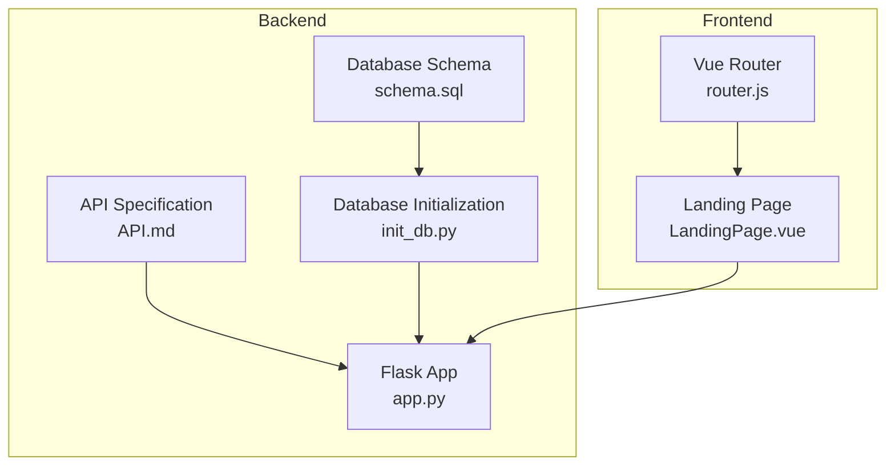
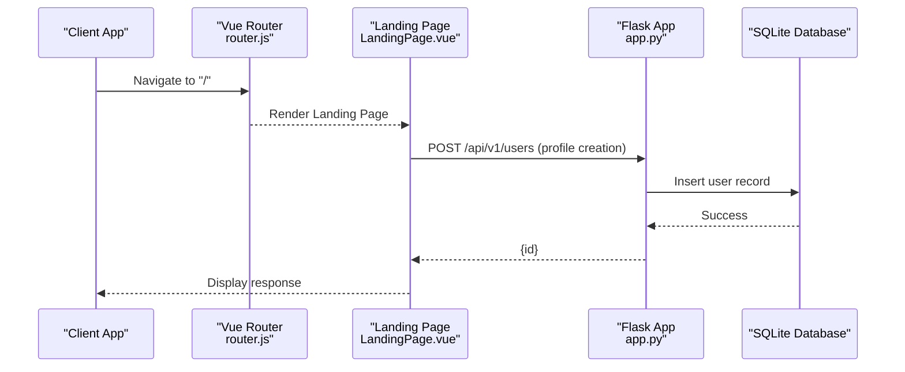
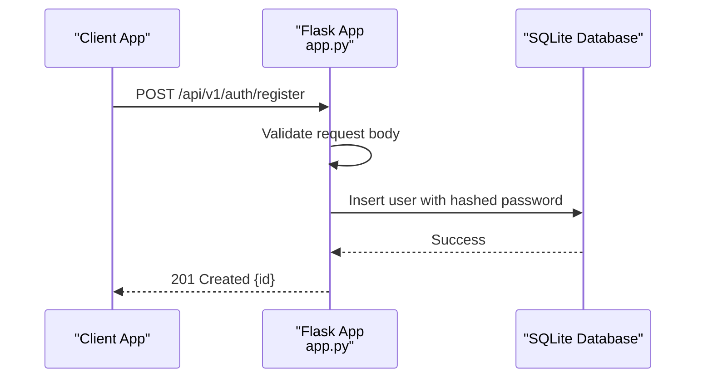
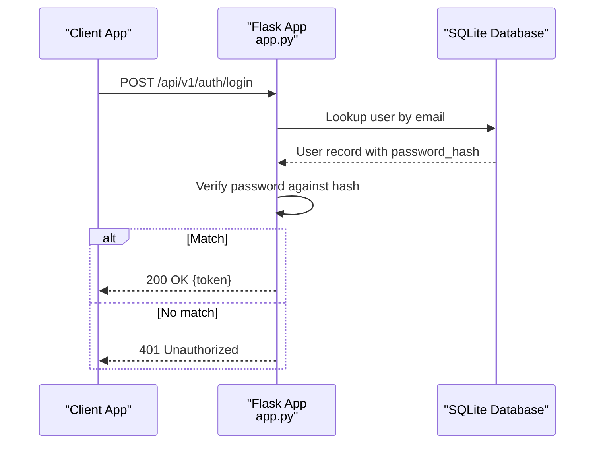
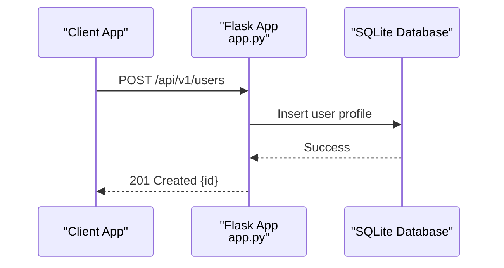
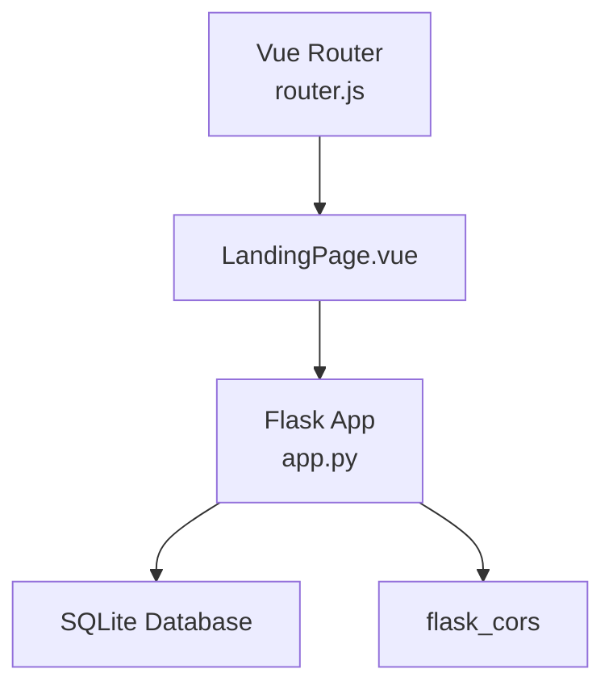

# Authentication Endpoints

<cite>
**Referenced Files in This Document**
- [app.py](file://nutricoach/backend/app.py)
- [API.md](file://nutricoach/backend/API.md)
- [init_db.py](file://nutricoach/backend/init_db.py)
- [schema.sql](file://nutricoach/backend/schema.sql)
- [LandingPage.vue](file://nutricoach/frontend/components/LandingPage.vue)
- [router.js](file://nutricoach/frontend/src/router.js)
</cite>

## Table of Contents
1. [Introduction](#introduction)
2. [Project Structure](#project-structure)
3. [Core Components](#core-components)
4. [Architecture Overview](#architecture-overview)
5. [Detailed Component Analysis](#detailed-component-analysis)
6. [Dependency Analysis](#dependency-analysis)
7. [Performance Considerations](#performance-considerations)
8. [Troubleshooting Guide](#troubleshooting-guide)
9. [Conclusion](#conclusion)

## Introduction
This document provides comprehensive authentication API documentation for the endpoints defined in the backend API specification. It covers the registration and login workflows, including required fields, validation rules, success responses, error handling, and security considerations. It also outlines JWT token handling and logout procedures conceptually, along with practical examples for successful registration and login flows.

## Project Structure
The authentication endpoints are part of the backend Flask application and are documented in the API specification. The frontend currently demonstrates basic routing and a landing page but does not yet implement authentication-specific UI components.

**Diagram sources**
- [app.py:1-31](file://nutricoach/backend/app.py#L1-L31)
- [API.md:1-59](file://nutricoach/backend/API.md#L1-L59)
- [init_db.py:1-106](file://nutricoach/backend/init_db.py#L1-L106)
- [schema.sql:1-77](file://nutricoach/backend/schema.sql#L1-L77)
- [router.js:1-14](file://nutricoach/frontend/src/router.js#L1-L14)
- [LandingPage.vue:1-92](file://nutricoach/frontend/components/LandingPage.vue#L1-L92)

**Section sources**
- [app.py:1-31](file://nutricoach/backend/app.py#L1-L31)
- [API.md:1-59](file://nutricoach/backend/API.md#L1-L59)
- [init_db.py:1-106](file://nutricoach/backend/init_db.py#L1-L106)
- [schema.sql:1-77](file://nutricoach/backend/schema.sql#L1-L77)
- [router.js:1-14](file://nutricoach/frontend/src/router.js#L1-L14)
- [LandingPage.vue:1-92](file://nutricoach/frontend/components/LandingPage.vue#L1-L92)

## Core Components
- Authentication endpoints:
  - POST /api/v1/auth/register: Registers a new user.
  - POST /api/v1/auth/login: Authenticates a user and returns a token.
- User management endpoint (for reference):
  - POST /api/v1/users: Creates a user profile with demographic and goal fields.
- Database schema:
  - Users table includes a password_hash field suitable for storing hashed credentials.
- Frontend:
  - Basic routing and landing page; authentication UI components are not yet implemented.

**Section sources**
- [API.md:21-24](file://nutricoach/backend/API.md#L21-L24)
- [schema.sql:3-19](file://nutricoach/backend/schema.sql#L3-L19)
- [init_db.py:9-28](file://nutricoach/backend/init_db.py#L9-L28)
- [router.js:1-14](file://nutricoach/frontend/src/router.js#L1-L14)
- [LandingPage.vue:1-92](file://nutricoach/frontend/components/LandingPage.vue#L1-L92)

## Architecture Overview
The authentication flow integrates the frontend, backend, and database. The frontend sends requests to the backend, which validates inputs, checks credentials against the database, and responds with appropriate JSON payloads. The database stores user credentials securely using a password hash.

**Diagram sources**
- [router.js:1-14](file://nutricoach/frontend/src/router.js#L1-L14)
- [LandingPage.vue:38-54](file://nutricoach/frontend/components/LandingPage.vue#L38-L54)
- [app.py:16-26](file://nutricoach/backend/app.py#L16-L26)

## Detailed Component Analysis

### Registration Endpoint: POST /api/v1/auth/register
- Purpose: Register a new user with credentials and profile data.
- Request body fields:
  - username (string): Unique identifier for the user.
  - email (string): Unique email address for the user.
  - password (string): Plain-text password (to be hashed before storage).
- Validation rules:
  - Required fields: username, email, password.
  - Email uniqueness enforced by database schema.
  - Password length and strength policies should be enforced by the backend (recommended).
- Success response:
  - Status: 201 Created.
  - Body: JSON object containing the new user's id.
- Error responses:
  - 400 Bad Request: Missing required fields or invalid payload.
  - 409 Conflict: Email already exists.
  - 500 Internal Server Error: Database or server failure.
- Security considerations:
  - Hash passwords before storing using a secure hashing algorithm (e.g., bcrypt).
  - Sanitize and validate all inputs to prevent injection attacks.
  - Enforce HTTPS to protect credentials in transit.
- Example workflow:
  - Client sends registration request with username, email, and password.
  - Backend validates inputs, hashes the password, and inserts a new user record.
  - On success, backend returns the new user id.

**Diagram sources**
- [API.md:22](file://nutricoach/backend/API.md#L22)
- [schema.sql:6](file://nutricoach/backend/schema.sql#L6)
- [app.py:16-26](file://nutricoach/backend/app.py#L16-L26)

**Section sources**
- [API.md:21-24](file://nutricoach/backend/API.md#L21-L24)
- [schema.sql:3-19](file://nutricoach/backend/schema.sql#L3-L19)
- [init_db.py:9-28](file://nutricoach/backend/init_db.py#L9-L28)

### Login Endpoint: POST /api/v1/auth/login
- Purpose: Authenticate a user and issue a token upon successful verification.
- Request body fields:
  - email (string): Registered user's email.
  - password (string): Plain-text password.
- Authentication flow:
  - Backend retrieves the stored password hash for the given email.
  - Compares the provided password with the stored hash.
  - On match, generates a JWT token and returns it to the client.
- Token handling:
  - Store the token securely (e.g., HttpOnly cookie or secure local storage).
  - Include the token in Authorization headers for protected requests.
- Logout procedure:
  - Invalidate the token on the server (e.g., maintain a blacklist).
  - Clear the token from the client storage.
- Error responses:
  - 400 Bad Request: Missing email or password.
  - 401 Unauthorized: Invalid credentials.
  - 404 Not Found: User not found.
  - 500 Internal Server Error: Server failure.
- Security considerations:
  - Use HTTPS to protect tokens and credentials.
  - Implement rate limiting to prevent brute-force attacks.
  - Add CSRF protection for state-changing requests if using cookies.

**Diagram sources**
- [API.md:23](file://nutricoach/backend/API.md#L23)
- [schema.sql:6](file://nutricoach/backend/schema.sql#L6)
- [app.py:16-26](file://nutricoach/backend/app.py#L16-L26)

**Section sources**
- [API.md:21-24](file://nutricoach/backend/API.md#L21-L24)
- [schema.sql:3-19](file://nutricoach/backend/schema.sql#L3-L19)
- [init_db.py:9-28](file://nutricoach/backend/init_db.py#L9-L28)

### User Profile Creation Endpoint: POST /api/v1/users (Reference)
- Purpose: Create a user profile with demographic and goal fields.
- Request body fields:
  - name (string)
  - email (string)
  - age (integer, optional)
  - weight (real, optional)
  - height (real, optional)
  - goals (string, optional)
- Success response:
  - Status: 201 Created.
  - Body: JSON object containing the new user's id.
- Notes:
  - This endpoint is separate from authentication and is used for profile creation.

**Diagram sources**
- [app.py:16-26](file://nutricoach/backend/app.py#L16-L26)

**Section sources**
- [app.py:16-26](file://nutricoach/backend/app.py#L16-L26)

## Dependency Analysis
- Backend dependencies:
  - Flask for routing and JSON responses.
  - SQLite for persistence with a dedicated users table.
- Frontend dependencies:
  - Vue Router for navigation; landing page demonstrates basic routing.
- External libraries:
  - flask_cors is enabled for cross-origin support.

**Diagram sources**
- [app.py:1-7](file://nutricoach/backend/app.py#L1-L7)
- [router.js:1-14](file://nutricoach/frontend/src/router.js#L1-L14)
- [LandingPage.vue:28](file://nutricoach/frontend/components/LandingPage.vue#L28)

**Section sources**
- [app.py:1-7](file://nutricoach/backend/app.py#L1-L7)
- [router.js:1-14](file://nutricoach/frontend/src/router.js#L1-L14)
- [LandingPage.vue:28](file://nutricoach/frontend/components/LandingPage.vue#L28)

## Performance Considerations
- Database indexing:
  - Index the email column in the users table to speed up lookups during login.
- Input validation:
  - Validate and sanitize inputs early to reduce unnecessary database operations.
- Token lifecycle:
  - Use short-lived access tokens and refresh tokens to minimize exposure windows.
- Rate limiting:
  - Implement rate limits on authentication endpoints to mitigate brute-force attacks.

## Troubleshooting Guide
- Common errors and resolutions:
  - 400 Bad Request: Ensure all required fields are present and properly formatted.
  - 409 Conflict: If registering fails due to duplicate email, prompt the user to use another email or log in.
  - 401 Unauthorized: Confirm the provided credentials are correct; ensure the password was hashed before storage.
  - 500 Internal Server Error: Check server logs and database connectivity.
- Logging and monitoring:
  - Log authentication attempts and failures for auditing and security analysis.
- Frontend integration tips:
  - Display user-friendly messages for each error code.
  - Persist tokens securely and handle token expiration gracefully.

**Section sources**
- [API.md:21-24](file://nutricoach/backend/API.md#L21-L24)
- [schema.sql:6](file://nutricoach/backend/schema.sql#L6)
- [init_db.py:9-28](file://nutricoach/backend/init_db.py#L9-L28)

## Conclusion
The backend defines authentication endpoints for registration and login, with a database schema supporting secure credential storage via password hashing. The frontend currently focuses on routing and a landing page, leaving authentication UI components for future development. By implementing robust validation, secure password hashing, HTTPS, CSRF protection, and proper token lifecycle management, the system can achieve strong security and reliability for authentication workflows.