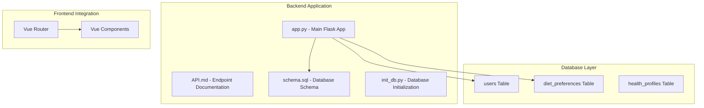
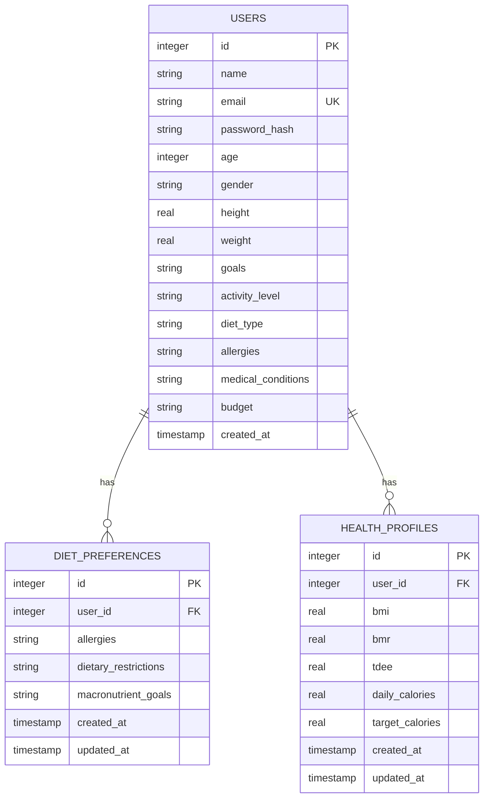
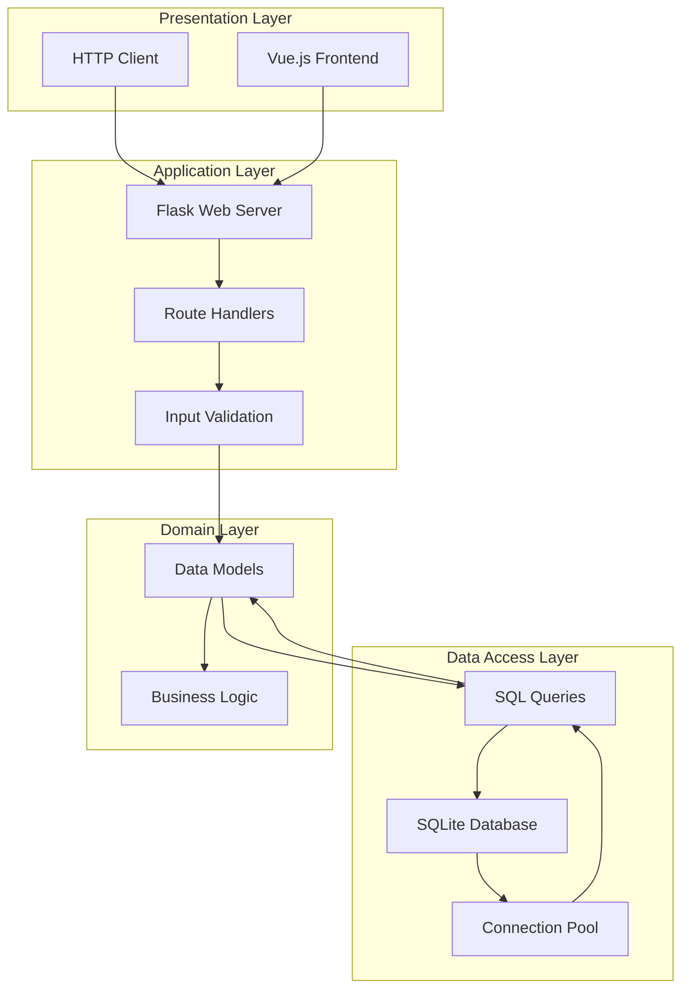
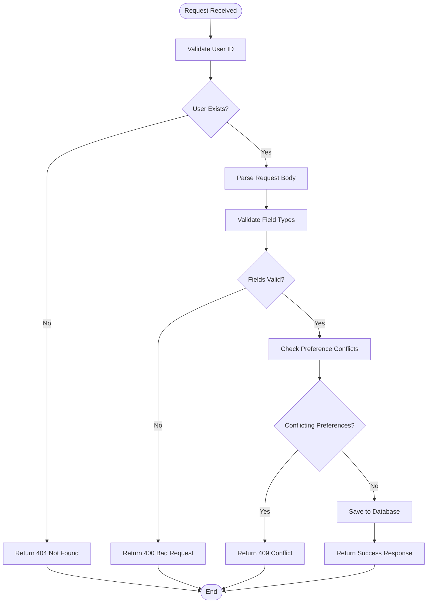
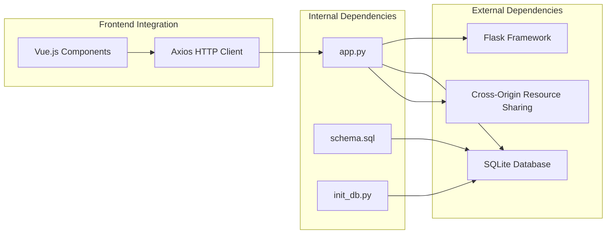

# Dietary Preferences Endpoints

<cite>
**Referenced Files in This Document**
- [API.md](file://nutricoach/backend/API.md)
- [app.py](file://nutricoach/backend/app.py)
- [schema.sql](file://nutricoach/backend/schema.sql)
- [init_db.py](file://nutricoach/backend/init_db.py)
- [README.md](file://nutricoach/README.md)
</cite>

## Table of Contents
1. [Introduction](#introduction)
2. [Project Structure](#project-structure)
3. [Core Components](#core-components)
4. [Architecture Overview](#architecture-overview)
5. [Detailed Component Analysis](#detailed-component-analysis)
6. [Dependency Analysis](#dependency-analysis)
7. [Performance Considerations](#performance-considerations)
8. [Troubleshooting Guide](#troubleshooting-guide)
9. [Conclusion](#conclusion)

## Introduction

The NutriCoach AI application provides a comprehensive dietary preferences management system that allows users to define and manage their food allergies, dietary restrictions, and nutritional goals. This documentation covers the complete API specification for the `/api/v1/diet-preferences` endpoints, including request/response schemas, validation rules, and practical usage examples.

The dietary preferences system is designed to support personalized meal planning by capturing user-specific dietary constraints and nutritional targets. The implementation follows RESTful principles and integrates seamlessly with the broader NutriCoach ecosystem.

## Project Structure

The dietary preferences functionality is part of the backend Flask application with the following key components:



**Diagram sources**
- [app.py:1-31](file://nutricoach/backend/app.py#L1-L31)
- [schema.sql:1-77](file://nutricoach/backend/schema.sql#L1-L77)
- [API.md:1-59](file://nutricoach/backend/API.md#L1-L59)

**Section sources**
- [app.py:1-31](file://nutricoach/backend/app.py#L1-L31)
- [schema.sql:1-77](file://nutricoach/backend/schema.sql#L1-L77)
- [API.md:1-59](file://nutricoach/backend/API.md#L1-L59)

## Core Components

The dietary preferences system consists of several interconnected components that work together to provide comprehensive dietary management capabilities:

### Database Schema

The system utilizes a normalized database design with separate tables for users and their dietary preferences:



**Diagram sources**
- [schema.sql:3-77](file://nutricoach/backend/schema.sql#L3-L77)

### Data Models

The system defines three primary data models that govern the structure and validation of dietary preference data:

#### User Model
The User model captures basic demographic and health information that influences dietary recommendations.

#### Diet Preference Model
The core model for dietary preferences with fields for allergies, restrictions, and nutritional goals.

#### Meal Plan Model
Supporting model for meal plan generation based on dietary preferences.

**Section sources**
- [API.md:27-59](file://nutricoach/backend/API.md#L27-L59)
- [schema.sql:34-41](file://nutricoach/backend/schema.sql#L34-L41)

## Architecture Overview

The dietary preferences API follows a layered architecture pattern with clear separation of concerns:



**Diagram sources**
- [app.py:1-31](file://nutricoach/backend/app.py#L1-L31)
- [schema.sql:1-77](file://nutricoach/backend/schema.sql#L1-L77)

## Detailed Component Analysis

### API Endpoint Specifications

#### GET /api/v1/diet-preferences/{user_id}

Retrieves all dietary preferences for a specific user, including allergies, restrictions, and nutritional goals.

**Request Parameters:**
- `user_id` (path): Integer identifier of the user whose preferences to retrieve

**Response Format:**
```json
{
  "id": "integer",
  "user_id": "integer",
  "allergies": "string",
  "dietary_restrictions": "string",
  "macronutrient_goals": "string"
}
```

**Success Response Codes:**
- 200: Successfully retrieved preferences
- 404: User not found

**Section sources**
- [API.md:12-14](file://nutricoach/backend/API.md#L12-L14)

#### POST /api/v1/diet-preferences

Creates new dietary preferences for a user or updates existing ones.

**Request Body:**
```json
{
  "user_id": "integer",
  "allergies": "string",
  "dietary_restrictions": "string",
  "macronutrient_goals": "string"
}
```

**Response Format:**
```json
{
  "id": "integer",
  "message": "string"
}
```

**Success Response Codes:**
- 201: Successfully created preferences
- 200: Successfully updated existing preferences

**Validation Rules:**
- `user_id`: Required, must reference existing user
- `allergies`: Optional, comma-separated list of allergen identifiers
- `dietary_restrictions`: Optional, comma-separated list of restriction types
- `macronutrient_goals`: Optional, JSON-encoded nutritional targets

**Section sources**
- [API.md:12-13](file://nutricoach/backend/API.md#L12-L13)

### Data Validation and Constraints

The system implements comprehensive validation to ensure data integrity and prevent conflicting dietary preferences:



**Diagram sources**
- [schema.sql:34-41](file://nutricoach/backend/schema.sql#L34-L41)

### Common Dietary Scenarios

#### Vegan Diet Profile
```json
{
  "user_id": 1,
  "allergies": "gluten,dairy",
  "dietary_restrictions": "vegan",
  "macronutrient_goals": "{\"protein\": \"1.2g/kg\", \"carbs\": \"4.5g/kg\", \"fats\": \"0.8g/kg\"}"
}
```

#### Gluten-Free Profile
```json
{
  "user_id": 2,
  "allergies": "wheat",
  "dietary_restrictions": "gluten-free",
  "macronutrient_goals": "{\"protein\": \"1.0g/kg\", \"carbs\": \"3.0g/kg\", \"fats\": \"0.7g/kg\"}"
}
```

#### High-Protein Goal Profile
```json
{
  "user_id": 3,
  "allergies": "dairy",
  "dietary_restrictions": "high-protein",
  "macronutrient_goals": "{\"protein\": \"2.0g/kg\", \"carbs\": \"2.5g/kg\", \"fats\": \"0.6g/kg\"}"
}
```

**Section sources**
- [API.md:42-50](file://nutricoach/backend/API.md#L42-L50)

### Preference Combination Validation Rules

The system enforces logical consistency between different preference types:

| Preference Type | Allowed Combinations | Validation Notes |
|----------------|---------------------|------------------|
| **Allergies** | Single or multiple items | Must be from approved allergen list |
| **Dietary Restrictions** | Single restriction type | Cannot combine incompatible restrictions |
| **Macronutrient Goals** | Protein, Carbs, Fats | Must be within physiological ranges |

**Conflict Resolution Examples:**
- **Vegan + Lactose Intolerance**: Allowed - both indicate dairy avoidance
- **Keto + Low-Fat**: Potentially conflicting - requires careful balance
- **High-Protein + Low-Calorie**: Possible with adequate caloric intake

## Dependency Analysis

The dietary preferences system has minimal external dependencies and integrates cleanly with the existing application architecture:



**Diagram sources**
- [app.py:1-7](file://nutricoach/backend/app.py#L1-L7)
- [schema.sql:1-1](file://nutricoach/backend/schema.sql#L1-L1)

**Section sources**
- [app.py:1-31](file://nutricoach/backend/app.py#L1-L31)
- [schema.sql:1-77](file://nutricoach/backend/schema.sql#L1-L77)

## Performance Considerations

### Database Optimization
- **Indexing Strategy**: Consider adding indexes on `user_id` in the `diet_preferences` table for faster lookups
- **Connection Pooling**: Implement connection pooling to handle concurrent requests efficiently
- **Query Optimization**: Use prepared statements to prevent SQL injection and improve performance

### Caching Strategy
- **Redis Integration**: Implement Redis caching for frequently accessed user preferences
- **Cache Expiration**: Set appropriate TTL values for cached preferences (typically 5-15 minutes)
- **Cache Invalidation**: Implement cache invalidation when preferences are updated

### Scalability Considerations
- **Horizontal Scaling**: The current SQLite implementation limits horizontal scaling
- **Database Migration**: Consider migrating to PostgreSQL or MySQL for production deployments
- **Load Balancing**: Implement load balancing for high-traffic scenarios

## Troubleshooting Guide

### Common Issues and Solutions

#### Database Connection Problems
**Symptoms:** 500 Internal Server Error when accessing endpoints
**Causes:** Database file permissions, missing database file
**Solutions:** 
- Verify database file exists and is accessible
- Check file permissions for the database directory
- Ensure proper database initialization

#### Validation Errors
**Symptoms:** 400 Bad Request responses
**Common Causes:**
- Invalid JSON format in request body
- Missing required fields
- Invalid data types
- Conflicting preference combinations

**Solutions:**
- Validate JSON structure before sending requests
- Ensure all required fields are present
- Check data type compatibility
- Review preference combination rules

#### User Not Found Errors
**Symptoms:** 404 Not Found responses
**Causes:** Invalid user_id parameter
**Solutions:**
- Verify user exists in the system
- Check user_id format (must be integer)
- Ensure user_id corresponds to existing record

### Debugging Tools and Techniques

#### API Testing
Use curl commands for manual testing:
```bash
# Test GET endpoint
curl -X GET http://localhost:5000/api/v1/diet-preferences/1

# Test POST endpoint  
curl -X POST http://localhost:5000/api/v1/diet-preferences \
  -H "Content-Type: application/json" \
  -d '{"user_id": 1, "allergies": "gluten", "dietary_restrictions": "vegetarian"}'
```

#### Logging and Monitoring
- Enable Flask debug mode for development
- Implement structured logging for production
- Monitor response times and error rates
- Track user preference change patterns

**Section sources**
- [app.py:30-31](file://nutricoach/backend/app.py#L30-L31)
- [README.md:57-77](file://nutricoach/README.md#L57-L77)

## Conclusion

The dietary preferences API provides a robust foundation for personalized nutrition management within the NutriCoach AI platform. The system's design emphasizes flexibility, scalability, and user-centric functionality while maintaining strong data integrity and validation controls.

Key strengths of the implementation include:
- **Comprehensive Coverage**: Full CRUD operations for dietary preferences
- **Flexible Data Model**: Support for various preference types and combinations
- **Strong Validation**: Built-in conflict detection and resolution
- **Clean Architecture**: Well-structured codebase with clear separation of concerns

Future enhancements could include:
- **Enhanced Validation**: More sophisticated preference combination checking
- **Advanced Analytics**: Trend analysis of user preference changes
- **Mobile Integration**: Native mobile app support
- **Integration APIs**: Third-party service integrations for recipe suggestions

The current implementation provides a solid foundation for building advanced personalized nutrition applications and can serve as a template for similar health and wellness platforms.