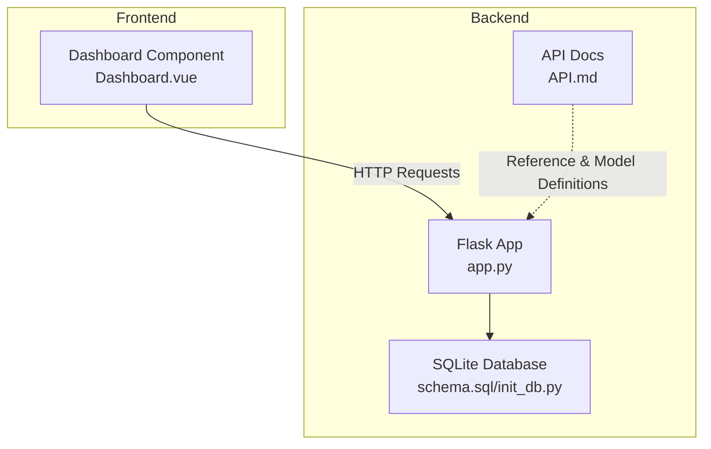
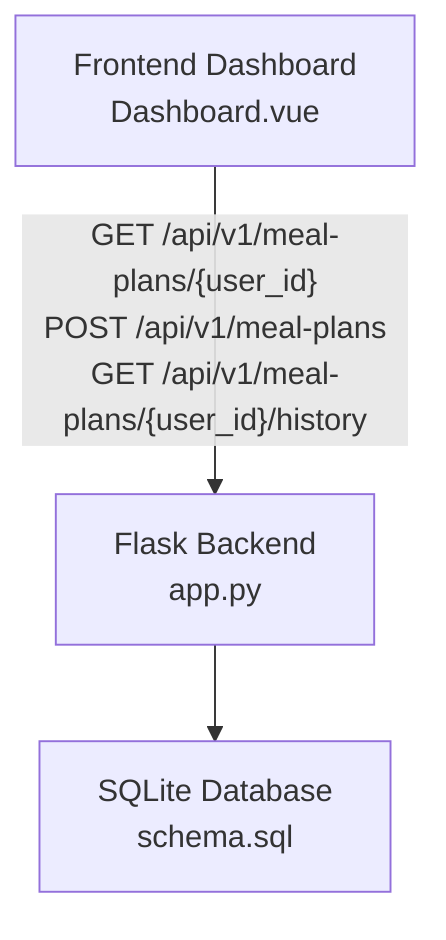
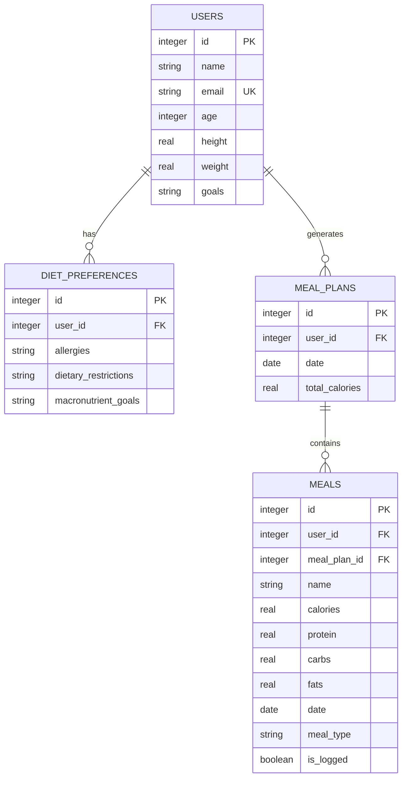
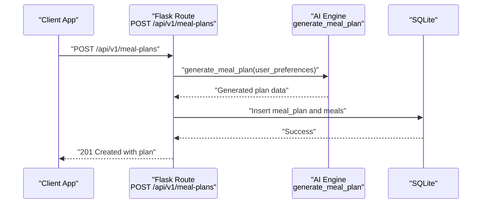
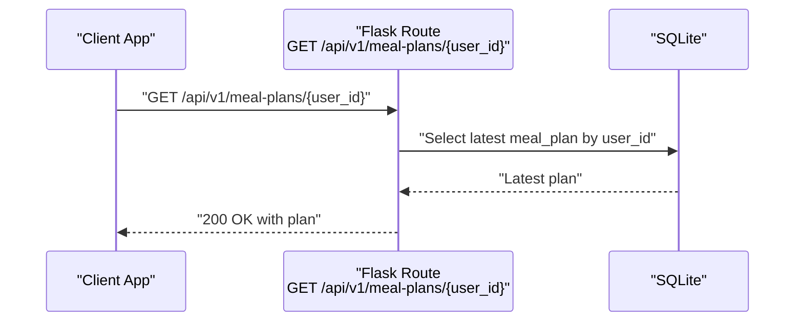
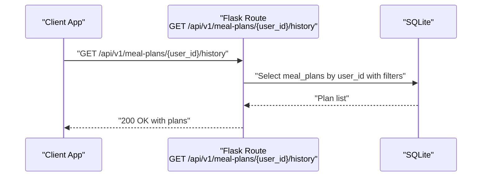
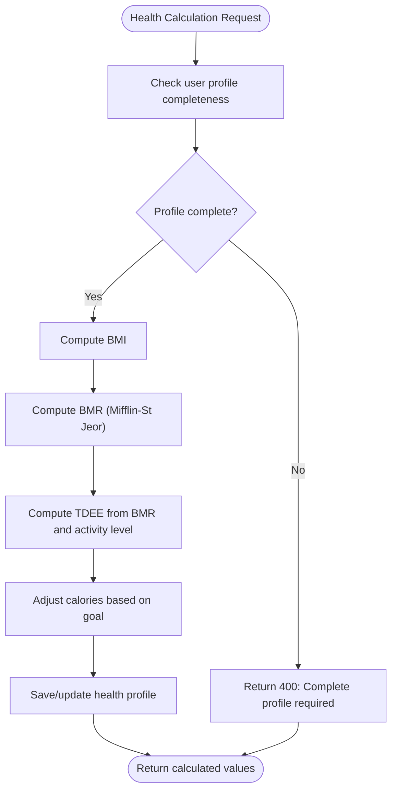
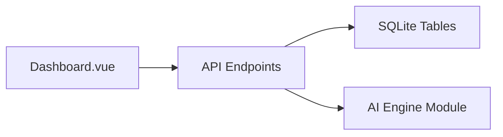

# Meal Plans Endpoints

<cite>
**Referenced Files in This Document**
- [API.md](file://nutricoach/backend/API.md)
- [app.py](file://nutricoach/backend/app.py)
- [schema.sql](file://nutricoach/backend/schema.sql)
- [init_db.py](file://nutricoach/backend/init_db.py)
- [README.md](file://nutricoach/README.md)
- [Dashboard.vue](file://nutricoach/frontend/components/Dashboard.vue)
</cite>

## Table of Contents
1. [Introduction](#introduction)
2. [Project Structure](#project-structure)
3. [Core Components](#core-components)
4. [Architecture Overview](#architecture-overview)
5. [Detailed Component Analysis](#detailed-component-analysis)
6. [Dependency Analysis](#dependency-analysis)
7. [Performance Considerations](#performance-considerations)
8. [Troubleshooting Guide](#troubleshooting-guide)
9. [Conclusion](#conclusion)

## Introduction
This document provides comprehensive documentation for the meal plan API endpoints under /api/v1/meal-plans. It covers:
- Endpoint definitions and request/response behavior
- Data models for meal plans, daily meals, and nutritional breakdown
- Filtering and retrieval patterns
- AI-driven plan generation workflow
- Validation and calculation rules
- Integration points with user profiles and preferences

The backend is a Flask application exposing REST endpoints backed by SQLite. The frontend integrates with these endpoints to present and manage meal plans.

## Project Structure
The backend exposes API endpoints and manages data through SQLite tables. The frontend includes a dashboard component that references plan generation and display.

**Diagram sources**
- [app.py:1-217](file://nutricoach/backend/app.py#L1-L217)
- [schema.sql:1-77](file://nutricoach/backend/schema.sql#L1-L77)
- [API.md:1-59](file://nutricoach/backend/API.md#L1-L59)
- [Dashboard.vue:1-46](file://nutricoach/frontend/components/Dashboard.vue#L1-L46)

**Section sources**
- [README.md:1-77](file://nutricoach/README.md#L1-L77)
- [API.md:1-59](file://nutricoach/backend/API.md#L1-L59)

## Core Components
- Meal Plans API: Exposes endpoints for generating, retrieving, and managing meal plans.
- Data Models: Defines the structure for users, diet preferences, and meal plans/meals.
- Database Schema: Declares tables for users, health profiles, diet preferences, meal plans, and meals.
- Frontend Integration: The dashboard component references plan generation and displays plan content.

Key implementation references:
- API endpoint definitions and models are documented in [API.md:16-59](file://nutricoach/backend/API.md#L16-L59).
- Database schema for meal plans and meals is defined in [schema.sql:43-67](file://nutricoach/backend/schema.sql#L43-L67).
- Frontend dashboard references plan generation in [Dashboard.vue:11-37](file://nutricoach/frontend/components/Dashboard.vue#L11-L37).

**Section sources**
- [API.md:16-59](file://nutricoach/backend/API.md#L16-L59)
- [schema.sql:43-67](file://nutricoach/backend/schema.sql#L43-L67)
- [Dashboard.vue:11-37](file://nutricoach/frontend/components/Dashboard.vue#L11-L37)

## Architecture Overview
The system follows a client-server pattern:
- The Flask backend serves REST endpoints secured with JWT.
- SQLite stores user, preference, health, and plan data.
- The Vue.js frontend consumes the API to render dashboards and trigger plan generation.

**Diagram sources**
- [Dashboard.vue:11-37](file://nutricoach/frontend/components/Dashboard.vue#L11-L37)
- [app.py:1-217](file://nutricoach/backend/app.py#L1-L217)
- [schema.sql:43-67](file://nutricoach/backend/schema.sql#L43-L67)

## Detailed Component Analysis

### API Endpoints Overview
Endpoints for meal plans are defined as follows:
- POST /api/v1/meal-plans: Generate and save a personalized meal plan
- GET /api/v1/meal-plans/{user_id}: Retrieve the latest meal plan for a user
- GET /api/v1/meal-plans/{user_id}/history: Retrieve meal plan history

These endpoints are documented in [API.md:16-20](file://nutricoach/backend/API.md#L16-L20).

Note: The current backend implementation in [app.py:1-217](file://nutricoach/backend/app.py#L1-L217) does not include explicit handlers for the above endpoints. They are referenced in the API documentation and schema. The frontend dashboard also references plan generation in [Dashboard.vue:11-37](file://nutricoach/frontend/components/Dashboard.vue#L11-L37).

**Section sources**
- [API.md:16-20](file://nutricoach/backend/API.md#L16-L20)
- [app.py:1-217](file://nutricoach/backend/app.py#L1-L217)
- [Dashboard.vue:11-37](file://nutricoach/frontend/components/Dashboard.vue#L11-L37)

### Data Models and Schemas
The following data models define the structure for meal plans and related entities:

- User
  - Fields: id, name, email, age, weight, height, goals
  - Reference: [API.md:29-40](file://nutricoach/backend/API.md#L29-L40)

- DietPreference
  - Fields: user_id, allergies, dietary_restrictions, macronutrient_goals
  - Reference: [API.md:42-49](file://nutricoach/backend/API.md#L42-L49)

- MealPlan
  - Fields: id, user_id, date, total_calories
  - Reference: [schema.sql:43-50](file://nutricoach/backend/schema.sql#L43-L50)

- Meal
  - Fields: id, user_id, meal_plan_id, name, calories, protein, carbs, fats, date, meal_type, is_logged
  - Reference: [schema.sql:52-67](file://nutricoach/backend/schema.sql#L52-L67)

**Diagram sources**
- [schema.sql:3-77](file://nutricoach/backend/schema.sql#L3-L77)

**Section sources**
- [API.md:29-59](file://nutricoach/backend/API.md#L29-L59)
- [schema.sql:3-77](file://nutricoach/backend/schema.sql#L3-L77)

### AI Integration Patterns
- AI-driven generation: The backend imports a meal engine responsible for generating personalized meal plans. The import statement is present in [app.py](file://nutricoach/backend/app.py#L8).
- Frontend integration: The dashboard component indicates plan generation via API calls in [Dashboard.vue:11-37](file://nutricoach/frontend/components/Dashboard.vue#L11-L37).

Note: The actual AI generation logic resides in the imported module and is not included in this repository snapshot.

**Section sources**
- [app.py:8](file://nutricoach/backend/app.py#L8)
- [Dashboard.vue:11-37](file://nutricoach/frontend/components/Dashboard.vue#L11-L37)

### Retrieval and Filtering
- Latest plan per user: GET /api/v1/meal-plans/{user_id}
- Plan history per user: GET /api/v1/meal-plans/{user_id}/history
- Filtering capabilities: The API documentation lists filtering by date range, user ID, and plan status. These filters are intended for the retrieval endpoints.

References:
- Endpoints: [API.md:16-20](file://nutricoach/backend/API.md#L16-L20)
- Data model for plan: [schema.sql:43-50](file://nutricoach/backend/schema.sql#L43-L50)

**Section sources**
- [API.md:16-20](file://nutricoach/backend/API.md#L16-L20)
- [schema.sql:43-50](file://nutricoach/backend/schema.sql#L43-L50)

### Creation Workflow (POST /api/v1/meal-plans)
- Purpose: Generate and save a new AI-driven meal plan for a user.
- Inputs: User preferences and goals influence plan generation.
- Outputs: Saved meal plan record with associated meals and nutritional totals.

References:
- Endpoint definition: [API.md](file://nutricoach/backend/API.md#L17)
- Meal plan schema: [schema.sql:43-50](file://nutricoach/backend/schema.sql#L43-L50)
- Meal schema: [schema.sql:52-67](file://nutricoach/backend/schema.sql#L52-L67)

**Diagram sources**
- [API.md:17](file://nutricoach/backend/API.md#L17)
- [schema.sql:43-67](file://nutricoach/backend/schema.sql#L43-L67)
- [app.py:8](file://nutricoach/backend/app.py#L8)

**Section sources**
- [API.md:17](file://nutricoach/backend/API.md#L17)
- [schema.sql:43-67](file://nutricoach/backend/schema.sql#L43-L67)
- [app.py:8](file://nutricoach/backend/app.py#L8)

### Retrieval Workflow (GET /api/v1/meal-plans/{user_id})
- Purpose: Fetch the latest meal plan for a given user.
- Behavior: Returns the most recent plan based on creation date.

References:
- Endpoint definition: [API.md](file://nutricoach/backend/API.md#L18)
- Data model: [schema.sql:43-50](file://nutricoach/backend/schema.sql#L43-L50)

**Diagram sources**
- [API.md:18](file://nutricoach/backend/API.md#L18)
- [schema.sql:43-50](file://nutricoach/backend/schema.sql#L43-L50)

**Section sources**
- [API.md:18](file://nutricoach/backend/API.md#L18)
- [schema.sql:43-50](file://nutricoach/backend/schema.sql#L43-L50)

### History Retrieval Workflow (GET /api/v1/meal-plans/{user_id}/history)
- Purpose: Retrieve historical meal plans for a user.
- Filters: Intended to support date range, user ID, and plan status filtering.

References:
- Endpoint definition: [API.md](file://nutricoach/backend/API.md#L19)
- Data model: [schema.sql:43-50](file://nutricoach/backend/schema.sql#L43-L50)

**Diagram sources**
- [API.md:19](file://nutricoach/backend/API.md#L19)
- [schema.sql:43-50](file://nutricoach/backend/schema.sql#L43-L50)

**Section sources**
- [API.md:19](file://nutricoach/backend/API.md#L19)
- [schema.sql:43-50](file://nutricoach/backend/schema.sql#L43-L50)

### Modification and Deletion Scenarios
- PUT endpoint for updating meal plan details: Not currently implemented in the backend snapshot. The API documentation references this endpoint conceptually.
- DELETE endpoint for removing plans: Not currently implemented in the backend snapshot. The API documentation references this endpoint conceptually.

References:
- API documentation: [API.md:16-20](file://nutricoach/backend/API.md#L16-L20)

**Section sources**
- [API.md:16-20](file://nutricoach/backend/API.md#L16-L20)

### Validation Rules and Nutritional Calculation Methods
- Validation rules:
  - User profile completeness is required before health calculations.
  - Profile fields include age, gender, height, weight, goals, and activity level.
  - References: [app.py:145-146](file://nutricoach/backend/app.py#L145-L146)

- Nutritional calculation methods:
  - BMI calculation using height and weight.
  - BMR calculation using Mifflin-St Jeor equation (based on gender).
  - TDEE derived from BMR and activity level multipliers.
  - Target calories adjusted based on goal (loss/gain/maintenance).
  - References: [app.py:155-184](file://nutricoach/backend/app.py#L155-L184)

**Diagram sources**
- [app.py:135-214](file://nutricoach/backend/app.py#L135-L214)

**Section sources**
- [app.py:145-184](file://nutricoach/backend/app.py#L145-L184)

## Dependency Analysis
- Backend-to-Database: Meal plan endpoints depend on the presence of meal_plans and meals tables.
- Frontend-to-Backend: The dashboard component references plan generation and display.
- AI Engine: The backend imports a module responsible for AI-driven plan generation.

**Diagram sources**
- [Dashboard.vue:11-37](file://nutricoach/frontend/components/Dashboard.vue#L11-L37)
- [schema.sql:43-67](file://nutricoach/backend/schema.sql#L43-L67)
- [app.py:8](file://nutricoach/backend/app.py#L8)

**Section sources**
- [Dashboard.vue:11-37](file://nutricoach/frontend/components/Dashboard.vue#L11-L37)
- [schema.sql:43-67](file://nutricoach/backend/schema.sql#L43-L67)
- [app.py:8](file://nutricoach/backend/app.py#L8)

## Performance Considerations
- Indexing: Consider adding indexes on frequently queried columns such as user_id, date, and created_at in meal_plans and meals tables to improve retrieval performance.
- Pagination: For history retrieval, implement pagination to limit response sizes.
- Caching: Cache frequently accessed user preferences and health profiles to reduce repeated calculations.
- Batch Operations: When inserting multiple meals, batch inserts can reduce overhead.

[No sources needed since this section provides general guidance]

## Troubleshooting Guide
- Missing endpoints: The backend snapshot does not include handlers for /api/v1/meal-plans endpoints. Ensure handlers are implemented according to the API documentation.
- Authentication: All endpoints under /api/v1 require JWT authentication. Verify token validity and user identity.
- Data completeness: Health calculations require complete user profile data. Validate profile fields before invoking calculation endpoints.
- Database initialization: Ensure the database is initialized with the schema before running the backend.

**Section sources**
- [API.md:16-20](file://nutricoach/backend/API.md#L16-L20)
- [app.py:135-214](file://nutricoach/backend/app.py#L135-L214)
- [schema.sql:43-67](file://nutricoach/backend/schema.sql#L43-L67)

## Conclusion
The meal plan API is designed around three primary endpoints for generation, retrieval, and history access, with supporting data models for users, diet preferences, meal plans, and meals. While the backend snapshot does not include explicit handlers for the meal plan endpoints, the API documentation and schema define the intended contracts. The AI integration relies on an external engine module, and the frontend dashboard references plan generation. To implement a production-ready solution, implement the missing endpoints, enforce validation rules, and integrate the AI engine for plan generation.