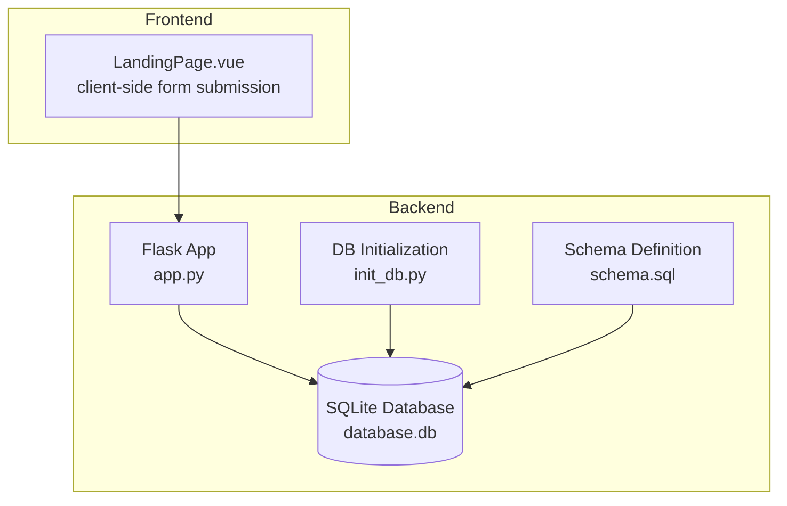
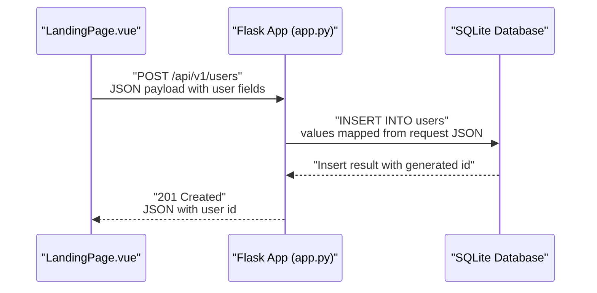
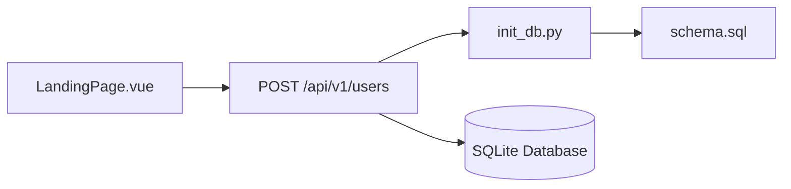

# User Management Endpoints

<cite>
**Referenced Files in This Document**
- [app.py](file://nutricoach/backend/app.py)
- [API.md](file://nutricoach/backend/API.md)
- [schema.sql](file://nutricoach/backend/schema.sql)
- [init_db.py](file://nutricoach/backend/init_db.py)
- [LandingPage.vue](file://nutricoach/frontend/components/LandingPage.vue)
</cite>

## Table of Contents
1. [Introduction](#introduction)
2. [Project Structure](#project-structure)
3. [Core Components](#core-components)
4. [Architecture Overview](#architecture-overview)
5. [Detailed Component Analysis](#detailed-component-analysis)
6. [Dependency Analysis](#dependency-analysis)
7. [Performance Considerations](#performance-considerations)
8. [Troubleshooting Guide](#troubleshooting-guide)
9. [Conclusion](#conclusion)

## Introduction
This document provides detailed API documentation for user management endpoints in the backend service. It focuses on the /api/v1/users endpoint family and maps the current implementation to the available routes and database schema. The documentation covers request/response schemas, validation rules, error handling, authentication requirements, rate limiting considerations, and practical examples for user creation, profile updates, and deletion.

## Project Structure
The backend is a Flask application that exposes REST endpoints backed by an SQLite database. The primary user model is defined in the schema and initialized during setup. The frontend demonstrates client-side usage of the user creation endpoint.

**Diagram sources**
- [app.py:1-31](file://nutricoach/backend/app.py#L1-L31)
- [schema.sql:1-77](file://nutricoach/backend/schema.sql#L1-L77)
- [init_db.py:1-106](file://nutricoach/backend/init_db.py#L1-L106)
- [LandingPage.vue:1-92](file://nutricoach/frontend/components/LandingPage.vue#L1-L92)

**Section sources**
- [app.py:1-31](file://nutricoach/backend/app.py#L1-L31)
- [API.md:1-59](file://nutricoach/backend/API.md#L1-L59)
- [schema.sql:1-77](file://nutricoach/backend/schema.sql#L1-L77)
- [init_db.py:1-106](file://nutricoach/backend/init_db.py#L1-L106)
- [LandingPage.vue:1-92](file://nutricoach/frontend/components/LandingPage.vue#L1-L92)

## Core Components
- Flask application with a single active route for user creation.
- SQLite database with a normalized schema supporting users, health profiles, diet preferences, meal plans, meals, and weight logs.
- Frontend component that submits user data to the backend.

Key implementation highlights:
- Endpoint: POST /api/v1/users for creating a new user.
- Database schema defines user fields including id, name, email, password_hash, age, gender, height, weight, goals, activity_level, diet_type, allergies, medical_conditions, budget, and timestamps.
- Frontend demonstrates a form submission to the user creation endpoint.

**Section sources**
- [app.py:16-26](file://nutricoach/backend/app.py#L16-L26)
- [schema.sql:3-19](file://nutricoach/backend/schema.sql#L3-L19)
- [LandingPage.vue:39-53](file://nutricoach/frontend/components/LandingPage.vue#L39-L53)

## Architecture Overview
The user management flow integrates the frontend form submission with the backend Flask route and the SQLite persistence layer.

**Diagram sources**
- [LandingPage.vue:48](file://nutricoach/frontend/components/LandingPage.vue#L48)
- [app.py:16-26](file://nutricoach/backend/app.py#L16-L26)
- [schema.sql:3-19](file://nutricoach/backend/schema.sql#L3-L19)

## Detailed Component Analysis

### Endpoint: POST /api/v1/users (Create User)
Purpose:
- Create a new user record in the database.

Request:
- Method: POST
- Path: /api/v1/users
- Content-Type: application/json
- Body fields:
  - name (required): string
  - email (required): string
  - age (optional): integer
  - weight (optional): real
  - height (optional): real
  - goals (optional): string

Response:
- Status codes:
  - 201 Created: successful creation
  - 400 Bad Request: malformed request or validation failure
  - 500 Internal Server Error: unexpected server error
- Response body:
  - JSON object containing the newly created user id

Behavior:
- Extracts JSON payload from the request.
- Inserts a new row into the users table with provided fields.
- Returns the generated user id.

Validation and Sanitization:
- No explicit input validation or sanitization is implemented in the route.
- Database-level constraints apply (e.g., email uniqueness enforced by schema).

Error Handling:
- Duplicate email: database constraint violation leads to an error response.
- Missing required fields: insertion failure results in an error response.

Practical Example:
- Submitting a form with name, email, age, weight, height, and goals to create a user.

Notes:
- The current implementation does not support retrieving, updating, or deleting users via dedicated endpoints.

**Section sources**
- [app.py:16-26](file://nutricoach/backend/app.py#L16-L26)
- [schema.sql:3-19](file://nutricoach/backend/schema.sql#L3-L19)
- [LandingPage.vue:39-53](file://nutricoach/frontend/components/LandingPage.vue#L39-L53)

### Endpoint: GET /api/v1/users/{user_id} (Retrieve User Details)
Endpoint availability:
- Not implemented in the current backend code.
- Refer to the API specification for intended behavior.

Intended behavior (per API.md):
- Retrieve a specific user’s details by user id.

Request:
- Method: GET
- Path: /api/v1/users/{user_id}
- Path parameters:
  - user_id (required): integer

Response:
- Status codes:
  - 200 OK: user found
  - 404 Not Found: user not found
  - 500 Internal Server Error: unexpected server error
- Response body:
  - JSON object representing the user

Notes:
- Implementation pending in the current backend.

**Section sources**
- [API.md:7-10](file://nutricoach/backend/API.md#L7-L10)

### Endpoint: PUT /api/v1/users/{user_id} (Update User Profile)
Endpoint availability:
- Not implemented in the current backend code.
- Refer to the API specification for intended behavior.

Intended behavior (per API.md):
- Update a user’s profile by user id.

Request:
- Method: PUT
- Path: /api/v1/users/{user_id}
- Path parameters:
  - user_id (required): integer
- Body fields:
  - name (optional): string
  - email (optional): string
  - age (optional): integer
  - weight (optional): real
  - height (optional): real
  - goals (optional): string

Response:
- Status codes:
  - 200 OK: successful update
  - 404 Not Found: user not found
  - 400 Bad Request: validation failure
  - 500 Internal Server Error: unexpected server error
- Response body:
  - JSON object representing the updated user

Notes:
- Implementation pending in the current backend.

**Section sources**
- [API.md:7-10](file://nutricoach/backend/API.md#L7-L10)

### Endpoint: DELETE /api/v1/users/{user_id} (Remove User Account)
Endpoint availability:
- Not implemented in the current backend code.
- Refer to the API specification for intended behavior.

Intended behavior (per API.md):
- Delete a user account by user id.

Request:
- Method: DELETE
- Path: /api/v1/users/{user_id}
- Path parameters:
  - user_id (required): integer

Response:
- Status codes:
  - 204 No Content: successful deletion
  - 404 Not Found: user not found
  - 500 Internal Server Error: unexpected server error
- Response body:
  - Empty body

Notes:
- Implementation pending in the current backend.

**Section sources**
- [API.md:7-10](file://nutricoach/backend/API.md#L7-L10)

### Authentication Requirements
- Not implemented in the current backend code.
- Refer to the API specification for intended behavior.

Intended behavior (per API.md):
- Authentication endpoints include register and login.
- Authorization tokens are expected for protected operations.

Notes:
- Current user management endpoints do not require authentication.

**Section sources**
- [API.md:21-24](file://nutricoach/backend/API.md#L21-L24)

### Parameter Validation Rules
Current backend validation:
- Minimal validation in the POST /api/v1/users route.
- Relies on database constraints for data integrity.

Database constraints (schema):
- Email is unique and not null.
- Name is not null.
- Password hash is not null.
- Age, height, weight, goals, activity_level, diet_type, allergies, medical_conditions, budget are optional.

Recommended validation (conceptual):
- Required fields: name, email, password_hash.
- Type checks: numeric fields validated as integers/reals.
- Unique constraints: enforce uniqueness for email.
- Sanitization: escape special characters and trim whitespace.

**Section sources**
- [schema.sql:3-19](file://nutricoach/backend/schema.sql#L3-L19)
- [app.py:16-26](file://nutricoach/backend/app.py#L16-L26)

### Error Handling for Duplicate Usernames/Emails
Observed behavior:
- Attempting to insert a duplicate email triggers a database constraint violation.
- The route does not explicitly handle this case, leading to a generic error response.

Recommended handling (conceptual):
- Catch database constraint violations for duplicate email.
- Return a structured error response indicating duplicate email.
- Include a machine-readable error code and human-readable message.

**Section sources**
- [schema.sql:6](file://nutricoach/backend/schema.sql#L6)
- [app.py:16-26](file://nutricoach/backend/app.py#L16-L26)

### Practical Examples

#### User Creation with Dietary Preferences
- Submit a POST request to /api/v1/users with name, email, age, weight, height, and goals.
- After user creation, set or update diet preferences via the diet preferences endpoints (not covered in this document).

Example request (conceptual):
- POST /api/v1/users
- Headers: Content-Type: application/json
- Body: { "name": "...", "email": "...", "age": 30, "weight": 70.5, "height": 175.0, "goals": "..." }

Expected response:
- 201 Created
- Body: { "id": 123 }

**Section sources**
- [LandingPage.vue:39-53](file://nutricoach/frontend/components/LandingPage.vue#L39-L53)
- [app.py:16-26](file://nutricoach/backend/app.py#L16-L26)

#### Profile Updates
- Intended behavior: Send a PUT request to /api/v1/users/{user_id} with updated fields.
- Implementation pending in the current backend.

**Section sources**
- [API.md:7-10](file://nutricoach/backend/API.md#L7-L10)

#### User Deletion
- Intended behavior: Send a DELETE request to /api/v1/users/{user_id}.
- Implementation pending in the current backend.

**Section sources**
- [API.md:7-10](file://nutricoach/backend/API.md#L7-L10)

### Rate Limiting Considerations
- Not implemented in the current backend code.
- Recommended approach (conceptual):
  - Apply rate limiting per IP address for user creation and other endpoints.
  - Use a sliding window or token bucket algorithm.
  - Return appropriate headers (e.g., X-RateLimit-Limit, X-RateLimit-Remaining).

[No sources needed since this section provides general guidance]

### Data Sanitization Practices
- Not implemented in the current backend code.
- Recommended approach (conceptual):
  - Validate and sanitize all incoming fields.
  - Enforce allowed character sets and lengths.
  - Escape HTML/script characters in text fields.
  - Normalize whitespace and trim inputs.

[No sources needed since this section provides general guidance]

## Dependency Analysis
The backend depends on the database schema and initialization scripts. The frontend depends on the backend API for user creation.

**Diagram sources**
- [LandingPage.vue:48](file://nutricoach/frontend/components/LandingPage.vue#L48)
- [app.py:16-26](file://nutricoach/backend/app.py#L16-L26)
- [init_db.py:1-106](file://nutricoach/backend/init_db.py#L1-L106)
- [schema.sql:1-77](file://nutricoach/backend/schema.sql#L1-L77)

**Section sources**
- [LandingPage.vue:48](file://nutricoach/frontend/components/LandingPage.vue#L48)
- [app.py:16-26](file://nutricoach/backend/app.py#L16-L26)
- [init_db.py:1-106](file://nutricoach/backend/init_db.py#L1-L106)
- [schema.sql:1-77](file://nutricoach/backend/schema.sql#L1-L77)

## Performance Considerations
- Database operations are synchronous and executed per-request.
- Recommendations (conceptual):
  - Use connection pooling for database connections.
  - Add indexes on frequently queried columns (e.g., email).
  - Implement pagination for future retrieval endpoints.
  - Cache frequently accessed data where appropriate.

[No sources needed since this section provides general guidance]

## Troubleshooting Guide
Common issues and resolutions:
- Duplicate email error:
  - Cause: Attempting to insert a user with an existing email.
  - Resolution: Ensure unique email values before submission.
- Missing required fields:
  - Cause: Omitting required fields in the request.
  - Resolution: Include name, email, and password_hash in the request body.
- Database connectivity:
  - Cause: Incorrect database path or permissions.
  - Resolution: Verify database file location and permissions.

**Section sources**
- [schema.sql:6](file://nutricoach/backend/schema.sql#L6)
- [app.py:16-26](file://nutricoach/backend/app.py#L16-L26)

## Conclusion
The current backend exposes a single user creation endpoint with minimal validation and no user retrieval, update, or deletion endpoints. The database schema supports a richer user model, including password hashing and additional attributes. To meet the documented objective comprehensively, implement the missing GET, PUT, and DELETE endpoints, add robust validation and sanitization, introduce authentication, and enhance error handling for duplicate entries. The frontend demonstrates a working example of user creation that can be extended to support the full lifecycle.