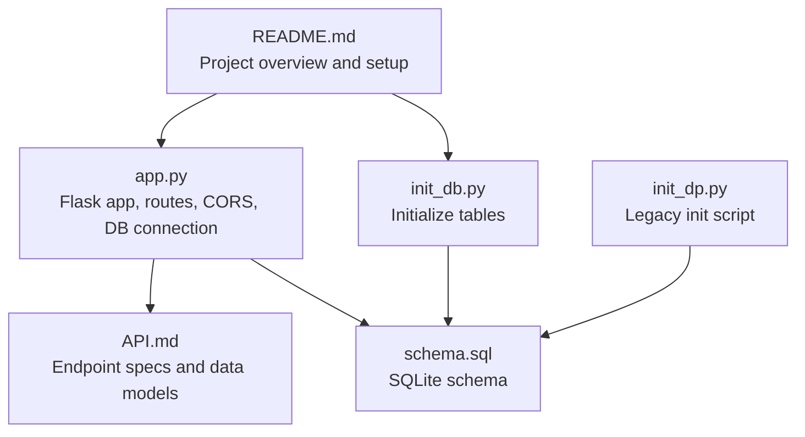
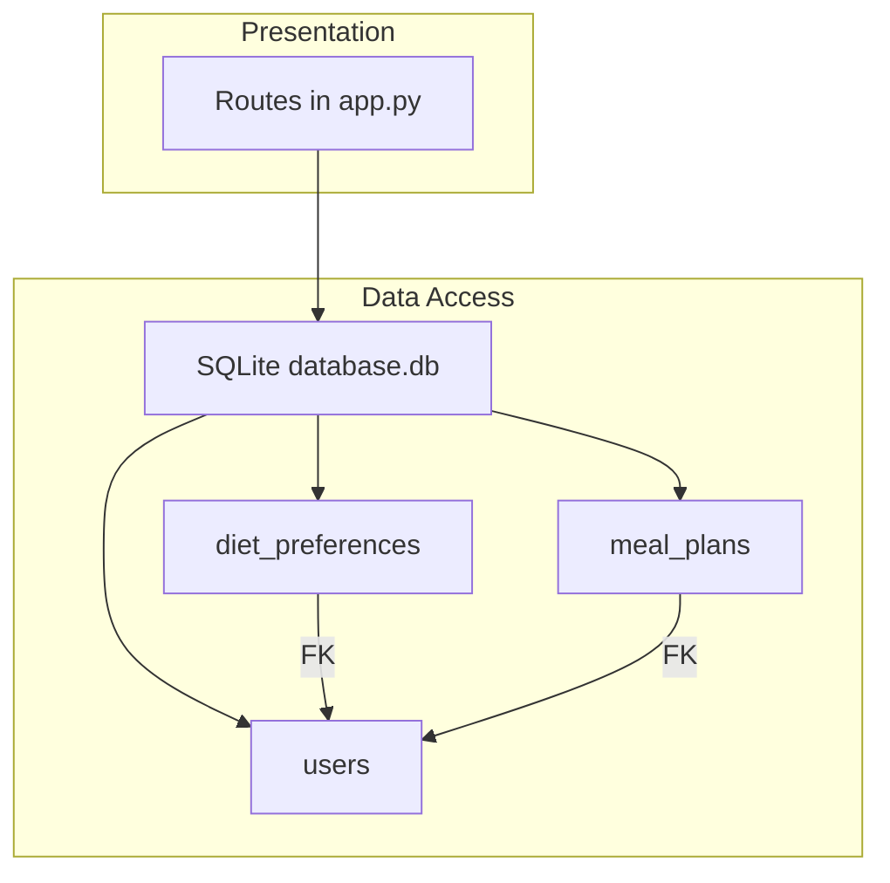
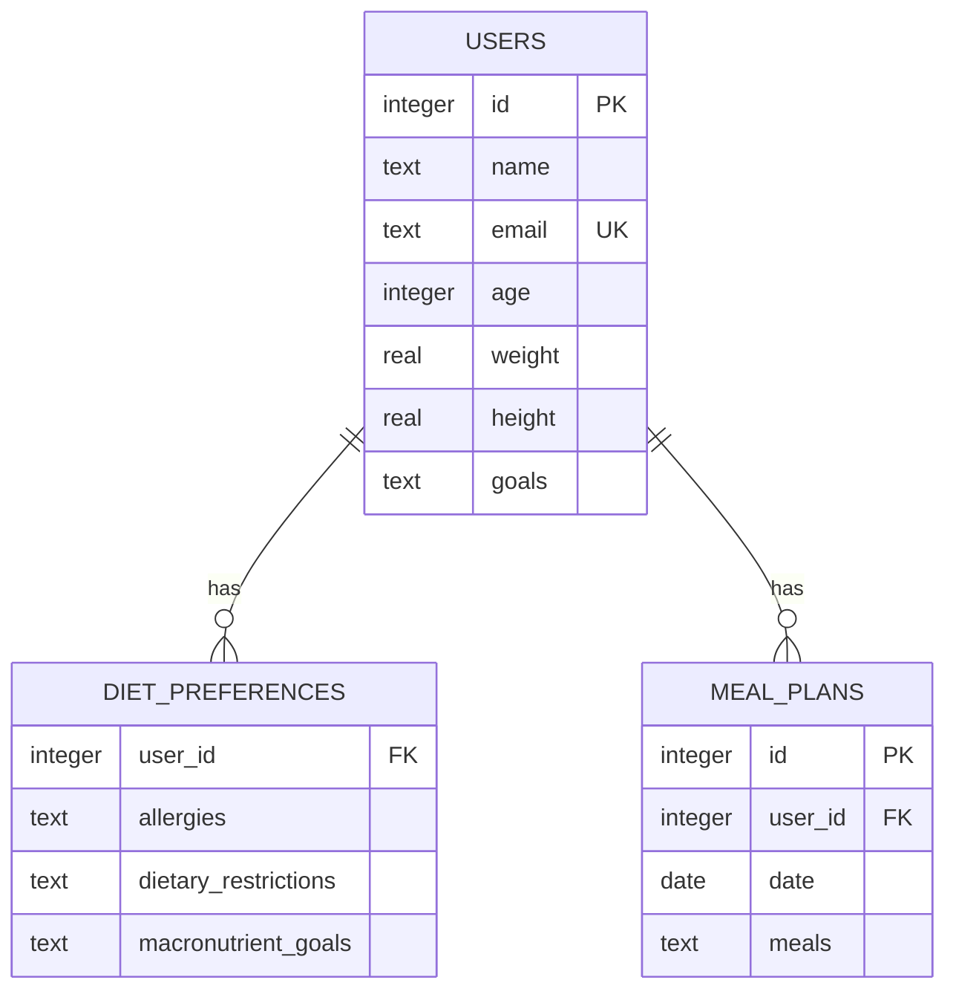
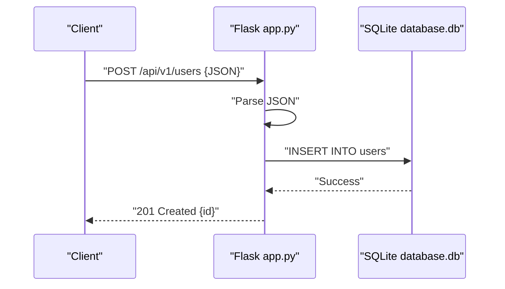
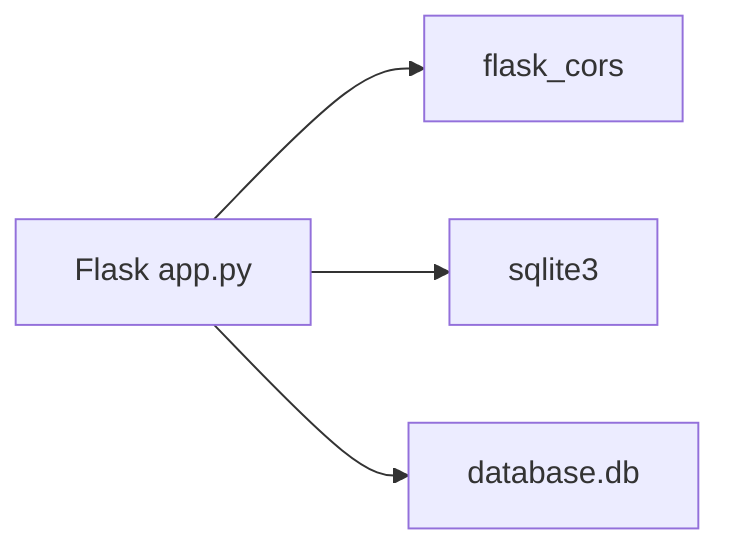

# Backend API Server

<cite>
**Referenced Files in This Document**
- [app.py](file://nutricoach/backend/app.py)
- [API.md](file://nutricoach/backend/API.md)
- [schema.sql](file://nutricoach/backend/schema.sql)
- [init_db.py](file://nutricoach/backend/init_db.py)
- [init_dp.py](file://nutricoach/backend/init_dp.py)
- [README.md](file://nutricoach/README.md)
</cite>

## Table of Contents
1. [Introduction](#introduction)
2. [Project Structure](#project-structure)
3. [Core Components](#core-components)
4. [Architecture Overview](#architecture-overview)
5. [Detailed Component Analysis](#detailed-component-analysis)
6. [Dependency Analysis](#dependency-analysis)
7. [Performance Considerations](#performance-considerations)
8. [Troubleshooting Guide](#troubleshooting-guide)
9. [Conclusion](#conclusion)
10. [Appendices](#appendices)

## Introduction
This document describes the backend API server for NutriCoach AI, a personalized diet plan generator. It covers Flask application setup, CORS configuration, database connection management, and application initialization. It documents the API endpoints for user management, authentication, dietary preferences, and meal plan generation, including HTTP methods, URL patterns, request/response schemas, and authentication requirements. It also explains the database schema design, initialization process, and schema evolution strategies, along with error handling patterns, status codes, response formatting standards, security considerations, rate limiting, and API versioning approaches. Practical examples of API consumption from the frontend and integration patterns are included.

## Project Structure
The backend is organized around a Flask application with a SQLite database. Key files include the application entry point, API documentation, schema definition, and database initialization scripts.

**Diagram sources**
- [app.py:1-31](file://nutricoach/backend/app.py#L1-L31)
- [API.md:1-59](file://nutricoach/backend/API.md#L1-L59)
- [schema.sql:1-25](file://nutricoach/backend/schema.sql#L1-L25)
- [init_db.py:1-47](file://nutricoach/backend/init_db.py#L1-L47)
- [init_dp.py:1-23](file://nutricoach/backend/init_dp.py#L1-L23)
- [README.md:1-77](file://nutricoach/README.md#L1-L77)

**Section sources**
- [README.md:18-47](file://nutricoach/README.md#L18-L47)
- [app.py:1-31](file://nutricoach/backend/app.py#L1-L31)
- [API.md:1-59](file://nutricoach/backend/API.md#L1-L59)
- [schema.sql:1-25](file://nutricoach/backend/schema.sql#L1-L25)
- [init_db.py:1-47](file://nutricoach/backend/init_db.py#L1-L47)
- [init_dp.py:1-23](file://nutricoach/backend/init_dp.py#L1-L23)

## Core Components
- Flask application and CORS: The application initializes a Flask app and enables cross-origin resource sharing for frontend-backend communication.
- Database connection management: A helper function establishes a SQLite connection with row factory for convenient record access.
- Application initialization: The server runs on host 0.0.0.0 and port 5000 with debug enabled.

Key implementation references:
- Flask app and CORS: [app.py:6-7](file://nutricoach/backend/app.py#L6-L7)
- Database path and connection helper: [app.py:9-14](file://nutricoach/backend/app.py#L9-L14)
- Application startup: [app.py:30-31](file://nutricoach/backend/app.py#L30-L31)

**Section sources**
- [app.py:6-14](file://nutricoach/backend/app.py#L6-L14)
- [app.py:30-31](file://nutricoach/backend/app.py#L30-L31)

## Architecture Overview
The backend follows a straightforward layered architecture:
- Presentation layer: Flask routes define the API surface.
- Data access layer: SQLite database with foreign key relationships.
- Initialization layer: Scripts to create tables and seed initial data.

**Diagram sources**
- [app.py:16-26](file://nutricoach/backend/app.py#L16-L26)
- [schema.sql:1-25](file://nutricoach/backend/schema.sql#L1-L25)

**Section sources**
- [app.py:16-26](file://nutricoach/backend/app.py#L16-L26)
- [schema.sql:1-25](file://nutricoach/backend/schema.sql#L1-L25)

## Detailed Component Analysis

### Flask Application Setup
- CORS configuration: Cross-origin requests are enabled globally for the Flask app.
- Database path: The SQLite database file is located adjacent to the backend module.
- Connection helper: Uses row factory to return rows as dictionaries for easier JSON serialization.

Implementation references:
- CORS enablement: [app.py:7](file://nutricoach/backend/app.py#L7)
- Database path: [app.py:9](file://nutricoach/backend/app.py#L9)
- Connection helper: [app.py:11-14](file://nutricoach/backend/app.py#L11-L14)

**Section sources**
- [app.py:7-14](file://nutricoach/backend/app.py#L7-L14)

### Database Schema Design
The schema defines three tables with explicit foreign key relationships:
- users: Stores user profile data with a unique email constraint.
- diet_preferences: Links to users via user_id with foreign key constraint.
- meal_plans: Links to users via user_id with foreign key constraint.

**Diagram sources**
- [schema.sql:1-25](file://nutricoach/backend/schema.sql#L1-L25)

**Section sources**
- [schema.sql:1-25](file://nutricoach/backend/schema.sql#L1-L25)

### Database Initialization
Two initialization scripts are present:
- init_db.py: Creates users, diet_preferences, and meal_plans tables with foreign keys.
- init_dp.py: Legacy script that creates a minimal users table.

Initialization steps:
- Connect to database.db.
- Create tables if they do not exist.
- Commit and close the connection.

References:
- init_db.py: [init_db.py:1-47](file://nutricoach/backend/init_db.py#L1-L47)
- init_dp.py: [init_dp.py:1-23](file://nutricoach/backend/init_dp.py#L1-L23)

**Section sources**
- [init_db.py:1-47](file://nutricoach/backend/init_db.py#L1-L47)
- [init_dp.py:1-23](file://nutricoach/backend/init_dp.py#L1-L23)

### API Endpoints
The API is versioned under /api/v1. The current implementation exposes a user creation endpoint. Additional endpoints are documented in API.md and will be integrated as development progresses.

Current endpoint:
- POST /api/v1/users: Create a new user with name, email, age, weight, height, and goals.

References:
- Endpoint definition: [app.py:16-26](file://nutricoach/backend/app.py#L16-L26)
- API specification: [API.md:6-24](file://nutricoach/backend/API.md#L6-L24)

**Section sources**
- [app.py:16-26](file://nutricoach/backend/app.py#L16-L26)
- [API.md:6-24](file://nutricoach/backend/API.md#L6-L24)

### Data Models
The API documentation defines the following data models:
- User: id, name, email, age, weight, height, goals.
- DietPreference: user_id, allergies, dietary_restrictions, macronutrient_goals.
- MealPlan: id, user_id, date, meals.

References:
- Data models: [API.md:27-59](file://nutricoach/backend/API.md#L27-L59)

**Section sources**
- [API.md:27-59](file://nutricoach/backend/API.md#L27-L59)

### Request/Response Handling
- Request parsing: JSON payload is extracted from the request.
- Response formatting: JSON responses are returned using Flask’s jsonify.
- Status codes: The user creation endpoint returns 201 Created.

References:
- JSON extraction and response: [app.py:17-26](file://nutricoach/backend/app.py#L17-L26)

**Section sources**
- [app.py:17-26](file://nutricoach/backend/app.py#L17-L26)

### Sequence Diagram: User Creation Flow

**Diagram sources**
- [app.py:16-26](file://nutricoach/backend/app.py#L16-L26)

## Dependency Analysis
- Flask and Flask-CORS: Used for routing and cross-origin support.
- SQLite: Embedded database accessed via Python’s sqlite3 module.
- Row factory: Enables dictionary-like access to rows for JSON serialization.

**Diagram sources**
- [app.py:1-7](file://nutricoach/backend/app.py#L1-L7)

**Section sources**
- [app.py:1-7](file://nutricoach/backend/app.py#L1-L7)

## Performance Considerations
- Connection lifecycle: Each request opens and closes a database connection. For higher throughput, consider connection pooling or reusing connections within a request context.
- Row factory: Using sqlite3.Row improves readability but adds minimal overhead.
- Indexing: No explicit indexes are defined. For large datasets, consider adding indexes on frequently queried columns (e.g., users.email).

[No sources needed since this section provides general guidance]

## Troubleshooting Guide
Common issues and resolutions:
- Database not found: Ensure database.db exists and is readable/writable by the application process.
- CORS errors: Confirm that CORS is enabled and that the frontend origin is permitted.
- Schema mismatch: Run init_db.py to recreate tables if the schema has changed.
- JSON parsing errors: Verify that requests include a valid JSON body and correct field names.

References:
- Database initialization: [init_db.py:1-47](file://nutricoach/backend/init_db.py#L1-L47)
- CORS enablement: [app.py:7](file://nutricoach/backend/app.py#L7)

**Section sources**
- [init_db.py:1-47](file://nutricoach/backend/init_db.py#L1-L47)
- [app.py:7](file://nutricoach/backend/app.py#L7)

## Conclusion
The backend provides a solid foundation for NutriCoach AI with a clear API surface, schema design, and initialization process. The current implementation focuses on user creation, with additional endpoints planned. The architecture supports easy extension for authentication, dietary preferences, and meal plan management while maintaining simplicity through SQLite and Flask.

[No sources needed since this section summarizes without analyzing specific files]

## Appendices

### API Versioning
- Base URL: /api/v1
- All endpoints are prefixed accordingly.

References:
- Base URL: [API.md:3-4](file://nutricoach/backend/API.md#L3-L4)

**Section sources**
- [API.md:3-4](file://nutricoach/backend/API.md#L3-L4)

### Security Considerations
- CORS: Enabled globally; restrict origins in production deployments.
- Authentication: Not implemented yet; plan to add JWT or session-based auth.
- Input validation: Add schema validation and sanitization for user inputs.
- Rate limiting: Implement rate limiting middleware to prevent abuse.

[No sources needed since this section provides general guidance]

### Database Initialization and Schema Evolution
- Initialization: Use init_db.py to create tables with foreign keys.
- Schema evolution: For future migrations, adopt a migration tool (e.g., Alembic) and maintain migration scripts alongside schema.sql.

References:
- Initialization: [init_db.py:1-47](file://nutricoach/backend/init_db.py#L1-L47)
- Legacy init: [init_dp.py:1-23](file://nutricoach/backend/init_dp.py#L1-L23)

**Section sources**
- [init_db.py:1-47](file://nutricoach/backend/init_db.py#L1-L47)
- [init_dp.py:1-23](file://nutricoach/backend/init_dp.py#L1-L23)

### Frontend Integration Patterns
- Base URL: http://localhost:5000/api/v1
- Example flow:
  - Create user via POST /users with JSON payload containing name, email, age, weight, height, goals.
  - Store returned id client-side for subsequent requests.
  - Use the id to manage dietary preferences and meal plans.

References:
- Base URL: [API.md:3-4](file://nutricoach/backend/API.md#L3-L4)
- Endpoint spec: [API.md:6-24](file://nutricoach/backend/API.md#L6-L24)

**Section sources**
- [API.md:3-4](file://nutricoach/backend/API.md#L3-L4)
- [API.md:6-24](file://nutricoach/backend/API.md#L6-L24)