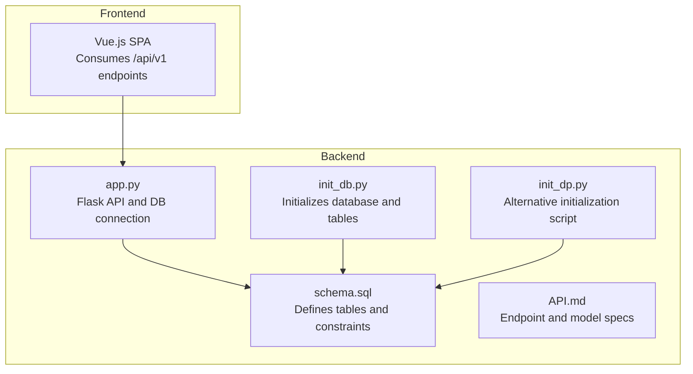
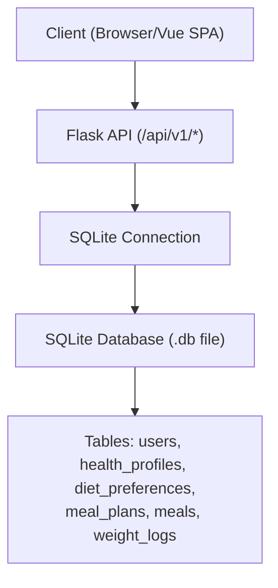
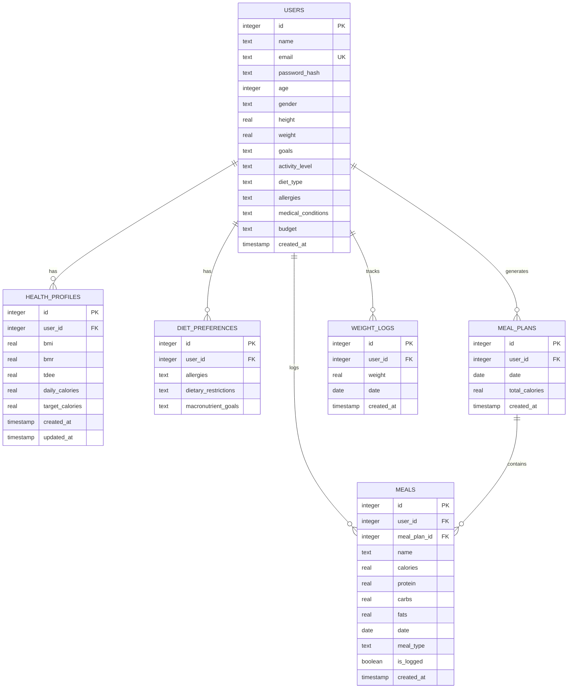
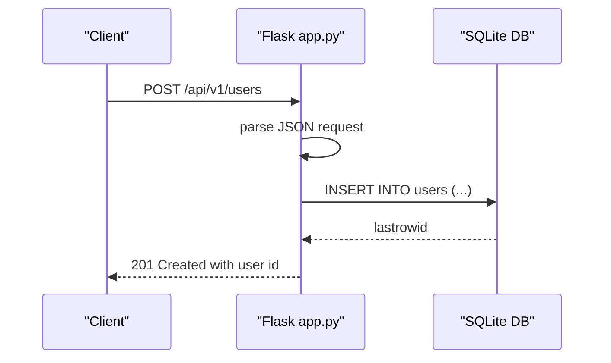
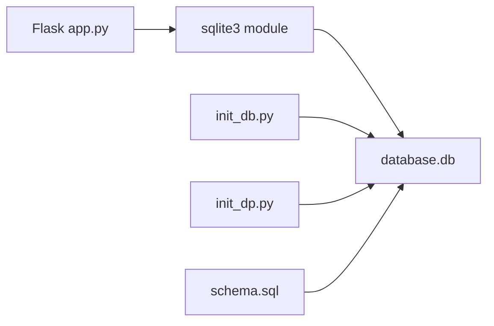

# Database Schema Design

<cite>
**Referenced Files in This Document**
- [schema.sql](file://nutricoach/backend/schema.sql)
- [init_db.py](file://nutricoach/backend/init_db.py)
- [init_dp.py](file://nutricoach/backend/init_dp.py)
- [app.py](file://nutricoach/backend/app.py)
- [API.md](file://nutricoach/backend/API.md)
- [README.md](file://nutricoach/README.md)
</cite>

## Table of Contents
1. [Introduction](#introduction)
2. [Project Structure](#project-structure)
3. [Core Components](#core-components)
4. [Architecture Overview](#architecture-overview)
5. [Detailed Component Analysis](#detailed-component-analysis)
6. [Dependency Analysis](#dependency-analysis)
7. [Performance Considerations](#performance-considerations)
8. [Troubleshooting Guide](#troubleshooting-guide)
9. [Conclusion](#conclusion)
10. [Appendices](#appendices)

## Introduction
This document provides comprehensive database schema documentation for NutriCoach AI. It covers table definitions, constraints, relationships, initialization and migration strategies, indexing and query patterns, data access patterns, validation rules, and operational best practices. The schema is implemented using SQLite with Python scripts for initialization and a Flask backend for data access.

## Project Structure
The database-related assets are primarily located under the backend directory:
- Schema definition script
- Initialization scripts for database creation and population
- Flask application for data access
- API documentation describing endpoints and data models

**Diagram sources**
- [schema.sql](file://nutricoach/backend/schema.sql)
- [init_db.py](file://nutricoach/backend/init_db.py)
- [init_dp.py](file://nutricoach/backend/init_dp.py)
- [app.py](file://nutricoach/backend/app.py)
- [API.md](file://nutricoach/backend/API.md)

**Section sources**
- [README.md:43-47](file://nutricoach/README.md#L43-L47)
- [API.md:1-59](file://nutricoach/backend/API.md#L1-L59)

## Core Components
This section documents the primary database tables used by NutriCoach AI, including their fields, data types, and constraints. The authoritative schema is defined in the schema SQL file.

- Users
  - Purpose: Stores user account and profile information.
  - Fields:
    - id: INTEGER PRIMARY KEY AUTOINCREMENT
    - name: TEXT NOT NULL
    - email: TEXT UNIQUE NOT NULL
    - password_hash: TEXT NOT NULL
    - age: INTEGER
    - gender: TEXT
    - height: REAL
    - weight: REAL
    - goals: TEXT
    - activity_level: TEXT
    - diet_type: TEXT
    - allergies: TEXT
    - medical_conditions: TEXT
    - budget: TEXT
    - created_at: TIMESTAMP DEFAULT CURRENT_TIMESTAMP
  - Notes: The schema defines additional profile fields beyond the API model, including password_hash and several health-related attributes.

- Health Profiles
  - Purpose: Stores calculated health metrics per user.
  - Fields:
    - id: INTEGER PRIMARY KEY AUTOINCREMENT
    - user_id: INTEGER NOT NULL (FK to users.id, ON DELETE CASCADE)
    - bmi: REAL
    - bmr: REAL
    - tdee: REAL
    - daily_calories: REAL
    - target_calories: REAL
    - created_at: TIMESTAMP DEFAULT CURRENT_TIMESTAMP
    - updated_at: TIMESTAMP DEFAULT CURRENT_TIMESTAMP

- Diet Preferences
  - Purpose: Stores user-specific dietary restrictions and goals.
  - Fields:
    - id: INTEGER PRIMARY KEY AUTOINCREMENT
    - user_id: INTEGER NOT NULL (FK to users.id, ON DELETE CASCADE)
    - allergies: TEXT
    - dietary_restrictions: TEXT
    - macronutrient_goals: TEXT

- Meal Plans
  - Purpose: Stores generated meal plans per user per day.
  - Fields:
    - id: INTEGER PRIMARY KEY AUTOINCREMENT
    - user_id: INTEGER NOT NULL (FK to users.id, ON DELETE CASCADE)
    - date: DATE NOT NULL
    - total_calories: REAL
    - created_at: TIMESTAMP DEFAULT CURRENT_TIMESTAMP

- Meals
  - Purpose: Stores individual meals within a meal plan or standalone logging.
  - Fields:
    - id: INTEGER PRIMARY KEY AUTOINCREMENT
    - user_id: INTEGER NOT NULL (FK to users.id, ON DELETE CASCADE)
    - meal_plan_id: INTEGER (FK to meal_plans.id, ON DELETE SET NULL)
    - name: TEXT NOT NULL
    - calories: REAL
    - protein: REAL
    - carbs: REAL
    - fats: REAL
    - date: DATE NOT NULL
    - meal_type: TEXT NOT NULL
    - is_logged: BOOLEAN DEFAULT 0
    - created_at: TIMESTAMP DEFAULT CURRENT_TIMESTAMP

- Weight Logs
  - Purpose: Tracks user weight entries over time.
  - Fields:
    - id: INTEGER PRIMARY KEY AUTOINCREMENT
    - user_id: INTEGER NOT NULL (FK to users.id, ON DELETE CASCADE)
    - weight: REAL NOT NULL
    - date: DATE NOT NULL
    - created_at: TIMESTAMP DEFAULT CURRENT_TIMESTAMP

Constraints and Referential Integrity
- Foreign Keys:
  - health_profiles.user_id -> users.id (ON DELETE CASCADE)
  - diet_preferences.user_id -> users.id (ON DELETE CASCADE)
  - meal_plans.user_id -> users.id (ON DELETE CASCADE)
  - meals.user_id -> users.id (ON DELETE CASCADE)
  - meals.meal_plan_id -> meal_plans.id (ON DELETE SET NULL)
  - weight_logs.user_id -> users.id (ON DELETE CASCADE)
- Unique Constraints:
  - users.email is UNIQUE
- Default Values:
  - Several TIMESTAMP fields default to CURRENT_TIMESTAMP
  - meals.is_logged defaults to 0 (boolean)

**Section sources**
- [schema.sql:3-76](file://nutricoach/backend/schema.sql#L3-L76)

## Architecture Overview
The backend uses a SQLite database accessed via Python’s sqlite3 module. The Flask application exposes REST endpoints that map to CRUD operations on the schema-defined tables. Initialization scripts create the database and tables.

**Diagram sources**
- [app.py:11-14](file://nutricoach/backend/app.py#L11-L14)
- [schema.sql:3-76](file://nutricoach/backend/schema.sql#L3-L76)

**Section sources**
- [app.py:1-31](file://nutricoach/backend/app.py#L1-L31)
- [README.md:43-47](file://nutricoach/README.md#L43-L47)

## Detailed Component Analysis

### Entity Relationship Diagram
The ER diagram below reflects the relationships among the core tables defined in the schema.

**Diagram sources**
- [schema.sql:3-76](file://nutricoach/backend/schema.sql#L3-L76)

### Data Access Patterns and API Mapping
The Flask application demonstrates direct SQL insertion against the users table. The API documentation outlines endpoints and payload shapes for users, diet preferences, and meal plans.

- User Creation
  - Endpoint: POST /api/v1/users
  - Payload fields: name, email, age, weight, height, goals
  - Implementation pattern: INSERT INTO users (...) VALUES (?, ?, ?, ?, ?, ?)

- Additional Endpoints (as documented)
  - GET /api/v1/users/{user_id}
  - PUT /api/v1/users/{user_id}
  - DELETE /api/v1/users/{user_id}
  - POST /api/v1/diet-preferences
  - GET /api/v1/diet-preferences/{user_id}
  - POST /api/v1/meal-plans
  - GET /api/v1/meal-plans/{user_id}
  - GET /api/v1/meal-plans/{user_id}/history

**Diagram sources**
- [app.py:16-26](file://nutricoach/backend/app.py#L16-L26)
- [API.md:6-10](file://nutricoach/backend/API.md#L6-L10)

**Section sources**
- [app.py:16-26](file://nutricoach/backend/app.py#L16-L26)
- [API.md:6-59](file://nutricoach/backend/API.md#L6-L59)

### Initialization and Migration Strategies
- Initialization Scripts
  - init_db.py: Creates users, diet_preferences, and meal_plans tables and establishes foreign keys.
  - init_dp.py: Creates a minimal users table (used for early setup).
- Schema Definition
  - schema.sql: Defines the authoritative schema including health_profiles, diet_preferences, meal_plans, meals, and weight_logs with comprehensive constraints.
- Migration Strategy
  - Current state: The project initializes tables via Python scripts and does not include explicit migration tooling.
  - Recommended approach:
    - Use a lightweight migration library (e.g., sqlite-migrations) to manage schema changes.
    - Version control migrations alongside schema.sql.
    - Apply migrations during deployment or startup.
  - For adding indexes or constraints in future iterations, wrap DDL statements in conditional checks to avoid failures on existing databases.

**Section sources**
- [init_db.py:9-42](file://nutricoach/backend/init_db.py#L9-L42)
- [init_dp.py:8-18](file://nutricoach/backend/init_dp.py#L8-L18)
- [schema.sql:3-76](file://nutricoach/backend/schema.sql#L3-L76)
- [README.md:43-47](file://nutricoach/README.md#L43-L47)

### Indexing Strategies and Query Optimization
- Current Indexes
  - No explicit indexes are defined in the schema.
- Recommended Indexes
  - users(email): Unique index already enforced by UNIQUE constraint; consider a covering index if frequent lookups by email occur.
  - health_profiles(user_id): Composite index (user_id, created_at) to optimize profile retrieval and updates.
  - diet_preferences(user_id): Single-column index on user_id for quick preference lookups.
  - meal_plans(user_id, date): Composite index to efficiently fetch plans per user per day.
  - meals(meal_plan_id, date): Composite index to accelerate plan-based meal queries.
  - weight_logs(user_id, date): Composite index to support weight trend queries.
- Query Patterns to Optimize
  - Retrieving latest meal plan per user: Use ORDER BY date DESC LIMIT 1 with appropriate index.
  - Aggregating daily macros: GROUP BY date with indexes on date and user_id.
  - Profile analytics: Use indexes on created_at and user_id for time-series queries.

**Section sources**
- [schema.sql:3-76](file://nutricoach/backend/schema.sql#L3-L76)

### Data Validation Rules and Business Logic Constraints
- Not-null constraints:
  - users.name, users.email, users.password_hash
  - health_profiles.user_id, diet_preferences.user_id, meal_plans.user_id, meals.user_id, weight_logs.user_id
- Uniqueness:
  - users.email is UNIQUE
- Referential integrity:
  - All child tables enforce FK constraints with cascading or SET NULL behaviors as defined.
- Defaults:
  - TIMESTAMP fields default to CURRENT_TIMESTAMP; meals.is_logged defaults to 0.
- Business Rules (derived from schema and API):
  - Password hashing is handled at application level (field present in schema).
  - Daily calorie targets and macros are stored in dedicated tables/meals for plan execution.
  - Weight logs enable progress tracking over time.

**Section sources**
- [schema.sql:3-76](file://nutricoach/backend/schema.sql#L3-L76)
- [API.md:29-59](file://nutricoach/backend/API.md#L29-L59)

### Data Lifecycle Management
- Creation: Users and profiles are created via API endpoints; meal plans and logs are generated by the application logic.
- Updates: Health profiles and weight logs include updated_at timestamps; application logic should update updated_at accordingly.
- Deletion: CASCADE deletes ensure child records are removed when a user is deleted; SET NULL allows orphaning of meals when a plan is removed.
- Archival/Retention: Consider implementing soft deletion or retention policies at the application layer if long-term historical data is required.

**Section sources**
- [schema.sql:31-32](file://nutricoach/backend/schema.sql#L31-L32)
- [schema.sql:40-41](file://nutricoach/backend/schema.sql#L40-L41)
- [schema.sql:66-66](file://nutricoach/backend/schema.sql#L66-L66)

## Dependency Analysis
The backend depends on Python’s sqlite3 module and the Flask framework. The database schema is defined centrally and consumed by both initialization scripts and the Flask application.

**Diagram sources**
- [app.py:1-31](file://nutricoach/backend/app.py#L1-L31)
- [init_db.py:1-47](file://nutricoach/backend/init_db.py#L1-L47)
- [init_dp.py:1-23](file://nutricoach/backend/init_dp.py#L1-L23)
- [schema.sql:1-77](file://nutricoach/backend/schema.sql#L1-L77)

**Section sources**
- [app.py:1-31](file://nutricoach/backend/app.py#L1-L31)
- [init_db.py:1-47](file://nutricoach/backend/init_db.py#L1-L47)
- [init_dp.py:1-23](file://nutricoach/backend/init_dp.py#L1-L23)
- [schema.sql:1-77](file://nutricoach/backend/schema.sql#L1-L77)

## Performance Considerations
- Connection Management: Use persistent connections or connection pooling in production; currently, each request opens and closes a connection.
- Prepared Statements: The existing code uses parameterized queries, which is good for preventing SQL injection and enabling plan reuse.
- Indexing: Add composite indexes for common filter-and-sort patterns (user_id + date, user_id + created_at).
- Query Size Limits: Paginate results for endpoints returning lists (e.g., meal plan history).
- Vacuum/Integrity Checks: Periodically run VACUUM and PRAGMA integrity_check in production deployments.

[No sources needed since this section provides general guidance]

## Troubleshooting Guide
- Database Initialization Failures
  - Ensure the backend directory is used for initialization commands.
  - Verify that the working directory contains the database file path used by the scripts.
- Connection Issues
  - Confirm the database file exists and is writable by the application process.
  - Validate that the Flask app connects to the correct path.
- Data Integrity Errors
  - UNIQUE violations on email indicate duplicate entries; handle gracefully in the API.
  - Foreign key errors suggest missing parent records; validate user_id presence before inserts.
- Migration Conflicts
  - If schema evolves, apply migrations before starting the application to avoid runtime errors.

**Section sources**
- [README.md:43-47](file://nutricoach/README.md#L43-L47)
- [app.py:9-14](file://nutricoach/backend/app.py#L9-L14)
- [schema.sql:3-76](file://nutricoach/backend/schema.sql#L3-L76)

## Conclusion
NutriCoach AI employs a straightforward SQLite schema centered around users, health metrics, dietary preferences, meal plans, meals, and weight logs. The schema enforces referential integrity and key constraints, while the Flask backend provides a minimal but extensible foundation for data access. To scale, introduce indexing, migrations, and connection pooling, and expand the API coverage to align with the documented models.

[No sources needed since this section summarizes without analyzing specific files]

## Appendices

### Appendix A: Sample Data Structures
- User
  - Fields: id, name, email, password_hash, age, gender, height, weight, goals, activity_level, diet_type, allergies, medical_conditions, budget, created_at
- Diet Preference
  - Fields: id, user_id, allergies, dietary_restrictions, macronutrient_goals
- Meal Plan
  - Fields: id, user_id, date, total_calories, created_at

**Section sources**
- [API.md:29-59](file://nutricoach/backend/API.md#L29-L59)