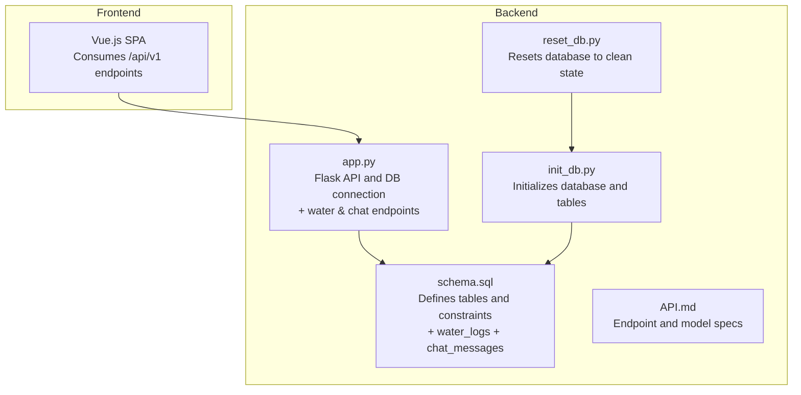
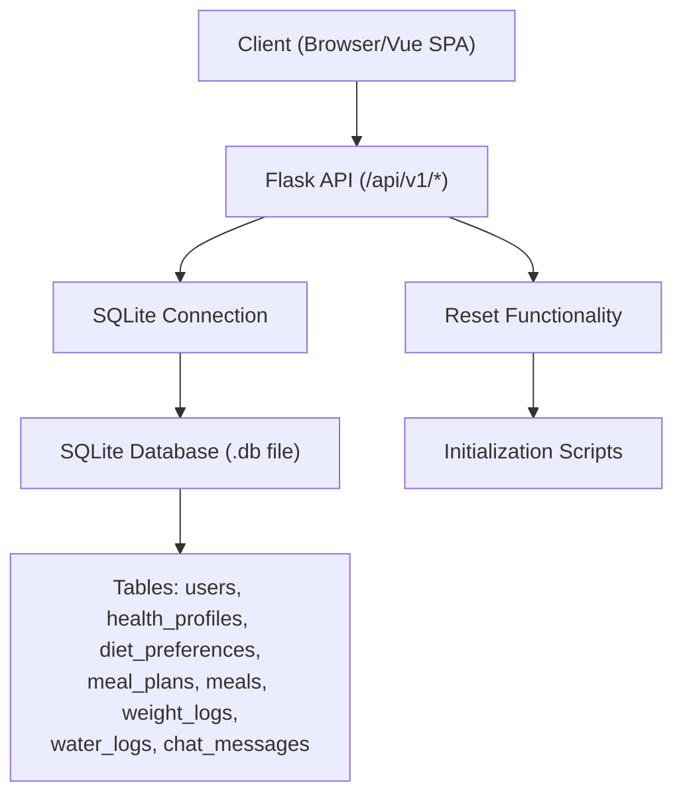
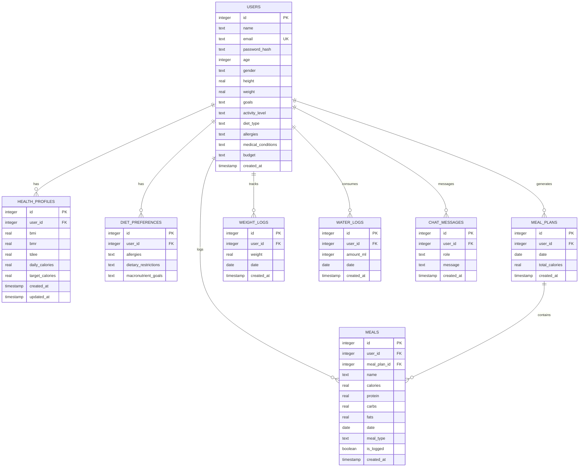
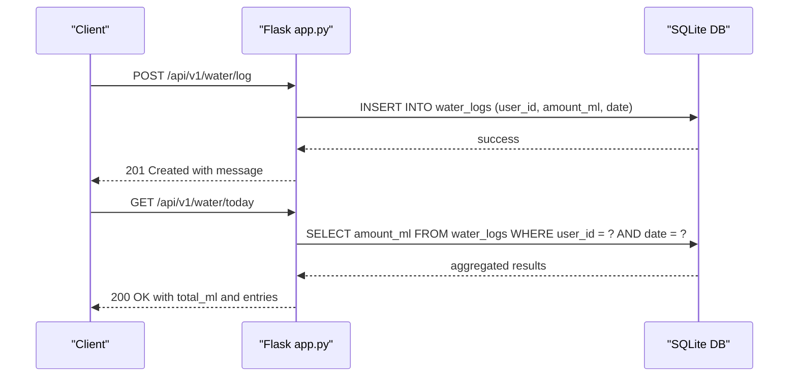
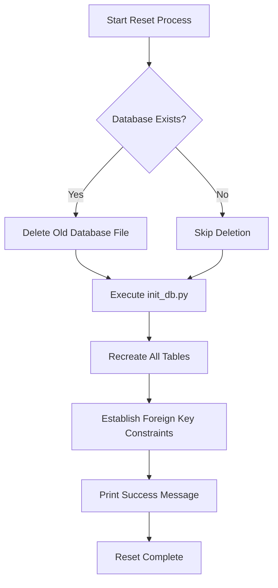
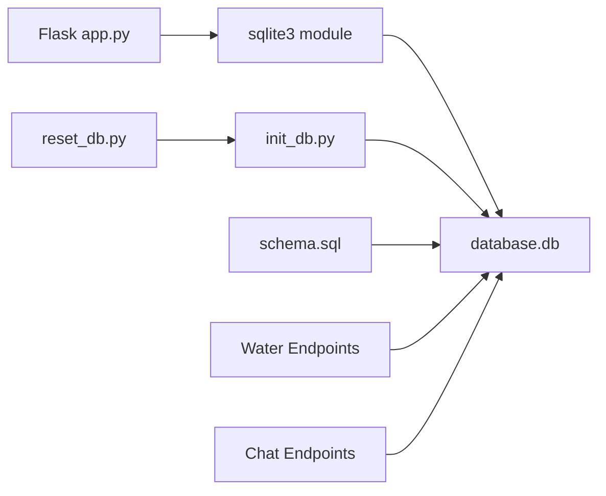

# Database Schema Design

<cite>
**Referenced Files in This Document**
- [schema.sql](file://nutricoach/backend/schema.sql)
- [init_db.py](file://nutricoach/backend/init_db.py)
- [reset_db.py](file://nutricoach/backend/reset_db.py)
- [app.py](file://nutricoach/backend/app.py)
- [API.md](file://nutricoach/backend/API.md)
- [README.md](file://nutricoach/README.md)
</cite>

## Update Summary
**Changes Made**
- Added comprehensive documentation for new water_logs table for water intake tracking
- Added detailed documentation for new chat_messages table for AI conversation history storage
- Updated table definitions to include water_logs and chat_messages with field specifications
- Enhanced API endpoint coverage to include water logging and AI chat functionality
- Updated entity relationship diagrams to reflect new table relationships
- Expanded data access patterns to include water intake and chat message handling

## Table of Contents
1. [Introduction](#introduction)
2. [Project Structure](#project-structure)
3. [Core Components](#core-components)
4. [Architecture Overview](#architecture-overview)
5. [Detailed Component Analysis](#detailed-component-analysis)
6. [Database Reset and Maintenance](#database-reset-and-maintenance)
7. [Dependency Analysis](#dependency-analysis)
8. [Performance Considerations](#performance-considerations)
9. [Troubleshooting Guide](#troubleshooting-guide)
10. [Conclusion](#conclusion)
11. [Appendices](#appendices)

## Introduction
This document provides comprehensive database schema documentation for NutriCoach AI. It covers table definitions, constraints, relationships, initialization and migration strategies, database reset functionality, indexing and query patterns, data access patterns, validation rules, and operational best practices. The schema is implemented using SQLite with Python scripts for initialization, reset operations, and a Flask backend for data access. The schema now includes enhanced functionality for water intake tracking and AI-powered conversation history management.

## Project Structure
The database-related assets are primarily located under the backend directory:
- Schema definition script with expanded table definitions
- Initialization scripts for database creation and population
- Database reset functionality for maintenance operations
- Flask application for data access with new water and chat endpoints
- API documentation describing endpoints and data models



**Diagram sources**
- [schema.sql](file://nutricoach/backend/schema.sql)
- [init_db.py](file://nutricoach/backend/init_db.py)
- [reset_db.py](file://nutricoach/backend/reset_db.py)
- [app.py](file://nutricoach/backend/app.py)
- [API.md](file://nutricoach/backend/API.md)

**Section sources**
- [README.md:43-47](file://nutricoach/README.md#L43-L47)
- [API.md:1-59](file://nutricoach/backend/API.md#L1-L59)

## Core Components
This section documents the primary database tables used by NutriCoach AI, including their fields, data types, and constraints. The authoritative schema is defined in the schema SQL file, which now includes enhanced functionality for water intake tracking and AI conversation history.

- Users
  - Purpose: Stores user account and profile information.
  - Fields:
    - id: INTEGER PRIMARY KEY AUTOINCREMENT
    - name: TEXT NOT NULL
    - email: TEXT UNIQUE NOT NULL
    - password_hash: TEXT NOT NULL
    - age: INTEGER
    - gender: TEXT
    - height: REAL
    - weight: REAL
    - goals: TEXT
    - activity_level: TEXT
    - diet_type: TEXT
    - allergies: TEXT
    - medical_conditions: TEXT
    - budget: TEXT
    - created_at: TIMESTAMP DEFAULT CURRENT_TIMESTAMP
  - Notes: The schema defines additional profile fields beyond the API model, including password_hash and several health-related attributes.

- Health Profiles
  - Purpose: Stores calculated health metrics per user.
  - Fields:
    - id: INTEGER PRIMARY KEY AUTOINCREMENT
    - user_id: INTEGER NOT NULL (FK to users.id, ON DELETE CASCADE)
    - bmi: REAL
    - bmr: REAL
    - tdee: REAL
    - daily_calories: REAL
    - target_calories: REAL
    - created_at: TIMESTAMP DEFAULT CURRENT_TIMESTAMP
    - updated_at: TIMESTAMP DEFAULT CURRENT_TIMESTAMP

- Diet Preferences
  - Purpose: Stores user-specific dietary restrictions and goals.
  - Fields:
    - id: INTEGER PRIMARY KEY AUTOINCREMENT
    - user_id: INTEGER NOT NULL (FK to users.id, ON DELETE CASCADE)
    - allergies: TEXT
    - dietary_restrictions: TEXT
    - macronutrient_goals: TEXT

- Meal Plans
  - Purpose: Stores generated meal plans per user per day.
  - Fields:
    - id: INTEGER PRIMARY KEY AUTOINCREMENT
    - user_id: INTEGER NOT NULL (FK to users.id, ON DELETE CASCADE)
    - date: DATE NOT NULL
    - total_calories: REAL
    - created_at: TIMESTAMP DEFAULT CURRENT_TIMESTAMP

- Meals
  - Purpose: Stores individual meals within a meal plan or standalone logging.
  - Fields:
    - id: INTEGER PRIMARY KEY AUTOINCREMENT
    - user_id: INTEGER NOT NULL (FK to users.id, ON DELETE CASCADE)
    - meal_plan_id: INTEGER (FK to meal_plans.id, ON DELETE SET NULL)
    - name: TEXT NOT NULL
    - calories: REAL
    - protein: REAL
    - carbs: REAL
    - fats: REAL
    - date: DATE NOT NULL
    - meal_type: TEXT NOT NULL
    - is_logged: BOOLEAN DEFAULT 0
    - created_at: TIMESTAMP DEFAULT CURRENT_TIMESTAMP

- Weight Logs
  - Purpose: Tracks user weight entries over time.
  - Fields:
    - id: INTEGER PRIMARY KEY AUTOINCREMENT
    - user_id: INTEGER NOT NULL (FK to users.id, ON DELETE CASCADE)
    - weight: REAL NOT NULL
    - date: DATE NOT NULL
    - created_at: TIMESTAMP DEFAULT CURRENT_TIMESTAMP

- Water Logs
  - Purpose: Tracks user water intake consumption over time.
  - Fields:
    - id: INTEGER PRIMARY KEY AUTOINCREMENT
    - user_id: INTEGER NOT NULL (FK to users.id, ON DELETE CASCADE)
    - amount_ml: INTEGER NOT NULL DEFAULT 250
    - date: DATE NOT NULL
    - created_at: TIMESTAMP DEFAULT CURRENT_TIMESTAMP
  - Notes: Default water intake amount is 250ml (standard glass size), with daily aggregation for dashboard metrics.

- Chat Messages
  - Purpose: Stores AI conversation history for each user.
  - Fields:
    - id: INTEGER PRIMARY KEY AUTOINCREMENT
    - user_id: INTEGER NOT NULL (FK to users.id, ON DELETE CASCADE)
    - role: TEXT NOT NULL (values: 'user' or 'assistant')
    - message: TEXT NOT NULL
    - created_at: TIMESTAMP DEFAULT CURRENT_TIMESTAMP
  - Notes: Maintains conversation context with chronological ordering for AI response generation.

Constraints and Referential Integrity
- Foreign Keys:
  - health_profiles.user_id -> users.id (ON DELETE CASCADE)
  - diet_preferences.user_id -> users.id (ON DELETE CASCADE)
  - meal_plans.user_id -> users.id (ON DELETE CASCADE)
  - meals.user_id -> users.id (ON DELETE CASCADE)
  - meals.meal_plan_id -> meal_plans.id (ON DELETE SET NULL)
  - weight_logs.user_id -> users.id (ON DELETE CASCADE)
  - water_logs.user_id -> users.id (ON DELETE CASCADE)
  - chat_messages.user_id -> users.id (ON DELETE CASCADE)
- Unique Constraints:
  - users.email is UNIQUE
- Default Values:
  - Several TIMESTAMP fields default to CURRENT_TIMESTAMP
  - meals.is_logged defaults to 0 (boolean)
  - water_logs.amount_ml defaults to 250 (ml)

**Section sources**
- [schema.sql:3-95](file://nutricoach/backend/schema.sql#L3-L95)

## Architecture Overview
The backend uses a SQLite database accessed via Python's sqlite3 module. The Flask application exposes REST endpoints that map to CRUD operations on the schema-defined tables. The enhanced schema now supports water intake tracking and AI conversation history, with initialization scripts creating all tables and constraints, while the reset functionality provides maintenance capabilities.



**Diagram sources**
- [app.py:11-14](file://nutricoach/backend/app.py#L11-L14)
- [schema.sql:3-95](file://nutricoach/backend/schema.sql#L3-L95)
- [reset_db.py:1-13](file://nutricoach/backend/reset_db.py#L1-L13)

**Section sources**
- [app.py:1-31](file://nutricoach/backend/app.py#L1-L31)
- [README.md:43-47](file://nutricoach/README.md#L43-L47)

## Detailed Component Analysis

### Entity Relationship Diagram
The ER diagram below reflects the relationships among all core tables defined in the schema, including the newly added water_logs and chat_messages tables.



**Diagram sources**
- [schema.sql:3-95](file://nutricoach/backend/schema.sql#L3-L95)

### Data Access Patterns and API Mapping
The Flask application demonstrates direct SQL insertion against the users table and includes new endpoints for water intake tracking and AI chat functionality. The API documentation outlines endpoints and payload shapes for all major features.

- User Creation
  - Endpoint: POST /api/v1/users
  - Payload fields: name, email, age, weight, height, goals
  - Implementation pattern: INSERT INTO users (...) VALUES (?, ?, ?, ?, ?, ?)

- Authentication Endpoints
  - POST /api/v1/auth/register - User registration with password hashing
  - POST /api/v1/auth/login - User authentication with JWT token generation
  - GET /api/v1/auth/me - Current user profile retrieval

- Health Calculation Endpoints
  - POST /api/v1/health/calculate - BMI, BMR, TDEE calculation and storage
  - GET /api/v1/health/profile - Health profile retrieval

- Meal Planning Endpoints
  - POST /api/v1/meal-plans/generate - Generate and save personalized meal plan
  - GET /api/v1/meal-plans/current - Retrieve current day's meal plan
  - GET /api/v1/meal-plans/{user_id}/history - Retrieve meal plan history

- Food Tracking Endpoints
  - POST /api/v1/meals/log - Log custom meals
  - GET /api/v1/meals/today - Retrieve today's logged meals

- Weight Tracking Endpoints
  - POST /api/v1/weight/log - Log weight entries
  - GET /api/v1/weight/history - Retrieve weight history

- Water Intake Endpoints
  - POST /api/v1/water/log - Log water consumption with amount_ml and date
  - GET /api/v1/water/today - Retrieve today's total water intake

- AI Chat Endpoints
  - POST /api/v1/chat - Send message to AI assistant and receive response
  - GET /api/v1/chat/history - Retrieve conversation history



**Diagram sources**
- [app.py:513-541](file://nutricoach/backend/app.py#L513-L541)
- [schema.sql:78-85](file://nutricoach/backend/schema.sql#L78-L85)

**Section sources**
- [app.py:513-541](file://nutricoach/backend/app.py#L513-L541)
- [app.py:616-663](file://nutricoach/backend/app.py#L616-L663)
- [API.md:6-59](file://nutricoach/backend/API.md#L6-L59)

### Initialization and Migration Strategies
- Initialization Scripts
  - init_db.py: Creates users, diet_preferences, and meal_plans tables and establishes foreign keys.
  - reset_db.py: Provides database reset functionality by deleting the old database and reinitializing tables.
- Schema Definition
  - schema.sql: Defines the authoritative schema including health_profiles, diet_preferences, meal_plans, meals, weight_logs, water_logs, and chat_messages with comprehensive constraints.
- Migration Strategy
  - Current state: The project initializes tables via Python scripts and provides reset functionality for maintenance.
  - Recommended approach:
    - Use a lightweight migration library (e.g., sqlite-migrations) to manage schema changes.
    - Version control migrations alongside schema.sql.
    - Apply migrations during deployment or startup.
  - For adding indexes or constraints in future iterations, wrap DDL statements in conditional checks to avoid failures on existing databases.

**Section sources**
- [init_db.py:9-106](file://nutricoach/backend/init_db.py#L9-L106)
- [reset_db.py:1-13](file://nutricoach/backend/reset_db.py#L1-L13)
- [schema.sql:3-95](file://nutricoach/backend/schema.sql#L3-L95)
- [README.md:43-47](file://nutricoach/README.md#L43-L47)

### Indexing Strategies and Query Optimization
- Current Indexes
  - No explicit indexes are defined in the schema.
- Recommended Indexes
  - users(email): Unique index already enforced by UNIQUE constraint; consider a covering index if frequent lookups by email occur.
  - health_profiles(user_id): Composite index (user_id, created_at) to optimize profile retrieval and updates.
  - diet_preferences(user_id): Single-column index on user_id for quick preference lookups.
  - meal_plans(user_id, date): Composite index to efficiently fetch plans per user per day.
  - meals(meal_plan_id, date): Composite index to accelerate plan-based meal queries.
  - weight_logs(user_id, date): Composite index to support weight trend queries.
  - water_logs(user_id, date): Composite index to optimize water intake aggregation queries.
  - chat_messages(user_id, created_at): Composite index to accelerate conversation history retrieval.
- Query Patterns to Optimize
  - Retrieving latest meal plan per user: Use ORDER BY date DESC LIMIT 1 with appropriate index.
  - Aggregating daily macros: GROUP BY date with indexes on date and user_id.
  - Profile analytics: Use indexes on created_at and user_id for time-series queries.
  - Water intake totals: Use SUM(amount_ml) with WHERE clause on user_id and date.
  - Chat history: Use ORDER BY created_at ASC with user_id filtering.

**Section sources**
- [schema.sql:3-95](file://nutricoach/backend/schema.sql#L3-L95)

### Data Validation Rules and Business Logic Constraints
- Not-null constraints:
  - users.name, users.email, users.password_hash
  - health_profiles.user_id, diet_preferences.user_id, meal_plans.user_id, meals.user_id, weight_logs.user_id
  - water_logs.user_id, water_logs.amount_ml, water_logs.date
  - chat_messages.user_id, chat_messages.role, chat_messages.message
- Uniqueness:
  - users.email is UNIQUE
- Referential integrity:
  - All child tables enforce FK constraints with cascading or SET NULL behaviors as defined.
- Defaults:
  - TIMESTAMP fields default to CURRENT_TIMESTAMP; meals.is_logged defaults to 0; water_logs.amount_ml defaults to 250.
- Business Rules (derived from schema and API):
  - Password hashing is handled at application level (field present in schema).
  - Daily calorie targets and macros are stored in dedicated tables/meals for plan execution.
  - Weight logs enable progress tracking over time.
  - Water intake defaults to 250ml per entry (standard glass size).
  - Chat messages maintain conversation context with role differentiation (user vs assistant).
  - Water intake aggregation provides dashboard metrics for hydration tracking.

**Section sources**
- [schema.sql:3-95](file://nutricoach/backend/schema.sql#L3-L95)
- [API.md:29-59](file://nutricoach/backend/API.md#L29-L59)

### Data Lifecycle Management
- Creation: Users and profiles are created via API endpoints; meal plans and logs are generated by the application logic; water intake and chat messages are recorded through dedicated endpoints.
- Updates: Health profiles and weight logs include updated_at timestamps; application logic should update updated_at accordingly.
- Deletion: CASCADE deletes ensure child records are removed when a user is deleted; SET NULL allows orphaning of meals when a plan is removed.
- Archival/Retention: Consider implementing soft deletion or retention policies at the application layer if long-term historical data is required.
- Water Intake: Daily aggregation occurs automatically in dashboard endpoints; individual entries can be queried for detailed tracking.
- Chat History: Conversation history is maintained indefinitely with automatic cleanup not implemented at database level.

**Section sources**
- [schema.sql:31-32](file://nutricoach/backend/schema.sql#L31-L32)
- [schema.sql:40-41](file://nutricoach/backend/schema.sql#L40-L41)
- [schema.sql:66-66](file://nutricoach/backend/schema.sql#L66-L66)
- [schema.sql:84-85](file://nutricoach/backend/schema.sql#L84-L85)
- [schema.sql:93-94](file://nutricoach/backend/schema.sql#L93-L94)

## Database Reset and Maintenance

### Database Reset Functionality
The application now includes comprehensive database reset capabilities through the reset_db.py script, which provides a clean slate for development and testing environments.

**Reset Process Flow:**
1. **Database Detection**: Script checks for existing database file at DB_PATH
2. **Deletion**: Removes the existing database file if present
3. **Reinitialization**: Executes init_db.py to recreate all tables and constraints
4. **Verification**: Prints success message upon completion



**Diagram sources**
- [reset_db.py:1-13](file://nutricoach/backend/reset_db.py#L1-L13)

### Reset Usage Scenarios
- **Development Environment**: Clean database state for testing new features
- **Data Corruption Recovery**: Restore database to known good state
- **Schema Changes Testing**: Fresh database after schema modifications
- **Demo Environments**: Clean slate for presentations and demonstrations

### Reset Command Execution
```bash
cd nutricoach/backend
python reset_db.py
```

**Section sources**
- [reset_db.py:1-13](file://nutricoach/backend/reset_db.py#L1-L13)

## Dependency Analysis
The backend depends on Python's sqlite3 module and the Flask framework. The database schema is defined centrally and consumed by both initialization scripts, reset functionality, and the Flask application. The enhanced schema now supports additional dependencies for water intake tracking and AI chat functionality.



**Diagram sources**
- [app.py:1-31](file://nutricoach/backend/app.py#L1-L31)
- [init_db.py:1-106](file://nutricoach/backend/init_db.py#L1-L106)
- [reset_db.py:1-13](file://nutricoach/backend/reset_db.py#L1-L13)
- [schema.sql:1-95](file://nutricoach/backend/schema.sql#L1-L95)

**Section sources**
- [app.py:1-31](file://nutricoach/backend/app.py#L1-L31)
- [init_db.py:1-106](file://nutricoach/backend/init_db.py#L1-L106)
- [reset_db.py:1-13](file://nutricoach/backend/reset_db.py#L1-L13)
- [schema.sql:1-95](file://nutricoach/backend/schema.sql#L1-L95)

## Performance Considerations
- Connection Management: Use persistent connections or connection pooling in production; currently, each request opens and closes a connection.
- Prepared Statements: The existing code uses parameterized queries, which is good for preventing SQL injection and enabling plan reuse.
- Indexing: Add composite indexes for common filter-and-sort patterns (user_id + date, user_id + created_at).
- Query Size Limits: Paginate results for endpoints returning lists (e.g., meal plan history, chat history).
- Vacuum/Integrity Checks: Periodically run VACUUM and PRAGMA integrity_check in production deployments.
- Reset Performance: The reset functionality provides a clean database state without manual cleanup operations.
- Water Intake Queries: Consider caching daily totals for frequently accessed dashboards.
- Chat History: Implement pagination for long conversation histories to prevent memory issues.

## Troubleshooting Guide
- Database Initialization Failures
  - Ensure the backend directory is used for initialization commands.
  - Verify that the working directory contains the database file path used by the scripts.
- Connection Issues
  - Confirm the database file exists and is writable by the application process.
  - Validate that the Flask app connects to the correct path.
- Data Integrity Errors
  - UNIQUE violations on email indicate duplicate entries; handle gracefully in the API.
  - Foreign key errors suggest missing parent records; validate user_id presence before inserts.
  - Water intake negative values: Validate amount_ml is positive in water logging endpoints.
  - Chat message validation: Ensure role is either 'user' or 'assistant'.
- Migration Conflicts
  - If schema evolves, apply migrations before starting the application to avoid runtime errors.
- Reset Issues
  - Permission errors during reset: Ensure write permissions for the backend directory.
  - Reset fails silently: Check Python environment and dependencies are properly installed.
  - Database not found after reset: Verify the database.db file is created in the expected location.
- Water Intake Issues
  - Missing water entries: Verify date format matches YYYY-MM-DD pattern.
  - Incorrect totals: Check for proper aggregation in dashboard endpoints.
- Chat Issues
  - Empty responses: Verify user profile and health profile data availability.
  - Conversation history empty: Check user_id authentication and chat_message entries.

**Section sources**
- [README.md:43-47](file://nutricoach/README.md#L43-L47)
- [app.py:9-14](file://nutricoach/backend/app.py#L9-L14)
- [schema.sql:3-95](file://nutricoach/backend/schema.sql#L3-L95)
- [reset_db.py:1-13](file://nutricoach/backend/reset_db.py#L1-L13)

## Conclusion
NutriCoach AI employs a comprehensive SQLite schema centered around users, health metrics, dietary preferences, meal plans, meals, weight logs, water logs, and chat messages. The schema enforces referential integrity and key constraints, while the Flask backend provides a robust foundation for data access with enhanced meal planning features, water intake tracking, and AI conversation history. The addition of database reset functionality provides essential maintenance capabilities for development and testing environments. To scale, introduce indexing, migrations, and connection pooling, and expand the API coverage to align with the documented models.

## Appendices

### Appendix A: Sample Data Structures
- User
  - Fields: id, name, email, password_hash, age, gender, height, weight, goals, activity_level, diet_type, allergies, medical_conditions, budget, created_at
- Diet Preference
  - Fields: id, user_id, allergies, dietary_restrictions, macronutrient_goals
- Meal Plan
  - Fields: id, user_id, date, total_calories, created_at
- Water Log Entry
  - Fields: id, user_id, amount_ml, date, created_at
  - Default: amount_ml = 250 (standard glass size)
- Chat Message
  - Fields: id, user_id, role, message, created_at
  - Role values: 'user' or 'assistant'

### Appendix B: Database Reset Commands
- **Full Reset**: `python reset_db.py`
- **Manual Cleanup**: Remove database.db file manually, then run initialization scripts
- **Verification**: Check that all tables are recreated after reset operation

### Appendix C: New API Endpoints
- **Water Intake**
  - POST /api/v1/water/log - Log water consumption with amount_ml and date
  - GET /api/v1/water/today - Retrieve today's total water intake
- **AI Chat**
  - POST /api/v1/chat - Send message to AI assistant and receive response
  - GET /api/v1/chat/history - Retrieve conversation history

**Section sources**
- [API.md:29-59](file://nutricoach/backend/API.md#L29-L59)
- [reset_db.py:1-13](file://nutricoach/backend/reset_db.py#L1-L13)
- [app.py:513-541](file://nutricoach/backend/app.py#L513-L541)
- [app.py:616-663](file://nutricoach/backend/app.py#L616-L663)