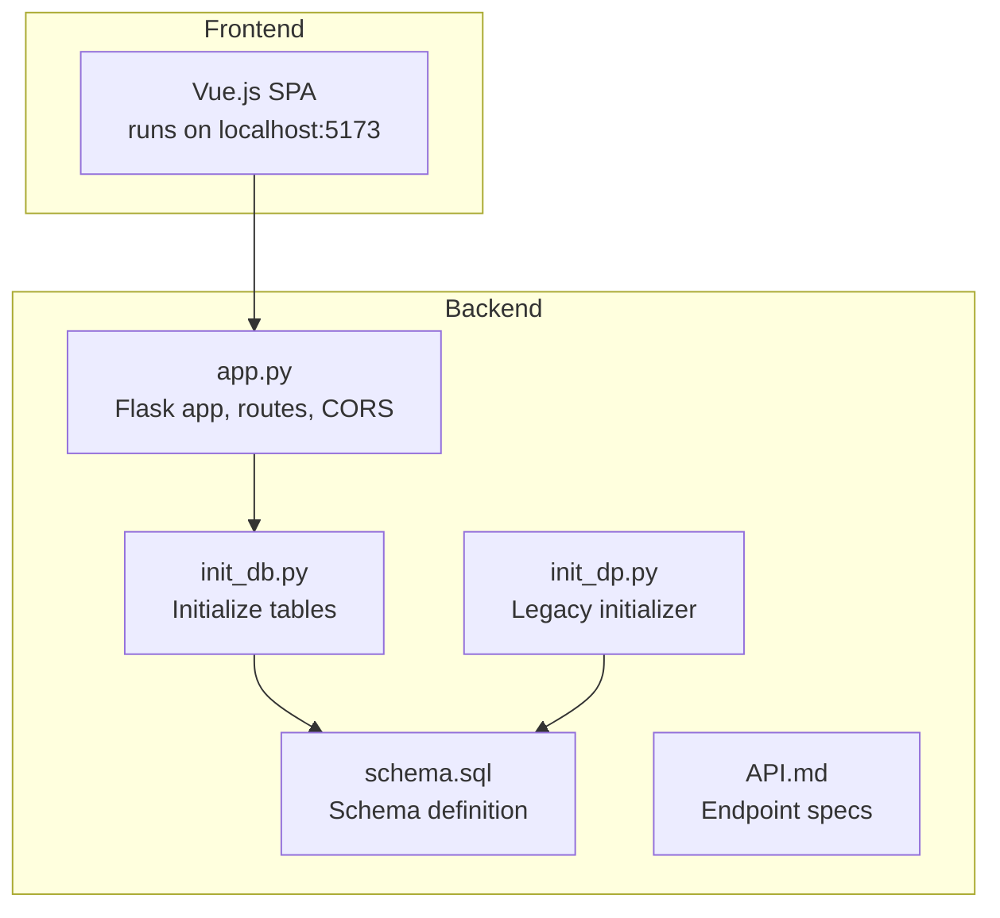
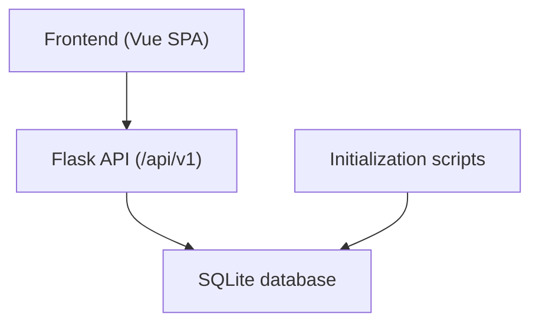
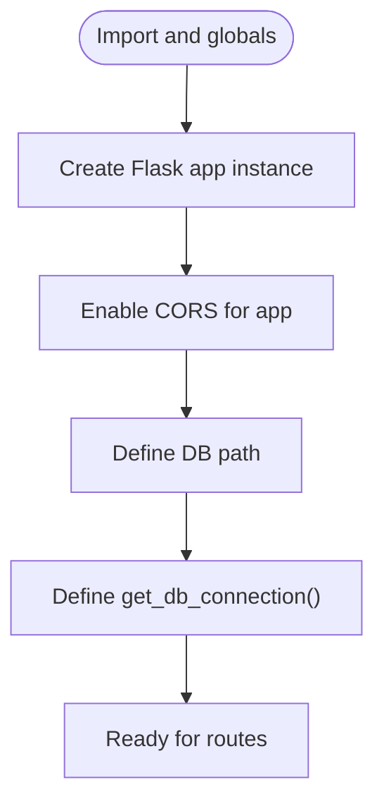
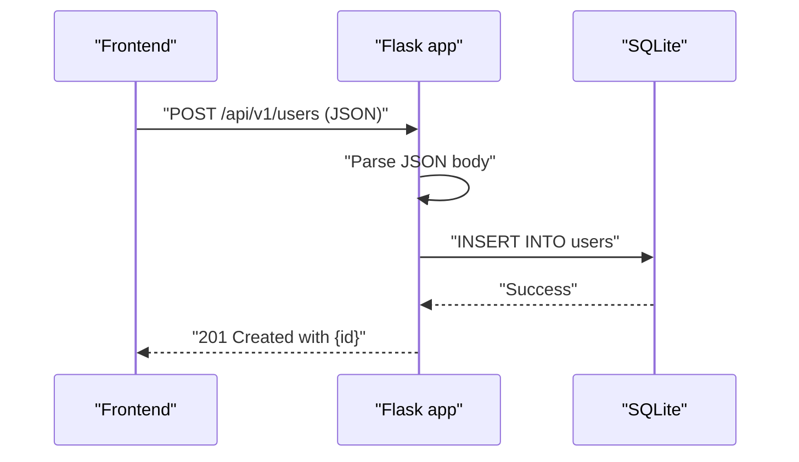
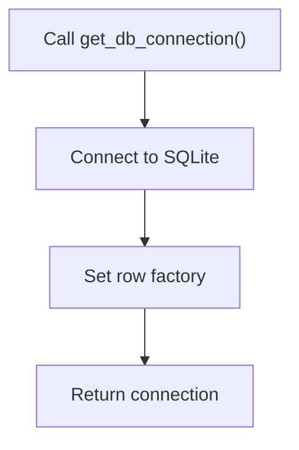
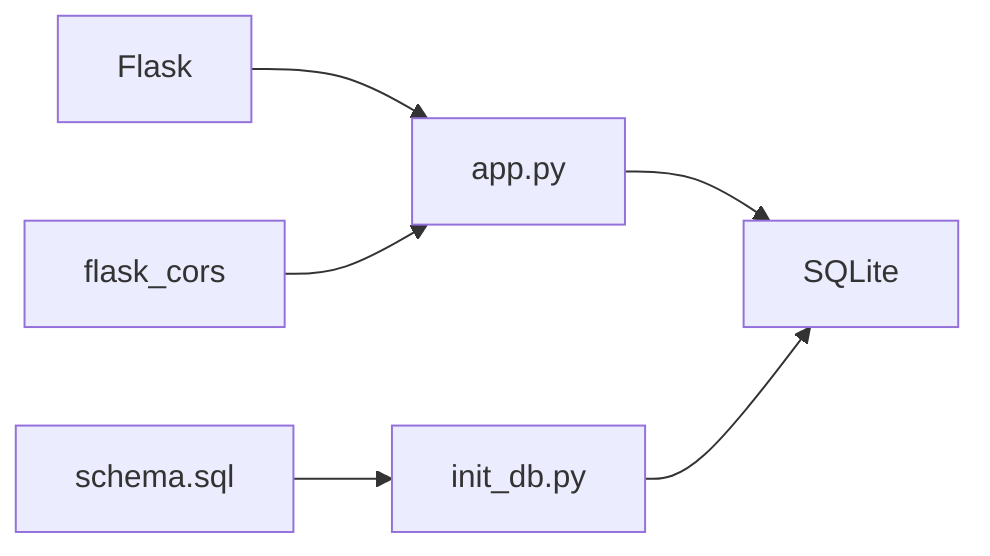

# Flask Application Setup

<cite>
**Referenced Files in This Document**
- [app.py](file://nutricoach/backend/app.py)
- [init_db.py](file://nutricoach/backend/init_db.py)
- [init_dp.py](file://nutricoach/backend/init_dp.py)
- [schema.sql](file://nutricoach/backend/schema.sql)
- [API.md](file://nutricoach/backend/API.md)
- [README.md](file://nutricoach/README.md)
</cite>

## Table of Contents
1. [Introduction](#introduction)
2. [Project Structure](#project-structure)
3. [Core Components](#core-components)
4. [Architecture Overview](#architecture-overview)
5. [Detailed Component Analysis](#detailed-component-analysis)
6. [Dependency Analysis](#dependency-analysis)
7. [Performance Considerations](#performance-considerations)
8. [Troubleshooting Guide](#troubleshooting-guide)
9. [Conclusion](#conclusion)
10. [Appendices](#appendices)

## Introduction
This document explains the Flask application setup for NutriCoach AI, focusing on application initialization, CORS configuration, database connection management, routing, and operational differences between development and production. It also outlines how the application currently handles requests and responses, and highlights areas for improvement in configuration management, middleware, error handling, logging, security, and session management.

## Project Structure
The backend is a minimal Flask application with a single module that defines routes and a database helper. Supporting scripts initialize the SQLite database with the required tables. The frontend is a separate Vue.js application that communicates with the backend API.

**Diagram sources**
- [app.py](file://nutricoach/backend/app.py)
- [init_db.py](file://nutricoach/backend/init_db.py)
- [init_dp.py](file://nutricoach/backend/init_dp.py)
- [schema.sql](file://nutricoach/backend/schema.sql)
- [API.md](file://nutricoach/backend/API.md)

**Section sources**
- [README.md](file://nutricoach/README.md)
- [app.py](file://nutricoach/backend/app.py)

## Core Components
- Flask application instance and CORS configuration
- Database connection helper using SQLite
- Single route for user creation
- Development server entry point

Key observations:
- The application does not use the application factory pattern; it initializes the Flask app at module level.
- There is no explicit blueprint registration in the current code.
- No global error handlers or logging configuration is present.
- Session management and security-related middleware are not configured.
- Environment-specific configuration is not implemented; development mode is enabled via the local run command.

**Section sources**
- [app.py](file://nutricoach/backend/app.py)

## Architecture Overview
The backend exposes REST endpoints under a base path defined in the API specification. The frontend runs separately and communicates with the backend over HTTP. The database is a local SQLite file managed by initialization scripts.

**Diagram sources**
- [API.md](file://nutricoach/backend/API.md)
- [app.py](file://nutricoach/backend/app.py)
- [init_db.py](file://nutricoach/backend/init_db.py)

## Detailed Component Analysis

### Flask Application Initialization and CORS
- The Flask app is created at module scope and CORS is enabled globally.
- The database path is resolved relative to the backend module location.
- A helper function establishes connections with row access via a row factory.

**Diagram sources**
- [app.py](file://nutricoach/backend/app.py)

**Section sources**
- [app.py](file://nutricoach/backend/app.py)

### Route Definition and Request/Response Handling
- A single endpoint accepts JSON payloads and returns JSON responses with appropriate status codes.
- The route inserts user data into the database and returns the newly created identifier.

**Diagram sources**
- [API.md](file://nutricoach/backend/API.md)
- [app.py](file://nutricoach/backend/app.py)

**Section sources**
- [app.py](file://nutricoach/backend/app.py)
- [API.md](file://nutricoach/backend/API.md)

### Database Connection Management
- The connection helper opens a SQLite connection and sets a row factory for convenient row access.
- The database is initialized by a script that creates the required tables.

**Diagram sources**
- [app.py](file://nutricoach/backend/app.py)
- [init_db.py](file://nutricoach/backend/init_db.py)

**Section sources**
- [app.py](file://nutricoach/backend/app.py)
- [init_db.py](file://nutricoach/backend/init_db.py)
- [schema.sql](file://nutricoach/backend/schema.sql)

### Blueprint Registration and Middleware
- Blueprints are not used in the current implementation.
- No custom middleware is registered; the application relies on default Flask behavior.

**Section sources**
- [app.py](file://nutricoach/backend/app.py)

### Application Factory Pattern
- Not implemented. The Flask app is created at import time.

**Section sources**
- [app.py](file://nutricoach/backend/app.py)

### Error Handlers and Logging
- No application-level error handlers are defined.
- No logging configuration is present in the current code.

**Section sources**
- [app.py](file://nutricoach/backend/app.py)

### Security Configurations and Session Management
- No CSRF protection, secure cookies, or session management is configured.
- Authentication endpoints are documented but not implemented in the current code.

**Section sources**
- [API.md](file://nutricoach/backend/API.md)
- [app.py](file://nutricoach/backend/app.py)

## Dependency Analysis
The backend depends on Flask and Flask-CORS for HTTP handling and cross-origin support, and on SQLite for persistence. Initialization scripts define the schema and prepare the database.

**Diagram sources**
- [app.py](file://nutricoach/backend/app.py)
- [init_db.py](file://nutricoach/backend/init_db.py)
- [schema.sql](file://nutricoach/backend/schema.sql)

**Section sources**
- [app.py](file://nutricoach/backend/app.py)
- [init_db.py](file://nutricoach/backend/init_db.py)
- [schema.sql](file://nutricoach/backend/schema.sql)

## Performance Considerations
- Current implementation uses a single-threaded development server.
- Database operations are basic inserts; consider connection pooling and transaction boundaries for scalability.
- Global CORS is permissive; restrict origins in production.

[No sources needed since this section provides general guidance]

## Troubleshooting Guide
- Database initialization: Run the initialization script to create tables before starting the server.
- Endpoint testing: Use the documented base URL and method signatures to verify responses.
- Development mode: The server runs with debug enabled locally; disable for production.

**Section sources**
- [README.md](file://nutricoach/README.md)
- [init_db.py](file://nutricoach/backend/init_db.py)
- [API.md](file://nutricoach/backend/API.md)

## Conclusion
The current Flask backend is a minimal prototype with a single route and straightforward database initialization. To move toward production readiness, implement an application factory, add blueprints, configure environment-aware settings, register error handlers and logging, introduce security middleware, and implement authentication and session management according to the API specification.

[No sources needed since this section summarizes without analyzing specific files]

## Appendices

### Development vs Production Differences
- Development: Local run with debug enabled and permissive CORS.
- Production: Use a WSGI server behind a reverse proxy; enable strict CORS and disable debug.

**Section sources**
- [app.py](file://nutricoach/backend/app.py)
- [README.md](file://nutricoach/README.md)

### Configuration Management
- The current code does not implement environment-specific configuration.
- Recommended improvements include environment variables, configuration classes, and a factory function to create the app with appropriate settings.

**Section sources**
- [app.py](file://nutricoach/backend/app.py)

### Example Request Types and Responses
- POST /api/v1/users: Expects a JSON payload with user fields and returns a 201 with the new identifier.
- Future endpoints: GET/PUT/DELETE for users, diet preferences, and meal plans as documented.

**Section sources**
- [API.md](file://nutricoach/backend/API.md)
- [app.py](file://nutricoach/backend/app.py)