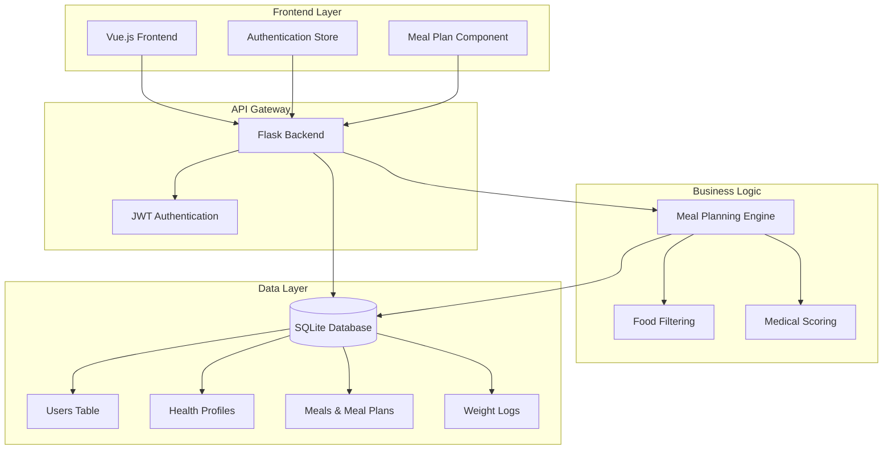
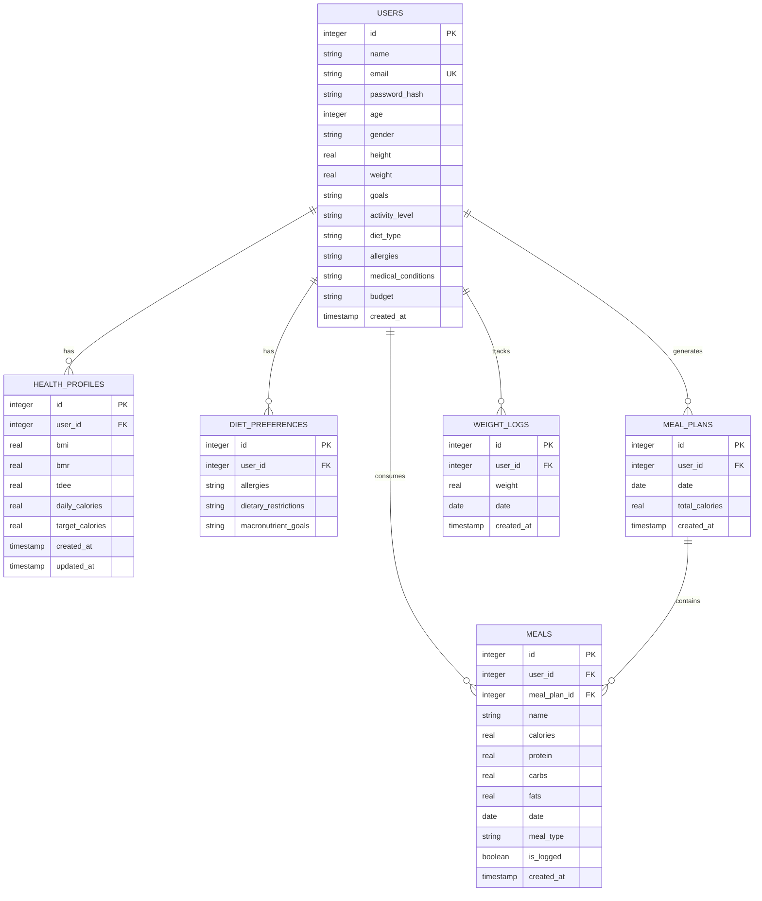
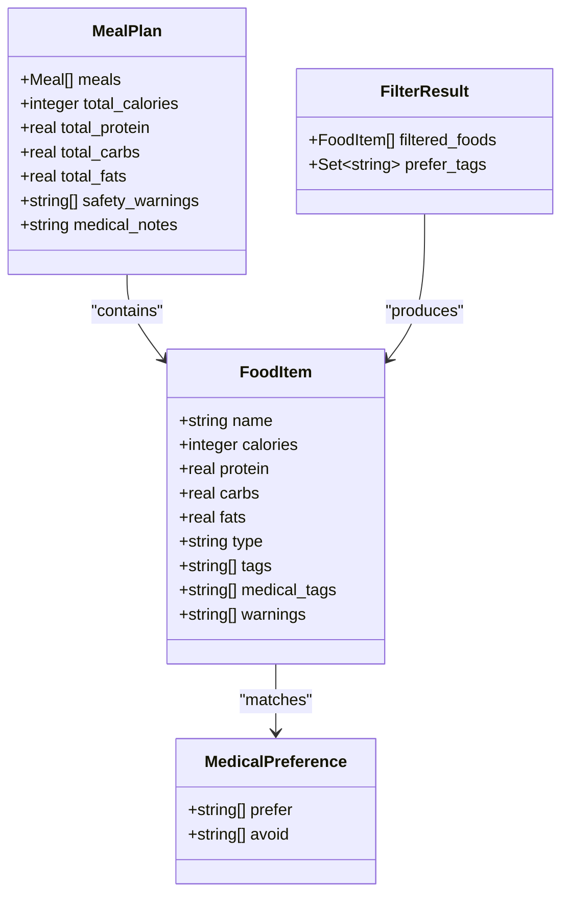
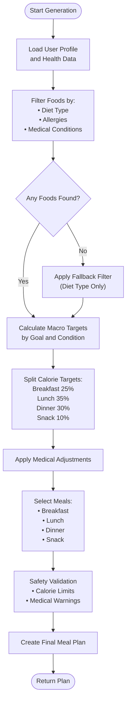
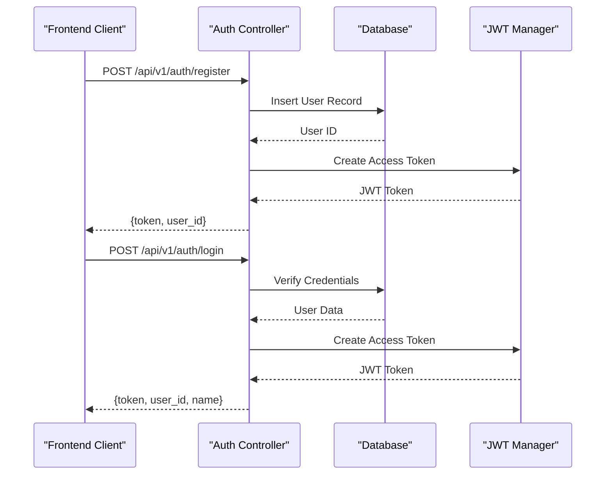
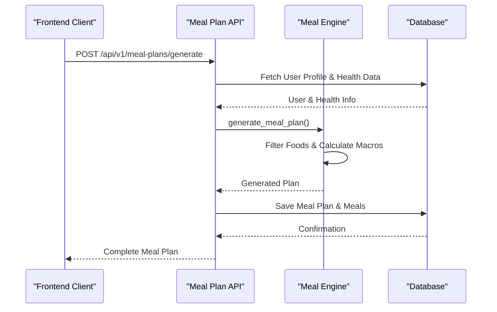
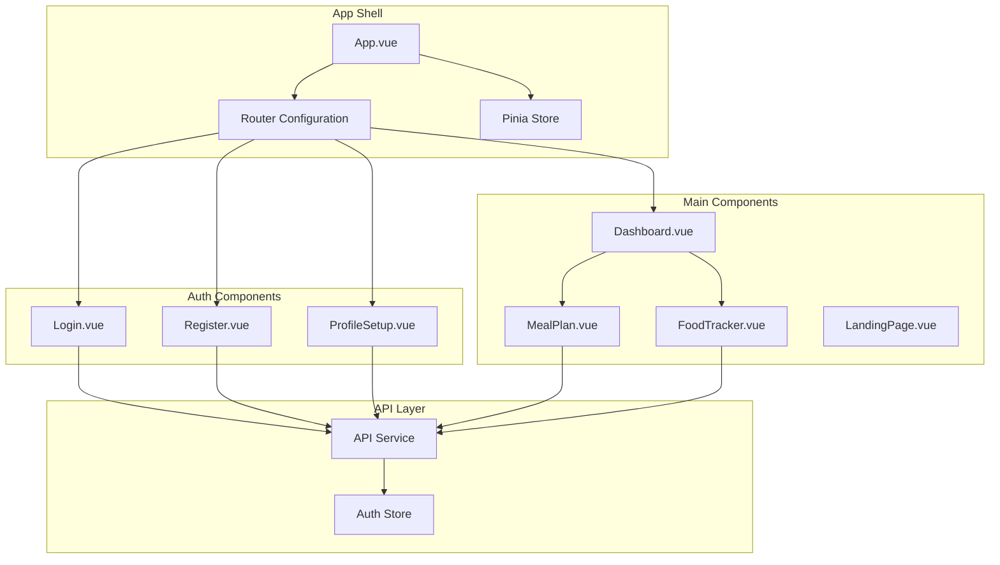
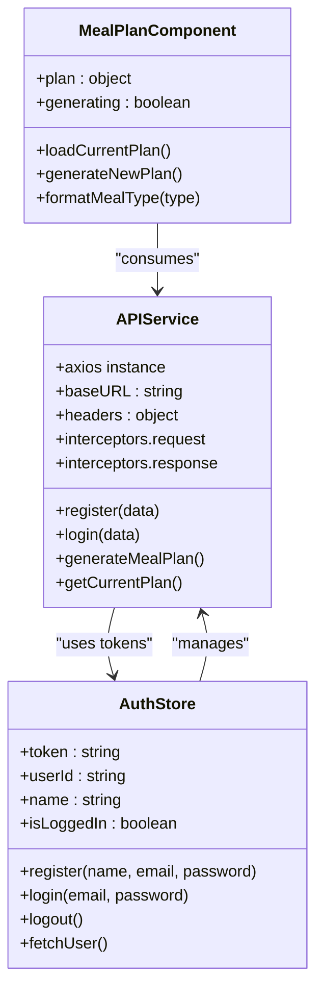
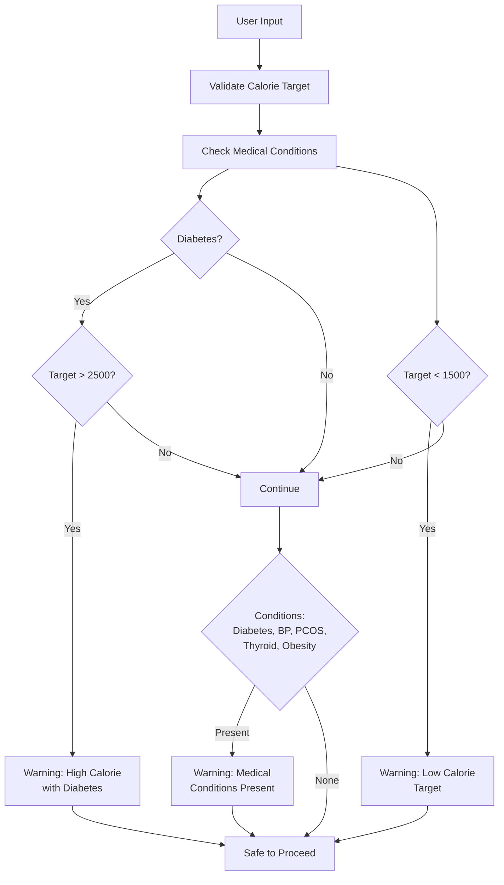
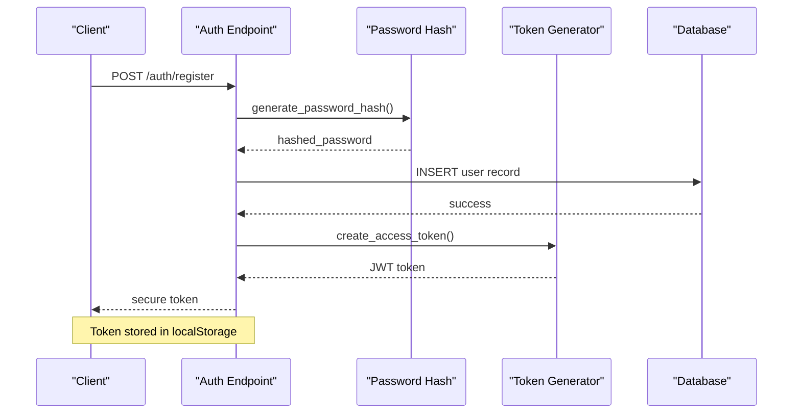

# Meal Planning Engine Implementation

<cite>
**Referenced Files in This Document**
- [app.py](file://nutricoach/backend/app.py)
- [meal_engine.py](file://nutricoach/backend/meal_engine.py)
- [schema.sql](file://nutricoach/backend/schema.sql)
- [init_db.py](file://nutricoach/backend/init_db.py)
- [reset_db.py](file://nutricoach/backend/reset_db.py)
- [API.md](file://nutricoach/backend/API.md)
- [README.md](file://nutricoach/README.md)
- [main.js](file://nutricoach/frontend/src/main.js)
- [api.js](file://nutricoach/frontend/src/api.js)
- [auth.js](file://nutricoach/frontend/src/stores/auth.js)
- [MealPlan.vue](file://nutricoach/frontend/components/MealPlan.vue)
</cite>

## Table of Contents
1. [Introduction](#introduction)
2. [System Architecture](#system-architecture)
3. [Database Design](#database-design)
4. [Meal Planning Engine Core](#meal-planning-engine-core)
5. [API Implementation](#api-implementation)
6. [Frontend Integration](#frontend-integration)
7. [Medical Condition Handling](#medical-condition-handling)
8. [Performance Considerations](#performance-considerations)
9. [Security Implementation](#security-implementation)
10. [Troubleshooting Guide](#troubleshooting-guide)
11. [Conclusion](#conclusion)

## Introduction

The NutriCoach AI Meal Planning Engine is a sophisticated system designed to generate personalized daily meal plans based on individual user profiles, dietary preferences, and medical conditions. Built with a modern tech stack featuring Vue.js frontend and Python Flask backend, this system provides intelligent nutrition guidance through an intuitive web interface.

The engine leverages a comprehensive database of Indian cuisine options, incorporating medical condition awareness, allergen filtering, and macro-nutrient balancing to create safe and effective meal plans tailored to each user's specific needs.

## System Architecture

The application follows a clean architecture pattern with clear separation between frontend, backend, and database layers:



**Diagram sources**
- [app.py:13-16](file://nutricoach/backend/app.py#L13-L16)
- [meal_engine.py:1-298](file://nutricoach/backend/meal_engine.py#L1-L298)
- [schema.sql:1-77](file://nutricoach/backend/schema.sql#L1-L77)

**Section sources**
- [app.py:1-468](file://nutricoach/backend/app.py#L1-L468)
- [README.md:1-77](file://nutricoach/README.md#L1-L77)

## Database Design

The system utilizes SQLite as its primary database, designed with normalization principles to ensure data integrity and efficient querying. The schema supports user profiles, health metrics, meal plans, and progress tracking.



**Diagram sources**
- [schema.sql:3-77](file://nutricoach/backend/schema.sql#L3-L77)

The database design incorporates several key features:

- **User Profiles**: Comprehensive personal information including demographics, activity levels, and health goals
- **Health Metrics**: Persistent storage of calculated BMI, BMR, TDEE, and target calories
- **Meal Tracking**: Structured meal logging with nutritional breakdowns
- **Progress Monitoring**: Weight history tracking for trend analysis
- **Referential Integrity**: Foreign key constraints ensure data consistency

**Section sources**
- [schema.sql:1-77](file://nutricoach/backend/schema.sql#L1-L77)
- [init_db.py:1-106](file://nutricoach/backend/init_db.py#L1-L106)

## Meal Planning Engine Core

The heart of the system lies in the meal planning engine, which intelligently selects foods based on multiple criteria including caloric targets, dietary restrictions, medical conditions, and nutritional preferences.

### Food Database Architecture

The engine maintains a comprehensive database of 73 Indian food items, each tagged with detailed nutritional information and medical considerations:



**Diagram sources**
- [meal_engine.py:6-73](file://nutricoach/backend/meal_engine.py#L6-L73)
- [meal_engine.py:76-110](file://nutricoach/backend/meal_engine.py#L76-L110)

### Medical Condition Mapping

The engine implements sophisticated medical condition handling through a comprehensive preference system:

| Medical Condition | Preferred Tags | Avoid Tags |
|-------------------|----------------|------------|
| Diabetes | diabetic_friendly, high_fiber, low_fat | high_sugar, high_gi |
| High Blood Pressure | low_sodium, high_fiber | high_sodium |
| PCOS | diabetic_friendly, high_fiber, anti_inflammatory, high_protein | high_sugar, high_gi, fried |
| Obesity | high_fiber, high_protein, low_fat | high_fat, fried, high_sugar |
| Acid Reflux | low_fat, easy_digest | fried, high_fat |

### Algorithm Implementation

The meal selection process follows a multi-stage filtering and scoring approach:



**Diagram sources**
- [meal_engine.py:207-298](file://nutricoach/backend/meal_engine.py#L207-L298)

**Section sources**
- [meal_engine.py:1-298](file://nutricoach/backend/meal_engine.py#L1-L298)

## API Implementation

The backend exposes a comprehensive RESTful API with JWT authentication and comprehensive error handling:

### Authentication Endpoints



**Diagram sources**
- [app.py:27-75](file://nutricoach/backend/app.py#L27-L75)

### Meal Planning Endpoints

The meal planning functionality integrates seamlessly with the authentication system:



**Diagram sources**
- [app.py:238-287](file://nutricoach/backend/app.py#L238-L287)
- [meal_engine.py:207-298](file://nutricoach/backend/meal_engine.py#L207-L298)

**Section sources**
- [app.py:1-468](file://nutricoach/backend/app.py#L1-L468)

## Frontend Integration

The Vue.js frontend provides an intuitive interface for users to interact with the meal planning system:

### Component Architecture



**Diagram sources**
- [main.js:1-10](file://nutricoach/frontend/src/main.js#L1-L10)
- [MealPlan.vue:1-178](file://nutricoach/frontend/components/MealPlan.vue#L1-L178)

### API Integration Pattern

The frontend implements a centralized API service with automatic JWT token management:



**Diagram sources**
- [api.js:1-33](file://nutricoach/frontend/src/api.js#L1-L33)
- [auth.js:1-59](file://nutricoach/frontend/src/stores/auth.js#L1-L59)
- [MealPlan.vue:63-98](file://nutricoach/frontend/components/MealPlan.vue#L63-L98)

**Section sources**
- [main.js:1-10](file://nutricoach/frontend/src/main.js#L1-L10)
- [api.js:1-33](file://nutricoach/frontend/src/api.js#L1-L33)
- [auth.js:1-59](file://nutricoach/frontend/src/stores/auth.js#L1-L59)
- [MealPlan.vue:1-178](file://nutricoach/frontend/components/MealPlan.vue#L1-L178)

## Medical Condition Handling

The system implements sophisticated medical condition awareness through a multi-layered filtering and scoring system:

### Safety Validation System



**Diagram sources**
- [meal_engine.py:186-204](file://nutricoach/backend/meal_engine.py#L186-L204)

### Dietary Restriction Filtering

The engine applies intelligent filtering based on user allergies and medical conditions:

1. **Diet Type Filtering**: Ensures compatibility with vegan, vegetarian, or non-vegetarian preferences
2. **Allergy Detection**: Scans food names for potential allergen matches
3. **Medical Warning Analysis**: Evaluates foods against condition-specific contraindications
4. **Preference Scoring**: Rates foods based on beneficial medical tags

**Section sources**
- [meal_engine.py:113-156](file://nutricoach/backend/meal_engine.py#L113-L156)
- [meal_engine.py:186-204](file://nutricoach/backend/meal_engine.py#L186-L204)

## Performance Considerations

The system is designed with several performance optimization strategies:

### Database Optimization

- **Connection Pooling**: Efficient SQLite connection management
- **Indexing Strategy**: Strategic indexing on frequently queried columns (user_id, date)
- **Query Optimization**: Minimized database round-trips through batch operations

### Algorithm Efficiency

- **Early Filtering**: Pre-filtering reduces candidate sets significantly
- **Random Selection**: Top-k selection ensures variety while maintaining performance
- **Memory Management**: Efficient data structures prevent memory leaks

### Caching Strategy

- **JWT Tokens**: Stateless authentication eliminates server-side session storage
- **Static Assets**: Proper caching headers for frontend resources
- **Database Queries**: Optimized query patterns reduce computational overhead

## Security Implementation

The application implements comprehensive security measures:

### Authentication Security



**Diagram sources**
- [app.py:27-52](file://nutricoach/backend/app.py#L27-L52)

### Authorization Patterns

- **JWT Middleware**: Automatic token validation for protected routes
- **Route Protection**: All meal plan endpoints require authentication
- **User Isolation**: Queries restricted to authenticated user context
- **Input Validation**: Comprehensive validation for all user inputs

**Section sources**
- [app.py:1-16](file://nutricoach/backend/app.py#L1-L16)
- [app.py:77-91](file://nutricoach/backend/app.py#L77-L91)

## Troubleshooting Guide

### Common Issues and Solutions

#### Database Initialization Problems

**Issue**: Database not found or schema missing
**Solution**: Run initialization script
```bash
cd nutricoach/backend
python init_db.py
```

#### API Connection Errors

**Issue**: Frontend cannot connect to backend
**Solution**: Verify backend is running and CORS is enabled
```bash
cd nutricoach/backend
python app.py
```

#### Authentication Failures

**Issue**: JWT token invalid or expired
**Solution**: Clear local storage and re-authenticate
```javascript
localStorage.removeItem('token')
localStorage.removeItem('user_id')
```

#### Meal Plan Generation Issues

**Issue**: No food options available
**Solution**: Check dietary restrictions and medical conditions
- Remove restrictive filters temporarily
- Verify health calculations are complete
- Ensure sufficient calorie targets

**Section sources**
- [reset_db.py:1-13](file://nutricoach/backend/reset_db.py#L1-L13)
- [api.js:19-30](file://nutricoach/frontend/src/api.js#L19-L30)

## Conclusion

The NutriCoach AI Meal Planning Engine represents a comprehensive solution for personalized nutrition guidance. Through its sophisticated filtering algorithms, medical condition awareness, and user-friendly interface, it provides a robust foundation for health and wellness applications.

Key strengths of the implementation include:

- **Intelligent Food Selection**: Multi-criteria filtering with medical scoring
- **Scalable Architecture**: Clean separation of concerns with modular design
- **User Experience**: Responsive frontend with seamless authentication
- **Data Integrity**: Comprehensive database schema with referential constraints
- **Security**: Robust authentication and authorization mechanisms

The system provides an excellent foundation for expansion, including integration with external nutrition databases, advanced analytics capabilities, and mobile application support.