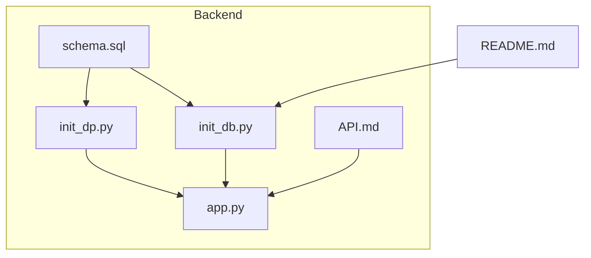
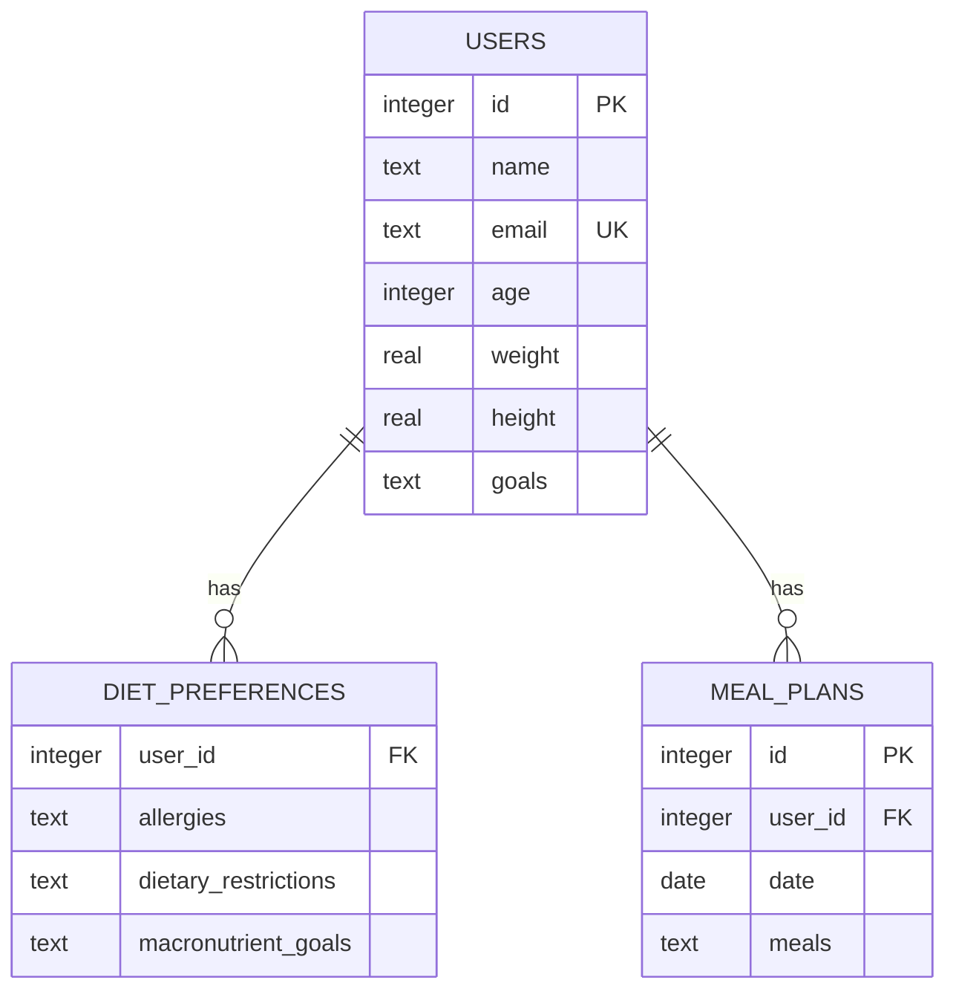
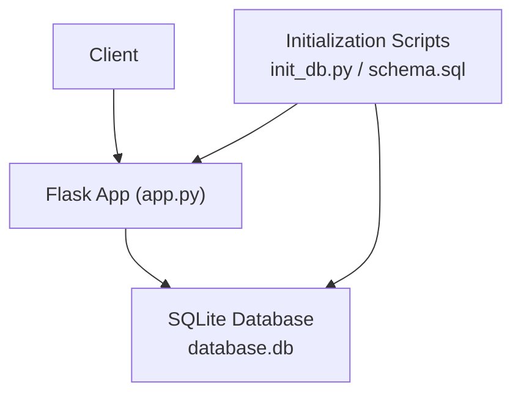
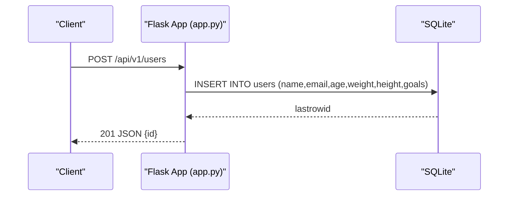
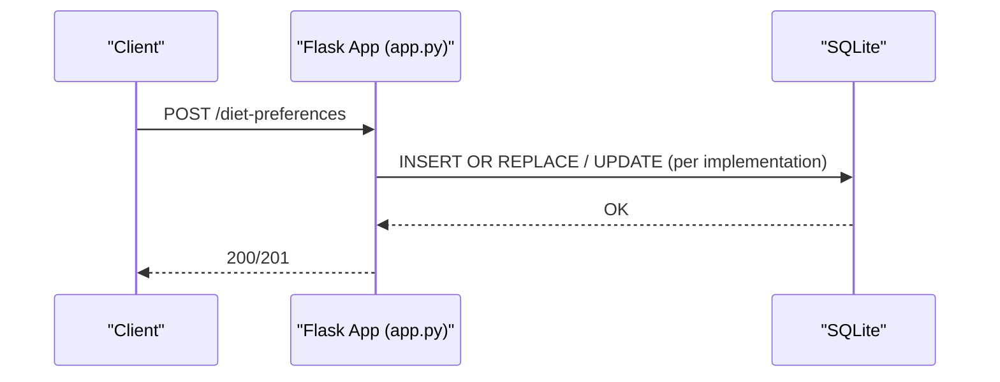
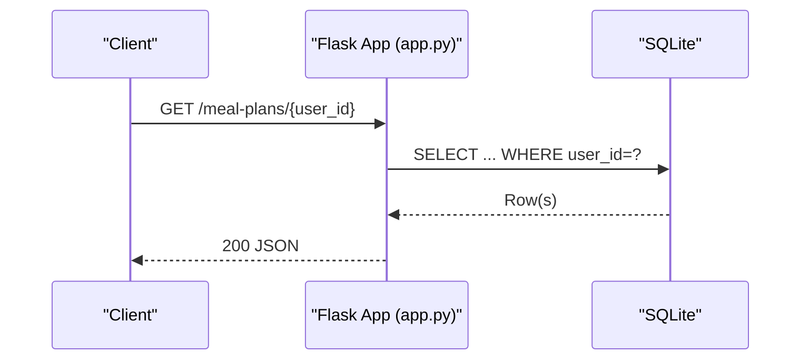
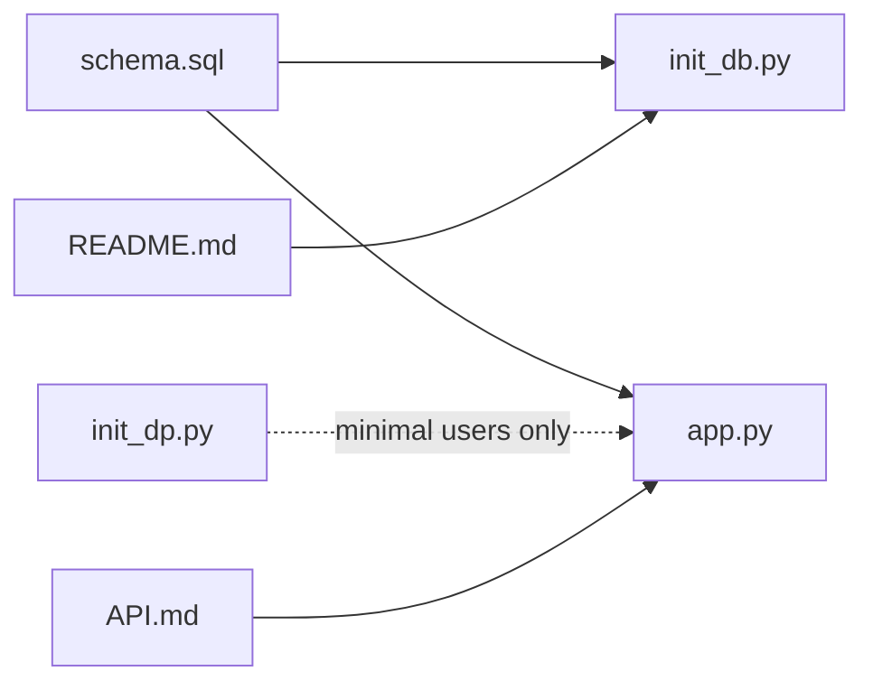

# Database Design

<cite>
**Referenced Files in This Document**
- [schema.sql](file://nutricoach/backend/schema.sql)
- [init_db.py](file://nutricoach/backend/init_db.py)
- [init_dp.py](file://nutricoach/backend/init_dp.py)
- [app.py](file://nutricoach/backend/app.py)
- [API.md](file://nutricoach/backend/API.md)
- [README.md](file://nutricoach/README.md)
</cite>

## Table of Contents
1. [Introduction](#introduction)
2. [Project Structure](#project-structure)
3. [Core Components](#core-components)
4. [Architecture Overview](#architecture-overview)
5. [Detailed Component Analysis](#detailed-component-analysis)
6. [Dependency Analysis](#dependency-analysis)
7. [Performance Considerations](#performance-considerations)
8. [Troubleshooting Guide](#troubleshooting-guide)
9. [Conclusion](#conclusion)
10. [Appendices](#appendices)

## Introduction
This document describes the database design for NutriCoach AI, focusing on the entity relationship model among users, diet preferences, and meal plans. It documents table schemas, constraints, referential integrity, initialization procedures, and operational patterns derived from the backend implementation. It also outlines performance considerations, indexing strategies, and query optimization techniques grounded in the current schema and usage.

## Project Structure
The database-related artifacts are located under the backend directory:
- Schema definition and initialization scripts
- API entrypoint and connection utilities
- API specification for data models and endpoints

**Diagram sources**
- [schema.sql:1-25](file://nutricoach/backend/schema.sql#L1-L25)
- [init_db.py:1-47](file://nutricoach/backend/init_db.py#L1-L47)
- [init_dp.py:1-23](file://nutricoach/backend/init_dp.py#L1-L23)
- [app.py:1-31](file://nutricoach/backend/app.py#L1-L31)
- [API.md:1-59](file://nutricoach/backend/API.md#L1-L59)
- [README.md:1-77](file://nutricoach/README.md#L1-L77)

**Section sources**
- [schema.sql:1-25](file://nutricoach/backend/schema.sql#L1-L25)
- [init_db.py:1-47](file://nutricoach/backend/init_db.py#L1-L47)
- [init_dp.py:1-23](file://nutricoach/backend/init_dp.py#L1-L23)
- [app.py:1-31](file://nutricoach/backend/app.py#L1-L31)
- [API.md:1-59](file://nutricoach/backend/API.md#L1-L59)
- [README.md:1-77](file://nutricoach/README.md#L1-L77)

## Core Components
This section defines the three core relational tables and their constraints.

- Users
  - Purpose: Stores user profile information.
  - Primary key: id (autoincrement integer)
  - Notable constraints: email is unique and not null; other fields are nullable per schema.
  - Business relevance: Serves as the anchor entity for diet preferences and meal plans.

- Diet Preferences
  - Purpose: Captures user-specific dietary attributes and goals.
  - Primary key: composite implied by foreign key relationship (no explicit PK)
  - Foreign key: user_id references users.id
  - Constraints: Enforces referential integrity to users.

- Meal Plans
  - Purpose: Stores generated meal plans associated with users and dates.
  - Primary key: id (autoincrement integer)
  - Foreign key: user_id references users.id
  - Constraints: Enforces referential integrity to users.

**Diagram sources**
- [schema.sql:1-25](file://nutricoach/backend/schema.sql#L1-L25)

**Section sources**
- [schema.sql:1-25](file://nutricoach/backend/schema.sql#L1-L25)

## Architecture Overview
The backend exposes a REST-like API via Flask and interacts with an SQLite database. Initialization scripts create tables and enforce referential integrity. The API currently supports user creation; additional endpoints for diet preferences and meal plans are documented in the API specification.

**Diagram sources**
- [app.py:1-31](file://nutricoach/backend/app.py#L1-L31)
- [init_db.py:1-47](file://nutricoach/backend/init_db.py#L1-L47)
- [schema.sql:1-25](file://nutricoach/backend/schema.sql#L1-L25)

**Section sources**
- [app.py:1-31](file://nutricoach/backend/app.py#L1-L31)
- [init_db.py:1-47](file://nutricoach/backend/init_db.py#L1-L47)
- [README.md:43-47](file://nutricoach/README.md#L43-L47)

## Detailed Component Analysis

### Users Table
- Fields and types
  - id: integer, primary key, autoincrement
  - name: text
  - email: text, unique, not null
  - age: integer
  - weight: real
  - height: real
  - goals: text
- Constraints
  - Unique constraint on email
  - Not null constraint on email
  - Other fields are nullable
- Typical operations
  - Insertion via API endpoint for user creation
  - Retrieval and updates supported by API specification
- Validation rules
  - Email uniqueness enforced at DB level
  - No additional checks in schema; validation occurs at application level

**Section sources**
- [schema.sql:1-9](file://nutricoach/backend/schema.sql#L1-L9)
- [API.md:29-40](file://nutricoach/backend/API.md#L29-L40)
- [app.py:16-26](file://nutricoach/backend/app.py#L16-L26)

### Diet Preferences Table
- Fields and types
  - user_id: integer, foreign key referencing users.id
  - allergies: text
  - dietary_restrictions: text
  - macronutrient_goals: text
- Constraints
  - Foreign key constraint to users.id
- Typical operations
  - Upsert/update per user via documented endpoint
  - Retrieval by user_id
- Validation rules
  - Referential integrity enforced by foreign key
  - No additional schema-level constraints

**Section sources**
- [schema.sql:11-17](file://nutricoach/backend/schema.sql#L11-L17)
- [API.md:42-50](file://nutricoach/backend/API.md#L42-L50)

### Meal Plans Table
- Fields and types
  - id: integer, primary key, autoincrement
  - user_id: integer, foreign key referencing users.id
  - date: date
  - meals: text
- Constraints
  - Foreign key constraint to users.id
- Typical operations
  - Generation and save via documented endpoint
  - Retrieval of latest and history via documented endpoints
- Validation rules
  - Referential integrity enforced by foreign key
  - No additional schema-level constraints

**Section sources**
- [schema.sql:19-25](file://nutricoach/backend/schema.sql#L19-L25)
- [API.md:52-59](file://nutricoach/backend/API.md#L52-L59)

### API Workflows

#### Create User

**Diagram sources**
- [app.py:16-26](file://nutricoach/backend/app.py#L16-L26)
- [API.md:6-10](file://nutricoach/backend/API.md#L6-L10)

**Section sources**
- [app.py:16-26](file://nutricoach/backend/app.py#L16-L26)
- [API.md:6-10](file://nutricoach/backend/API.md#L6-L10)

#### Upsert Diet Preferences

**Diagram sources**
- [API.md:12-15](file://nutricoach/backend/API.md#L12-L15)

**Section sources**
- [API.md:12-15](file://nutricoach/backend/API.md#L12-L15)

#### Retrieve Latest Meal Plan

**Diagram sources**
- [API.md:16-19](file://nutricoach/backend/API.md#L16-L19)

**Section sources**
- [API.md:16-19](file://nutricoach/backend/API.md#L16-L19)

## Dependency Analysis
- Initialization dependencies
  - schema.sql defines the canonical schema and is used by init_db.py to create tables conditionally.
  - init_dp.py creates a minimal users table for early setup but lacks diet_preferences and meal_plans.
- Runtime dependencies
  - app.py connects to database.db and exposes endpoints; it relies on schema.sql-defined tables.
- API specification
  - API.md enumerates endpoints and data models; they align with the schema.

**Diagram sources**
- [schema.sql:1-25](file://nutricoach/backend/schema.sql#L1-L25)
- [init_db.py:1-47](file://nutricoach/backend/init_db.py#L1-L47)
- [init_dp.py:1-23](file://nutricoach/backend/init_dp.py#L1-L23)
- [app.py:1-31](file://nutricoach/backend/app.py#L1-L31)
- [API.md:1-59](file://nutricoach/backend/API.md#L1-L59)
- [README.md:43-47](file://nutricoach/README.md#L43-L47)

**Section sources**
- [schema.sql:1-25](file://nutricoach/backend/schema.sql#L1-L25)
- [init_db.py:1-47](file://nutricoach/backend/init_db.py#L1-L47)
- [init_dp.py:1-23](file://nutricoach/backend/init_dp.py#L1-L23)
- [app.py:1-31](file://nutricoach/backend/app.py#L1-L31)
- [API.md:1-59](file://nutricoach/backend/API.md#L1-L59)
- [README.md:43-47](file://nutricoach/README.md#L43-L47)

## Performance Considerations
- Indexing strategy
  - Primary keys (id) are implicitly indexed by SQLite.
  - Consider adding an index on users.email to accelerate lookups by email.
  - Consider adding an index on meal_plans.user_id and possibly a composite index on (user_id, date) to optimize retrieval of meal plans by user and date.
- Query optimization techniques
  - Use LIMIT and ORDER BY appropriately when retrieving histories.
  - Prefer prepared statements and parameterized queries (already used in app.py).
  - Normalize repeated text fields (e.g., meals) into structured JSON or separate normalized tables if growth demands it; otherwise keep as text for simplicity.
- Concurrency and transactions
  - Wrap write operations in transactions to ensure atomicity.
- Storage and maintenance
  - Regularly vacuum and analyze the database in production environments.
  - Backups should be consistent snapshots of the database file.

[No sources needed since this section provides general guidance]

## Troubleshooting Guide
- Initialization failures
  - Ensure the backend directory is used for initialization commands.
  - Verify permissions to create database.db in the backend directory.
- Duplicate email errors
  - The email column is unique; handle duplicate entries gracefully in client applications.
- Foreign key violations
  - Ensure users exist before inserting diet preferences or meal plans.
- Connection issues
  - Confirm DB_PATH resolves to the intended database.db file.

**Section sources**
- [README.md:43-47](file://nutricoach/README.md#L43-L47)
- [schema.sql:3-4](file://nutricoach/backend/schema.sql#L3-L4)
- [schema.sql:16-17](file://nutricoach/backend/schema.sql#L16-L17)
- [schema.sql:24-25](file://nutricoach/backend/schema.sql#L24-L25)

## Conclusion
The current schema establishes a clean foundation for user profiles, dietary preferences, and meal plans with enforced referential integrity. Initialization scripts and the API specification define clear operational boundaries. For production, consider targeted indexing, robust error handling around unique constraints, and structured storage for complex meal data to scale effectively.

[No sources needed since this section summarizes without analyzing specific files]

## Appendices

### Database Initialization Procedures
- Full initialization (recommended)
  - Run the initialization script that creates all tables.
- Minimal initialization
  - Run the simplified script that creates only the users table.

**Section sources**
- [README.md:43-47](file://nutricoach/README.md#L43-L47)
- [init_db.py:1-47](file://nutricoach/backend/init_db.py#L1-L47)
- [init_dp.py:1-23](file://nutricoach/backend/init_dp.py#L1-L23)

### Data Seeding Strategies
- Seed users first, then diet preferences and meal plans.
- Use batch inserts for performance when adding multiple records.
- Maintain referential integrity by seeding users before related records.

[No sources needed since this section provides general guidance]

### Sample Data Structures
- User
  - Keys: id, name, email, age, weight, height, goals
- Diet Preference
  - Keys: user_id, allergies, dietary_restrictions, macronutrient_goals
- Meal Plan
  - Keys: id, user_id, date, meals

**Section sources**
- [API.md:29-59](file://nutricoach/backend/API.md#L29-L59)

### Query Patterns and Examples
- Retrieve user by email
  - SELECT ... FROM users WHERE email = ?
- Insert user
  - INSERT INTO users (...) VALUES (...)
- Upsert diet preferences
  - INSERT OR REPLACE INTO diet_preferences (user_id, ...) VALUES (?, ...)
- Get latest meal plan for a user
  - SELECT ... FROM meal_plans WHERE user_id = ? ORDER BY date DESC LIMIT 1
- Get meal plan history for a user
  - SELECT ... FROM meal_plans WHERE user_id = ? ORDER BY date DESC

**Section sources**
- [app.py:16-26](file://nutricoach/backend/app.py#L16-L26)
- [API.md:12-19](file://nutricoach/backend/API.md#L12-L19)