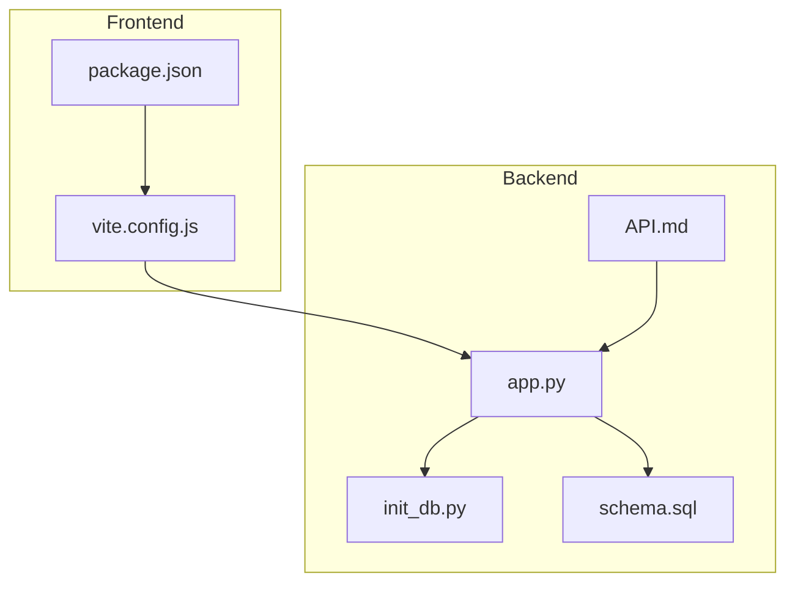
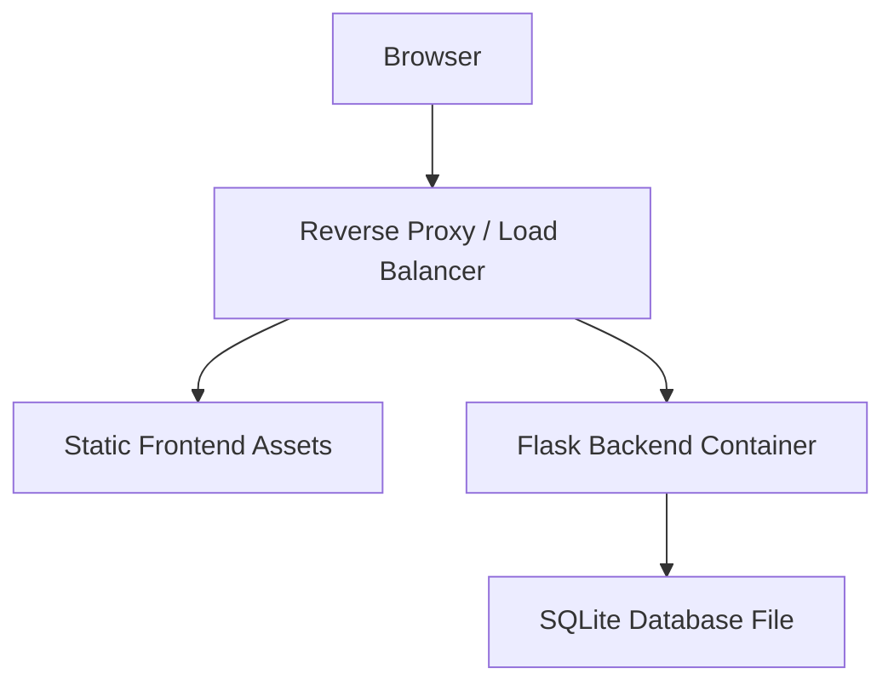
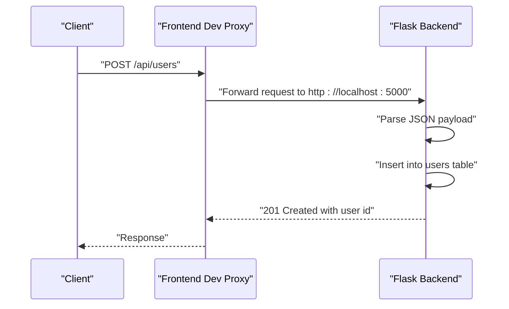
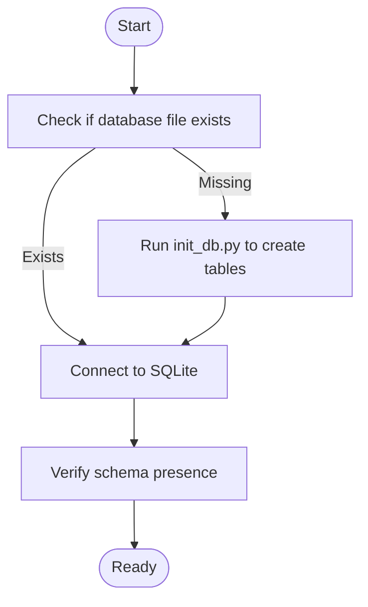
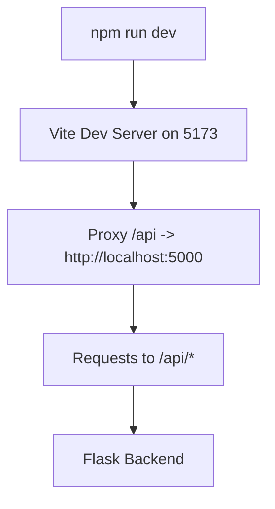
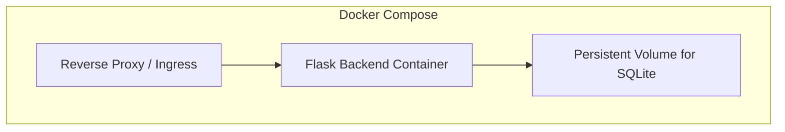

# Deployment Guide

<cite>
**Referenced Files in This Document**
- [README.md](file://nutricoach/README.md)
- [API.md](file://nutricoach/backend/API.md)
- [app.py](file://nutricoach/backend/app.py)
- [init_db.py](file://nutricoach/backend/init_db.py)
- [schema.sql](file://nutricoach/backend/schema.sql)
- [package.json](file://nutricoach/frontend/package.json)
- [vite.config.js](file://nutricoach/frontend/vite.config.js)
</cite>

## Table of Contents
1. [Introduction](#introduction)
2. [Project Structure](#project-structure)
3. [Core Components](#core-components)
4. [Architecture Overview](#architecture-overview)
5. [Detailed Component Analysis](#detailed-component-analysis)
6. [Environment Preparation](#environment-preparation)
7. [Dependency Installation](#dependency-installation)
8. [Configuration Management](#configuration-management)
9. [Docker Deployment](#docker-deployment)
10. [Database Migration Procedures](#database-migration-procedures)
11. [Static Asset Optimization](#static-asset-optimization)
12. [Server Requirements](#server-requirements)
13. [Performance Tuning](#performance-tuning)
14. [Monitoring Setup](#monitoring-setup)
15. [CI/CD Pipeline Integration](#cicd-pipeline-integration)
16. [Automated Testing Strategies](#automated-testing-strategies)
17. [Security Considerations](#security-considerations)
18. [Troubleshooting Guide](#troubleshooting-guide)
19. [Scaling and Load Balancing](#scaling-and-load-balancing)
20. [Backup and Recovery](#backup-and-recovery)
21. [Conclusion](#conclusion)

## Introduction
This guide documents the production deployment of NutriCoach AI, a web application featuring a Vue.js frontend and a Python Flask backend with an SQLite database. It covers environment preparation, dependency installation, configuration management, Docker-based containerization, orchestration considerations, environment variables, database initialization, static asset optimization, server requirements, performance tuning, monitoring, CI/CD integration, automated testing, security hardening, troubleshooting, scaling, load balancing, and backup/recovery procedures.

## Project Structure
NutriCoach AI follows a clear separation of concerns:
- Backend: Python Flask application exposing REST endpoints and managing SQLite storage.
- Frontend: Vue.js single-page application built with Vite, communicating with the backend via a development proxy.
- Database: SQLite managed through initialization scripts and schema definitions.

**Diagram sources**
- [package.json:1-19](file://nutricoach/frontend/package.json#L1-L19)
- [vite.config.js:1-17](file://nutricoach/frontend/vite.config.js#L1-L17)
- [app.py:1-31](file://nutricoach/backend/app.py#L1-L31)
- [init_db.py:1-47](file://nutricoach/backend/init_db.py#L1-L47)
- [schema.sql:1-25](file://nutricoach/backend/schema.sql#L1-L25)
- [API.md:1-59](file://nutricoach/backend/API.md#L1-L59)

**Section sources**
- [README.md:1-77](file://nutricoach/README.md#L1-L77)
- [package.json:1-19](file://nutricoach/frontend/package.json#L1-L19)
- [vite.config.js:1-17](file://nutricoach/frontend/vite.config.js#L1-L17)
- [app.py:1-31](file://nutricoach/backend/app.py#L1-L31)
- [init_db.py:1-47](file://nutricoach/backend/init_db.py#L1-L47)
- [schema.sql:1-25](file://nutricoach/backend/schema.sql#L1-L25)
- [API.md:1-59](file://nutricoach/backend/API.md#L1-L59)

## Core Components
- Flask Backend: Exposes REST endpoints under /api/v1, connects to an SQLite database, and enables CORS for cross-origin requests during development.
- Database Initialization: Provides scripts to create tables and seed initial schema.
- Frontend Build System: Uses Vite to develop and build the Vue.js application, with a development proxy routing API calls to the backend.

Key runtime characteristics:
- Backend listens on host 0.0.0.0 and port 5000 in development mode.
- Frontend development server runs on port 5173 with a proxy to the backend.

**Section sources**
- [app.py:1-31](file://nutricoach/backend/app.py#L1-L31)
- [init_db.py:1-47](file://nutricoach/backend/init_db.py#L1-L47)
- [schema.sql:1-25](file://nutricoach/backend/schema.sql#L1-L25)
- [package.json:1-19](file://nutricoach/frontend/package.json#L1-L19)
- [vite.config.js:1-17](file://nutricoach/frontend/vite.config.js#L1-L17)

## Architecture Overview
The production architecture centers on containerizing the backend and serving the frontend via a reverse proxy or static hosting. The backend persists data in an SQLite file located alongside the application.

[No sources needed since this diagram shows conceptual workflow, not actual code structure]

## Detailed Component Analysis

### Backend Flask Application
The backend defines a minimal Flask service with a single endpoint for user creation and a database connection helper. It initializes CORS and binds to 0.0.0.0:5000 for development.

**Diagram sources**
- [vite.config.js:7-15](file://nutricoach/frontend/vite.config.js#L7-L15)
- [app.py:16-26](file://nutricoach/backend/app.py#L16-L26)

**Section sources**
- [app.py:1-31](file://nutricoach/backend/app.py#L1-L31)
- [API.md:6-11](file://nutricoach/backend/API.md#L6-L11)

### Database Schema and Initialization
The backend includes initialization scripts and a schema definition that create three tables: users, diet_preferences, and meal_plans. The Flask application uses a local SQLite file path resolved from the backend directory.

**Diagram sources**
- [init_db.py:1-47](file://nutricoach/backend/init_db.py#L1-L47)
- [schema.sql:1-25](file://nutricoach/backend/schema.sql#L1-L25)
- [app.py:9-14](file://nutricoach/backend/app.py#L9-L14)

**Section sources**
- [init_db.py:1-47](file://nutricoach/backend/init_db.py#L1-L47)
- [schema.sql:1-25](file://nutricoach/backend/schema.sql#L1-L25)
- [app.py:9-14](file://nutricoach/backend/app.py#L9-L14)

### Frontend Build and Proxy Configuration
The frontend uses Vite with a development proxy that forwards API requests to the backend. Production builds should be served statically behind a reverse proxy or CDN.

**Diagram sources**
- [package.json:5-8](file://nutricoach/frontend/package.json#L5-L8)
- [vite.config.js:7-15](file://nutricoach/frontend/vite.config.js#L7-L15)

**Section sources**
- [package.json:1-19](file://nutricoach/frontend/package.json#L1-L19)
- [vite.config.js:1-17](file://nutricoach/frontend/vite.config.js#L1-L17)

## Environment Preparation
- Operating Systems: Linux distributions recommended for production; Windows/macOS supported for development.
- Runtime Dependencies:
  - Python 3.11+ for the backend.
  - Node.js 18+ for the frontend.
- Optional: Docker for containerized deployment.

Preparation checklist:
- Create a dedicated non-root user for the application.
- Install Python virtual environment tooling and Node.js package manager.
- Configure system limits for file descriptors and processes suitable for production workloads.

**Section sources**
- [README.md:20-24](file://nutricoach/README.md#L20-L24)

## Dependency Installation
Backend:
- Create and activate a Python virtual environment.
- Install Python dependencies using the backend requirements mechanism referenced in the repository documentation.
- Run the backend application in production using a WSGI server (see Docker section for containerized guidance).

Frontend:
- Install Node.js dependencies.
- Build the frontend for production using the provided build script.

Verification:
- Confirm the backend responds to health checks and serves the expected API endpoints.
- Validate the frontend build artifacts are generated and can be served statically.

**Section sources**
- [README.md:34-47](file://nutricoach/README.md#L34-L47)
- [package.json:5-8](file://nutricoach/frontend/package.json#L5-L8)

## Configuration Management
Environment variables for production:
- Database path: Control the location of the SQLite file via an environment variable to enable persistent storage outside the container filesystem.
- Server binding: Bind the backend to 0.0.0.0 and configure the port via an environment variable.
- Reverse proxy headers: Configure trust for forwarded headers if using a reverse proxy.

Frontend:
- Build-time base path: Set the public path for static assets when hosted under a subpath.
- API base URL: Configure the production API base URL via environment variables injected at build time.

Operational configuration:
- Logging level and output destinations.
- CORS origins in production should be restricted to trusted domains.

**Section sources**
- [app.py:9-14](file://nutricoach/backend/app.py#L9-L14)
- [vite.config.js:7-15](file://nutricoach/frontend/vite.config.js#L7-L15)

## Docker Deployment
Containerization strategy:
- Multi-stage build:
  - Build stage: Install Node.js dependencies and build the frontend.
  - Runtime stage: Copy built assets and set up the Python environment.
- Backend container:
  - Use a Python slim base image.
  - Mount a persistent volume for the SQLite database file to survive container restarts.
- Frontend container:
  - Serve built assets via a lightweight static server or reverse proxy.

Image building:
- Define a Dockerfile that installs Python dependencies, copies backend code, and sets up the application.
- Define a docker-compose.yml orchestrating the backend service and a reverse proxy/service mesh component.

Orchestration considerations:
- Use a reverse proxy (e.g., Nginx) or ingress controller to terminate TLS and route traffic to the backend.
- Persist the SQLite database file on a host path or a persistent volume.
- Configure resource limits and readiness/liveness probes.

[No sources needed since this diagram shows conceptual workflow, not actual code structure]

**Section sources**
- [README.md](file://nutricoach/README.md#L16)
- [app.py:9-14](file://nutricoach/backend/app.py#L9-L14)

## Database Migration Procedures
Current state:
- The backend includes initialization scripts and a schema definition. There is no explicit migration framework present.

Recommended procedure:
- For schema changes in production:
  - Back up the existing SQLite database file.
  - Apply schema updates using the schema definition or initialization script.
  - Validate data integrity and test critical endpoints.
  - Roll back by restoring the backup if issues arise.

Operational safeguards:
- Schedule maintenance windows for migrations.
- Use read-only snapshots where possible.
- Keep a secondary standby instance for failover during critical updates.

**Section sources**
- [init_db.py:1-47](file://nutricoach/backend/init_db.py#L1-L47)
- [schema.sql:1-25](file://nutricoach/backend/schema.sql#L1-L25)

## Static Asset Optimization
Production optimizations:
- Enable gzip/brotli compression on the reverse proxy or CDN.
- Set long cache headers for immutable assets; use content-hashed filenames.
- Minimize JavaScript/CSS bundles and split large chunks.
- Preload critical resources and defer non-critical ones.

Build configuration:
- Use the provided build script to generate optimized assets for production.
- Configure the public path appropriately when hosting under a subpath.

**Section sources**
- [package.json:5-8](file://nutricoach/frontend/package.json#L5-L8)
- [vite.config.js:1-17](file://nutricoach/frontend/vite.config.js#L1-L17)

## Server Requirements
Hardware sizing:
- CPU: Allocate cores proportional to concurrent API requests and background processing needs.
- Memory: Account for Python process memory plus database connections and caching overhead.
- Storage: Provide sufficient disk space for the SQLite database file, logs, and static assets.

Network:
- Open ports 80/443 for HTTPS traffic and 22 for SSH administration.
- Restrict inbound access to trusted networks and apply rate limiting.

Security:
- Disable unnecessary services and apply OS hardening baselines.
- Use a reverse proxy with TLS termination configured with strong ciphers and protocols.

**Section sources**
- [README.md:20-24](file://nutricoach/README.md#L20-L24)

## Performance Tuning
Backend tuning:
- Use a production WSGI server (e.g., Gunicorn) with multiple workers tuned to CPU cores.
- Enable keep-alive and tune connection pool sizes for SQLite.
- Monitor response latency and throughput; scale horizontally if needed.

Frontend tuning:
- Optimize bundle sizes and leverage lazy loading for routes.
- Enable client-side caching and HTTP/2 multiplexing.

Infrastructure:
- Place a CDN in front of static assets.
- Use a reverse proxy to offload TLS and compress responses.

**Section sources**
- [README.md:12-16](file://nutricoach/README.md#L12-L16)

## Monitoring Setup
Observability stack:
- Logs: Centralize application logs and database logs to a log aggregation platform.
- Metrics: Expose metrics endpoints and scrape with a monitoring system.
- Tracing: Add distributed tracing for request flows across frontend and backend.

Health checks:
- Implement a simple GET endpoint for readiness and liveness probes.
- Monitor database connectivity and disk space.

Alerting:
- Alert on high error rates, slow response times, and low free disk space.

**Section sources**
- [API.md:1-59](file://nutricoach/backend/API.md#L1-L59)

## CI/CD Pipeline Integration
Pipeline stages:
- Build: Build the frontend and backend artifacts.
- Test: Run unit tests and integration tests against a temporary database.
- Package: Build Docker images and push to a registry.
- Deploy: Apply infrastructure changes via orchestration and promote images to production.

Automation:
- Use branch protection rules and pull request reviews.
- Gate deployments with automated checks and manual approvals for production.

**Section sources**
- [README.md](file://nutricoach/README.md#L16)

## Automated Testing Strategies
Testing approach:
- Unit tests for backend business logic.
- Integration tests validating API endpoints and database interactions.
- End-to-end tests for critical user flows.

Test data:
- Use separate test databases and truncate data between runs.
- Snapshot schema for reproducible test environments.

**Section sources**
- [init_db.py:1-47](file://nutricoach/backend/init_db.py#L1-L47)
- [schema.sql:1-25](file://nutricoach/backend/schema.sql#L1-L25)

## Security Considerations
TLS/SSL:
- Terminate TLS at the reverse proxy with modern cipher suites and protocols.
- Enforce HTTPS redirects and HSTS.

Firewall and network:
- Allow only necessary ports from trusted networks.
- Segment the application tier from public exposure.

Access control:
- Implement authentication and authorization for sensitive endpoints.
- Restrict administrative access and enforce least privilege.

Secrets management:
- Store secrets in environment variables or a secret manager.
- Rotate credentials regularly and revoke compromised tokens.

**Section sources**
- [app.py:6-7](file://nutricoach/backend/app.py#L6-L7)

## Troubleshooting Guide
Common issues:
- Port conflicts: Ensure ports 5000 (backend) and 5173 (frontend) are free during development; adjust container ports in production.
- Database connectivity: Verify the database file path and permissions; confirm the persistent volume mount is correct.
- CORS errors: In production, restrict CORS origins to the frontend domain.
- Reverse proxy misconfiguration: Validate proxy pass rules and header forwarding.

Rollback procedures:
- Revert to the previous container image tag.
- Restore the database from the most recent backup.
- Reapply configuration changes incrementally.

Maintenance tasks:
- Regularly back up the database file.
- Monitor disk usage and clean old logs.
- Review dependency updates and patch vulnerabilities.

**Section sources**
- [app.py:9-14](file://nutricoach/backend/app.py#L9-L14)
- [vite.config.js:7-15](file://nutricoach/frontend/vite.config.js#L7-L15)

## Scaling and Load Balancing
Horizontal scaling:
- Scale the backend by adding more instances behind a load balancer.
- Ensure sticky sessions are not required; keep the backend stateless except for the shared database.

Load balancing:
- Use a layer 7 load balancer to distribute traffic across backend instances.
- Configure health checks and automatic draining of unhealthy nodes.

Database considerations:
- SQLite is file-based; ensure a shared persistent storage backend or migrate to a clustered database for multi-primary setups.

**Section sources**
- [README.md](file://nutricoach/README.md#L16)

## Backup and Recovery
Backup strategy:
- Take periodic snapshots of the SQLite database file while the application is quiesced or mounted read-only.
- Store backups offsite or in a secure cloud storage.

Recovery procedure:
- Restore the database file from the latest good backup.
- Restart services and validate data integrity and API functionality.

Retention policy:
- Maintain multiple generations of backups with different retention periods.

**Section sources**
- [init_db.py:1-47](file://nutricoach/backend/init_db.py#L1-L47)

## Conclusion
This guide provides a comprehensive blueprint for deploying NutriCoach AI in production. By containerizing the backend, optimizing the frontend, securing network and transport layers, implementing robust monitoring, and establishing CI/CD and backup procedures, teams can operate a reliable and scalable system. Adhering to the outlined practices ensures predictable upgrades, quick incident response, and sustainable growth.