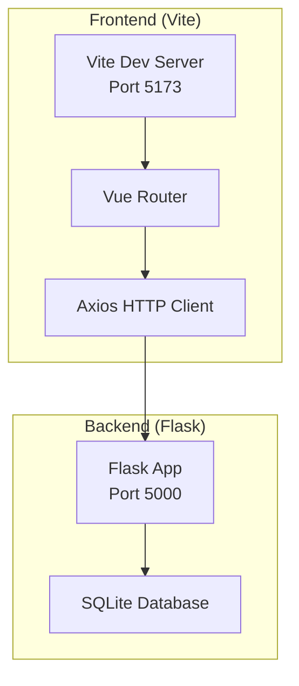
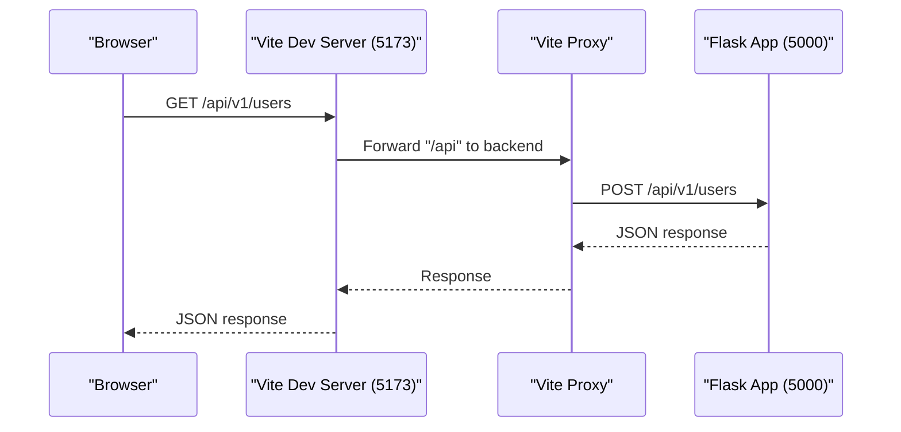
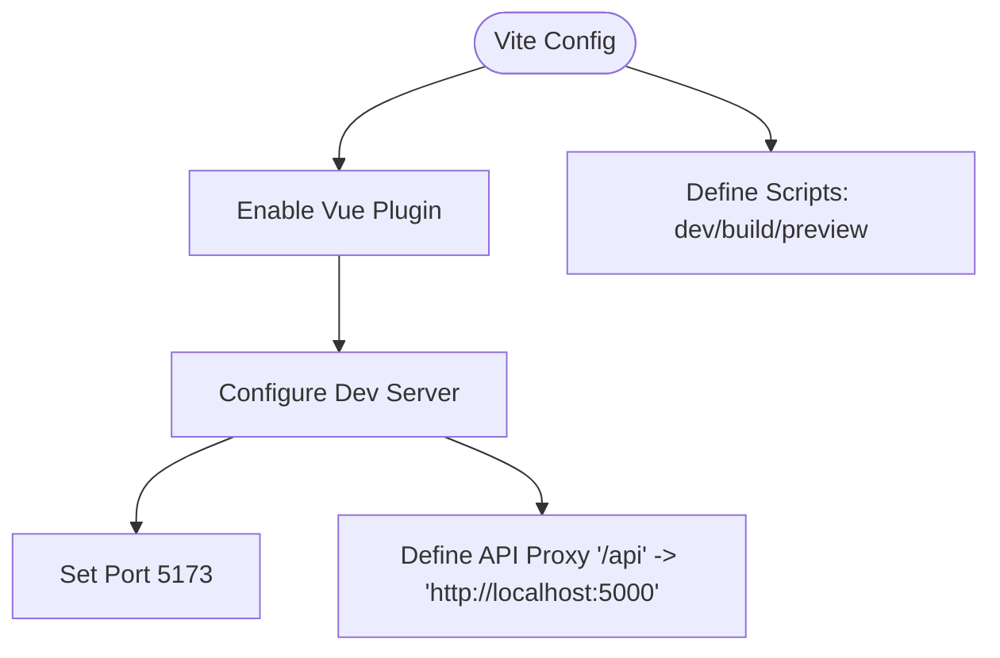
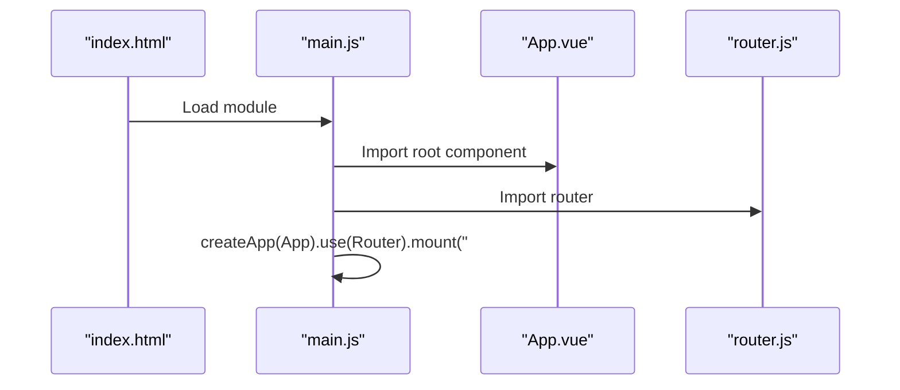
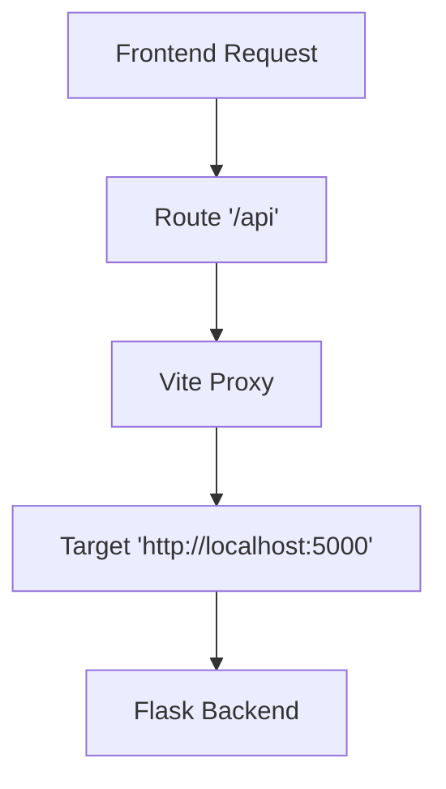
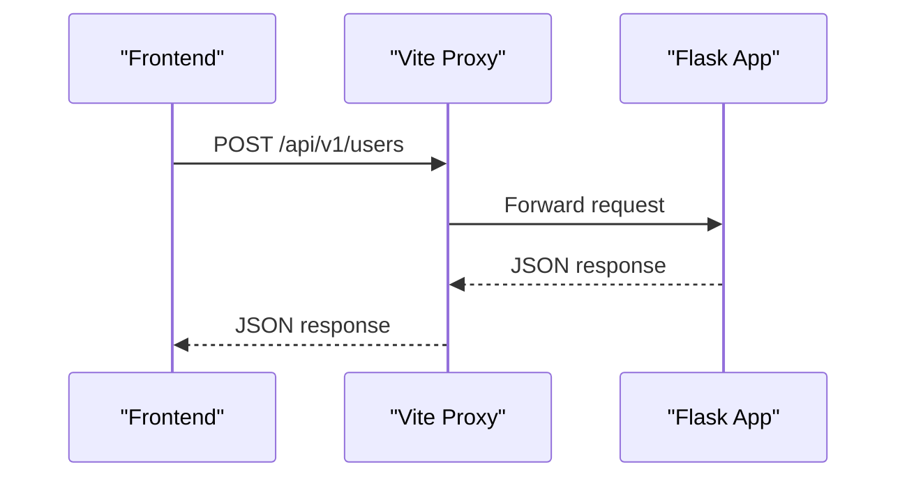
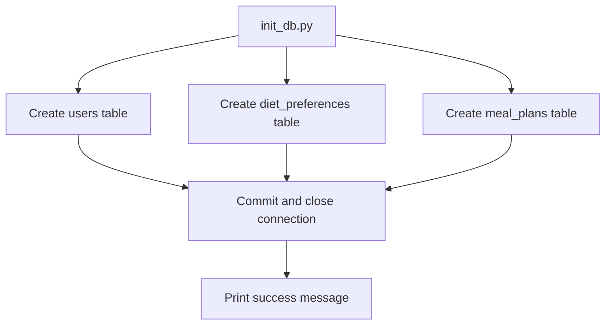
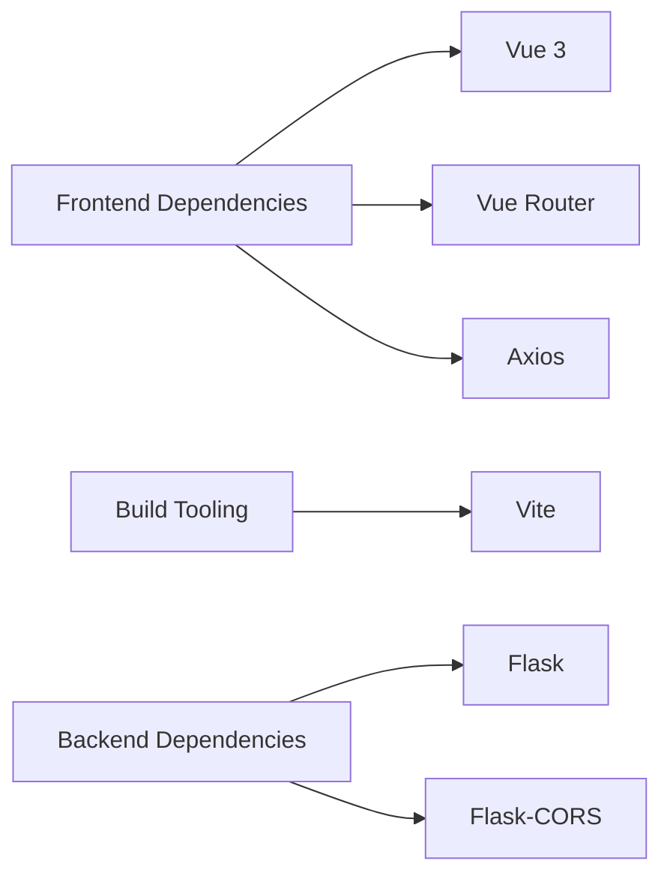
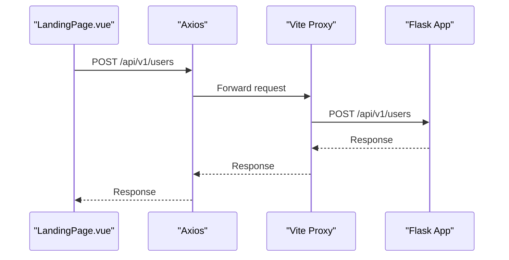

# Development Environment

<cite>
**Referenced Files in This Document**
- [vite.config.js](file://nutricoach/frontend/vite.config.js)
- [package.json](file://nutricoach/frontend/package.json)
- [main.js](file://nutricoach/frontend/src/main.js)
- [router.js](file://nutricoach/frontend/src/router.js)
- [App.vue](file://nutricoach/frontend/src/App.vue)
- [index.html](file://nutricoach/frontend/index.html)
- [LandingPage.vue](file://nutricoach/frontend/components/LandingPage.vue)
- [Dashboard.vue](file://nutricoach/frontend/components/Dashboard.vue)
- [app.py](file://nutricoach/backend/app.py)
- [API.md](file://nutricoach/backend/API.md)
- [init_db.py](file://nutricoach/backend/init_db.py)
- [schema.sql](file://nutricoach/backend/schema.sql)
- [README.md](file://nutricoach/README.md)
</cite>

## Table of Contents
1. [Introduction](#introduction)
2. [Project Structure](#project-structure)
3. [Core Components](#core-components)
4. [Architecture Overview](#architecture-overview)
5. [Detailed Component Analysis](#detailed-component-analysis)
6. [Dependency Analysis](#dependency-analysis)
7. [Performance Considerations](#performance-considerations)
8. [Troubleshooting Guide](#troubleshooting-guide)
9. [Conclusion](#conclusion)
10. [Appendices](#appendices)

## Introduction
This document describes the development environment for NutriCoach AI, focusing on the Vite-based frontend configuration, development server setup, API proxy for seamless frontend-backend integration, and the build process. It also covers development workflow, debugging techniques, environment variable considerations, cross-platform compatibility, and troubleshooting steps for common issues.

## Project Structure
The project follows a clear separation between frontend and backend:
- Frontend: Vue 3 application configured with Vite, using Vue Router and Axios for HTTP requests.
- Backend: Python Flask application exposing REST endpoints and managing SQLite data.

Key runtime ports:
- Frontend development server: http://localhost:5173
- Backend development server: http://localhost:5000

**Diagram sources**
- [vite.config.js:7-15](file://nutricoach/frontend/vite.config.js#L7-L15)
- [app.py:30-31](file://nutricoach/backend/app.py#L30-L31)

**Section sources**
- [README.md:25-77](file://nutricoach/README.md#L25-L77)
- [vite.config.js:1-17](file://nutricoach/frontend/vite.config.js#L1-L17)
- [app.py:1-31](file://nutricoach/backend/app.py#L1-L31)

## Core Components
- Vite configuration defines the development server, port, and API proxy for backend integration.
- Vue application bootstraps the router and mounts the root component.
- Vue Router manages navigation and route resolution.
- Axios is used by components to communicate with the backend API.
- Flask backend exposes REST endpoints and serves CORS-enabled responses.

**Section sources**
- [vite.config.js:5-16](file://nutricoach/frontend/vite.config.js#L5-L16)
- [main.js:1-6](file://nutricoach/frontend/src/main.js#L1-L6)
- [router.js:1-14](file://nutricoach/frontend/src/router.js#L1-L14)
- [LandingPage.vue:28-55](file://nutricoach/frontend/components/LandingPage.vue#L28-L55)
- [app.py:1-31](file://nutricoach/backend/app.py#L1-L31)

## Architecture Overview
The frontend and backend are decoupled during development. The Vite dev server proxies API requests from the frontend to the Flask backend, enabling seamless integration without cross-origin concerns.

**Diagram sources**
- [vite.config.js:9-14](file://nutricoach/frontend/vite.config.js#L9-L14)
- [app.py:16-26](file://nutricoach/backend/app.py#L16-L26)

## Detailed Component Analysis

### Vite Configuration
- Plugin: Vue plugin is enabled for single-file component support.
- Server:
  - Port: 5173
  - Proxy: Routes requests starting with /api to http://localhost:5000 with origin change enabled.
- Scripts:
  - dev: Starts Vite dev server.
  - build: Produces optimized production assets.
  - preview: Serves built assets locally.

**Diagram sources**
- [vite.config.js:5-16](file://nutricoach/frontend/vite.config.js#L5-L16)
- [package.json:5-8](file://nutricoach/frontend/package.json#L5-L8)

**Section sources**
- [vite.config.js:1-17](file://nutricoach/frontend/vite.config.js#L1-L17)
- [package.json:1-19](file://nutricoach/frontend/package.json#L1-L19)

### Frontend Application Bootstrap
- Creates the Vue app instance, registers the router, and mounts to the DOM element.
- The router is configured with HTML5 history mode and basic route definitions.

**Diagram sources**
- [index.html:11](file://nutricoach/frontend/index.html#L11)
- [main.js:1-6](file://nutricoach/frontend/src/main.js#L1-L6)
- [App.vue:1-11](file://nutricoach/frontend/src/App.vue#L1-L11)
- [router.js:1-14](file://nutricoach/frontend/src/router.js#L1-L14)

**Section sources**
- [index.html:1-14](file://nutricoach/frontend/index.html#L1-L14)
- [main.js:1-6](file://nutricoach/frontend/src/main.js#L1-L6)
- [App.vue:1-11](file://nutricoach/frontend/src/App.vue#L1-L11)
- [router.js:1-14](file://nutricoach/frontend/src/router.js#L1-L14)

### API Proxy Setup
- The proxy forwards all requests starting with /api to the Flask backend running on port 5000.
- This avoids CORS issues during development and allows the frontend to call backend endpoints using relative paths.

**Diagram sources**
- [vite.config.js:9-14](file://nutricoach/frontend/vite.config.js#L9-L14)

**Section sources**
- [vite.config.js:7-15](file://nutricoach/frontend/vite.config.js#L7-L15)

### Backend API Endpoints
- Flask app exposes CORS-enabled endpoints and runs on port 5000.
- The base API path is documented as /api/v1 in the API specification.
- Example endpoint: POST /api/v1/users for creating users.

**Diagram sources**
- [app.py:16-26](file://nutricoach/backend/app.py#L16-L26)
- [API.md:3-24](file://nutricoach/backend/API.md#L3-L24)

**Section sources**
- [app.py:1-31](file://nutricoach/backend/app.py#L1-L31)
- [API.md:1-59](file://nutricoach/backend/API.md#L1-L59)

### Database Initialization
- The backend initializes SQLite tables for users, diet preferences, and meal plans.
- A script creates tables if they do not exist and prints a success message.

**Diagram sources**
- [init_db.py:1-47](file://nutricoach/backend/init_db.py#L1-L47)
- [schema.sql:1-25](file://nutricoach/backend/schema.sql#L1-L25)

**Section sources**
- [init_db.py:1-47](file://nutricoach/backend/init_db.py#L1-L47)
- [schema.sql:1-25](file://nutricoach/backend/schema.sql#L1-L25)

## Dependency Analysis
- Frontend depends on Vue 3, Vue Router, and Axios for HTTP requests.
- Vite is used for development and building.
- Backend depends on Flask and Flask-CORS for API exposure.

**Diagram sources**
- [package.json:10-18](file://nutricoach/frontend/package.json#L10-L18)
- [app.py:1-7](file://nutricoach/backend/app.py#L1-L7)

**Section sources**
- [package.json:1-19](file://nutricoach/frontend/package.json#L1-L19)
- [app.py:1-31](file://nutricoach/backend/app.py#L1-L31)

## Performance Considerations
- Development server hot reload is enabled by default in Vite.
- Production builds optimize assets and minimize code.
- For performance profiling:
  - Use browser developer tools to profile network requests and JavaScript execution.
  - Monitor API latency and response sizes.
  - Consider lazy-loading routes and components for larger applications.

[No sources needed since this section provides general guidance]

## Troubleshooting Guide
Common development issues and resolutions:
- Port conflicts:
  - Frontend default port is 5173; adjust in Vite config if needed.
  - Backend default port is 5000; adjust in Flask app if needed.
- CORS errors:
  - Flask app enables CORS globally; ensure requests are proxied via Vite to avoid cross-origin issues.
- Proxy misconfiguration:
  - Verify the proxy target and path match the backend base path.
- Database initialization:
  - Run the initialization script to create tables if missing.
- Environment activation:
  - Ensure the Python virtual environment is activated before running the backend.

**Section sources**
- [vite.config.js:7-15](file://nutricoach/frontend/vite.config.js#L7-L15)
- [app.py:30-31](file://nutricoach/backend/app.py#L30-L31)
- [init_db.py:1-47](file://nutricoach/backend/init_db.py#L1-L47)
- [README.md:25-77](file://nutricoach/README.md#L25-L77)

## Conclusion
NutriCoach AI’s development environment is streamlined with Vite for the frontend and Flask for the backend. The Vite proxy simplifies API integration during development, while the build scripts enable quick local previews. Following the setup steps and using the troubleshooting tips ensures a smooth development experience across platforms.

[No sources needed since this section summarizes without analyzing specific files]

## Appendices

### Development Workflow
- Start the backend server on port 5000.
- Start the frontend development server on port 5173.
- Access the application at http://localhost:5173/.
- Use hot reload and source maps for efficient iteration.

**Section sources**
- [README.md:25-77](file://nutricoach/README.md#L25-L77)
- [vite.config.js:7-15](file://nutricoach/frontend/vite.config.js#L7-L15)
- [app.py:30-31](file://nutricoach/backend/app.py#L30-L31)

### Cross-Platform Compatibility
- Node.js and Python prerequisites are required.
- Virtual environment activation differs by platform:
  - Windows: venv\Scripts\activate
  - Unix/macOS: source venv/bin/activate
- Ensure firewall and antivirus do not block ports 5173 or 5000.

**Section sources**
- [README.md:20-23](file://nutricoach/README.md#L20-L23)
- [README.md:37-41](file://nutricoach/README.md#L37-L41)
- [README.md:61-67](file://nutricoach/README.md#L61-L67)

### Build Process
- Development:
  - Run the dev script to start the Vite dev server.
- Production:
  - Run the build script to generate optimized assets.
  - Use the preview script to serve built assets locally.

**Section sources**
- [package.json:5-8](file://nutricoach/frontend/package.json#L5-L8)

### API Communication Patterns
- Frontend components use Axios to call backend endpoints under /api/v1.
- The proxy forwards these requests to the Flask backend.

**Diagram sources**
- [LandingPage.vue:48](file://nutricoach/frontend/components/LandingPage.vue#L48)
- [vite.config.js:9-14](file://nutricoach/frontend/vite.config.js#L9-L14)
- [app.py:16-26](file://nutricoach/backend/app.py#L16-L26)