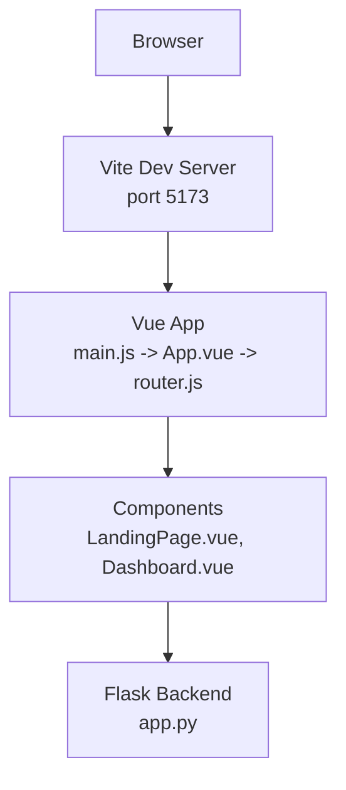
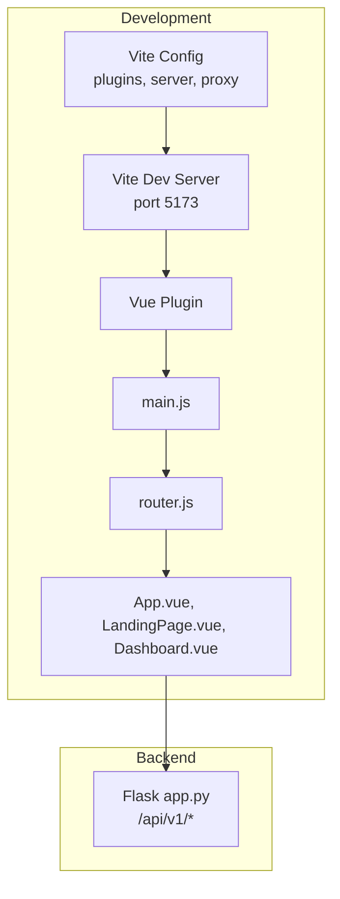
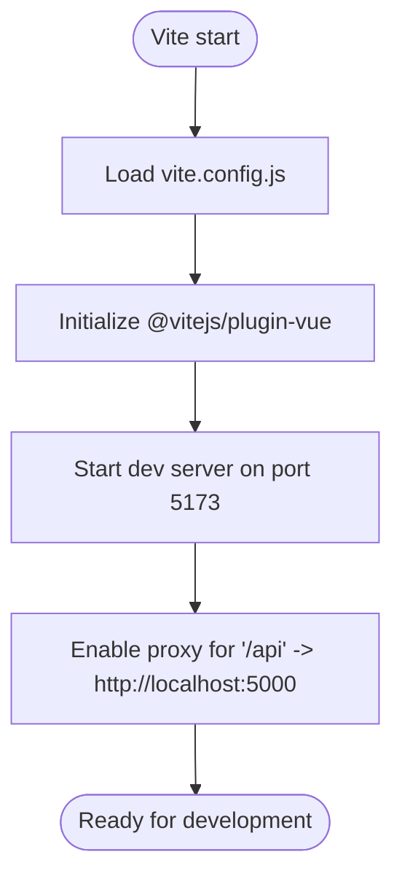
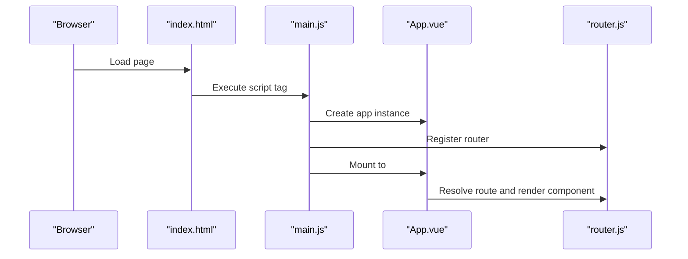
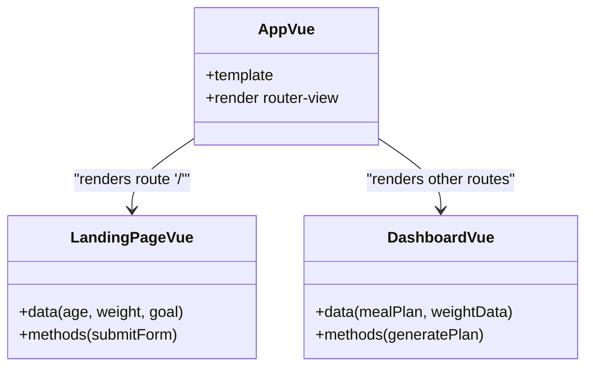
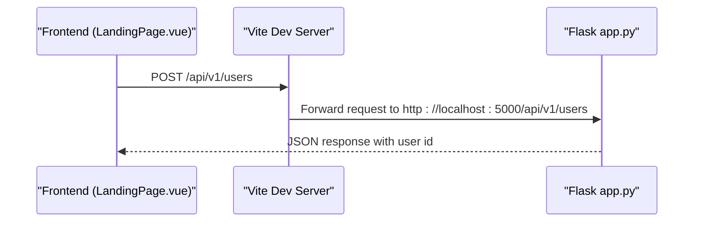
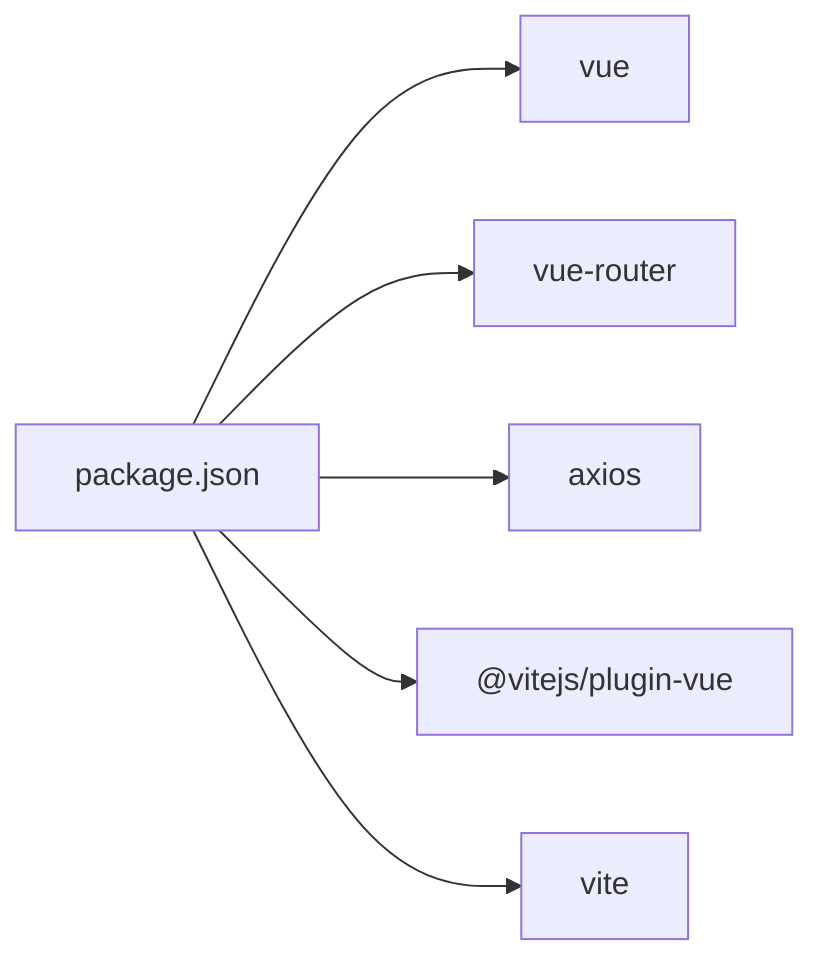

# Build Process and Development Environment

<cite>
**Referenced Files in This Document**
- [package.json](file://nutricoach/frontend/package.json)
- [vite.config.js](file://nutricoach/frontend/vite.config.js)
- [main.js](file://nutricoach/frontend/src/main.js)
- [index.html](file://nutricoach/frontend/index.html)
- [App.vue](file://nutricoach/frontend/src/App.vue)
- [router.js](file://nutricoach/frontend/src/router.js)
- [LandingPage.vue](file://nutricoach/frontend/components/LandingPage.vue)
- [Dashboard.vue](file://nutricoach/frontend/components/Dashboard.vue)
- [app.py](file://nutricoach/backend/app.py)
- [API.md](file://nutricoach/backend/API.md)
</cite>

## Table of Contents
1. [Introduction](#introduction)
2. [Project Structure](#project-structure)
3. [Core Components](#core-components)
4. [Architecture Overview](#architecture-overview)
5. [Detailed Component Analysis](#detailed-component-analysis)
6. [Dependency Analysis](#dependency-analysis)
7. [Performance Considerations](#performance-considerations)
8. [Troubleshooting Guide](#troubleshooting-guide)
9. [Conclusion](#conclusion)

## Introduction
This document explains the frontend build process and development environment for the Nutri Coach - AI project. It covers Vite configuration, development server and proxy setup, asset handling, build targets, and the Vue.js application bootstrap. It also outlines the development workflow, production build preparation, and common troubleshooting steps. The guide is designed for both new contributors and experienced developers who want a clear understanding of the frontend toolchain and how it integrates with the backend API.

## Project Structure
The frontend is a Vue 3 single-page application built with Vite. The application entry point is declared in the HTML template and mounted via the JavaScript entry file. Routing is handled by Vue Router, and the UI components are organized under the components directory. The Vite configuration defines the development server, plugin integration, and API proxying to the backend.

**Diagram sources**
- [index.html:1-14](file://nutricoach/frontend/index.html#L1-L14)
- [main.js:1-6](file://nutricoach/frontend/src/main.js#L1-L6)
- [App.vue:1-11](file://nutricoach/frontend/src/App.vue#L1-L11)
- [router.js:1-14](file://nutricoach/frontend/src/router.js#L1-L14)
- [LandingPage.vue:1-92](file://nutricoach/frontend/components/LandingPage.vue#L1-L92)
- [Dashboard.vue:1-46](file://nutricoach/frontend/components/Dashboard.vue#L1-L46)
- [app.py:1-31](file://nutricoach/backend/app.py#L1-L31)

**Section sources**
- [index.html:1-14](file://nutricoach/frontend/index.html#L1-L14)
- [main.js:1-6](file://nutricoach/frontend/src/main.js#L1-L6)
- [App.vue:1-11](file://nutricoach/frontend/src/App.vue#L1-L11)
- [router.js:1-14](file://nutricoach/frontend/src/router.js#L1-L14)
- [LandingPage.vue:1-92](file://nutricoach/frontend/components/LandingPage.vue#L1-L92)
- [Dashboard.vue:1-46](file://nutricoach/frontend/components/Dashboard.vue#L1-L46)

## Core Components
- Vite configuration: Defines the development server port and API proxy to the backend Flask service.
- Vue application bootstrap: Creates the Vue app instance, mounts it to the DOM, and registers routing.
- Router: Configures client-side routing with Vue Router and maps the landing page route.
- Components: Presentational and interactive UI elements, including forms and navigation.
- Backend integration: The frontend communicates with the backend API using Axios; the Vite proxy simplifies local development by avoiding cross-origin issues.

Key implementation references:
- Vite config and proxy: [vite.config.js:1-17](file://nutricoach/frontend/vite.config.js#L1-L17)
- Application entry and mounting: [main.js:1-6](file://nutricoach/frontend/src/main.js#L1-L6), [index.html:1-14](file://nutricoach/frontend/index.html#L1-L14)
- Router setup: [router.js:1-14](file://nutricoach/frontend/src/router.js#L1-L14)
- Component composition: [App.vue:1-11](file://nutricoach/frontend/src/App.vue#L1-L11), [LandingPage.vue:1-92](file://nutricoach/frontend/components/LandingPage.vue#L1-L92), [Dashboard.vue:1-46](file://nutricoach/frontend/components/Dashboard.vue#L1-L46)
- Backend API contract: [API.md:1-59](file://nutricoach/backend/API.md#L1-L59), [app.py:1-31](file://nutricoach/backend/app.py#L1-L31)

**Section sources**
- [vite.config.js:1-17](file://nutricoach/frontend/vite.config.js#L1-L17)
- [main.js:1-6](file://nutricoach/frontend/src/main.js#L1-L6)
- [index.html:1-14](file://nutricoach/frontend/index.html#L1-L14)
- [router.js:1-14](file://nutricoach/frontend/src/router.js#L1-L14)
- [App.vue:1-11](file://nutricoach/frontend/src/App.vue#L1-L11)
- [LandingPage.vue:1-92](file://nutricoach/frontend/components/LandingPage.vue#L1-L92)
- [Dashboard.vue:1-46](file://nutricoach/frontend/components/Dashboard.vue#L1-L46)
- [API.md:1-59](file://nutricoach/backend/API.md#L1-L59)
- [app.py:1-31](file://nutricoach/backend/app.py#L1-L31)

## Architecture Overview
The frontend development stack centers on Vite for fast builds and a dev server with hot module replacement. Vue 3 handles UI rendering, and Vue Router manages client-side navigation. Axios is used for HTTP requests to the backend. The Vite proxy forwards API calls from the frontend to the backend during development, simplifying cross-origin handling.

**Diagram sources**
- [vite.config.js:1-17](file://nutricoach/frontend/vite.config.js#L1-L17)
- [main.js:1-6](file://nutricoach/frontend/src/main.js#L1-L6)
- [router.js:1-14](file://nutricoach/frontend/src/router.js#L1-L14)
- [App.vue:1-11](file://nutricoach/frontend/src/App.vue#L1-L11)
- [LandingPage.vue:1-92](file://nutricoach/frontend/components/LandingPage.vue#L1-L92)
- [Dashboard.vue:1-46](file://nutricoach/frontend/components/Dashboard.vue#L1-L46)
- [app.py:1-31](file://nutricoach/backend/app.py#L1-L31)

## Detailed Component Analysis

### Vite Configuration and Development Server
- Plugin integration: The Vue plugin is enabled to support Single File Components.
- Development server: Runs on port 5173 with live reload capabilities.
- Proxy configuration: Routes requests prefixed with /api to the backend Flask service running on localhost:5000. This avoids CORS complications during local development.
- Asset handling: Vite resolves modules and serves static assets efficiently.

**Diagram sources**
- [vite.config.js:1-17](file://nutricoach/frontend/vite.config.js#L1-L17)

**Section sources**
- [vite.config.js:1-17](file://nutricoach/frontend/vite.config.js#L1-L17)

### Vue Application Bootstrap and Routing
- Entry point: The HTML template includes a script tag that loads the application entry file.
- App creation: The entry file initializes the Vue app, registers the router, and mounts to the DOM element with id app.
- Router configuration: Uses Vue Router with web history mode and a basic route mapping to the landing page component.

**Diagram sources**
- [index.html:1-14](file://nutricoach/frontend/index.html#L1-L14)
- [main.js:1-6](file://nutricoach/frontend/src/main.js#L1-L6)
- [App.vue:1-11](file://nutricoach/frontend/src/App.vue#L1-L11)
- [router.js:1-14](file://nutricoach/frontend/src/router.js#L1-L14)

**Section sources**
- [index.html:1-14](file://nutricoach/frontend/index.html#L1-L14)
- [main.js:1-6](file://nutricoach/frontend/src/main.js#L1-L6)
- [App.vue:1-11](file://nutricoach/frontend/src/App.vue#L1-L11)
- [router.js:1-14](file://nutricoach/frontend/src/router.js#L1-L14)

### Component Composition and Data Flow
- App shell: Wraps the router view to render the current route.
- Landing page: Presents a form to collect user data and submits it to the backend endpoint. The component imports Axios for HTTP requests.
- Dashboard: Provides navigation and placeholders for meal plans and progress tracking.

**Diagram sources**
- [App.vue:1-11](file://nutricoach/frontend/src/App.vue#L1-L11)
- [LandingPage.vue:1-92](file://nutricoach/frontend/components/LandingPage.vue#L1-L92)
- [Dashboard.vue:1-46](file://nutricoach/frontend/components/Dashboard.vue#L1-L46)

**Section sources**
- [App.vue:1-11](file://nutricoach/frontend/src/App.vue#L1-L11)
- [LandingPage.vue:1-92](file://nutricoach/frontend/components/LandingPage.vue#L1-L92)
- [Dashboard.vue:1-46](file://nutricoach/frontend/components/Dashboard.vue#L1-L46)

### Backend API Contract and Frontend Integration
- Backend base URL: The Flask app exposes endpoints under /api/v1.
- Example endpoint: POST /api/v1/users creates a new user and returns the new identifier.
- Frontend usage: The landing page component posts user data to the backend endpoint. During development, Vite proxies /api requests to the backend.

**Diagram sources**
- [LandingPage.vue:1-92](file://nutricoach/frontend/components/LandingPage.vue#L1-L92)
- [vite.config.js:1-17](file://nutricoach/frontend/vite.config.js#L1-L17)
- [app.py:1-31](file://nutricoach/backend/app.py#L1-L31)

**Section sources**
- [API.md:1-59](file://nutricoach/backend/API.md#L1-L59)
- [app.py:1-31](file://nutricoach/backend/app.py#L1-L31)
- [LandingPage.vue:1-92](file://nutricoach/frontend/components/LandingPage.vue#L1-L92)
- [vite.config.js:1-17](file://nutricoach/frontend/vite.config.js#L1-L17)

## Dependency Analysis
- Runtime dependencies:
  - Vue 3: Reactive application framework.
  - Vue Router 4: Client-side routing.
  - Axios: HTTP client for API communication.
- Development dependencies:
  - @vitejs/plugin-vue: Enables SFC support in Vite.
  - Vite: Build tool and dev server.

**Diagram sources**
- [package.json:1-19](file://nutricoach/frontend/package.json#L1-L19)

**Section sources**
- [package.json:1-19](file://nutricoach/frontend/package.json#L1-L19)

## Performance Considerations
- Development performance:
  - Keep the dev server port consistent to avoid unnecessary restarts.
  - Use the proxy to avoid manual CORS configuration and reduce network overhead during local iteration.
- Production build readiness:
  - Vite’s default build targets modern browsers; ensure transpilation aligns with your deployment environment.
  - Consider enabling code splitting for larger applications by organizing routes and components for lazy loading.
  - Minimize heavy assets and leverage Vite’s built-in asset optimization.
- Debugging:
  - Enable source maps in development for accurate stack traces.
  - Use Vue DevTools to inspect component state and router transitions.

[No sources needed since this section provides general guidance]

## Troubleshooting Guide
- Proxy does not forward requests:
  - Verify the proxy target matches the backend host and port.
  - Confirm the frontend makes requests to /api and that the proxy path is configured.
  - Check that the backend is running and reachable at the proxy target address.
- CORS errors in development:
  - The proxy should prevent CORS issues; if they persist, review the proxy configuration and ensure the backend supports cross-origin requests.
- Hot module replacement not working:
  - Ensure the dev server is running and the browser is connected.
  - Check for syntax errors in Vue components or the entry file.
- Build fails or assets missing:
  - Confirm all dependencies are installed and up to date.
  - Validate Vite configuration and plugin compatibility.
- Backend endpoint not found:
  - Match the frontend endpoint to the backend base URL and path as defined in the API specification.

**Section sources**
- [vite.config.js:1-17](file://nutricoach/frontend/vite.config.js#L1-L17)
- [API.md:1-59](file://nutricoach/backend/API.md#L1-L59)
- [app.py:1-31](file://nutricoach/backend/app.py#L1-L31)

## Conclusion
The frontend build process leverages Vite for a fast development experience and Vue 3 for a reactive UI. The Vite configuration provides a straightforward development server with a proxy to the backend, while the Vue application is bootstrapped cleanly and routed via Vue Router. By following the outlined setup, development workflow, and troubleshooting tips, contributors can iterate quickly and prepare the application for production deployment.