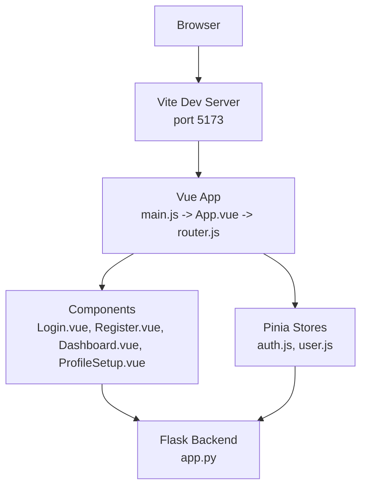
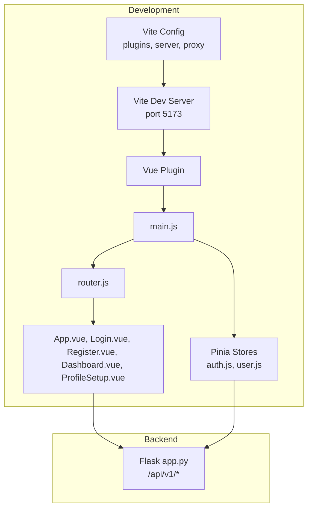
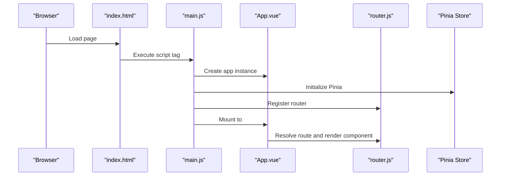
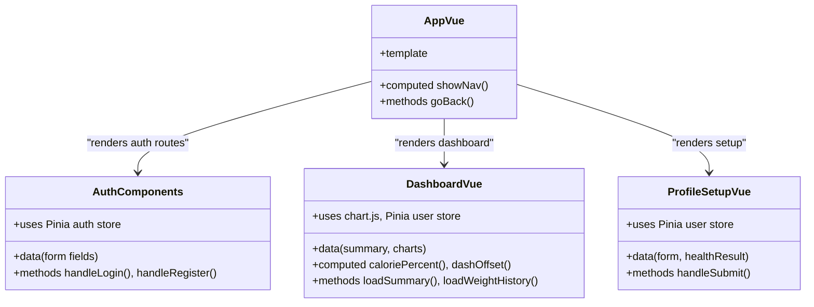
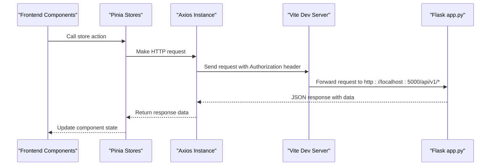
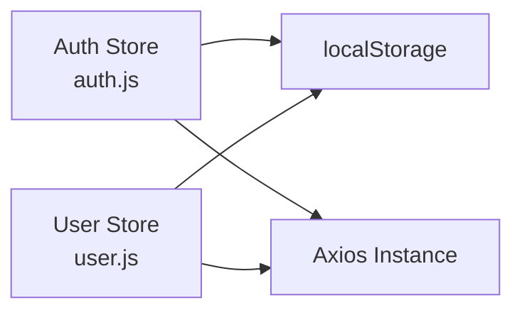
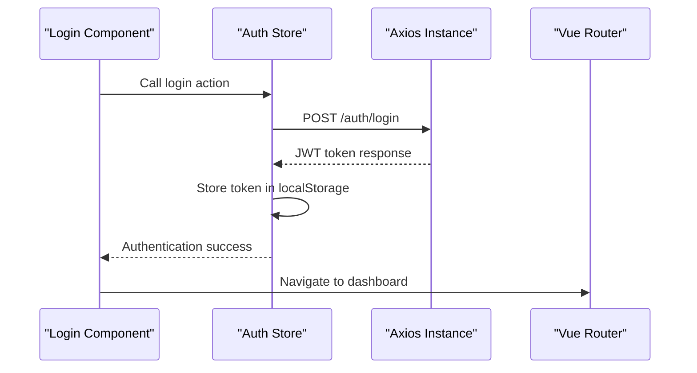

# Build Process and Development Environment

<cite>
**Referenced Files in This Document**
- [package.json](file://nutricoach/frontend/package.json)
- [vite.config.js](file://nutricoach/frontend/vite.config.js)
- [main.js](file://nutricoach/frontend/src/main.js)
- [index.html](file://nutricoach/frontend/index.html)
- [App.vue](file://nutricoach/frontend/src/App.vue)
- [router.js](file://nutricoach/frontend/src/router.js)
- [api.js](file://nutricoach/frontend/src/api.js)
- [auth.js](file://nutricoach/frontend/src/stores/auth.js)
- [user.js](file://nutricoach/frontend/src/stores/user.js)
- [Login.vue](file://nutricoach/frontend/components/Login.vue)
- [Register.vue](file://nutricoach/frontend/components/Register.vue)
- [Dashboard.vue](file://nutricoach/frontend/components/Dashboard.vue)
- [ProfileSetup.vue](file://nutricoach/frontend/components/ProfileSetup.vue)
- [app.py](file://nutricoach/backend/app.py)
- [API.md](file://nutricoach/backend/API.md)
</cite>

## Update Summary
**Changes Made**
- Updated architecture overview to reflect modern Vue 3 ecosystem with Pinia state management
- Added comprehensive documentation for Pinia store management and state persistence
- Enhanced authentication flow documentation with JWT token management
- Updated component composition to include advanced state management patterns
- Added chart.js integration and visualization capabilities
- Expanded development tooling section with modern debugging techniques

## Table of Contents
1. [Introduction](#introduction)
2. [Project Structure](#project-structure)
3. [Core Components](#core-components)
4. [Architecture Overview](#architecture-overview)
5. [Detailed Component Analysis](#detailed-component-analysis)
6. [State Management with Pinia](#state-management-with-pinia)
7. [Authentication System](#authentication-system)
8. [Development Tooling](#development-tooling)
9. [Performance Considerations](#performance-considerations)
10. [Troubleshooting Guide](#troubleshooting-guide)
11. [Conclusion](#conclusion)

## Introduction
This document explains the modern frontend build process and development environment for the Nutri Coach - AI project. The application leverages Vue 3 with the latest ecosystem tools including Vite for rapid development, Pinia for state management, and enhanced development tooling. The documentation covers Vite configuration, development server and proxy setup, asset handling, build targets, and the Vue.js application bootstrap with modern state management patterns. It also outlines the development workflow, production build preparation, and common troubleshooting steps.

## Project Structure
The frontend is a sophisticated Vue 3 single-page application built with Vite and enhanced with Pinia state management. The application follows a modular architecture with dedicated store modules for authentication and user management. The application entry point is declared in the HTML template and mounted via the JavaScript entry file. Routing is handled by Vue Router, and the UI components are organized with advanced state management patterns. The Vite configuration defines the development server, plugin integration, and API proxying to the backend.

**Diagram sources**
- [index.html:1-14](file://nutricoach/frontend/index.html#L1-L14)
- [main.js:1-10](file://nutricoach/frontend/src/main.js#L1-L10)
- [App.vue:1-83](file://nutricoach/frontend/src/App.vue#L1-L83)
- [router.js:1-35](file://nutricoach/frontend/src/router.js#L1-L35)
- [auth.js:1-59](file://nutricoach/frontend/src/stores/auth.js#L1-L59)
- [user.js:1-40](file://nutricoach/frontend/src/stores/user.js#L1-L40)
- [Login.vue:1-92](file://nutricoach/frontend/components/Login.vue#L1-L92)
- [Register.vue:1-96](file://nutricoach/frontend/components/Register.vue#L1-L96)
- [Dashboard.vue:1-276](file://nutricoach/frontend/components/Dashboard.vue#L1-L276)
- [ProfileSetup.vue:1-184](file://nutricoach/frontend/components/ProfileSetup.vue#L1-L184)
- [app.py:1-31](file://nutricoach/backend/app.py#L1-L31)

**Section sources**
- [index.html:1-14](file://nutricoach/frontend/index.html#L1-L14)
- [main.js:1-10](file://nutricoach/frontend/src/main.js#L1-L10)
- [App.vue:1-83](file://nutricoach/frontend/src/App.vue#L1-L83)
- [router.js:1-35](file://nutricoach/frontend/src/router.js#L1-L35)
- [auth.js:1-59](file://nutricoach/frontend/src/stores/auth.js#L1-L59)
- [user.js:1-40](file://nutricoach/frontend/src/stores/user.js#L1-L40)

## Core Components
- **Vite configuration**: Defines the development server port and API proxy to the backend Flask service with modern plugin integration.
- **Vue application bootstrap**: Creates the Vue app instance with Pinia state management, mounts it to the DOM, and registers routing.
- **Pinia state management**: Implements centralized state management with persistent storage and automatic token handling.
- **Router**: Configures client-side routing with Vue Router and authentication guards.
- **Components**: Advanced presentational and interactive UI elements with integrated state management and chart.js visualizations.
- **Backend integration**: The frontend communicates with the backend API using Axios with automatic JWT token injection and error handling.

Key implementation references:
- Vite config and proxy: [vite.config.js:1-17](file://nutricoach/frontend/vite.config.js#L1-L17)
- Application entry and mounting: [main.js:1-10](file://nutricoach/frontend/src/main.js#L1-L10), [index.html:1-14](file://nutricoach/frontend/index.html#L1-L14)
- Router setup: [router.js:1-35](file://nutricoach/frontend/src/router.js#L1-L35)
- Authentication store: [auth.js:1-59](file://nutricoach/frontend/src/stores/auth.js#L1-L59)
- User store: [user.js:1-40](file://nutricoach/frontend/src/stores/user.js#L1-L40)
- Component composition: [App.vue:1-83](file://nutricoach/frontend/src/App.vue#L1-L83), [Login.vue:1-92](file://nutricoach/frontend/components/Login.vue#L1-L92), [Dashboard.vue:1-276](file://nutricoach/frontend/components/Dashboard.vue#L1-L276)
- Backend API contract: [API.md:1-59](file://nutricoach/backend/API.md#L1-L59), [app.py:1-31](file://nutricoach/backend/app.py#L1-L31)

**Section sources**
- [vite.config.js:1-17](file://nutricoach/frontend/vite.config.js#L1-L17)
- [main.js:1-10](file://nutricoach/frontend/src/main.js#L1-L10)
- [index.html:1-14](file://nutricoach/frontend/index.html#L1-L14)
- [router.js:1-35](file://nutricoach/frontend/src/router.js#L1-L35)
- [auth.js:1-59](file://nutricoach/frontend/src/stores/auth.js#L1-L59)
- [user.js:1-40](file://nutricoach/frontend/src/stores/user.js#L1-L40)
- [App.vue:1-83](file://nutricoach/frontend/src/App.vue#L1-L83)
- [Login.vue:1-92](file://nutricoach/frontend/components/Login.vue#L1-L92)
- [Dashboard.vue:1-276](file://nutricoach/frontend/components/Dashboard.vue#L1-L276)
- [API.md:1-59](file://nutricoach/backend/API.md#L1-L59)
- [app.py:1-31](file://nutricoach/backend/app.py#L1-L31)

## Architecture Overview
The frontend development stack centers on Vite for fast builds and a dev server with hot module replacement. Vue 3 handles UI rendering with Composition API patterns, and Vue Router manages client-side navigation with authentication guards. Pinia provides centralized state management with automatic persistence to localStorage. Axios is used for HTTP requests to the backend with automatic JWT token injection and error handling. The Vite proxy forwards API calls from the frontend to the backend during development, simplifying cross-origin handling.

**Diagram sources**
- [vite.config.js:1-17](file://nutricoach/frontend/vite.config.js#L1-L17)
- [main.js:1-10](file://nutricoach/frontend/src/main.js#L1-L10)
- [router.js:1-35](file://nutricoach/frontend/src/router.js#L1-L35)
- [auth.js:1-59](file://nutricoach/frontend/src/stores/auth.js#L1-L59)
- [user.js:1-40](file://nutricoach/frontend/src/stores/user.js#L1-L40)
- [App.vue:1-83](file://nutricoach/frontend/src/App.vue#L1-L83)
- [Login.vue:1-92](file://nutricoach/frontend/components/Login.vue#L1-L92)
- [Register.vue:1-96](file://nutricoach/frontend/components/Register.vue#L1-L96)
- [Dashboard.vue:1-276](file://nutricoach/frontend/components/Dashboard.vue#L1-L276)
- [ProfileSetup.vue:1-184](file://nutricoach/frontend/components/ProfileSetup.vue#L1-L184)
- [app.py:1-31](file://nutricoach/backend/app.py#L1-L31)

## Detailed Component Analysis

### Vite Configuration and Development Server
- **Plugin integration**: The Vue plugin is enabled to support Single File Components with modern template compilation.
- **Development server**: Runs on port 5173 with live reload capabilities and hot module replacement.
- **Proxy configuration**: Routes requests prefixed with /api to the backend Flask service running on localhost:5000. This avoids CORS complications during local development.
- **Asset handling**: Vite resolves modules and serves static assets efficiently with modern ES module support.

**Diagram sources**
- [vite.config.js:1-17](file://nutricoach/frontend/vite.config.js#L1-L17)

**Section sources**
- [vite.config.js:1-17](file://nutricoach/frontend/vite.config.js#L1-L17)

### Vue Application Bootstrap and Modern State Management
- **Entry point**: The HTML template includes a script tag that loads the application entry file.
- **App creation**: The entry file initializes the Vue app with Pinia state management, registers the router, and mounts to the DOM element with id app.
- **State management**: Pinia provides reactive state management with automatic persistence to localStorage.
- **Router configuration**: Uses Vue Router with web history mode and authentication guards for protected routes.

**Diagram sources**
- [index.html:1-14](file://nutricoach/frontend/index.html#L1-L14)
- [main.js:1-10](file://nutricoach/frontend/src/main.js#L1-L10)
- [App.vue:1-83](file://nutricoach/frontend/src/App.vue#L1-L83)
- [router.js:1-35](file://nutricoach/frontend/src/router.js#L1-L35)

**Section sources**
- [index.html:1-14](file://nutricoach/frontend/index.html#L1-L14)
- [main.js:1-10](file://nutricoach/frontend/src/main.js#L1-L10)
- [App.vue:1-83](file://nutricoach/frontend/src/App.vue#L1-L83)
- [router.js:1-35](file://nutricoach/frontend/src/router.js#L1-L35)

### Component Composition and Advanced State Management
- **App shell**: Wraps the router view to render the current route with conditional navigation.
- **Authentication components**: Login and Register components with integrated Pinia store usage and form validation.
- **Dashboard component**: Advanced analytics with chart.js integration, real-time data visualization, and responsive design.
- **Profile setup**: Comprehensive health profile management with form validation and health calculation integration.

**Diagram sources**
- [App.vue:1-83](file://nutricoach/frontend/src/App.vue#L1-L83)
- [Login.vue:1-92](file://nutricoach/frontend/components/Login.vue#L1-L92)
- [Register.vue:1-96](file://nutricoach/frontend/components/Register.vue#L1-L96)
- [Dashboard.vue:1-276](file://nutricoach/frontend/components/Dashboard.vue#L1-L276)
- [ProfileSetup.vue:1-184](file://nutricoach/frontend/components/ProfileSetup.vue#L1-L184)

**Section sources**
- [App.vue:1-83](file://nutricoach/frontend/src/App.vue#L1-L83)
- [Login.vue:1-92](file://nutricoach/frontend/components/Login.vue#L1-L92)
- [Register.vue:1-96](file://nutricoach/frontend/components/Register.vue#L1-L96)
- [Dashboard.vue:1-276](file://nutricoach/frontend/components/Dashboard.vue#L1-L276)
- [ProfileSetup.vue:1-184](file://nutricoach/frontend/components/ProfileSetup.vue#L1-L184)

### Backend API Contract and Enhanced Frontend Integration
- **Backend base URL**: The Flask app exposes endpoints under /api/v1 with comprehensive authentication and user management.
- **Authentication endpoints**: POST /auth/register, POST /auth/login, GET /auth/me for JWT token management.
- **User management endpoints**: GET /users/profile, PUT /users/profile, POST /health/calculate, GET /dashboard/summary.
- **Frontend usage**: Components integrate with Pinia stores that handle API communication with automatic JWT token injection and error handling.

**Diagram sources**
- [Login.vue:1-92](file://nutricoach/frontend/components/Login.vue#L1-L92)
- [Register.vue:1-96](file://nutricoach/frontend/components/Register.vue#L1-L96)
- [Dashboard.vue:1-276](file://nutricoach/frontend/components/Dashboard.vue#L1-L276)
- [ProfileSetup.vue:1-184](file://nutricoach/frontend/components/ProfileSetup.vue#L1-L184)
- [auth.js:1-59](file://nutricoach/frontend/src/stores/auth.js#L1-L59)
- [user.js:1-40](file://nutricoach/frontend/src/stores/user.js#L1-L40)
- [api.js:1-33](file://nutricoach/frontend/src/api.js#L1-L33)
- [vite.config.js:1-17](file://nutricoach/frontend/vite.config.js#L1-L17)
- [app.py:1-31](file://nutricoach/backend/app.py#L1-L31)

**Section sources**
- [API.md:1-59](file://nutricoach/backend/API.md#L1-L59)
- [app.py:1-31](file://nutricoach/backend/app.py#L1-L31)
- [Login.vue:1-92](file://nutricoach/frontend/components/Login.vue#L1-L92)
- [Register.vue:1-96](file://nutricoach/frontend/components/Register.vue#L1-L96)
- [Dashboard.vue:1-276](file://nutricoach/frontend/components/Dashboard.vue#L1-L276)
- [ProfileSetup.vue:1-184](file://nutricoach/frontend/components/ProfileSetup.vue#L1-L184)
- [auth.js:1-59](file://nutricoach/frontend/src/stores/auth.js#L1-L59)
- [user.js:1-40](file://nutricoach/frontend/src/stores/user.js#L1-L40)
- [api.js:1-33](file://nutricoach/frontend/src/api.js#L1-L33)
- [vite.config.js:1-17](file://nutricoach/frontend/vite.config.js#L1-L17)

## State Management with Pinia
The application uses Pinia for centralized state management with automatic persistence and reactive updates. Two main stores manage different aspects of the application state:

### Authentication Store (auth.js)
- **State management**: Manages JWT tokens, user IDs, and user profiles with localStorage persistence.
- **Getters**: Provides computed properties like isLoggedIn for authentication status.
- **Actions**: Handles user registration, login, profile fetching, and logout with automatic token storage.
- **Integration**: Automatically injects JWT tokens into API requests and handles 401 errors.

### User Store (user.js)
- **State management**: Manages user profiles, health metrics, and dashboard summaries.
- **Actions**: Handles profile updates, health calculations, and dashboard data fetching.
- **Integration**: Works seamlessly with the authentication store for authenticated requests.

**Diagram sources**
- [auth.js:1-59](file://nutricoach/frontend/src/stores/auth.js#L1-L59)
- [user.js:1-40](file://nutricoach/frontend/src/stores/user.js#L1-L40)
- [api.js:1-33](file://nutricoach/frontend/src/api.js#L1-L33)

**Section sources**
- [auth.js:1-59](file://nutricoach/frontend/src/stores/auth.js#L1-L59)
- [user.js:1-40](file://nutricoach/frontend/src/stores/user.js#L1-L40)
- [api.js:1-33](file://nutricoach/frontend/src/api.js#L1-L33)

## Authentication System
The authentication system implements a comprehensive JWT-based authentication flow with automatic token management and security features:

### Token Management
- **Automatic injection**: Axios interceptors automatically add Authorization headers to all requests.
- **Persistence**: Tokens are stored in localStorage and automatically cleared on 401 errors.
- **Route protection**: Router guards protect authenticated routes and redirect unauthenticated users to login.

### Component Integration
- **Login Component**: Handles user authentication with form validation and error handling.
- **Register Component**: Manages user registration with validation and automatic redirection.
- **Dashboard Component**: Integrates authentication state for user-specific data and navigation.

**Diagram sources**
- [Login.vue:1-92](file://nutricoach/frontend/components/Login.vue#L1-L92)
- [auth.js:1-59](file://nutricoach/frontend/src/stores/auth.js#L1-L59)
- [router.js:1-35](file://nutricoach/frontend/src/router.js#L1-L35)

**Section sources**
- [Login.vue:1-92](file://nutricoach/frontend/components/Login.vue#L1-L92)
- [Register.vue:1-96](file://nutricoach/frontend/components/Register.vue#L1-L96)
- [auth.js:1-59](file://nutricoach/frontend/src/stores/auth.js#L1-L59)
- [router.js:1-35](file://nutricoach/frontend/src/router.js#L1-L35)

## Development Tooling
The modern development environment leverages cutting-edge tools for efficient development and debugging:

### Vite Features
- **Fast development server**: Instant hot module replacement and live reloading.
- **Modern build pipeline**: ES module support, tree shaking, and optimized asset bundling.
- **Plugin ecosystem**: Extensive plugin support for Vue, TypeScript, and other frameworks.

### Vue DevTools Integration
- **Component inspection**: Real-time component state and props inspection.
- **Router debugging**: Route navigation tracking and authentication state monitoring.
- **Pinia state inspection**: Reactive state management visualization and debugging.

### Debugging Capabilities
- **Source maps**: Full source map support for accurate debugging in development.
- **Error boundaries**: Comprehensive error handling with user-friendly error messages.
- **Network inspection**: Real-time API request/response monitoring.

### Performance Monitoring
- **Bundle analysis**: Built-in bundle size analysis and optimization recommendations.
- **Runtime performance**: Component rendering performance tracking and optimization insights.

## Performance Considerations
- **Development performance**:
  - Keep the dev server port consistent to avoid unnecessary restarts.
  - Use the proxy to avoid manual CORS configuration and reduce network overhead during local iteration.
  - Leverage Vite's fast HMR for rapid UI iteration.
- **Production build readiness**:
  - Vite's default build targets modern browsers; ensure transpilation aligns with your deployment environment.
  - Consider enabling code splitting for larger applications by organizing routes and components for lazy loading.
  - Minimize heavy assets and leverage Vite's built-in asset optimization.
  - Pinia stores automatically handle state persistence efficiently.
- **State management optimization**:
  - Use computed properties and watchers judiciously to avoid unnecessary re-computations.
  - Implement proper store module separation for better memory management.
  - Utilize localStorage caching for frequently accessed data.
- **Debugging**:
  - Enable source maps in development for accurate stack traces.
  - Use Vue DevTools to inspect component state, router transitions, and Pinia store state.
  - Monitor network requests and API response times for performance optimization.

## Troubleshooting Guide
- **Proxy does not forward requests**:
  - Verify the proxy target matches the backend host and port.
  - Confirm the frontend makes requests to /api and that the proxy path is configured.
  - Check that the backend is running and reachable at the proxy target address.
- **CORS errors in development**:
  - The proxy should prevent CORS issues; if they persist, review the proxy configuration and ensure the backend supports cross-origin requests.
- **Hot module replacement not working**:
  - Ensure the dev server is running and the browser is connected.
  - Check for syntax errors in Vue components or the entry file.
  - Verify Vite plugin compatibility and configuration.
- **Build fails or assets missing**:
  - Confirm all dependencies are installed and up to date.
  - Validate Vite configuration and plugin compatibility.
  - Check for circular dependencies in the component tree.
- **Backend endpoint not found**:
  - Match the frontend endpoint to the backend base URL and path as defined in the API specification.
  - Verify axios baseURL configuration and API endpoint paths.
- **Authentication issues**:
  - Check JWT token storage and expiration in localStorage.
  - Verify axios interceptor configuration for Authorization headers.
  - Review router guards and authentication state management.
- **State management problems**:
  - Verify Pinia store initialization and module registration.
  - Check for proper store action dispatching and state mutations.
  - Monitor localStorage persistence and data serialization.
- **Chart.js integration issues**:
  - Ensure proper Chart.js registration and component imports.
  - Verify data structure compatibility with chart.js requirements.
  - Check for responsive design conflicts and container sizing.

**Section sources**
- [vite.config.js:1-17](file://nutricoach/frontend/vite.config.js#L1-L17)
- [API.md:1-59](file://nutricoach/backend/API.md#L1-L59)
- [app.py:1-31](file://nutricoach/backend/app.py#L1-L31)
- [auth.js:1-59](file://nutricoach/frontend/src/stores/auth.js#L1-L59)
- [user.js:1-40](file://nutricoach/frontend/src/stores/user.js#L1-L40)
- [api.js:1-33](file://nutricoach/frontend/src/api.js#L1-L33)

## Conclusion
The frontend build process leverages Vite for a fast development experience and Vue 3 for a reactive UI with modern state management through Pinia. The Vite configuration provides a straightforward development server with a proxy to the backend, while the Vue application is bootstrapped with Pinia stores for centralized state management. The authentication system implements JWT-based security with automatic token management, and the component architecture supports advanced features like chart.js integration and responsive design. By following the outlined setup, development workflow, and troubleshooting tips, contributors can iterate quickly and prepare the application for production deployment with modern Vue 3 ecosystem best practices.