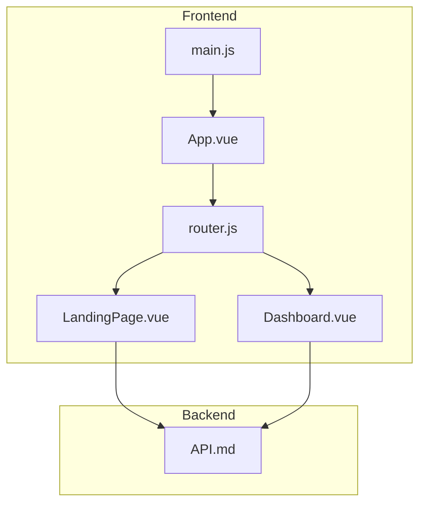
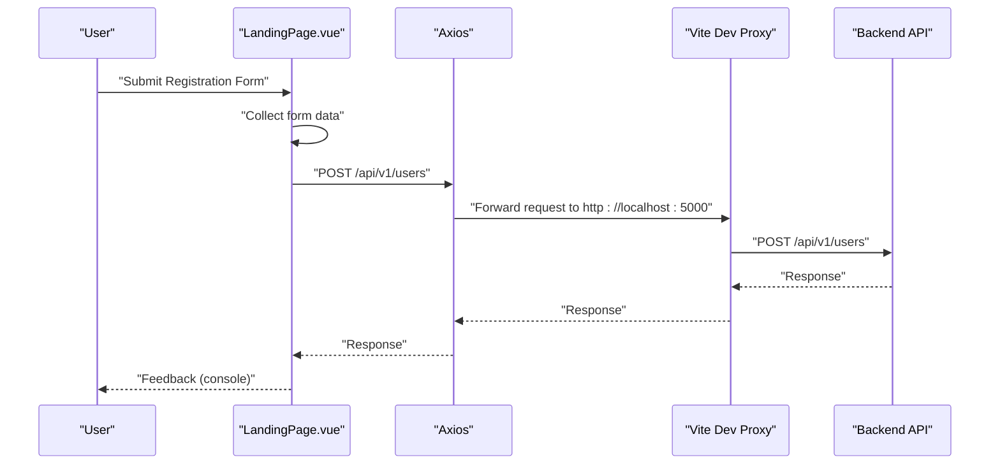
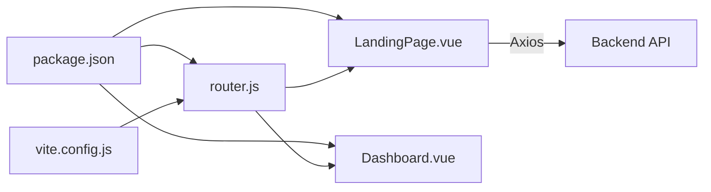

# Component Documentation

<cite>
**Referenced Files in This Document**
- [LandingPage.vue](file://nutricoach/frontend/components/LandingPage.vue)
- [Dashboard.vue](file://nutricoach/frontend/components/Dashboard.vue)
- [App.vue](file://nutricoach/frontend/src/App.vue)
- [main.js](file://nutricoach/frontend/src/main.js)
- [router.js](file://nutricoach/frontend/src/router.js)
- [API.md](file://nutricoach/backend/API.md)
- [package.json](file://nutricoach/frontend/package.json)
- [vite.config.js](file://nutricoach/frontend/vite.config.js)
- [README.md](file://nutricoach/README.md)
</cite>

## Table of Contents
1. [Introduction](#introduction)
2. [Project Structure](#project-structure)
3. [Core Components](#core-components)
4. [Architecture Overview](#architecture-overview)
5. [Detailed Component Analysis](#detailed-component-analysis)
6. [Dependency Analysis](#dependency-analysis)
7. [Performance Considerations](#performance-considerations)
8. [Troubleshooting Guide](#troubleshooting-guide)
9. [Conclusion](#conclusion)

## Introduction
This document provides comprehensive documentation for the frontend components of NutriCoach AI, focusing on the LandingPage.vue and Dashboard.vue components. It explains the template structure, script composition using Vue 3 Options API, data binding, form submission handling, and integration with the backend API. It also covers styling approaches, responsive design, accessibility considerations, and component reusability patterns.

## Project Structure
The frontend is a Vue 3 application configured with Vite and Vue Router. The application mounts the router outlet inside the root App component and exposes two primary routes: the landing page and a dashboard route. The Vite configuration sets up a development proxy to forward API requests to the backend server.

**Diagram sources**
- [App.vue:1-11](file://nutricoach/frontend/src/App.vue#L1-L11)
- [main.js:1-6](file://nutricoach/frontend/src/main.js#L1-L6)
- [router.js:1-14](file://nutricoach/frontend/src/router.js#L1-L14)
- [LandingPage.vue:1-92](file://nutricoach/frontend/components/LandingPage.vue#L1-L92)
- [Dashboard.vue:1-46](file://nutricoach/frontend/components/Dashboard.vue#L1-L46)
- [API.md:1-59](file://nutricoach/backend/API.md#L1-L59)

**Section sources**
- [App.vue:1-11](file://nutricoach/frontend/src/App.vue#L1-L11)
- [main.js:1-6](file://nutricoach/frontend/src/main.js#L1-L6)
- [router.js:1-14](file://nutricoach/frontend/src/router.js#L1-L14)
- [vite.config.js:1-17](file://nutricoach/frontend/vite.config.js#L1-L17)
- [README.md:1-77](file://nutricoach/README.md#L1-L77)

## Core Components
This section documents the two primary components and their roles within the application.

- LandingPage.vue: Provides the initial user onboarding experience with a registration form. It binds form inputs to reactive data, submits user data to the backend, and applies basic styling with responsive adjustments.
- Dashboard.vue: Serves as the main application interface for registered users. It displays a daily meal plan placeholder, a progress tracker area, and navigation links to related pages.

**Section sources**
- [LandingPage.vue:1-92](file://nutricoach/frontend/components/LandingPage.vue#L1-L92)
- [Dashboard.vue:1-46](file://nutricoach/frontend/components/Dashboard.vue#L1-L46)

## Architecture Overview
The frontend integrates with the backend via HTTP requests. During development, Vite proxies API requests from the frontend to the backend server. The LandingPage.vue component posts user data to the backend’s user creation endpoint, while the Dashboard.vue component prepares placeholders for future meal plan and progress tracking features.

**Diagram sources**
- [LandingPage.vue:38-54](file://nutricoach/frontend/components/LandingPage.vue#L38-L54)
- [vite.config.js:9-14](file://nutricoach/frontend/vite.config.js#L9-L14)
- [API.md:6-10](file://nutricoach/backend/API.md#L6-L10)

## Detailed Component Analysis

### LandingPage.vue
LandingPage.vue implements the initial user registration experience. It includes:
- Template structure: A header with navigation links and a hero section containing a form.
- Data binding: Reactive fields for age, weight, and goal selection bound via v-model.
- Form submission: A submit handler that constructs a user payload and posts it to the backend.
- Styling: Basic layout and responsive adjustments for small screens.
- Accessibility: Uses semantic HTML elements and standard input types.

Key implementation aspects:
- Template structure: The form uses native inputs and a select element for goal selection.
- Script composition: Uses Vue 3 Options API with data() and methods{}.
- Event handling: Submits the form via @submit.prevent to prevent page reload.
- Computed properties: Not used in this component.
- Props: None defined.
- State management: Local reactive data managed via data().
- Data fetching patterns: Uses axios to post user data to the backend.
- Integration with backend API: Posts to the user creation endpoint.

Validation and feedback mechanisms:
- Input validation: The component does not implement client-side validation. It relies on backend validation.
- User feedback: Logs success or error to the console.

Responsive design and styling:
- The component defines inline styles for layout and responsiveness, adjusting padding and spacing on smaller screens.

Accessibility considerations:
- Uses standard input types and labels where applicable.
- Navigation uses router-link for SPA-friendly navigation.

Extensibility and reusability:
- The component could be refactored to use the Composition API for improved reactivity and composables.
- Validation logic and feedback could be extracted into reusable utilities.
- The hardcoded user details in the payload should be replaced with dynamic inputs.

**Section sources**
- [LandingPage.vue:1-92](file://nutricoach/frontend/components/LandingPage.vue#L1-L92)
- [API.md:6-10](file://nutricoach/backend/API.md#L6-L10)
- [package.json:10-13](file://nutricoach/frontend/package.json#L10-L13)

### Dashboard.vue
Dashboard.vue provides the main application interface for users. It includes:
- Template structure: A sidebar with navigation links and a main content area displaying a daily meal plan and progress tracker.
- Data binding: Reactive fields for mealPlan and weightData.
- Placeholder content: Displays a preformatted JSON representation of meals and a placeholder for chart data.
- Navigation controls: Links to Home, Preferences, and Plans.

Key implementation aspects:
- Template structure: Uses router-link for navigation and a button to trigger plan generation.
- Script composition: Uses Vue 3 Options API with data() and methods{}.
- Event handling: A click handler for generating a new plan.
- Computed properties: Not used in this component.
- Props: None defined.
- State management: Local reactive data managed via data().
- Data fetching patterns: Methods are placeholders for future API integration.
- Integration with backend API: Methods are placeholders for future API integration.

Styling and responsive design:
- Inline styles define layout and sizing for the sidebar and chart container.

Accessibility considerations:
- Navigation uses router-link for SPA-friendly navigation.
- Content areas use semantic headings.

Extensibility and reusability:
- The component could be refactored to use the Composition API for improved reactivity and composables.
- Chart rendering and data fetching could be extracted into reusable components.
- The placeholder content should be replaced with real data and visualizations.

**Section sources**
- [Dashboard.vue:1-46](file://nutricoach/frontend/components/Dashboard.vue#L1-L46)
- [API.md:16-19](file://nutricoach/backend/API.md#L16-L19)

## Dependency Analysis
The frontend depends on Vue 3, Vue Router, and Axios. Vite manages the development server and proxy configuration. The router maps the root path to the LandingPage component. The LandingPage component uses axios to communicate with the backend API.

**Diagram sources**
- [package.json:10-13](file://nutricoach/frontend/package.json#L10-L13)
- [vite.config.js:1-17](file://nutricoach/frontend/vite.config.js#L1-L17)
- [router.js:1-14](file://nutricoach/frontend/src/router.js#L1-L14)
- [LandingPage.vue:28](file://nutricoach/frontend/components/LandingPage.vue#L28)
- [API.md:1-59](file://nutricoach/backend/API.md#L1-L59)

**Section sources**
- [package.json:10-13](file://nutricoach/frontend/package.json#L10-L13)
- [vite.config.js:1-17](file://nutricoach/frontend/vite.config.js#L1-L17)
- [router.js:1-14](file://nutricoach/frontend/src/router.js#L1-L14)

## Performance Considerations
- Network requests: Minimize unnecessary API calls and implement caching where appropriate.
- Rendering: Prefer lightweight templates and avoid heavy computations in render functions.
- Bundle size: Keep dependencies minimal and leverage tree-shaking.
- Development proxy: Ensure the proxy configuration is correct to avoid failed requests during development.

## Troubleshooting Guide
Common issues and resolutions:
- Backend connectivity: Verify the backend server is running and reachable at the configured host/port.
- API endpoints: Confirm the base URL and endpoint paths match the backend API documentation.
- CORS: Ensure the backend allows cross-origin requests from the frontend origin.
- Form submission: Check the console for errors and confirm the axios request payload matches the backend expectations.
- Routing: Ensure the router is correctly configured and the routes match the intended navigation.

**Section sources**
- [API.md:1-59](file://nutricoach/backend/API.md#L1-L59)
- [vite.config.js:9-14](file://nutricoach/frontend/vite.config.js#L9-L14)
- [LandingPage.vue:38-54](file://nutricoach/frontend/components/LandingPage.vue#L38-L54)

## Conclusion
The LandingPage.vue and Dashboard.vue components provide the foundational UI for NutriCoach AI. They demonstrate basic form handling, routing, and API integration patterns. Future enhancements should focus on client-side validation, user feedback, Composition API adoption, and robust data fetching and visualization for the dashboard.