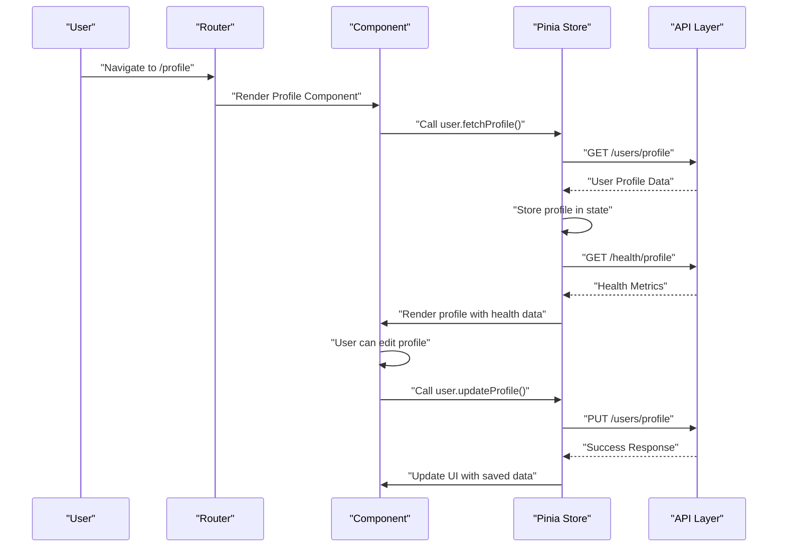
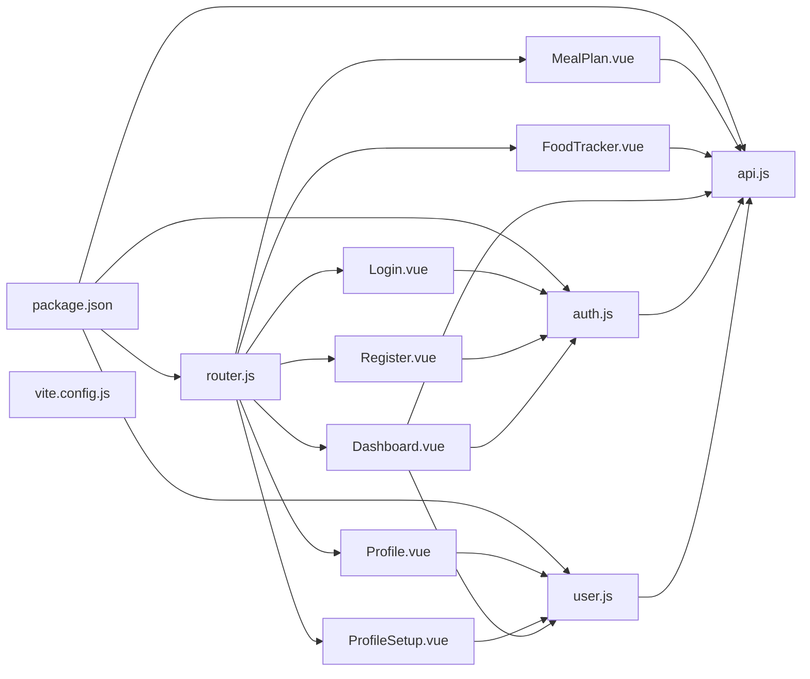

# Component Documentation

<cite>
**Referenced Files in This Document**
- [LandingPage.vue](file://nutricoach/frontend/components/LandingPage.vue)
- [Dashboard.vue](file://nutricoach/frontend/components/Dashboard.vue)
- [Profile.vue](file://nutricoach/frontend/components/Profile.vue)
- [MealPlan.vue](file://nutricoach/frontend/components/MealPlan.vue)
- [ProfileSetup.vue](file://nutricoach/frontend/components/ProfileSetup.vue)
- [FoodTracker.vue](file://nutricoach/frontend/components/FoodTracker.vue)
- [Register.vue](file://nutricoach/frontend/components/Register.vue)
- [Login.vue](file://nutricoach/frontend/components/Login.vue)
- [App.vue](file://nutricoach/frontend/src/App.vue)
- [main.js](file://nutricoach/frontend/src/main.js)
- [router.js](file://nutricoach/frontend/src/router.js)
- [auth.js](file://nutricoach/frontend/src/stores/auth.js)
- [user.js](file://nutricoach/frontend/src/stores/user.js)
- [api.js](file://nutricoach/frontend/src/api.js)
- [API.md](file://nutricoach/backend/API.md)
- [package.json](file://nutricoach/frontend/package.json)
- [vite.config.js](file://nutricoach/frontend/vite.config.js)
- [README.md](file://nutricoach/README.md)
</cite>

## Update Summary
**Changes Made**
- Added comprehensive documentation for the new Profile.vue component with profile management capabilities
- Enhanced Dashboard.vue documentation with export functionality details and improved component integration
- Updated router configuration to include Profile component routing
- Expanded state management documentation to cover Profile component integration

## Table of Contents
1. [Introduction](#introduction)
2. [Project Structure](#project-structure)
3. [Core Components](#core-components)
4. [Architecture Overview](#architecture-overview)
5. [Detailed Component Analysis](#detailed-component-analysis)
6. [State Management with Pinia](#state-management-with-pinia)
7. [Authentication System](#authentication-system)
8. [API Integration Patterns](#api-integration-patterns)
9. [Dependency Analysis](#dependency-analysis)
10. [Performance Considerations](#performance-considerations)
11. [Troubleshooting Guide](#troubleshooting-guide)
12. [Conclusion](#conclusion)

## Introduction
This document provides comprehensive documentation for the complete frontend component ecosystem of NutriCoach AI. The application now features a sophisticated Vue 3 architecture with seven primary components, advanced state management using Pinia, and comprehensive authentication flows. The system includes user registration and login, profile setup, meal planning, food tracking, and a comprehensive dashboard with progress visualization and data export capabilities.

## Project Structure
The frontend is a modern Vue 3 application built with Vite, featuring a complete routing system, state management with Pinia, and comprehensive component architecture. The application follows a modular structure with dedicated components for different functional areas.

```mermaid
graph TB
subgraph "Frontend Architecture"
APP["App.vue"]
MAIN["main.js"]
ROUTER["router.js"]
AUTH_STORE["auth.js (Pinia)"]
USER_STORE["user.js (Pinia)"]
API["api.js (Axios)"]
END
subgraph "Authentication Components"
LOGIN["Login.vue"]
REGISTER["Register.vue"]
END
subgraph "Profile & Setup"
PROFILE["Profile.vue"]
PROFILE_SETUP["ProfileSetup.vue"]
END
subgraph "Main Application"
DASHBOARD["Dashboard.vue"]
MEAL_PLAN["MealPlan.vue"]
FOOD_TRACKER["FoodTracker.vue"]
END
subgraph "Backend Integration"
API_DOC["API.md"]
END
MAIN --> APP
APP --> ROUTER
ROUTER --> LOGIN
ROUTER --> REGISTER
ROUTER --> PROFILE
ROUTER --> PROFILE_SETUP
ROUTER --> DASHBOARD
ROUTER --> MEAL_PLAN
ROUTER --> FOOD_TRACKER
LOGIN --> AUTH_STORE
REGISTER --> AUTH_STORE
PROFILE --> USER_STORE
PROFILE_SETUP --> USER_STORE
DASHBOARD --> AUTH_STORE
DASHBOARD --> USER_STORE
MEAL_PLAN --> API
FOOD_TRACKER --> API
DASHBOARD --> API
AUTH_STORE --> API
USER_STORE --> API
API --> API_DOC
```

**Diagram sources**
- [main.js:1-10](file://nutricoach/frontend/src/main.js#L1-L10)
- [router.js:1-37](file://nutricoach/frontend/src/router.js#L1-L37)
- [auth.js:1-59](file://nutricoach/frontend/src/stores/auth.js#L1-L59)
- [user.js:1-40](file://nutricoach/frontend/src/stores/user.js#L1-L40)
- [api.js:1-33](file://nutricoach/frontend/src/api.js#L1-L33)
- [Login.vue:1-92](file://nutricoach/frontend/components/Login.vue#L1-L92)
- [Register.vue:1-96](file://nutricoach/frontend/components/Register.vue#L1-L96)
- [Profile.vue:1-324](file://nutricoach/frontend/components/Profile.vue#L1-L324)
- [ProfileSetup.vue:1-184](file://nutricoach/frontend/components/ProfileSetup.vue#L1-L184)
- [Dashboard.vue:1-304](file://nutricoach/frontend/components/Dashboard.vue#L1-L304)
- [MealPlan.vue:1-178](file://nutricoach/frontend/components/MealPlan.vue#L1-L178)
- [FoodTracker.vue:1-224](file://nutricoach/frontend/components/FoodTracker.vue#L1-L224)

**Section sources**
- [main.js:1-10](file://nutricoach/frontend/src/main.js#L1-L10)
- [router.js:1-37](file://nutricoach/frontend/src/router.js#L1-L37)
- [vite.config.js:1-17](file://nutricoach/frontend/vite.config.js#L1-L17)
- [README.md:1-77](file://nutricoach/README.md#L1-L77)

## Core Components
The application consists of seven primary components, each serving distinct functional purposes:

### Authentication Components
- **Login.vue**: Handles user authentication with email/password validation and error handling
- **Register.vue**: Manages user registration with form validation and redirect flow

### Profile & Setup Components
- **Profile.vue**: Comprehensive user profile management with view/edit modes and health calculations
- **ProfileSetup.vue**: Comprehensive user profile setup with health metrics calculation and medical condition tracking

### Main Application Components
- **Dashboard.vue**: Advanced analytics dashboard with health statistics, progress tracking, interactive charts, and data export functionality
- **MealPlan.vue**: Personalized meal plan generation with safety warnings and nutritional summaries
- **FoodTracker.vue**: Daily food logging with macronutrient tracking and weight monitoring

**Section sources**
- [Login.vue:1-92](file://nutricoach/frontend/components/Login.vue#L1-L92)
- [Register.vue:1-96](file://nutricoach/frontend/components/Register.vue#L1-L96)
- [Profile.vue:1-324](file://nutricoach/frontend/components/Profile.vue#L1-L324)
- [ProfileSetup.vue:1-184](file://nutricoach/frontend/components/ProfileSetup.vue#L1-L184)
- [Dashboard.vue:1-304](file://nutricoach/frontend/components/Dashboard.vue#L1-L304)
- [MealPlan.vue:1-178](file://nutricoach/frontend/components/MealPlan.vue#L1-L178)
- [FoodTracker.vue:1-224](file://nutricoach/frontend/components/FoodTracker.vue#L1-L224)

## Architecture Overview
The application follows a modern Vue 3 architecture with centralized state management, comprehensive authentication, and RESTful API integration. The system uses Pinia for state management, Vue Router for navigation, and Chart.js for data visualization.



**Diagram sources**
- [router.js:16](file://nutricoach/frontend/src/router.js#L16)
- [Profile.vue:160-177](file://nutricoach/frontend/components/Profile.vue#L160-L177)
- [user.js:12-20](file://nutricoach/frontend/src/stores/user.js#L12-L20)

## Detailed Component Analysis

### Login.vue - Authentication Component
The Login component provides secure user authentication with comprehensive error handling and form validation.

**Template Structure**: Clean card-based layout with form validation and error display
**Script Composition**: Uses Vue 3 Composition API with Pinia store integration
**State Management**: Manages local form state with loading and error states
**Authentication Flow**: Integrates with AuthStore for JWT token management

**Key Features**:
- Email/password validation with HTML5 constraints
- Loading state management during authentication
- Error handling with user-friendly messages
- Automatic redirection after successful login

**Section sources**
- [Login.vue:1-92](file://nutricoach/frontend/components/Login.vue#L1-L92)
- [auth.js:26-35](file://nutricoach/frontend/src/stores/auth.js#L26-L35)

### Register.vue - User Registration Component
Handles user registration with comprehensive form validation and seamless onboarding flow.

**Template Structure**: Minimalist card layout with form validation indicators
**Form Validation**: Client-side validation with HTML5 attributes and server-side error handling
**Onboarding Flow**: Redirects to profile setup after successful registration

**Key Features**:
- Full name, email, and password validation
- Minimum password length enforcement
- Loading states during registration process
- Error message display for user feedback

**Section sources**
- [Register.vue:1-96](file://nutricoach/frontend/components/Register.vue#L1-L96)
- [auth.js:17-24](file://nutricoach/frontend/src/stores/auth.js#L17-L24)

### Profile.vue - Comprehensive Profile Management
Advanced profile management component with view/edit modes, health calculations, and comprehensive user data editing.

**Template Structure**: Dual-mode interface with view-only and editable forms
**State Management**: Manages loading, editing, saving, success, and error states
**Health Integration**: Displays calculated health metrics alongside profile data
**Form Validation**: Comprehensive form validation with real-time health recalculation

**Key Features**:
- View mode with formatted health metrics display
- Edit mode with comprehensive form fields
- Real-time health metric recalculation on profile changes
- Success/error messaging with user feedback
- Mobile-responsive grid layout
- Navigation to profile setup for new users

**Section sources**
- [Profile.vue:1-324](file://nutricoach/frontend/components/Profile.vue#L1-L324)
- [user.js:12-31](file://nutricoach/frontend/src/stores/user.js#L12-L31)

### Dashboard.vue - Advanced Analytics Dashboard
Comprehensive dashboard with health statistics, progress tracking, interactive visualizations, and data export functionality.

**Template Structure**: Responsive grid layout with multiple card-based sections and sidebar navigation
**Chart Integration**: Vue ChartJS integration for weight history visualization
**Progress Tracking**: Circular calorie progress visualization with dynamic coloring
**Data Export**: Built-in functionality to export user data as JSON files
**Real-time Data**: Live health statistics and goal progress tracking

**Key Features**:
- Welcome message with user name and goal display
- Health statistics cards (BMI, BMR, daily target, weight)
- Circular calorie progress with SVG animation and color coding
- Goal progress bar with percentage display
- Interactive weight history chart with Chart.js
- Quick action buttons for navigation and data export
- Responsive design with mobile optimization
- Logout functionality with authentication store integration

**Updated** Enhanced with export functionality that allows users to download their data as JSON files

**Section sources**
- [Dashboard.vue:1-304](file://nutricoach/frontend/components/Dashboard.vue#L1-L304)
- [auth.js:12-14](file://nutricoach/frontend/src/stores/auth.js#L12-L14)

### MealPlan.vue - Personalized Meal Planning
Dynamic meal plan generation with safety warnings and nutritional summaries.

**Template Structure**: Card-based layout with safety warnings and meal grid
**Plan Generation**: Async meal plan generation with loading states
**Nutritional Tracking**: Comprehensive macro-nutrient summaries
**Safety Features**: Medical condition warnings and dietary restrictions

**Key Features**:
- Safety warning banners for medical conditions
- Tailored medical condition badges
- Summary bar with total calories and macros
- Grid-based meal cards with color-coded categories
- Generate new plan functionality
- Empty state handling

**Section sources**
- [MealPlan.vue:1-178](file://nutricoach/frontend/components/MealPlan.vue#L1-L178)

### FoodTracker.vue - Daily Food Logging System
Comprehensive food logging system with macronutrient tracking and weight monitoring.

**Template Structure**: Split layout with logging form and today's log
**Macronutrient Tracking**: Detailed protein, carb, and fat tracking
**Progress Visualization**: Calorie consumption progress bar
**Weight Monitoring**: Integrated weight logging functionality

**Key Features**:
- Food logging form with comprehensive nutrition fields
- Today's meal log with macronutrient breakdown
- Calorie consumption progress visualization
- Weight logging with automatic form clearing
- Responsive two-column layout for desktop, single column for mobile

**Section sources**
- [FoodTracker.vue:1-224](file://nutricoach/frontend/components/FoodTracker.vue#L1-L224)

## State Management with Pinia
The application uses Pinia for centralized state management across all components.

### AuthStore - Authentication State Management
Manages user authentication state, JWT tokens, and user profile data with automatic persistence.

**State Properties**:
- `token`: JWT authentication token stored in localStorage
- `userId`: Currently authenticated user ID
- `name`: User's display name
- `user`: Complete user profile object

**Actions**:
- `register()`: Handles user registration and token storage
- `login()`: Manages user authentication and profile fetching
- `fetchUser()`: Retrieves current user profile from backend
- `logout()`: Clears authentication state and localStorage

### UserStore - User Profile Management
Handles user profile data, health calculations, and dashboard summaries.

**State Properties**:
- `profile`: User's personal information
- `healthProfile`: Calculated health metrics
- `dashboardSummary`: Dashboard analytics data

**Actions**:
- `fetchProfile()`: Retrieves user profile from backend
- `updateProfile()`: Updates user profile with validation
- `calculateHealth()`: Computes BMI, BMR, and target calories
- `fetchHealthProfile()`: Retrieves health metrics
- `fetchDashboardSummary()`: Loads dashboard analytics

**Section sources**
- [auth.js:1-59](file://nutricoach/frontend/src/stores/auth.js#L1-L59)
- [user.js:1-40](file://nutricoach/frontend/src/stores/user.js#L1-L40)

## Authentication System
The application implements a comprehensive authentication system with JWT tokens, automatic token refresh, and protected routes.

### Route Protection
Routes are protected using Vue Router navigation guards that check for authentication tokens in localStorage.

### Token Management
Automatic token injection into API requests and automatic logout on 401 errors.

### Session Persistence
User authentication state persists across browser sessions using localStorage.

**Section sources**
- [router.js:27-34](file://nutricoach/frontend/src/router.js#L27-L34)
- [api.js:11-30](file://nutricoach/frontend/src/api.js#L11-L30)
- [auth.js:48-56](file://nutricoach/frontend/src/stores/auth.js#L48-L56)

## API Integration Patterns
The application uses a centralized API layer with comprehensive error handling and authentication integration.

### API Configuration
- Base URL: `http://localhost:5000/api/v1`
- Content-Type: `application/json`
- Automatic JWT token injection
- 401 error handling with automatic logout

### Request Interceptors
- Token extraction from localStorage
- Authorization header injection
- Automatic authentication for protected routes

### Response Handling
- Automatic 401 error handling
- Error propagation to components
- Promise rejection for error handling

**Section sources**
- [api.js:1-33](file://nutricoach/frontend/src/api.js#L1-L33)
- [API.md:1-59](file://nutricoach/backend/API.md#L1-L59)

## Dependency Analysis
The application has a well-structured dependency graph with clear separation of concerns.



**Diagram sources**
- [package.json:10-13](file://nutricoach/frontend/package.json#L10-L13)
- [router.js:1-37](file://nutricoach/frontend/src/router.js#L1-L37)
- [auth.js:1-59](file://nutricoach/frontend/src/stores/auth.js#L1-L59)
- [user.js:1-40](file://nutricoach/frontend/src/stores/user.js#L1-L40)
- [api.js:1-33](file://nutricoach/frontend/src/api.js#L1-L33)

**Section sources**
- [package.json:10-13](file://nutricoach/frontend/package.json#L10-L13)
- [vite.config.js:1-17](file://nutricoach/frontend/vite.config.js#L1-L17)

## Performance Considerations
- **State Management**: Pinia provides efficient state updates with minimal re-renders
- **Component Lazy Loading**: Consider lazy loading for large components like the dashboard
- **Chart Optimization**: Chart.js components should be optimized for performance with large datasets
- **API Caching**: Implement caching strategies for frequently accessed data like health profiles
- **Bundle Size**: Monitor bundle size as new components are added
- **Network Requests**: Implement request deduplication and caching for repeated API calls
- **Export Functionality**: Data export should handle large datasets efficiently with progress indication

## Troubleshooting Guide
Common issues and resolutions:

### Authentication Issues
- **Token Expiration**: Check localStorage for expired tokens and implement automatic refresh
- **Route Protection**: Verify `requiresAuth` meta tags and navigation guard implementation
- **401 Errors**: Ensure API interceptor handles 401 responses and redirects to login

### Component Issues
- **Dashboard Charts**: Verify Chart.js installation and proper component registration
- **Form Validation**: Check v-model bindings and validation rules for all forms
- **API Integration**: Confirm API endpoints match backend documentation
- **Profile Component**: Verify user store integration and health calculation updates

### State Management Issues
- **Pinia Stores**: Verify store registration in main.js and proper store usage
- **Local Storage**: Check for localStorage availability and proper token storage
- **Store Persistence**: Ensure state persists across page reloads

### Export Functionality Issues
- **File Download**: Verify Blob API support and download mechanism
- **Data Formatting**: Ensure exported JSON is properly formatted and validated
- **Error Handling**: Check export error handling and user feedback

**Section sources**
- [auth.js:48-56](file://nutricoach/frontend/src/stores/auth.js#L48-L56)
- [api.js:20-30](file://nutricoach/frontend/src/api.js#L20-L30)
- [router.js:27-34](file://nutricoach/frontend/src/router.js#L27-L34)
- [Profile.vue:189-214](file://nutricoach/frontend/components/Profile.vue#L189-L214)
- [Dashboard.vue:187-207](file://nutricoach/frontend/components/Dashboard.vue#L187-L207)

## Conclusion
The NutriCoach AI frontend represents a comprehensive Vue 3 application with advanced features including authentication, state management, data visualization, and data export capabilities. The addition of the Profile.vue component and enhanced Dashboard.vue functionality creates a complete health and nutrition tracking ecosystem. The architecture demonstrates best practices in component organization, state management with Pinia, and API integration patterns. The new export functionality provides users with the ability to download their data for backup or transfer purposes. Future enhancements should focus on performance optimization, comprehensive testing, and expanding the feature set based on user feedback.