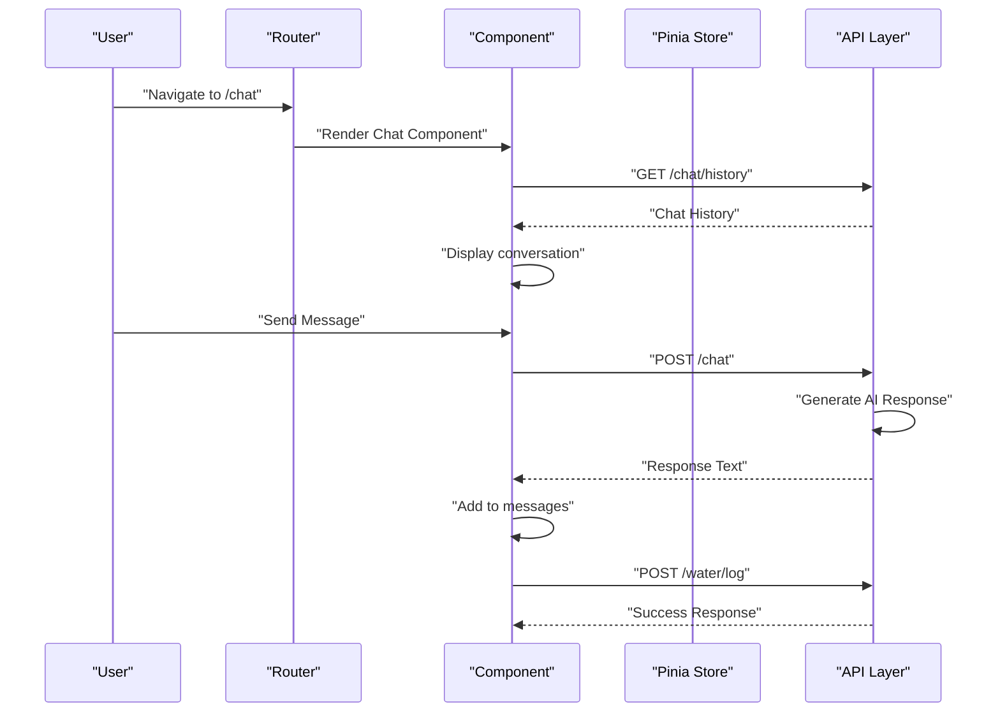
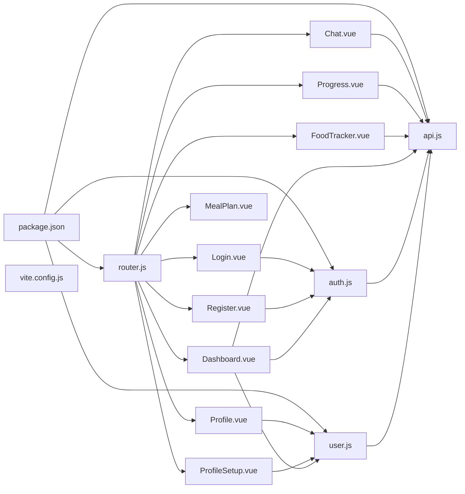

# Component Documentation

<cite>
**Referenced Files in This Document**
- [Chat.vue](file://nutricoach/frontend/components/Chat.vue)
- [Progress.vue](file://nutricoach/frontend/components/Progress.vue)
- [Dashboard.vue](file://nutricoach/frontend/components/Dashboard.vue)
- [FoodTracker.vue](file://nutricoach/frontend/components/FoodTracker.vue)
- [LandingPage.vue](file://nutricoach/frontend/components/LandingPage.vue)
- [Profile.vue](file://nutricoach/frontend/components/Profile.vue)
- [MealPlan.vue](file://nutricoach/frontend/components/MealPlan.vue)
- [ProfileSetup.vue](file://nutricoach/frontend/components/ProfileSetup.vue)
- [Register.vue](file://nutricoach/frontend/components/Register.vue)
- [Login.vue](file://nutricoach/frontend/components/Login.vue)
- [App.vue](file://nutricoach/frontend/src/App.vue)
- [main.js](file://nutricoach/frontend/src/main.js)
- [router.js](file://nutricoach/frontend/src/router.js)
- [auth.js](file://nutricoach/frontend/src/stores/auth.js)
- [user.js](file://nutricoach/frontend/src/stores/user.js)
- [api.js](file://nutricoach/frontend/src/api.js)
- [API.md](file://nutricoach/backend/API.md)
- [app.py](file://nutricoach/backend/app.py)
- [schema.sql](file://nutricoach/backend/schema.sql)
- [package.json](file://nutricoach/frontend/package.json)
- [vite.config.js](file://nutricoach/frontend/vite.config.js)
- [README.md](file://nutricoach/README.md)
</cite>

## Update Summary
**Changes Made**
- Added comprehensive documentation for new AI Nutrition Coach Chat component with real-time messaging and AI response generation
- Documented Progress Tracking component with weight history visualization and goal progress monitoring
- Enhanced Dashboard component documentation with water intake tracking integration and new navigation links
- Updated FoodTracker component documentation with integrated weight logging functionality
- Expanded backend API documentation to include new water intake, chat, and weight tracking endpoints
- Updated router configuration documentation to include new component routing

## Table of Contents
1. [Introduction](#introduction)
2. [Project Structure](#project-structure)
3. [Core Components](#core-components)
4. [Architecture Overview](#architecture-overview)
5. [Detailed Component Analysis](#detailed-component-analysis)
6. [State Management with Pinia](#state-management-with-pinia)
7. [Authentication System](#authentication-system)
8. [API Integration Patterns](#api-integration-patterns)
9. [Backend API Endpoints](#backend-api-endpoints)
10. [Dependency Analysis](#dependency-analysis)
11. [Performance Considerations](#performance-considerations)
12. [Troubleshooting Guide](#troubleshooting-guide)
13. [Conclusion](#conclusion)

## Introduction
This document provides comprehensive documentation for the complete frontend component ecosystem of NutriCoach AI. The application now features a sophisticated Vue 3 architecture with nine primary components, advanced state management using Pinia, and comprehensive authentication flows. The system includes user registration and login, profile setup, meal planning, food tracking, progress monitoring, AI-powered nutrition coaching, and a comprehensive dashboard with water intake tracking and data visualization capabilities.

## Project Structure
The frontend is a modern Vue 3 application built with Vite, featuring a complete routing system, state management with Pinia, and comprehensive component architecture. The application follows a modular structure with dedicated components for different functional areas, now enhanced with AI chat capabilities and comprehensive progress tracking.

```mermaid
graph TB
subgraph "Frontend Architecture"
APP["App.vue"]
MAIN["main.js"]
ROUTER["router.js"]
AUTH_STORE["auth.js (Pinia)"]
USER_STORE["user.js (Pinia)"]
API["api.js (Axios)"]
END
subgraph "Authentication Components"
LOGIN["Login.vue"]
REGISTER["Register.vue"]
END
subgraph "Profile & Setup"
PROFILE["Profile.vue"]
PROFILE_SETUP["ProfileSetup.vue"]
END
subgraph "Main Application"
DASHBOARD["Dashboard.vue"]
MEAL_PLAN["MealPlan.vue"]
FOOD_TRACKER["FoodTracker.vue"]
CHAT["Chat.vue"]
PROGRESS["Progress.vue"]
END
subgraph "Backend Integration"
API_DOC["API.md"]
BACKEND_APP["app.py"]
SCHEMA["schema.sql"]
END
MAIN --> APP
APP --> ROUTER
ROUTER --> LOGIN
ROUTER --> REGISTER
ROUTER --> PROFILE
ROUTER --> PROFILE_SETUP
ROUTER --> DASHBOARD
ROUTER --> MEAL_PLAN
ROUTER --> FOOD_TRACKER
ROUTER --> CHAT
ROUTER --> PROGRESS
LOGIN --> AUTH_STORE
REGISTER --> AUTH_STORE
PROFILE --> USER_STORE
PROFILE_SETUP --> USER_STORE
DASHBOARD --> AUTH_STORE
DASHBOARD --> USER_STORE
CHAT --> API
PROGRESS --> API
FOOD_TRACKER --> API
DASHBOARD --> API
AUTH_STORE --> API
USER_STORE --> API
API --> API_DOC
API_DOC --> BACKEND_APP
BACKEND_APP --> SCHEMA
```

**Diagram sources**
- [main.js:1-10](file://nutricoach/frontend/src/main.js#L1-L10)
- [router.js:1-41](file://nutricoach/frontend/src/router.js#L1-L41)
- [auth.js:1-59](file://nutricoach/frontend/src/stores/auth.js#L1-L59)
- [user.js:1-40](file://nutricoach/frontend/src/stores/user.js#L1-L40)
- [api.js:1-33](file://nutricoach/frontend/src/api.js#L1-L33)
- [Login.vue:1-92](file://nutricoach/frontend/components/Login.vue#L1-L92)
- [Register.vue:1-96](file://nutricoach/frontend/components/Register.vue#L1-L96)
- [Profile.vue:1-324](file://nutricoach/frontend/components/Profile.vue#L1-L324)
- [ProfileSetup.vue:1-184](file://nutricoach/frontend/components/ProfileSetup.vue#L1-L184)
- [Dashboard.vue:1-356](file://nutricoach/frontend/components/Dashboard.vue#L1-L356)
- [MealPlan.vue:1-178](file://nutricoach/frontend/components/MealPlan.vue#L1-L178)
- [FoodTracker.vue:1-290](file://nutricoach/frontend/components/FoodTracker.vue#L1-L290)
- [Chat.vue:1-197](file://nutricoach/frontend/components/Chat.vue#L1-L197)
- [Progress.vue:1-208](file://nutricoach/frontend/components/Progress.vue#L1-L208)

**Section sources**
- [main.js:1-10](file://nutricoach/frontend/src/main.js#L1-L10)
- [router.js:1-41](file://nutricoach/frontend/src/router.js#L1-L41)
- [vite.config.js:1-17](file://nutricoach/frontend/vite.config.js#L1-L17)
- [README.md:1-77](file://nutricoach/README.md#L1-L77)

## Core Components
The application consists of nine primary components, each serving distinct functional purposes with enhanced capabilities:

### Authentication Components
- **Login.vue**: Handles user authentication with email/password validation and error handling
- **Register.vue**: Manages user registration with form validation and redirect flow

### Profile & Setup Components
- **Profile.vue**: Comprehensive user profile management with view/edit modes and health calculations
- **ProfileSetup.vue**: Comprehensive user profile setup with health metrics calculation and medical condition tracking

### Main Application Components
- **Dashboard.vue**: Advanced analytics dashboard with health statistics, progress tracking, interactive charts, water intake tracking, and navigation controls
- **MealPlan.vue**: Personalized meal plan generation with safety warnings and nutritional summaries
- **FoodTracker.vue**: Enhanced daily food logging with macronutrient tracking, weight monitoring, and water intake integration

### AI & Progress Components
- **Chat.vue**: AI-powered nutrition coach with real-time messaging, conversation history, and intelligent responses
- **Progress.vue**: Comprehensive progress tracking with weight history visualization, goal progress monitoring, and trend analysis

**Section sources**
- [Login.vue:1-92](file://nutricoach/frontend/components/Login.vue#L1-L92)
- [Register.vue:1-96](file://nutricoach/frontend/components/Register.vue#L1-L96)
- [Profile.vue:1-324](file://nutricoach/frontend/components/Profile.vue#L1-L324)
- [ProfileSetup.vue:1-184](file://nutricoach/frontend/components/ProfileSetup.vue#L1-L184)
- [Dashboard.vue:1-356](file://nutricoach/frontend/components/Dashboard.vue#L1-L356)
- [MealPlan.vue:1-178](file://nutricoach/frontend/components/MealPlan.vue#L1-L178)
- [FoodTracker.vue:1-290](file://nutricoach/frontend/components/FoodTracker.vue#L1-L290)
- [Chat.vue:1-197](file://nutricoach/frontend/components/Chat.vue#L1-L197)
- [Progress.vue:1-208](file://nutricoach/frontend/components/Progress.vue#L1-L208)

## Architecture Overview
The application follows a modern Vue 3 architecture with centralized state management, comprehensive authentication, and RESTful API integration. The system uses Pinia for state management, Vue Router for navigation, and Chart.js for data visualization. The architecture now includes AI chat capabilities and comprehensive progress tracking with water intake monitoring.



**Diagram sources**
- [router.js:22](file://nutricoach/frontend/src/router.js#L22)
- [Chat.vue:79-107](file://nutricoach/frontend/components/Chat.vue#L79-L107)
- [app.py:616-651](file://nutricoach/backend/app.py#L616-L651)

## Detailed Component Analysis

### Chat.vue - AI Nutrition Coach Component
The Chat component provides an intelligent AI-powered nutrition coaching experience with real-time messaging, conversation history, and contextual responses based on user profiles.

**Template Structure**: Modern chat interface with message bubbles, typing indicators, and responsive design
**Script Composition**: Uses Vue 2 Options API with comprehensive message handling and API integration
**State Management**: Manages messages array, input state, sending/loading states, and typing indicators
**AI Integration**: Connects to backend chat API with intelligent response generation based on user profiles

**Key Features**:
- Real-time chat interface with user and AI message differentiation
- Conversation history loading and display
- Typing indicators during AI response generation
- Intelligent responses based on user profile, health metrics, and common nutrition queries
- Auto-scrolling to latest messages
- Responsive design for mobile and desktop

**Updated** Enhanced with comprehensive AI response generation including calorie calculations, protein recommendations, hydration advice, BMI interpretation, and personalized meal suggestions

**Section sources**
- [Chat.vue:1-197](file://nutricoach/frontend/components/Chat.vue#L1-L197)
- [app.py:546-613](file://nutricoach/backend/app.py#L546-L613)

### Progress.vue - Comprehensive Progress Tracking Component
Advanced progress tracking component with weight history visualization, goal progress monitoring, and trend analysis capabilities.

**Template Structure**: Multi-card layout with summary statistics, interactive charts, and detailed history tables
**Chart Integration**: Vue ChartJS integration for weight trend visualization with custom styling
**Data Processing**: Comprehensive weight change calculations and trend analysis
**Visualization**: Custom chart styling with gradient fills, smooth curves, and responsive design

**Key Features**:
- Summary statistics cards for starting weight, current weight, weight change, and goal progress
- Interactive weight trend chart with Chart.js integration
- Detailed weight history table with change calculations
- Responsive grid layout for optimal viewing on all devices
- Empty state handling for new users
- Real-time goal progress calculation from dashboard summary

**Section sources**
- [Progress.vue:1-208](file://nutricoach/frontend/components/Progress.vue#L1-L208)
- [app.py:439-450](file://nutricoach/backend/app.py#L439-L450)

### Dashboard.vue - Enhanced Analytics Dashboard
Comprehensive dashboard with health statistics, progress tracking, interactive visualizations, water intake monitoring, and navigation controls.

**Template Structure**: Responsive sidebar navigation with main content area containing health cards, charts, and quick actions
**Chart Integration**: Vue ChartJS integration for weekly progress visualization
**Water Tracking**: Integrated water intake monitoring with quick-add functionality
**Navigation Enhancement**: Added AI Coach and Progress tracking navigation links
**Real-time Data**: Live health statistics, goal progress tracking, and water intake updates

**Key Features**:
- Welcome message with user name and goal display
- Health statistics cards (BMI, BMR, daily target, weight)
- Water intake card with progress tracking and quick-add buttons (+250ml, +500ml)
- Circular calorie progress with SVG animation and color coding
- Goal progress bar with percentage display
- Interactive weekly progress chart with Chart.js
- Quick action buttons for navigation to all major features
- Responsive design with mobile optimization
- Logout functionality with authentication store integration

**Updated** Enhanced with water intake tracking integration including API endpoints for water logging and daily totals, plus new navigation links for AI Coach and Progress tracking

**Section sources**
- [Dashboard.vue:1-356](file://nutricoach/frontend/components/Dashboard.vue#L1-L356)
- [app.py:513-541](file://nutricoach/backend/app.py#L513-L541)

### FoodTracker.vue - Enhanced Daily Food Logging System
Comprehensive food logging system with macronutrient tracking, weight monitoring, and integrated water intake functionality.

**Template Structure**: Multi-section layout with meal logging form, today's summary, meal cards, and weight logging section
**Macronutrient Tracking**: Detailed protein, carb, and fat tracking with real-time calculations
**Progress Visualization**: Calorie consumption progress bar with dynamic updates
**Weight Integration**: Integrated weight logging functionality with separate form
**Water Tracking**: Enhanced with water intake logging capabilities

**Key Features**:
- Comprehensive meal logging form with name, type, and macronutrient inputs
- Today's meal summary with calorie and macronutrient totals
- Color-coded meal cards with type-specific styling
- Real-time progress calculations for all macronutrients
- Separate weight logging form with validation
- Responsive two-column layout for desktop, single column for mobile
- Form validation and error handling
- Automatic data refresh after logging

**Updated** Enhanced with integrated weight logging functionality and improved form validation

**Section sources**
- [FoodTracker.vue:1-290](file://nutricoach/frontend/components/FoodTracker.vue#L1-L290)
- [app.py:417-436](file://nutricoach/backend/app.py#L417-L436)

### Login.vue - Authentication Component
The Login component provides secure user authentication with comprehensive error handling and form validation.

**Template Structure**: Clean card-based layout with form validation and error display
**Script Composition**: Uses Vue 3 Composition API with Pinia store integration
**State Management**: Manages local form state with loading and error states
**Authentication Flow**: Integrates with AuthStore for JWT token management

**Key Features**:
- Email/password validation with HTML5 constraints
- Loading state management during authentication
- Error handling with user-friendly messages
- Automatic redirection after successful login

**Section sources**
- [Login.vue:1-92](file://nutricoach/frontend/components/Login.vue#L1-L92)
- [auth.js:26-35](file://nutricoach/frontend/src/stores/auth.js#L26-L35)

### Register.vue - User Registration Component
Handles user registration with comprehensive form validation and seamless onboarding flow.

**Template Structure**: Minimalist card layout with form validation indicators
**Form Validation**: Client-side validation with HTML5 attributes and server-side error handling
**Onboarding Flow**: Redirects to profile setup after successful registration

**Key Features**:
- Full name, email, and password validation
- Minimum password length enforcement
- Loading states during registration process
- Error message display for user feedback

**Section sources**
- [Register.vue:1-96](file://nutricoach/frontend/components/Register.vue#L1-L96)
- [auth.js:17-24](file://nutricoach/frontend/src/stores/auth.js#L17-L24)

### Profile.vue - Comprehensive Profile Management
Advanced profile management component with view/edit modes, health calculations, and comprehensive user data editing.

**Template Structure**: Dual-mode interface with view-only and editable forms
**State Management**: Manages loading, editing, saving, success, and error states
**Health Integration**: Displays calculated health metrics alongside profile data
**Form Validation**: Comprehensive form validation with real-time health recalculation

**Key Features**:
- View mode with formatted health metrics display
- Edit mode with comprehensive form fields
- Real-time health metric recalculation on profile changes
- Success/error messaging with user feedback
- Mobile-responsive grid layout
- Navigation to profile setup for new users

**Section sources**
- [Profile.vue:1-324](file://nutricoach/frontend/components/Profile.vue#L1-L324)
- [user.js:12-31](file://nutricoach/frontend/src/stores/user.js#L12-L31)

### MealPlan.vue - Personalized Meal Planning
Dynamic meal plan generation with safety warnings and nutritional summaries.

**Template Structure**: Card-based layout with safety warnings and meal grid
**Plan Generation**: Async meal plan generation with loading states
**Nutritional Tracking**: Comprehensive macro-nutrient summaries
**Safety Features**: Medical condition warnings and dietary restrictions

**Key Features**:
- Safety warning banners for medical conditions
- Tailored medical condition badges
- Summary bar with total calories and macros
- Grid-based meal cards with color-coded categories
- Generate new plan functionality
- Empty state handling

**Section sources**
- [MealPlan.vue:1-178](file://nutricoach/frontend/components/MealPlan.vue#L1-L178)

## State Management with Pinia
The application uses Pinia for centralized state management across all components.

### AuthStore - Authentication State Management
Manages user authentication state, JWT tokens, and user profile data with automatic persistence.

**State Properties**:
- `token`: JWT authentication token stored in localStorage
- `userId`: Currently authenticated user ID
- `name`: User's display name
- `user`: Complete user profile object

**Actions**:
- `register()`: Handles user registration and token storage
- `login()`: Manages user authentication and profile fetching
- `fetchUser()`: Retrieves current user profile from backend
- `logout()`: Clears authentication state and localStorage

### UserStore - User Profile Management
Handles user profile data, health calculations, and dashboard summaries.

**State Properties**:
- `profile`: User's personal information
- `healthProfile`: Calculated health metrics
- `dashboardSummary`: Dashboard analytics data

**Actions**:
- `fetchProfile()`: Retrieves user profile from backend
- `updateProfile()`: Updates user profile with validation
- `calculateHealth()`: Computes BMI, BMR, and target calories
- `fetchHealthProfile()`: Retrieves health metrics
- `fetchDashboardSummary()`: Loads dashboard analytics

**Section sources**
- [auth.js:1-59](file://nutricoach/frontend/src/stores/auth.js#L1-L59)
- [user.js:1-40](file://nutricoach/frontend/src/stores/user.js#L1-L40)

## Authentication System
The application implements a comprehensive authentication system with JWT tokens, automatic token refresh, and protected routes.

### Route Protection
Routes are protected using Vue Router navigation guards that check for authentication tokens in localStorage.

### Token Management
Automatic token injection into API requests and automatic logout on 401 errors.

### Session Persistence
User authentication state persists across browser sessions using localStorage.

**Section sources**
- [router.js:31-38](file://nutricoach/frontend/src/router.js#L31-L38)
- [api.js:11-30](file://nutricoach/frontend/src/api.js#L11-L30)
- [auth.js:48-56](file://nutricoach/frontend/src/stores/auth.js#L48-L56)

## API Integration Patterns
The application uses a centralized API layer with comprehensive error handling and authentication integration.

### API Configuration
- Base URL: `http://localhost:5000/api/v1`
- Content-Type: `application/json`
- Automatic JWT token injection
- 401 error handling with automatic logout

### Request Interceptors
- Token extraction from localStorage
- Authorization header injection
- Automatic authentication for protected routes

### Response Handling
- Automatic 401 error handling
- Error propagation to components
- Promise rejection for error handling

**Section sources**
- [api.js:1-33](file://nutricoach/frontend/src/api.js#L1-L33)

## Backend API Endpoints
The backend provides comprehensive API endpoints supporting all frontend functionality including water intake tracking, AI chat capabilities, and progress monitoring.

### Authentication & User Management
- **POST** `/auth/register` - Register a new user
- **POST** `/auth/login` - Authenticate and return a token
- **POST** `/users` - Create a new user (legacy endpoint)
- **GET** `/users/{user_id}` - Retrieve user details
- **PUT** `/users/{user_id}` - Update user details
- **DELETE** `/users/{user_id}` - Delete a user

### Diet & Meal Management
- **POST** `/diet-preferences` - Set or update diet preferences for a user
- **GET** `/diet-preferences/{user_id}` - Get diet preferences for a user
- **POST** `/meal-plans` - Generate and save a personalized meal plan
- **GET** `/meal-plans/{user_id}` - Retrieve the latest meal plan for a user
- **GET** `/meal-plans/{user_id}/history` - Retrieve meal plan history
- **POST** `/meals/log` - Log a meal entry
- **GET** `/meals/today` - Retrieve today's meals

### Water Intake Tracking
- **POST** `/water/log` - Log water intake for the day
- **GET** `/water/today` - Get total water intake for today

### Weight Tracking
- **POST** `/weight/log` - Log weight entry
- **GET** `/weight/history` - Retrieve weight history

### AI Chat System
- **POST** `/chat` - Send message to AI coach and receive response
- **GET** `/chat/history` - Retrieve chat conversation history

### Dashboard Integration
- **GET** `/dashboard/summary` - Get comprehensive dashboard summary

**Section sources**
- [API.md:1-59](file://nutricoach/backend/API.md#L1-L59)
- [app.py:417-663](file://nutricoach/backend/app.py#L417-L663)

## Dependency Analysis
The application has a well-structured dependency graph with clear separation of concerns and enhanced functionality.



**Diagram sources**
- [package.json:10-13](file://nutricoach/frontend/package.json#L10-L13)
- [router.js:1-41](file://nutricoach/frontend/src/router.js#L1-L41)
- [auth.js:1-59](file://nutricoach/frontend/src/stores/auth.js#L1-L59)
- [user.js:1-40](file://nutricoach/frontend/src/stores/user.js#L1-L40)
- [api.js:1-33](file://nutricoach/frontend/src/api.js#L1-L33)

**Section sources**
- [package.json:10-13](file://nutricoach/frontend/package.json#L10-L13)
- [vite.config.js:1-17](file://nutricoach/frontend/vite.config.js#L1-L17)

## Performance Considerations
- **State Management**: Pinia provides efficient state updates with minimal re-renders
- **Component Lazy Loading**: Consider lazy loading for large components like the dashboard and chat
- **Chart Optimization**: Chart.js components should be optimized for performance with large datasets
- **API Caching**: Implement caching strategies for frequently accessed data like health profiles and chat history
- **Bundle Size**: Monitor bundle size as new components are added, especially Chart.js and Vue ChartJS dependencies
- **Network Requests**: Implement request deduplication and caching for repeated API calls
- **Water Intake Tracking**: Optimize water logging operations to minimize database writes
- **AI Response Caching**: Consider caching common AI responses to reduce server load
- **Mobile Performance**: Ensure responsive design optimizations for mobile devices with limited resources

## Troubleshooting Guide
Common issues and resolutions:

### Authentication Issues
- **Token Expiration**: Check localStorage for expired tokens and implement automatic refresh
- **Route Protection**: Verify `requiresAuth` meta tags and navigation guard implementation
- **401 Errors**: Ensure API interceptor handles 401 responses and redirects to login

### Component Issues
- **Dashboard Charts**: Verify Chart.js installation and proper component registration
- **Form Validation**: Check v-model bindings and validation rules for all forms
- **API Integration**: Confirm API endpoints match backend documentation
- **Profile Component**: Verify user store integration and health calculation updates
- **Chat Component**: Verify WebSocket connections and message handling
- **Progress Component**: Check Chart.js initialization and data formatting

### State Management Issues
- **Pinia Stores**: Verify store registration in main.js and proper store usage
- **Local Storage**: Check for localStorage availability and proper token storage
- **Store Persistence**: Ensure state persists across page reloads

### New Feature Issues
- **Water Intake**: Verify water logging endpoints and daily totals calculation
- **AI Chat**: Check chat API connectivity and response generation logic
- **Progress Tracking**: Ensure weight history endpoints and chart rendering work correctly
- **Dashboard Integration**: Verify water intake display and quick-add functionality

### API Integration Issues
- **Endpoint Mismatches**: Verify frontend API calls match backend endpoint definitions
- **Data Format**: Check data structures returned by backend APIs match frontend expectations
- **Error Handling**: Ensure proper error handling for network failures and API errors

**Section sources**
- [auth.js:48-56](file://nutricoach/frontend/src/stores/auth.js#L48-L56)
- [api.js:20-30](file://nutricoach/frontend/src/api.js#L20-L30)
- [router.js:31-38](file://nutricoach/frontend/src/router.js#L31-L38)
- [Chat.vue:79-107](file://nutricoach/frontend/components/Chat.vue#L79-L107)
- [Progress.vue:117-138](file://nutricoach/frontend/components/Progress.vue#L117-L138)
- [Dashboard.vue:178-202](file://nutricoach/frontend/components/Dashboard.vue#L178-L202)

## Conclusion
The NutriCoach AI frontend represents a comprehensive Vue 3 application with advanced features including authentication, state management, data visualization, AI-powered nutrition coaching, and comprehensive progress tracking. The addition of the Chat.vue and Progress.vue components, along with enhanced Dashboard and FoodTracker components featuring water intake tracking, creates a complete health and nutrition tracking ecosystem. The architecture demonstrates best practices in component organization, state management with Pinia, and API integration patterns. The new AI chat functionality provides intelligent nutrition advice and personalized recommendations, while the progress tracking component offers comprehensive weight monitoring and trend analysis. The water intake tracking integration enhances the overall wellness monitoring capabilities. Future enhancements should focus on performance optimization, comprehensive testing, expanding the AI chat capabilities, and enhancing the user experience based on user feedback.