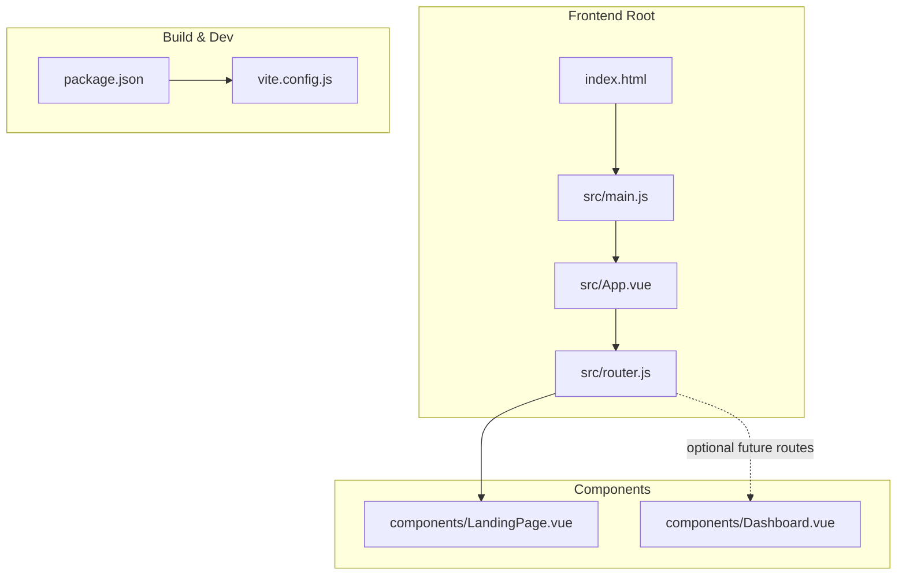
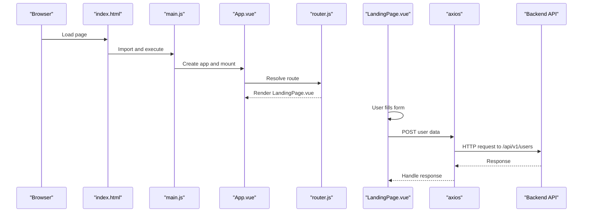
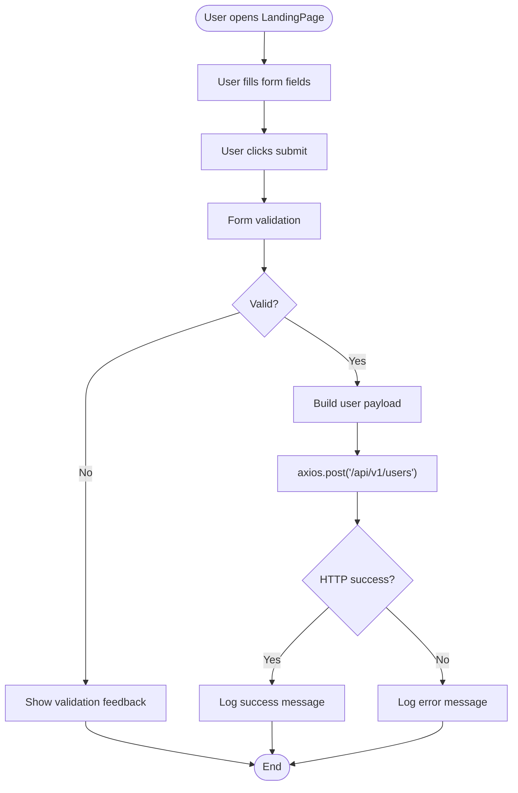
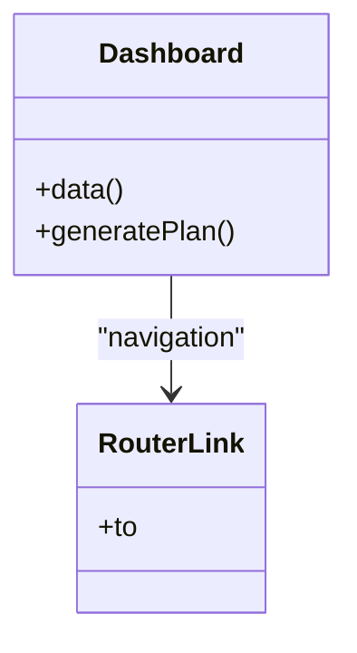
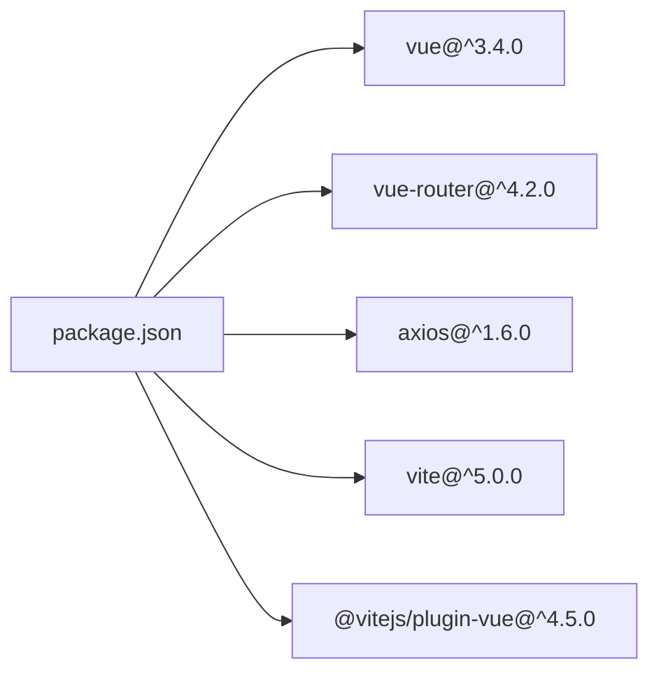

# Frontend Application

<cite>
**Referenced Files in This Document**
- [main.js](file://nutricoach/frontend/src/main.js)
- [App.vue](file://nutricoach/frontend/src/App.vue)
- [router.js](file://nutricoach/frontend/src/router.js)
- [LandingPage.vue](file://nutricoach/frontend/components/LandingPage.vue)
- [Dashboard.vue](file://nutricoach/frontend/components/Dashboard.vue)
- [package.json](file://nutricoach/frontend/package.json)
- [vite.config.js](file://nutricoach/frontend/vite.config.js)
- [index.html](file://nutricoach/frontend/index.html)
- [README.md](file://nutricoach/README.md)
- [API.md](file://nutricoach/backend/API.md)
</cite>

## Table of Contents
1. [Introduction](#introduction)
2. [Project Structure](#project-structure)
3. [Core Components](#core-components)
4. [Architecture Overview](#architecture-overview)
5. [Detailed Component Analysis](#detailed-component-analysis)
6. [Dependency Analysis](#dependency-analysis)
7. [Performance Considerations](#performance-considerations)
8. [Troubleshooting Guide](#troubleshooting-guide)
9. [Conclusion](#conclusion)
10. [Appendices](#appendices)

## Introduction
This document describes the frontend application for NutriCoach AI, a Vue.js Single Page Application (SPA) that provides user registration and a dashboard for personalized diet plans. It covers the application bootstrap process, routing configuration, component architecture, state management patterns, styling and responsiveness, and the Vite build and development workflow. It also outlines extension guidelines and best practices for maintaining consistency.

## Project Structure
The frontend is organized around a minimal SPA structure:
- Application bootstrap and mounting occur in main.js.
- The root App component renders the active route via router-view.
- Routing is configured in router.js with a single route pointing to LandingPage.vue.
- Two primary components exist: LandingPage.vue for user registration and Dashboard.vue for the main application interface.
- Build and development are configured via Vite with a local proxy for the backend API.

**Diagram sources**
- [index.html:1-14](file://nutricoach/frontend/index.html#L1-L14)
- [main.js:1-6](file://nutricoach/frontend/src/main.js#L1-L6)
- [App.vue:1-11](file://nutricoach/frontend/src/App.vue#L1-L11)
- [router.js:1-14](file://nutricoach/frontend/src/router.js#L1-L14)
- [LandingPage.vue:1-92](file://nutricoach/frontend/components/LandingPage.vue#L1-L92)
- [Dashboard.vue:1-46](file://nutricoach/frontend/components/Dashboard.vue#L1-L46)
- [package.json:1-19](file://nutricoach/frontend/package.json#L1-L19)
- [vite.config.js:1-17](file://nutricoach/frontend/vite.config.js#L1-L17)

**Section sources**
- [index.html:1-14](file://nutricoach/frontend/index.html#L1-L14)
- [main.js:1-6](file://nutricoach/frontend/src/main.js#L1-L6)
- [App.vue:1-11](file://nutricoach/frontend/src/App.vue#L1-L11)
- [router.js:1-14](file://nutricoach/frontend/src/router.js#L1-L14)
- [package.json:1-19](file://nutricoach/frontend/package.json#L1-L19)
- [vite.config.js:1-17](file://nutricoach/frontend/vite.config.js#L1-L17)

## Core Components
- Application Bootstrap (main.js): Creates the Vue app instance, installs the router, and mounts to the DOM element with id app.
- Root Component (App.vue): Provides the top-level container and renders the active route outlet.
- Router (router.js): Defines the client-side routing with a single route mapping the root path to LandingPage.vue.
- LandingPage.vue: Presents a hero section with a registration form, two-way data binding, and submission handling via axios to the backend API.
- Dashboard.vue: Provides a layout with sidebar navigation and placeholders for a daily meal plan and progress tracker.

Key implementation patterns:
- Composition: Components are self-contained with template, script, and style sections.
- Reactive Data: Uses Vue 3 reactivity via data() and computed updates via v-model.
- Event Handling: Submits forms on user action and handles click events for UI actions.
- Styling: Inline styles scoped to component classes with basic responsive adjustments.

**Section sources**
- [main.js:1-6](file://nutricoach/frontend/src/main.js#L1-L6)
- [App.vue:1-11](file://nutricoach/frontend/src/App.vue#L1-L11)
- [router.js:1-14](file://nutricoach/frontend/src/router.js#L1-L14)
- [LandingPage.vue:1-92](file://nutricoach/frontend/components/LandingPage.vue#L1-L92)
- [Dashboard.vue:1-46](file://nutricoach/frontend/components/Dashboard.vue#L1-L46)

## Architecture Overview
The frontend follows a classic SPA architecture:
- The browser loads index.html, which includes a script tag to load src/main.js.
- main.js initializes the Vue app and registers the router.
- App.vue renders the router-view, which displays the current route’s component.
- LandingPage.vue handles user input and communicates with the backend API via axios.
- Dashboard.vue organizes the main application UI with navigation and content areas.

**Diagram sources**
- [index.html:1-14](file://nutricoach/frontend/index.html#L1-L14)
- [main.js:1-6](file://nutricoach/frontend/src/main.js#L1-L6)
- [App.vue:1-11](file://nutricoach/frontend/src/App.vue#L1-L11)
- [router.js:1-14](file://nutricoach/frontend/src/router.js#L1-L14)
- [LandingPage.vue:1-92](file://nutricoach/frontend/components/LandingPage.vue#L1-L92)
- [API.md:1-59](file://nutricoach/backend/API.md#L1-L59)

## Detailed Component Analysis

### Application Bootstrap (main.js)
- Purpose: Initialize the Vue 3 application, register the router plugin, and mount to the DOM.
- Behavior: Creates the app instance, installs the router, and mounts to the element with id app.
- Integration: Works with App.vue and router.js to form the SPA runtime.

**Section sources**
- [main.js:1-6](file://nutricoach/frontend/src/main.js#L1-L6)

### Root Component (App.vue)
- Purpose: Top-level container that renders the active route via router-view.
- Template: Minimal wrapper div containing router-view.
- Script: Exposes the component name for identification.
- Styling: No styles in this component; styles are encapsulated in child components.

**Section sources**
- [App.vue:1-11](file://nutricoach/frontend/src/App.vue#L1-L11)

### Routing Configuration (router.js)
- Purpose: Configure client-side routing using vue-router with HTML5 history mode.
- Routes: Defines a single route mapping the root path to LandingPage.vue.
- Extensibility: Additional routes can be added to support new views like preferences and plans.

**Section sources**
- [router.js:1-14](file://nutricoach/frontend/src/router.js#L1-L14)

### LandingPage.vue
- Purpose: Registration and onboarding screen for new users.
- Template:
  - Header with branding and navigation links.
  - Hero section with a centered form.
  - Inputs bound to reactive data (age, weight, goal) and a submit button.
- Script:
  - Reactive data: age, weight, goal.
  - Method: submitForm constructs a payload and posts to the backend API endpoint for user creation.
- Styling:
  - Component-scoped styles for layout, typography, and interactive states.
  - Responsive adjustments using media queries for smaller screens.
- Lifecycle:
  - Created via data() initialization.
  - Form submission triggers submitForm during user interaction.
- Data Binding:
  - v-model binds form inputs to reactive data.
  - @submit.prevent handles form submission without page reload.
- Event Handling:
  - @submit prevents default form submission and triggers submitForm.
  - Button click triggers form submission.
- Backend Integration:
  - Uses axios to post user data to the backend API endpoint for user creation.

**Diagram sources**
- [LandingPage.vue:1-92](file://nutricoach/frontend/components/LandingPage.vue#L1-L92)
- [API.md:1-59](file://nutricoach/backend/API.md#L1-L59)

**Section sources**
- [LandingPage.vue:1-92](file://nutricoach/frontend/components/LandingPage.vue#L1-L92)
- [API.md:1-59](file://nutricoach/backend/API.md#L1-L59)

### Dashboard.vue
- Purpose: Main application interface displaying daily meal plan and progress tracking.
- Template:
  - Sidebar navigation with router-links to Home, Preferences, and Plans.
  - Main content area with a daily meal plan section and progress tracker.
  - Button to generate a new plan.
- Script:
  - Reactive data: mealPlan and weightData placeholders.
  - Method: generatePlan is a stub for triggering plan regeneration.
- Styling:
  - Component-scoped styles for layout and spacing.
  - Placeholder chart area with fixed dimensions.

**Diagram sources**
- [Dashboard.vue:1-46](file://nutricoach/frontend/components/Dashboard.vue#L1-L46)
- [router.js:1-14](file://nutricoach/frontend/src/router.js#L1-L14)

**Section sources**
- [Dashboard.vue:1-46](file://nutricoach/frontend/components/Dashboard.vue#L1-L46)

## Dependency Analysis
- Runtime Dependencies:
  - Vue 3: Core framework for reactive components and templates.
  - vue-router: Client-side routing for SPA navigation.
  - axios: HTTP client for backend API communication.
- Build Dependencies:
  - @vitejs/plugin-vue: Vite plugin for Vue SFC support.
  - vite: Build tool and development server.
- Scripts:
  - dev: Starts the Vite development server.
  - build: Produces a production bundle.
  - preview: Serves the production build locally.

**Diagram sources**
- [package.json:1-19](file://nutricoach/frontend/package.json#L1-L19)

**Section sources**
- [package.json:1-19](file://nutricoach/frontend/package.json#L1-L19)

## Performance Considerations
- Component Granularity: Keep components focused and reusable to minimize unnecessary re-renders.
- Reactive Data Scope: Limit reactive data to what is needed in each component to reduce overhead.
- Styling Encapsulation: Prefer component-scoped styles to avoid global conflicts and improve maintainability.
- Asset Loading: Use lazy loading for routes and heavy assets to optimize initial load.
- Proxy Configuration: Ensure the Vite proxy targets the correct backend origin to avoid CORS and network errors.

## Troubleshooting Guide
- Development Server Not Starting:
  - Verify Node.js and npm installation and run the dev script.
  - Confirm the Vite server port is free and accessible.
- Backend API Communication Failures:
  - Ensure the backend is running and reachable at the configured target.
  - Check the proxy configuration in vite.config.js for correct origin and path.
- Form Submission Issues:
  - Validate that axios is imported and the backend endpoint matches the API documentation.
  - Inspect the browser console for error logs during submission.
- Routing Problems:
  - Confirm router.js defines the intended routes and that router-view is present in App.vue.

**Section sources**
- [vite.config.js:1-17](file://nutricoach/frontend/vite.config.js#L1-L17)
- [API.md:1-59](file://nutricoach/backend/API.md#L1-L59)
- [LandingPage.vue:1-92](file://nutricoach/frontend/components/LandingPage.vue#L1-L92)

## Conclusion
NutriCoach AI’s frontend is a compact, extensible Vue.js SPA with a clear separation of concerns. The bootstrap and routing layers are minimal and robust, while LandingPage.vue and Dashboard.vue provide the foundation for user onboarding and the main application interface. The Vite configuration enables efficient development with a local proxy to the backend. By following the outlined patterns and extension guidelines, developers can confidently add new features and maintain code quality.

## Appendices

### Build Process and Development Workflow
- Development:
  - Run the dev script to start the Vite development server.
  - Access the application at the configured port.
  - Use the proxy to communicate with the backend API without CORS issues.
- Production:
  - Build the application using the build script.
  - Preview the production build locally using the preview script.

**Section sources**
- [package.json:1-19](file://nutricoach/frontend/package.json#L1-L19)
- [vite.config.js:1-17](file://nutricoach/frontend/vite.config.js#L1-L17)
- [README.md:1-77](file://nutricoach/README.md#L1-L77)

### Extension Guidelines
- Adding a New Route:
  - Define a new route in router.js with a path and component.
  - Add a corresponding component under components/.
  - Include navigation links in App.vue or relevant components.
- Creating a New Component:
  - Place the component in components/ with a descriptive filename.
  - Use a single root element in the template and component-scoped styles.
  - Keep reactive data minimal and encapsulated.
- State Management Patterns:
  - Use component-local reactive data for UI state.
  - For shared state, consider a centralized store (e.g., Pinia) as the application grows.
- Styling and Responsiveness:
  - Prefer component-scoped styles and CSS-in-JS alternatives if needed.
  - Use media queries for responsive breakpoints.
- Data Binding and Events:
  - Use v-model for controlled inputs and @event handlers for interactions.
  - Validate inputs before sending requests to the backend.
- Backend Integration:
  - Align API endpoints with the documented backend contract.
  - Centralize HTTP calls in composables or services for reuse.