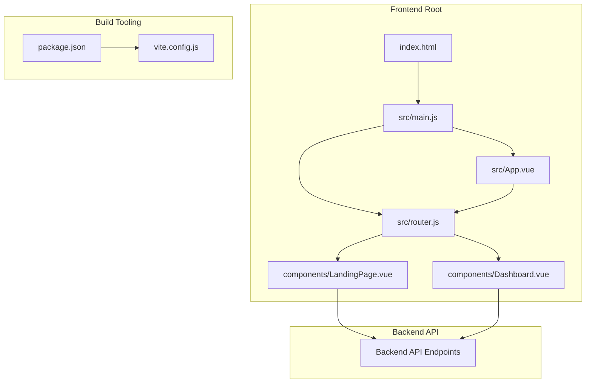
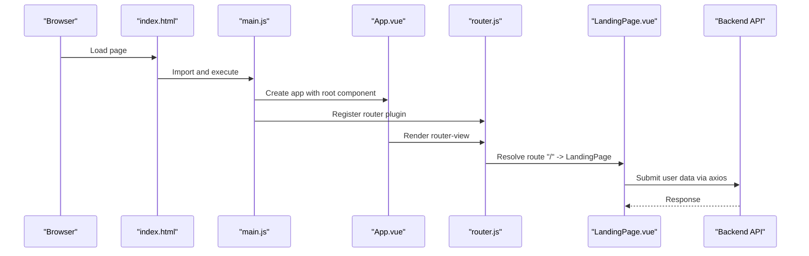
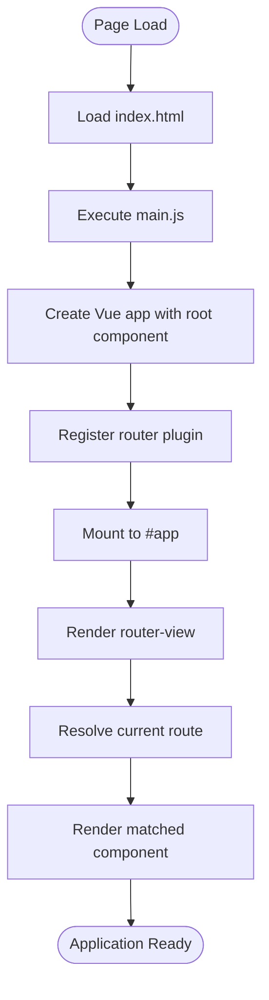
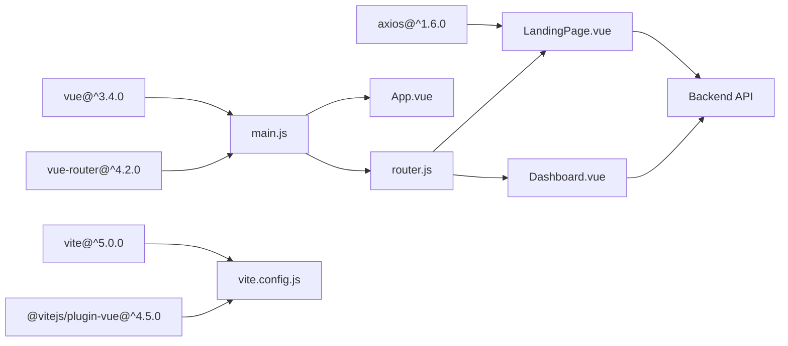

# Vue.js Application Architecture

<cite>
**Referenced Files in This Document**
- [main.js](file://nutricoach/frontend/src/main.js)
- [App.vue](file://nutricoach/frontend/src/App.vue)
- [router.js](file://nutricoach/frontend/src/router.js)
- [LandingPage.vue](file://nutricoach/frontend/components/LandingPage.vue)
- [Dashboard.vue](file://nutricoach/frontend/components/Dashboard.vue)
- [index.html](file://nutricoach/frontend/index.html)
- [package.json](file://nutricoach/frontend/package.json)
- [vite.config.js](file://nutricoach/frontend/vite.config.js)
- [API.md](file://nutricoach/backend/API.md)
</cite>

## Table of Contents
1. [Introduction](#introduction)
2. [Project Structure](#project-structure)
3. [Core Components](#core-components)
4. [Architecture Overview](#architecture-overview)
5. [Detailed Component Analysis](#detailed-component-analysis)
6. [Dependency Analysis](#dependency-analysis)
7. [Performance Considerations](#performance-considerations)
8. [Troubleshooting Guide](#troubleshooting-guide)
9. [Conclusion](#conclusion)

## Introduction
This document describes the Vue.js application architecture for NutriCoach AI, focusing on the application bootstrap process, routing configuration, component structure, and integration with the backend API. The frontend is built with Vue 3 and Vue Router, configured via Vite, and communicates with a Python Flask backend through a local proxy.

## Project Structure
The frontend follows a conventional Vue 3 project layout with a minimal routing setup and two primary components: a landing page and a dashboard. The application is bootstrapped through a single entry point that mounts the Vue instance and registers the router.

**Diagram sources**
- [index.html:1-14](file://nutricoach/frontend/index.html#L1-L14)
- [main.js:1-6](file://nutricoach/frontend/src/main.js#L1-L6)
- [App.vue:1-11](file://nutricoach/frontend/src/App.vue#L1-L11)
- [router.js:1-14](file://nutricoach/frontend/src/router.js#L1-L14)
- [LandingPage.vue:1-92](file://nutricoach/frontend/components/LandingPage.vue#L1-L92)
- [Dashboard.vue:1-46](file://nutricoach/frontend/components/Dashboard.vue#L1-L46)
- [package.json:1-19](file://nutricoach/frontend/package.json#L1-L19)
- [vite.config.js:1-17](file://nutricoach/frontend/vite.config.js#L1-L17)

**Section sources**
- [index.html:1-14](file://nutricoach/frontend/index.html#L1-L14)
- [main.js:1-6](file://nutricoach/frontend/src/main.js#L1-L6)
- [router.js:1-14](file://nutricoach/frontend/src/router.js#L1-L14)
- [package.json:1-19](file://nutricoach/frontend/package.json#L1-L19)
- [vite.config.js:1-17](file://nutricoach/frontend/vite.config.js#L1-L17)

## Core Components
This section documents the application bootstrap, root component, and routing configuration.

- Application Bootstrap (main.js)
  - Creates the Vue 3 application instance using the root component.
  - Registers the router plugin.
  - Mounts the application to the DOM element with id "app".
  - No additional plugins or global configurations are present in this minimal setup.

- Root Component (App.vue)
  - Provides a top-level container with a router outlet.
  - Serves as the host for all routed views.
  - Contains no additional logic or styling beyond the outlet.

- Routing Configuration (router.js)
  - Defines a single route mapping the root path to the landing page component.
  - Uses browser history mode for routing.
  - Exports a configured router instance.

**Section sources**
- [main.js:1-6](file://nutricoach/frontend/src/main.js#L1-L6)
- [App.vue:1-11](file://nutricoach/frontend/src/App.vue#L1-L11)
- [router.js:1-14](file://nutricoach/frontend/src/router.js#L1-L14)

## Architecture Overview
The application follows a straightforward client-side routing model. The Vue instance is mounted in the HTML document, and Vue Router manages navigation between components. The Vite development server proxies API requests to the backend service.

**Diagram sources**
- [index.html:1-14](file://nutricoach/frontend/index.html#L1-L14)
- [main.js:1-6](file://nutricoach/frontend/src/main.js#L1-L6)
- [App.vue:1-11](file://nutricoach/frontend/src/App.vue#L1-L11)
- [router.js:1-14](file://nutricoach/frontend/src/router.js#L1-L14)
- [LandingPage.vue:1-92](file://nutricoach/frontend/components/LandingPage.vue#L1-L92)
- [API.md:1-59](file://nutricoach/backend/API.md#L1-L59)

## Detailed Component Analysis

### Application Bootstrap and Initialization
- Vue Instance Creation
  - The application is created with the root component and immediately registered with the router.
  - The mount target aligns with the HTML document’s id attribute.

- Plugin Registration
  - Router plugin is registered during application creation.
  - No additional plugins are included in this minimal setup.

- Global Configurations
  - No global configurations are present in the bootstrap code.
  - Build-time configurations are handled by Vite, including development server and proxy settings.

**Section sources**
- [main.js:1-6](file://nutricoach/frontend/src/main.js#L1-L6)
- [index.html:1-14](file://nutricoach/frontend/index.html#L1-L14)
- [vite.config.js:1-17](file://nutricoach/frontend/vite.config.js#L1-L17)

### Root Component Structure
- Template
  - Hosts a single router outlet to render matched components.
- Script
  - Default export with a descriptive component name.
- Style
  - No styles are defined in the root component.

**Section sources**
- [App.vue:1-11](file://nutricoach/frontend/src/App.vue#L1-L11)

### Routing Configuration
- Route Definitions
  - Single route mapping the root path to the landing page component.
  - Additional routes for plans, preferences, and about/contact are referenced in components but not yet defined in the router.

- Navigation Guards
  - No navigation guards are implemented in the current router configuration.

- Lazy Loading Strategy
  - Current implementation imports components synchronously.
  - Lazy loading can be introduced by dynamically importing components in route definitions.

- History Mode
  - Uses browser history mode for clean URLs.

**Section sources**
- [router.js:1-14](file://nutricoach/frontend/src/router.js#L1-L14)
- [LandingPage.vue:6-10](file://nutricoach/frontend/components/LandingPage.vue#L6-L10)
- [Dashboard.vue:5-7](file://nutricoach/frontend/components/Dashboard.vue#L5-L7)

### Component Lifecycle Management
- Lifecycle Hooks
  - Components use the Options API with data and methods.
  - No explicit lifecycle hooks are defined beyond default initialization.

- Reactive Data Management
  - Reactive properties are declared in the data option.
  - Two-way binding is used with v-model on form inputs.

- Component Communication Patterns
  - Components communicate primarily through props and events.
  - Parent-child communication occurs via props and emitted events.

**Section sources**
- [LandingPage.vue:30-55](file://nutricoach/frontend/components/LandingPage.vue#L30-L55)
- [Dashboard.vue:27-39](file://nutricoach/frontend/components/Dashboard.vue#L27-L39)

### Dependency Injection Patterns
- Composition API Usage
  - The current implementation uses the Options API.
  - Composition API patterns can be adopted by migrating to script setup and using ref, reactive, and computed.

- Global Services
  - Axios is imported locally within components for API calls.
  - A centralized service layer can be introduced to manage HTTP requests and share state.

**Section sources**
- [LandingPage.vue:28](file://nutricoach/frontend/components/LandingPage.vue#L28)
- [Dashboard.vue:26](file://nutricoach/frontend/components/Dashboard.vue#L26)

### Application Initialization Sequence
1. The HTML document loads and includes the module script pointing to the main entry.
2. The main entry creates the Vue application and registers the router.
3. The root component renders the router outlet.
4. The router resolves the current route and renders the corresponding component.
5. Components initialize their reactive data and handle user interactions.

**Diagram sources**
- [index.html:1-14](file://nutricoach/frontend/index.html#L1-L14)
- [main.js:1-6](file://nutricoach/frontend/src/main.js#L1-L6)
- [App.vue:1-11](file://nutricoach/frontend/src/App.vue#L1-L11)
- [router.js:1-14](file://nutricoach/frontend/src/router.js#L1-L14)

## Dependency Analysis
The application depends on Vue 3 and Vue Router for UI and routing, Axios for HTTP requests, and Vite for development and build tooling. The router depends on the presence of components for route resolution.

**Diagram sources**
- [package.json:10-18](file://nutricoach/frontend/package.json#L10-L18)
- [main.js:1-6](file://nutricoach/frontend/src/main.js#L1-L6)
- [router.js:1-14](file://nutricoach/frontend/src/router.js#L1-L14)
- [LandingPage.vue:28](file://nutricoach/frontend/components/LandingPage.vue#L28)
- [vite.config.js:1-17](file://nutricoach/frontend/vite.config.js#L1-L17)

**Section sources**
- [package.json:1-19](file://nutricoach/frontend/package.json#L1-L19)
- [router.js:1-14](file://nutricoach/frontend/src/router.js#L1-L14)
- [LandingPage.vue:28](file://nutricoach/frontend/components/LandingPage.vue#L28)

## Performance Considerations
- Route-based Lazy Loading
  - Introduce dynamic imports for route components to reduce initial bundle size.
- Component Splitting
  - Extract shared UI elements into reusable components to minimize duplication.
- HTTP Request Optimization
  - Centralize API calls behind a service layer to enable caching and deduplication.
- Dev Server Proxy
  - Ensure the proxy target matches the backend service address to avoid unnecessary network overhead.

[No sources needed since this section provides general guidance]

## Troubleshooting Guide
- Route Not Found
  - Verify that the requested path has a corresponding route definition.
  - Confirm that the router instance is registered during application creation.

- Component Not Rendering
  - Ensure the component referenced by the route exists and is exported correctly.
  - Check that the router outlet is present in the root component template.

- API Requests Failing
  - Confirm the backend service is running and reachable.
  - Verify the proxy configuration in Vite matches the backend address.
  - Review the backend API documentation for endpoint correctness.

**Section sources**
- [router.js:1-14](file://nutricoach/frontend/src/router.js#L1-L14)
- [App.vue:1-11](file://nutricoach/frontend/src/App.vue#L1-L11)
- [vite.config.js:9-14](file://nutricoach/frontend/vite.config.js#L9-L14)
- [API.md:1-59](file://nutricoach/backend/API.md#L1-L59)

## Conclusion
NutriCoach AI’s frontend is a minimal Vue 3 application with a focused routing setup and two primary components. The bootstrap process is streamlined, relying on Vue Router for navigation and Axios for backend integration. Extending the application involves adding routes, implementing lazy loading, adopting Composition API patterns, and centralizing service logic for improved maintainability and performance.