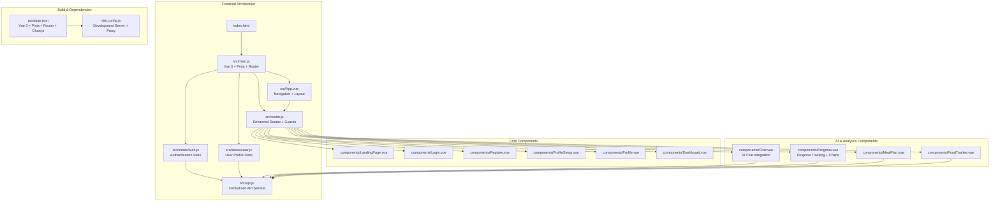
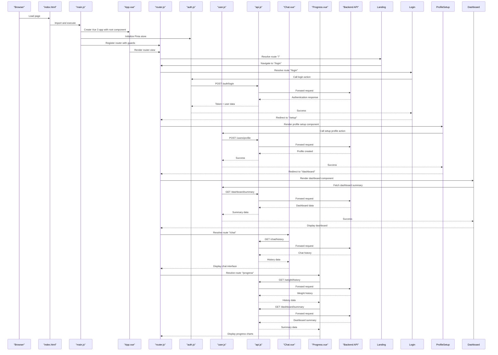
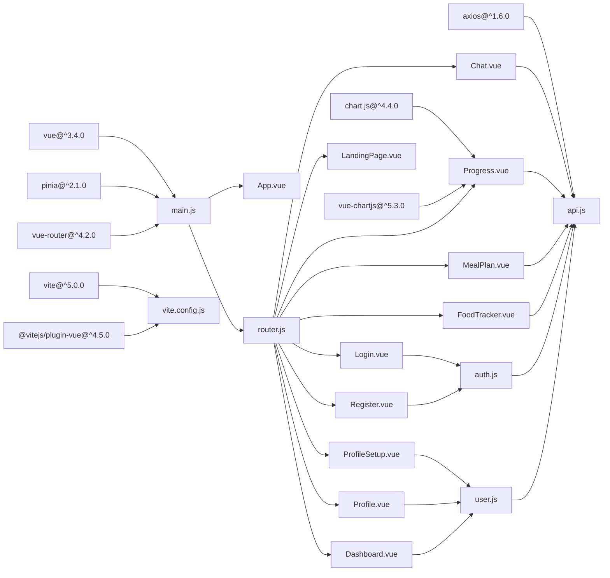

# Vue.js Application Architecture

<cite>
**Referenced Files in This Document**
- [main.js](file://nutricoach/frontend/src/main.js)
- [App.vue](file://nutricoach/frontend/src/App.vue)
- [router.js](file://nutricoach/frontend/src/router.js)
- [auth.js](file://nutricoach/frontend/src/stores/auth.js)
- [user.js](file://nutricoach/frontend/src/stores/user.js)
- [api.js](file://nutricoach/frontend/src/api.js)
- [Chat.vue](file://nutricoach/frontend/components/Chat.vue)
- [Progress.vue](file://nutricoach/frontend/components/Progress.vue)
- [Login.vue](file://nutricoach/frontend/components/Login.vue)
- [Register.vue](file://nutricoach/frontend/components/Register.vue)
- [ProfileSetup.vue](file://nutricoach/frontend/components/ProfileSetup.vue)
- [Profile.vue](file://nutricoach/frontend/components/Profile.vue)
- [MealPlan.vue](file://nutricoach/frontend/components/MealPlan.vue)
- [FoodTracker.vue](file://nutricoach/frontend/components/FoodTracker.vue)
- [Dashboard.vue](file://nutricoach/frontend/components/Dashboard.vue)
- [LandingPage.vue](file://nutricoach/frontend/components/LandingPage.vue)
- [index.html](file://nutricoach/frontend/index.html)
- [package.json](file://nutricoach/frontend/package.json)
- [vite.config.js](file://nutricoach/frontend/vite.config.js)
</cite>

## Update Summary
**Changes Made**
- Added comprehensive AI chat integration with Chat.vue component featuring real-time messaging and history
- Implemented advanced progress tracking system with Progress.vue component including weight charts and analytics
- Enhanced dashboard with water metrics visualization and comprehensive health analytics
- Expanded routing system with dedicated chat and progress tracking routes
- Integrated Chart.js for data visualization in progress tracking
- Added new authentication and navigation patterns supporting AI-powered features

## Table of Contents
1. [Introduction](#introduction)
2. [Project Structure](#project-structure)
3. [Core Components](#core-components)
4. [Architecture Overview](#architecture-overview)
5. [Detailed Component Analysis](#detailed-component-analysis)
6. [State Management with Pinia](#state-management-with-pinia)
7. [Enhanced Routing System](#enhanced-routing-system)
8. [AI Chat Integration](#ai-chat-integration)
9. [Progress Tracking System](#progress-tracking-system)
10. [Component Lifecycle Management](#component-lifecycle-management)
11. [Dependency Analysis](#dependency-analysis)
12. [Performance Considerations](#performance-considerations)
13. [Troubleshooting Guide](#troubleshooting-guide)
14. [Conclusion](#conclusion)

## Introduction
This document describes the Vue.js application architecture for NutriCoach AI, focusing on the major Vue 3 migration with Pinia state management, enhanced routing structure, and comprehensive component ecosystem. The application now features a robust authentication system, centralized state management, modular component architecture designed for scalability and maintainability, and comprehensive user profile management capabilities. The recent enhancements include AI chat integration, advanced progress tracking with data visualization, and enhanced dashboard functionality with water metrics visualization.

## Project Structure
The frontend has evolved into a comprehensive Vue 3 application with Pinia state management, featuring nine distinct components including new AI chat and progress tracking capabilities alongside centralized services for API communication and state persistence.

**Diagram sources**
- [main.js:1-10](file://nutricoach/frontend/src/main.js#L1-L10)
- [App.vue:1-83](file://nutricoach/frontend/src/App.vue#L1-L83)
- [router.js:1-41](file://nutricoach/frontend/src/router.js#L1-L41)
- [auth.js:1-59](file://nutricoach/frontend/src/stores/auth.js#L1-L59)
- [user.js:1-40](file://nutricoach/frontend/src/stores/user.js#L1-L40)
- [api.js:1-33](file://nutricoach/frontend/src/api.js#L1-L33)
- [Chat.vue:1-197](file://nutricoach/frontend/components/Chat.vue#L1-L197)
- [Progress.vue:1-208](file://nutricoach/frontend/components/Progress.vue#L1-L208)
- [package.json:1-22](file://nutricoach/frontend/package.json#L1-L22)
- [vite.config.js:1-20](file://nutricoach/frontend/vite.config.js#L1-L20)

**Section sources**
- [main.js:1-10](file://nutricoach/frontend/src/main.js#L1-L10)
- [App.vue:1-83](file://nutricoach/frontend/src/App.vue#L1-L83)
- [router.js:1-41](file://nutricoach/frontend/src/router.js#L1-L41)
- [package.json:1-22](file://nutricoach/frontend/package.json#L1-L22)
- [vite.config.js:1-20](file://nutricoach/frontend/vite.config.js#L1-L20)

## Core Components
This section documents the enhanced application bootstrap process, root component with navigation, and comprehensive routing configuration with new AI and analytics features.

### Application Bootstrap and State Management
- **Vue 3 Application Creation**: The application is created using `createApp()` with the root component as the foundation.
- **Pinia Integration**: Pinia state management is initialized globally and provides centralized state management across all components.
- **Plugin Registration**: Both Pinia and Vue Router plugins are registered during application creation.
- **Mount Configuration**: The application mounts to the DOM element with id "app" as defined in the HTML structure.
- **Chart.js Integration**: Chart.js and vue-chartjs are integrated for advanced data visualization capabilities.

**Updated** Enhanced with Chart.js integration for progress tracking and analytics visualization

**Section sources**
- [main.js:1-10](file://nutricoach/frontend/src/main.js#L1-L10)

### Root Component with Enhanced Navigation
- **Dynamic Navigation Bar**: The root component now includes a responsive navigation bar that appears on authenticated routes.
- **Back Navigation**: Implements intelligent back navigation with fallback to home route when history is empty.
- **Route-based Visibility**: Navigation bar visibility is controlled by computed properties based on current route path.
- **Global Styling**: Includes comprehensive CSS styling for responsive design and consistent user experience.

**Updated** Added navigation bar with computed visibility and back navigation functionality

**Section sources**
- [App.vue:1-83](file://nutricoach/frontend/src/App.vue#L1-L83)

### Comprehensive Routing Configuration
- **Enhanced Route Structure**: Expanded from a single route to ten distinct routes covering authentication, setup, profile management, AI features, and analytics.
- **Authentication Guards**: Implements route guards using `requiresAuth` meta fields to protect authenticated routes.
- **Navigation Protection**: Prevents access to protected routes without valid authentication tokens.
- **History Mode**: Maintains browser history mode for clean URL structure and proper navigation semantics.
- **AI Feature Routes**: New dedicated routes for chat (`/chat`) and progress tracking (`/progress`) with comprehensive authentication protection.

**Updated** Significantly expanded routing structure with AI chat and progress tracking routes, authentication guards, and comprehensive component coverage

**Section sources**
- [router.js:1-41](file://nutricoach/frontend/src/router.js#L1-L41)

## Architecture Overview
The application now follows a sophisticated client-side routing model with centralized state management, comprehensive authentication flows, and advanced AI-powered features. The enhanced architecture supports user registration, authentication, profile setup, profile management, AI chat integration, progress tracking with data visualization, and comprehensive nutrition tracking capabilities.

**Diagram sources**
- [index.html:1-14](file://nutricoach/frontend/index.html#L1-L14)
- [main.js:1-10](file://nutricoach/frontend/src/main.js#L1-L10)
- [App.vue:1-83](file://nutricoach/frontend/src/App.vue#L1-L83)
- [router.js:1-41](file://nutricoach/frontend/src/router.js#L1-L41)
- [auth.js:1-59](file://nutricoach/frontend/src/stores/auth.js#L1-L59)
- [user.js:1-40](file://nutricoach/frontend/src/stores/user.js#L1-L40)
- [api.js:1-33](file://nutricoach/frontend/src/api.js#L1-L33)
- [Chat.vue:79-107](file://nutricoach/frontend/components/Chat.vue#L79-L107)
- [Progress.vue:117-138](file://nutricoach/frontend/components/Progress.vue#L117-L138)

## Detailed Component Analysis

### Enhanced Application Bootstrap Process
- **Vue 3 Modern Features**: Utilizes modern Vue 3 features including Composition API patterns and enhanced reactivity.
- **State Management Integration**: Pinia provides reactive state management with persistent storage through localStorage integration.
- **Plugin Ecosystem**: Supports Vue Router for navigation, Chart.js for data visualization, and centralized API service for HTTP communication.
- **Development Workflow**: Vite provides fast development server with hot module replacement, proxy configuration, and Chart.js integration.

**Updated** Migrated to Vue 3 with Pinia state management, Chart.js integration, and enhanced development tooling

**Section sources**
- [main.js:1-10](file://nutricoach/frontend/src/main.js#L1-L10)
- [package.json:10-17](file://nutricoach/frontend/package.json#L10-L17)
- [vite.config.js:1-20](file://nutricoach/frontend/vite.config.js#L1-L20)

### Authentication Component Suite
- **Login Component**: Handles user authentication with form validation, error handling, and automatic redirection to dashboard.
- **Registration Component**: Manages user account creation with validation and automatic login flow.
- **Profile Setup Component**: Comprehensive health profile collection with medical conditions, dietary preferences, and goal setting.
- **Profile Component**: Advanced user profile management with CRUD operations, health calculations, and real-time updates.
- **Form Validation**: Implements comprehensive form validation with real-time feedback and error handling.

**Updated** Added complete authentication and profile management component suite including new Profile.vue with advanced CRUD capabilities

**Section sources**
- [Login.vue:1-92](file://nutricoach/frontend/components/Login.vue#L1-L92)
- [Register.vue:1-96](file://nutricoach/frontend/components/Register.vue#L1-L96)
- [ProfileSetup.vue:1-184](file://nutricoach/frontend/components/ProfileSetup.vue#L1-L184)
- [Profile.vue:1-324](file://nutricoach/frontend/components/Profile.vue#L1-L324)

### Feature-Rich Component Library
- **Meal Plan Component**: Dynamic meal plan generation with safety warnings, medical condition tailoring, and macro nutrition display.
- **Food Tracker Component**: Comprehensive food logging system with daily summaries, calorie tracking, and weight monitoring.
- **Dashboard Component**: Central hub for user progress tracking and quick access to features with water metrics visualization.
- **Profile Component**: Comprehensive user profile management with personal information, fitness goals, health metrics, and editable fields.
- **AI Chat Component**: Real-time conversational AI integration with message history, typing indicators, and intelligent responses.
- **Progress Component**: Advanced analytics dashboard with weight tracking, trend visualization, and goal progress monitoring.
- **Responsive Design**: Mobile-first approach with adaptive layouts and touch-friendly interfaces.

**Updated** Added comprehensive AI chat integration, advanced progress tracking with data visualization, and enhanced dashboard with water metrics

**Section sources**
- [MealPlan.vue:1-178](file://nutricoach/frontend/components/MealPlan.vue#L1-L178)
- [FoodTracker.vue:1-224](file://nutricoach/frontend/components/FoodTracker.vue#L1-L224)
- [Profile.vue:1-324](file://nutricoach/frontend/components/Profile.vue#L1-L324)
- [Chat.vue:1-197](file://nutricoach/frontend/components/Chat.vue#L1-L197)
- [Progress.vue:1-208](file://nutricoach/frontend/components/Progress.vue#L1-L208)

### Component Lifecycle Management
- **Mounted Hooks**: Components implement appropriate lifecycle hooks for data fetching and initialization.
- **Computed Properties**: Extensive use of computed properties for derived state and dynamic UI updates.
- **Event Handling**: Comprehensive event handling for user interactions and form submissions.
- **Error Boundaries**: Robust error handling with user-friendly error messages and graceful degradation.
- **Profile Management Lifecycle**: Advanced lifecycle management in Profile.vue including health calculation recalculation and real-time updates.
- **Chat Message Lifecycle**: Real-time message handling with automatic scrolling and typing indicators.
- **Progress Data Lifecycle**: Chart.js integration with dynamic data updates and responsive visualization.

**Updated** Enhanced with computed properties, lifecycle hooks, comprehensive error handling, advanced profile management lifecycle, and real-time chat functionality

**Section sources**
- [Login.vue:25-44](file://nutricoach/frontend/components/Login.vue#L25-L44)
- [ProfileSetup.vue:95-131](file://nutricoach/frontend/components/ProfileSetup.vue#L95-L131)
- [FoodTracker.vue:85-160](file://nutricoach/frontend/components/FoodTracker.vue#L85-L160)
- [Profile.vue:160-214](file://nutricoach/frontend/components/Profile.vue#L160-L214)
- [Chat.vue:72-118](file://nutricoach/frontend/components/Chat.vue#L72-L118)
- [Progress.vue:87-144](file://nutricoach/frontend/components/Progress.vue#L87-L144)

## State Management with Pinia
The application implements a comprehensive state management solution using Pinia, providing centralized control over authentication state, user profiles, and application-wide data.

### Authentication Store Architecture
- **State Persistence**: Authentication state persists across browser sessions using localStorage integration.
- **Token Management**: Automatic JWT token handling with interceptor configuration for secure API communication.
- **User Context**: Comprehensive user context management including profile data and authentication status.
- **Action Methods**: Asynchronous action methods for registration, login, user fetching, and logout operations.

### User Profile Store
- **Profile Management**: Centralized user profile data with update and fetch operations including health calculations.
- **Health Calculations**: Integration with health calculation endpoints for personalized nutrition recommendations and BMI/BMR/TDEE calculations.
- **Dashboard Integration**: Provides dashboard summary data for real-time progress tracking.
- **Data Synchronization**: Automatic data synchronization between local state and backend services.
- **Profile CRUD Operations**: Complete CRUD functionality for user profile management with real-time updates.

**Section sources**
- [auth.js:1-59](file://nutricoach/frontend/src/stores/auth.js#L1-L59)
- [user.js:1-40](file://nutricoach/frontend/src/stores/user.js#L1-L40)

## Enhanced Routing System
The routing system has been significantly expanded to support a comprehensive user journey from registration through feature utilization, AI interactions, and advanced analytics.

### Route Configuration Strategy
- **Authentication Flow**: Sequential routing from landing page through registration, profile setup, profile management, to authenticated dashboard.
- **Protected Routes**: Implementation of route guards protecting sensitive features like meal planning, food tracking, AI chat, and progress tracking.
- **Navigation Patterns**: Support for both programmatic navigation and user-driven routing through the interface.
- **Route Meta Fields**: Strategic use of meta fields for authentication requirements and route categorization.
- **AI Feature Routes**: Dedicated routes for chat (`/chat`) and progress tracking (`/progress`) with comprehensive authentication protection.

### Navigation Guard Implementation
- **Token Validation**: Real-time token validation using localStorage for authentication state verification.
- **Redirect Logic**: Intelligent redirect logic for unauthenticated users attempting to access protected routes.
- **Guard Execution**: Pre-navigation guard execution ensuring security and proper user flow progression.

**Section sources**
- [router.js:13-41](file://nutricoach/frontend/src/router.js#L13-L41)
- [auth.js:16-56](file://nutricoach/frontend/src/stores/auth.js#L16-L56)

## AI Chat Integration
The application now features comprehensive AI chat integration through the Chat.vue component, providing intelligent nutrition coaching and health guidance.

### Chat Component Architecture
- **Real-time Messaging**: WebSocket-like real-time message exchange with backend AI service.
- **Message History**: Persistent chat history retrieval and display with timestamps.
- **Typing Indicators**: Animated typing indicators for realistic conversation flow.
- **Error Handling**: Graceful error handling with user-friendly fallback messages.
- **Auto-scrolling**: Automatic scrolling to latest messages with smooth animations.

### AI Conversation Features
- **Nutrition Advice**: Personalized nutrition recommendations based on user profile and goals.
- **Meal Suggestions**: Intelligent meal suggestions tailored to dietary preferences and restrictions.
- **Calorie Calculations**: Real-time macro and micro-nutrient calculations for foods and meals.
- **Health Guidance**: Evidence-based fitness and health tips aligned with user's health profile.

### Technical Implementation
- **API Integration**: Direct integration with `/chat` and `/chat/history` endpoints.
- **State Management**: Reactive message state with automatic UI updates.
- **Performance Optimization**: Efficient DOM manipulation and memory management.
- **Accessibility**: Screen reader friendly with proper ARIA labels and keyboard navigation.

**Section sources**
- [Chat.vue:1-197](file://nutricoach/frontend/components/Chat.vue#L1-L197)
- [api.js:10-30](file://nutricoach/frontend/src/api.js#L10-L30)

## Progress Tracking System
The application features advanced progress tracking capabilities through the Progress.vue component, providing comprehensive analytics and visualization for user fitness journeys.

### Progress Dashboard Features
- **Weight Analytics**: Comprehensive weight tracking with historical data visualization.
- **Trend Analysis**: Interactive line charts displaying weight loss/gain trends over time.
- **Goal Progress**: Real-time progress tracking towards user-defined fitness goals.
- **Statistical Summary**: Key metrics including starting weight, current weight, and total change.
- **Responsive Design**: Mobile-first approach with adaptive chart layouts.

### Chart.js Integration
- **Line Charts**: Smooth line charts with tension-based curves for weight trends.
- **Interactive Elements**: Hover effects, tooltips, and responsive scaling.
- **Custom Styling**: Green-themed color scheme with professional data visualization aesthetics.
- **Empty States**: Graceful handling of insufficient data with instructional messages.

### Data Processing and Visualization
- **Historical Data**: Reverse chronological sorting with calculated daily changes.
- **Statistical Calculations**: Automatic computation of weight change magnitudes and trends.
- **Dynamic Updates**: Real-time chart updates when new weight data is available.
- **Performance Optimization**: Efficient data structures and rendering optimizations.

### Technical Implementation
- **Chart.js Components**: Integration with vue-chartjs for reactive chart components.
- **API Endpoints**: Seamless integration with `/weight/history` and `/dashboard/summary` endpoints.
- **Error Handling**: Robust error handling with fallback UI states.
- **Accessibility**: Screen reader compatible with descriptive chart labels and legends.

**Section sources**
- [Progress.vue:1-208](file://nutricoach/frontend/components/Progress.vue#L1-L208)
- [api.js:10-30](file://nutricoach/frontend/src/api.js#L10-L30)

## Component Lifecycle Management
The application implements comprehensive component lifecycle management across all components, with special attention to AI chat and progress tracking functionality.

### Lifecycle Patterns
- **Application Initialization**: Vue 3 app creation with Pinia and Router plugins.
- **Route Resolution**: Dynamic component loading based on URL patterns and authentication state.
- **Data Fetching**: Lifecycle hooks for API data retrieval and state synchronization.
- **UI Updates**: Reactive updates triggered by state changes and user interactions.
- **Memory Management**: Proper cleanup of event listeners and timers in component destruction.

### Specialized Lifecycle Management
- **Chat Component**: Real-time message lifecycle with automatic scrolling and typing indicators.
- **Progress Component**: Chart.js lifecycle with data binding and responsive resize handling.
- **Authentication Components**: Token validation and user session management across component boundaries.
- **Dashboard Components**: Real-time data updates with efficient polling and caching strategies.

### Error Handling and Recovery
- **Network Failures**: Graceful degradation with cached data and retry mechanisms.
- **API Errors**: User-friendly error messages with recovery options and logging.
- **Component Errors**: Error boundaries preventing cascade failures across the application.
- **State Recovery**: Automatic recovery from invalid state conditions with user notifications.

**Section sources**
- [Chat.vue:72-118](file://nutricoach/frontend/components/Chat.vue#L72-L118)
- [Progress.vue:117-138](file://nutricoach/frontend/components/Progress.vue#L117-L138)
- [auth.js:37-46](file://nutricoach/frontend/src/stores/auth.js#L37-L46)
- [user.js:12-37](file://nutricoach/frontend/src/stores/user.js#L12-L37)

## Dependency Analysis
The application now leverages a modern Vue 3 ecosystem with comprehensive dependencies supporting state management, routing, development workflows, and advanced data visualization.

**Diagram sources**
- [package.json:10-17](file://nutricoach/frontend/package.json#L10-L17)
- [main.js:1-10](file://nutricoach/frontend/src/main.js#L1-L10)
- [router.js:1-41](file://nutricoach/frontend/src/router.js#L1-L41)
- [auth.js:1-59](file://nutricoach/frontend/src/stores/auth.js#L1-L59)
- [user.js:1-40](file://nutricoach/frontend/src/stores/user.js#L1-L40)
- [api.js:1-33](file://nutricoach/frontend/src/api.js#L1-L33)
- [Progress.vue:61-65](file://nutricoach/frontend/components/Progress.vue#L61-L65)
- [Chat.vue:61](file://nutricoach/frontend/components/Chat.vue#L61)
- [vite.config.js:1-20](file://nutricoach/frontend/vite.config.js#L1-L20)

**Section sources**
- [package.json:1-22](file://nutricoach/frontend/package.json#L1-L22)
- [router.js:1-41](file://nutricoach/frontend/src/router.js#L1-L41)
- [auth.js:1-59](file://nutricoach/frontend/src/stores/auth.js#L1-L59)
- [user.js:1-40](file://nutricoach/frontend/src/stores/user.js#L1-L40)

## Performance Considerations
- **State Persistence**: Pinia stores utilize localStorage for state persistence, reducing redundant API calls on page reload.
- **Lazy Loading**: Route-based lazy loading can be implemented for larger components to optimize initial bundle size.
- **Component Optimization**: Individual component optimization through computed properties and efficient rendering strategies.
- **API Caching**: Centralized API service with request/response interceptors for improved network performance.
- **Chart Optimization**: Chart.js integration optimized for performance with selective data updates and responsive resizing.
- **Chat Performance**: Real-time chat functionality optimized with efficient DOM updates and message batching.
- **Progress Visualization**: Chart.js components optimized with proper cleanup and memory management.
- **Profile Management Optimization**: Efficient profile data caching and health calculation optimization in Profile.vue component.

## Troubleshooting Guide
- **Authentication Issues**: Verify token persistence in localStorage and ensure API interceptors are properly configured.
- **Route Protection**: Check authentication guards and ensure token validation logic is functioning correctly.
- **State Management**: Monitor Pinia store state updates and localStorage synchronization for data consistency.
- **API Communication**: Verify baseURL configuration and proxy settings for proper backend communication.
- **Component Rendering**: Ensure proper component imports and route definitions for seamless navigation.
- **Profile Management Issues**: Check user store profile fetching and health calculation endpoints for proper data synchronization.
- **Chat Functionality**: Verify AI service connectivity and message API endpoints for proper chat operation.
- **Progress Tracking Issues**: Check weight history endpoints and Chart.js integration for proper data visualization.
- **Chart Rendering**: Ensure Chart.js and vue-chartjs are properly installed and configured for progress tracking.
- **Health Calculation Errors**: Verify health endpoint availability and proper data formatting for BMI/BMR/TDEE calculations.

**Section sources**
- [router.js:31-38](file://nutricoach/frontend/src/router.js#L31-L38)
- [auth.js:16-56](file://nutricoach/frontend/src/stores/auth.js#L16-L56)
- [api.js:10-30](file://nutricoach/frontend/src/api.js#L10-L30)
- [vite.config.js:10-18](file://nutricoach/frontend/vite.config.js#L10-L18)
- [Chat.vue:79-107](file://nutricoach/frontend/components/Chat.vue#L79-L107)
- [Progress.vue:117-138](file://nutricoach/frontend/components/Progress.vue#L117-L138)

## Conclusion
NutriCoach AI has undergone a comprehensive Vue 3 migration featuring Pinia state management, enhanced routing architecture, and a complete component ecosystem. The application now provides a robust foundation for nutrition tracking, meal planning, user profile management, AI-powered chat assistance, and comprehensive health analytics with centralized authentication and state management. The recent enhancements include sophisticated AI chat integration with real-time messaging capabilities, advanced progress tracking with interactive data visualization, and enhanced dashboard functionality with water metrics and comprehensive analytics. The modern architecture supports scalability, maintainability, and enhanced user experience through responsive design, comprehensive feature coverage, advanced profile management capabilities, and cutting-edge AI-powered health coaching features.