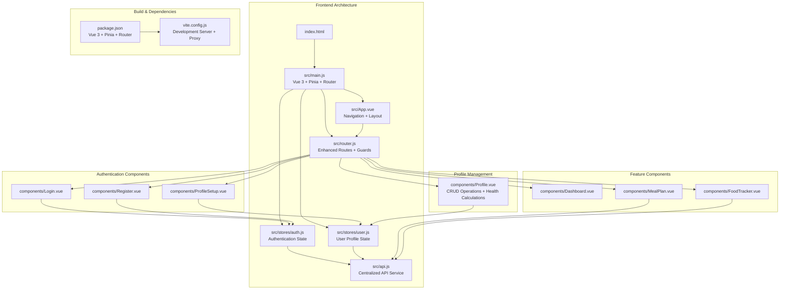
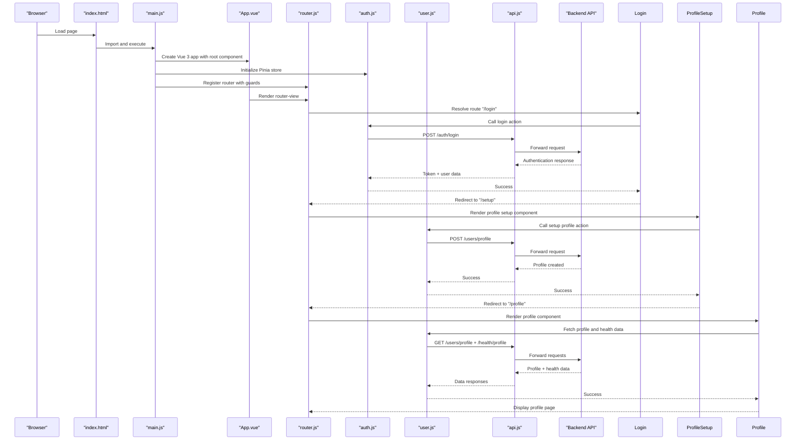
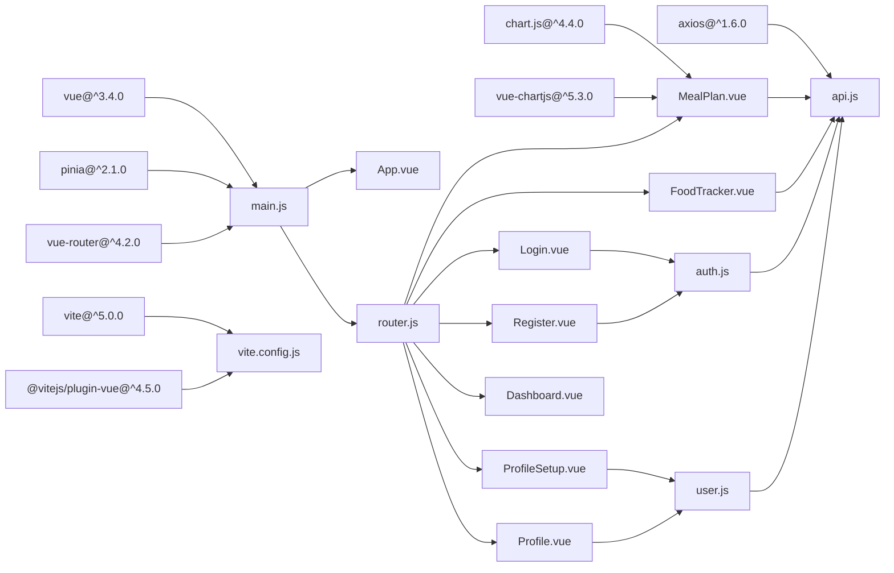

# Vue.js Application Architecture

<cite>
**Referenced Files in This Document**
- [main.js](file://nutricoach/frontend/src/main.js)
- [App.vue](file://nutricoach/frontend/src/App.vue)
- [router.js](file://nutricoach/frontend/src/router.js)
- [auth.js](file://nutricoach/frontend/src/stores/auth.js)
- [user.js](file://nutricoach/frontend/src/stores/user.js)
- [api.js](file://nutricoach/frontend/src/api.js)
- [Login.vue](file://nutricoach/frontend/components/Login.vue)
- [Register.vue](file://nutricoach/frontend/components/Register.vue)
- [ProfileSetup.vue](file://nutricoach/frontend/components/ProfileSetup.vue)
- [Profile.vue](file://nutricoach/frontend/components/Profile.vue)
- [MealPlan.vue](file://nutricoach/frontend/components/MealPlan.vue)
- [FoodTracker.vue](file://nutricoach/frontend/components/FoodTracker.vue)
- [index.html](file://nutricoach/frontend/index.html)
- [package.json](file://nutricoach/frontend/package.json)
- [vite.config.js](file://nutricoach/frontend/vite.config.js)
</cite>

## Update Summary
**Changes Made**
- Updated main.js to reflect Pinia state management integration
- Enhanced App.vue with navigation bar and computed properties
- Expanded router.js with comprehensive authentication guard system including new Profile route
- Added Pinia store architecture with auth and user management
- Integrated centralized API service with interceptors
- Added new components: Login, Register, ProfileSetup, Profile, MealPlan, FoodTracker
- Updated dependency structure to support Vue 3 ecosystem
- **New**: Added comprehensive Profile.vue component with CRUD operations and health calculations
- **New**: Enhanced routing system with dedicated profile management route

## Table of Contents
1. [Introduction](#introduction)
2. [Project Structure](#project-structure)
3. [Core Components](#core-components)
4. [Architecture Overview](#architecture-overview)
5. [Detailed Component Analysis](#detailed-component-analysis)
6. [State Management with Pinia](#state-management-with-pinia)
7. [Enhanced Routing System](#enhanced-routing-system)
8. [Component Lifecycle Management](#component-lifecycle-management)
9. [Dependency Analysis](#dependency-analysis)
10. [Performance Considerations](#performance-considerations)
11. [Troubleshooting Guide](#troubleshooting-guide)
12. [Conclusion](#conclusion)

## Introduction
This document describes the Vue.js application architecture for NutriCoach AI, focusing on the major Vue 3 migration with Pinia state management, enhanced routing structure, and comprehensive component ecosystem. The application now features a robust authentication system, centralized state management, modular component architecture designed for scalability and maintainability, and comprehensive user profile management capabilities.

## Project Structure
The frontend has evolved into a comprehensive Vue 3 application with Pinia state management, featuring six distinct authentication and feature components alongside centralized services for API communication and state persistence.

**Diagram sources**
- [main.js:1-10](file://nutricoach/frontend/src/main.js#L1-L10)
- [App.vue:1-83](file://nutricoach/frontend/src/App.vue#L1-L83)
- [router.js:1-37](file://nutricoach/frontend/src/router.js#L1-L37)
- [auth.js:1-59](file://nutricoach/frontend/src/stores/auth.js#L1-L59)
- [user.js:1-40](file://nutricoach/frontend/src/stores/user.js#L1-L40)
- [api.js:1-33](file://nutricoach/frontend/src/api.js#L1-L33)
- [Login.vue:1-92](file://nutricoach/frontend/components/Login.vue#L1-L92)
- [Register.vue:1-96](file://nutricoach/frontend/components/Register.vue#L1-L96)
- [ProfileSetup.vue:1-184](file://nutricoach/frontend/components/ProfileSetup.vue#L1-L184)
- [Profile.vue:1-324](file://nutricoach/frontend/components/Profile.vue#L1-L324)
- [MealPlan.vue:1-178](file://nutricoach/frontend/components/MealPlan.vue#L1-L178)
- [FoodTracker.vue:1-224](file://nutricoach/frontend/components/FoodTracker.vue#L1-L224)
- [package.json:1-22](file://nutricoach/frontend/package.json#L1-L22)
- [vite.config.js:1-17](file://nutricoach/frontend/vite.config.js#L1-L17)

**Section sources**
- [main.js:1-10](file://nutricoach/frontend/src/main.js#L1-L10)
- [App.vue:1-83](file://nutricoach/frontend/src/App.vue#L1-L83)
- [router.js:1-37](file://nutricoach/frontend/src/router.js#L1-L37)
- [package.json:1-22](file://nutricoach/frontend/package.json#L1-L22)
- [vite.config.js:1-17](file://nutricoach/frontend/vite.config.js#L1-L17)

## Core Components
This section documents the enhanced application bootstrap process, root component with navigation, and comprehensive routing configuration.

### Application Bootstrap and State Management
- **Vue 3 Application Creation**: The application is created using `createApp()` with the root component as the foundation.
- **Pinia Integration**: Pinia state management is initialized globally and provides centralized state management across all components.
- **Plugin Registration**: Both Pinia and Vue Router plugins are registered during application creation.
- **Mount Configuration**: The application mounts to the DOM element with id "app" as defined in the HTML structure.

**Updated** Enhanced with Pinia state management for centralized application state

**Section sources**
- [main.js:1-10](file://nutricoach/frontend/src/main.js#L1-L10)

### Root Component with Enhanced Navigation
- **Dynamic Navigation Bar**: The root component now includes a responsive navigation bar that appears on authenticated routes.
- **Back Navigation**: Implements intelligent back navigation with fallback to home route when history is empty.
- **Route-based Visibility**: Navigation bar visibility is controlled by computed properties based on current route path.
- **Global Styling**: Includes comprehensive CSS styling for responsive design and consistent user experience.

**Updated** Added navigation bar with computed visibility and back navigation functionality

**Section sources**
- [App.vue:1-83](file://nutricoach/frontend/src/App.vue#L1-L83)

### Comprehensive Routing Configuration
- **Enhanced Route Structure**: Expanded from a single route to eight distinct routes covering authentication, setup, profile management, and feature pages.
- **Authentication Guards**: Implements route guards using `requiresAuth` meta fields to protect authenticated routes.
- **Navigation Protection**: Prevents access to protected routes without valid authentication tokens.
- **History Mode**: Maintains browser history mode for clean URL structure and proper navigation semantics.
- **Profile Route Integration**: New dedicated `/profile` route for comprehensive user profile management.

**Updated** Significantly expanded routing structure with authentication guards, comprehensive component coverage, and new profile management route

**Section sources**
- [router.js:1-37](file://nutricoach/frontend/src/router.js#L1-L37)

## Architecture Overview
The application now follows a sophisticated client-side routing model with centralized state management and comprehensive authentication flows. The enhanced architecture supports user registration, authentication, profile setup, profile management, and feature-rich nutrition tracking capabilities.

**Diagram sources**
- [index.html:1-14](file://nutricoach/frontend/index.html#L1-L14)
- [main.js:1-10](file://nutricoach/frontend/src/main.js#L1-L10)
- [App.vue:1-83](file://nutricoach/frontend/src/App.vue#L1-L83)
- [router.js:1-37](file://nutricoach/frontend/src/router.js#L1-L37)
- [auth.js:1-59](file://nutricoach/frontend/src/stores/auth.js#L1-L59)
- [user.js:1-40](file://nutricoach/frontend/src/stores/user.js#L1-L40)
- [api.js:1-33](file://nutricoach/frontend/src/api.js#L1-L33)

## Detailed Component Analysis

### Enhanced Application Bootstrap Process
- **Vue 3 Modern Features**: Utilizes modern Vue 3 features including Composition API patterns and enhanced reactivity.
- **State Management Integration**: Pinia provides reactive state management with persistent storage through localStorage integration.
- **Plugin Ecosystem**: Supports Vue Router for navigation and centralized API service for HTTP communication.
- **Development Workflow**: Vite provides fast development server with hot module replacement and proxy configuration.

**Updated** Migrated to Vue 3 with Pinia state management and enhanced development tooling

**Section sources**
- [main.js:1-10](file://nutricoach/frontend/src/main.js#L1-L10)
- [package.json:10-17](file://nutricoach/frontend/package.json#L10-L17)
- [vite.config.js:1-17](file://nutricoach/frontend/vite.config.js#L1-L17)

### Authentication Component Suite
- **Login Component**: Handles user authentication with form validation, error handling, and automatic redirection to dashboard.
- **Registration Component**: Manages user account creation with validation and automatic login flow.
- **Profile Setup Component**: Comprehensive health profile collection with medical conditions, dietary preferences, and goal setting.
- **Profile Component**: Advanced user profile management with CRUD operations, health calculations, and real-time updates.
- **Form Validation**: Implements comprehensive form validation with real-time feedback and error handling.

**Updated** Added complete authentication and profile management component suite including new Profile.vue with advanced CRUD capabilities

**Section sources**
- [Login.vue:1-92](file://nutricoach/frontend/components/Login.vue#L1-L92)
- [Register.vue:1-96](file://nutricoach/frontend/components/Register.vue#L1-L96)
- [ProfileSetup.vue:1-184](file://nutricoach/frontend/components/ProfileSetup.vue#L1-L184)
- [Profile.vue:1-324](file://nutricoach/frontend/components/Profile.vue#L1-L324)

### Feature-Rich Component Library
- **Meal Plan Component**: Dynamic meal plan generation with safety warnings, medical condition tailoring, and macro nutrition display.
- **Food Tracker Component**: Comprehensive food logging system with daily summaries, calorie tracking, and weight monitoring.
- **Dashboard Component**: Central hub for user progress tracking and quick access to features.
- **Profile Component**: Comprehensive user profile management with personal information, fitness goals, health metrics, and editable fields.
- **Responsive Design**: Mobile-first approach with adaptive layouts and touch-friendly interfaces.

**Updated** Added comprehensive feature components for nutrition tracking, meal planning, and advanced profile management

**Section sources**
- [MealPlan.vue:1-178](file://nutricoach/frontend/components/MealPlan.vue#L1-L178)
- [FoodTracker.vue:1-224](file://nutricoach/frontend/components/FoodTracker.vue#L1-L224)
- [Profile.vue:1-324](file://nutricoach/frontend/components/Profile.vue#L1-L324)

### Component Lifecycle Management
- **Mounted Hooks**: Components implement appropriate lifecycle hooks for data fetching and initialization.
- **Computed Properties**: Extensive use of computed properties for derived state and dynamic UI updates.
- **Event Handling**: Comprehensive event handling for user interactions and form submissions.
- **Error Boundaries**: Robust error handling with user-friendly error messages and graceful degradation.
- **Profile Management Lifecycle**: Advanced lifecycle management in Profile.vue including health calculation recalculation and real-time updates.

**Updated** Enhanced with computed properties, lifecycle hooks, comprehensive error handling, and advanced profile management lifecycle

**Section sources**
- [Login.vue:25-44](file://nutricoach/frontend/components/Login.vue#L25-L44)
- [ProfileSetup.vue:95-131](file://nutricoach/frontend/components/ProfileSetup.vue#L95-L131)
- [FoodTracker.vue:85-160](file://nutricoach/frontend/components/FoodTracker.vue#L85-L160)
- [Profile.vue:160-214](file://nutricoach/frontend/components/Profile.vue#L160-L214)

## State Management with Pinia
The application implements a comprehensive state management solution using Pinia, providing centralized control over authentication state, user profiles, and application-wide data.

### Authentication Store Architecture
- **State Persistence**: Authentication state persists across browser sessions using localStorage integration.
- **Token Management**: Automatic JWT token handling with interceptor configuration for secure API communication.
- **User Context**: Comprehensive user context management including profile data and authentication status.
- **Action Methods**: Asynchronous action methods for registration, login, user fetching, and logout operations.

### User Profile Store
- **Profile Management**: Centralized user profile data with update and fetch operations including health calculations.
- **Health Calculations**: Integration with health calculation endpoints for personalized nutrition recommendations and BMI/BMR/TDEE calculations.
- **Dashboard Integration**: Provides dashboard summary data for real-time progress tracking.
- **Data Synchronization**: Automatic data synchronization between local state and backend services.
- **Profile CRUD Operations**: Complete CRUD functionality for user profile management with real-time updates.

**Section sources**
- [auth.js:1-59](file://nutricoach/frontend/src/stores/auth.js#L1-L59)
- [user.js:1-40](file://nutricoach/frontend/src/stores/user.js#L1-L40)

## Enhanced Routing System
The routing system has been significantly expanded to support a comprehensive user journey from registration through feature utilization and advanced profile management.

### Route Configuration Strategy
- **Authentication Flow**: Sequential routing from landing page through registration, profile setup, profile management, to authenticated dashboard.
- **Protected Routes**: Implementation of route guards protecting sensitive features like meal planning, food tracking, and profile management.
- **Navigation Patterns**: Support for both programmatic navigation and user-driven routing through the interface.
- **Route Meta Fields**: Strategic use of meta fields for authentication requirements and route categorization.
- **Profile Route Integration**: Dedicated `/profile` route for comprehensive user profile management and editing.

### Navigation Guard Implementation
- **Token Validation**: Real-time token validation using localStorage for authentication state verification.
- **Redirect Logic**: Intelligent redirect logic for unauthenticated users attempting to access protected routes.
- **Guard Execution**: Pre-navigation guard execution ensuring security and proper user flow progression.

**Section sources**
- [router.js:11-37](file://nutricoach/frontend/src/router.js#L11-L37)
- [auth.js:16-56](file://nutricoach/frontend/src/stores/auth.js#L16-L56)

## Dependency Analysis
The application now leverages a modern Vue 3 ecosystem with comprehensive dependencies supporting state management, routing, and development workflows.

**Diagram sources**
- [package.json:10-17](file://nutricoach/frontend/package.json#L10-L17)
- [main.js:1-10](file://nutricoach/frontend/src/main.js#L1-L10)
- [router.js:1-37](file://nutricoach/frontend/src/router.js#L1-L37)
- [auth.js:1-59](file://nutricoach/frontend/src/stores/auth.js#L1-L59)
- [user.js:1-40](file://nutricoach/frontend/src/stores/user.js#L1-L40)
- [api.js:1-33](file://nutricoach/frontend/src/api.js#L1-L33)
- [Profile.vue:145](file://nutricoach/frontend/components/Profile.vue#L145)
- [vite.config.js:1-17](file://nutricoach/frontend/vite.config.js#L1-L17)

**Section sources**
- [package.json:1-22](file://nutricoach/frontend/package.json#L1-L22)
- [router.js:1-37](file://nutricoach/frontend/src/router.js#L1-L37)
- [auth.js:1-59](file://nutricoach/frontend/src/stores/auth.js#L1-L59)
- [user.js:1-40](file://nutricoach/frontend/src/stores/user.js#L1-L40)

## Performance Considerations
- **State Persistence**: Pinia stores utilize localStorage for state persistence, reducing redundant API calls on page reload.
- **Lazy Loading**: Route-based lazy loading can be implemented for larger components to optimize initial bundle size.
- **Component Optimization**: Individual component optimization through computed properties and efficient rendering strategies.
- **API Caching**: Centralized API service with request/response interceptors for improved network performance.
- **Chart Optimization**: Chart.js integration optimized for performance with selective data updates.
- **Profile Management Optimization**: Efficient profile data caching and health calculation optimization in Profile.vue component.

## Troubleshooting Guide
- **Authentication Issues**: Verify token persistence in localStorage and ensure API interceptors are properly configured.
- **Route Protection**: Check authentication guards and ensure token validation logic is functioning correctly.
- **State Management**: Monitor Pinia store state updates and localStorage synchronization for data consistency.
- **API Communication**: Verify baseURL configuration and proxy settings for proper backend communication.
- **Component Rendering**: Ensure proper component imports and route definitions for seamless navigation.
- **Profile Management Issues**: Check user store profile fetching and health calculation endpoints for proper data synchronization.
- **Health Calculation Errors**: Verify health endpoint availability and proper data formatting for BMI/BMR/TDEE calculations.

**Section sources**
- [router.js:27-34](file://nutricoach/frontend/src/router.js#L27-L34)
- [auth.js:16-56](file://nutricoach/frontend/src/stores/auth.js#L16-L56)
- [api.js:10-30](file://nutricoach/frontend/src/api.js#L10-L30)
- [vite.config.js:7-14](file://nutricoach/frontend/vite.config.js#L7-L14)
- [Profile.vue:164-214](file://nutricoach/frontend/components/Profile.vue#L164-L214)

## Conclusion
NutriCoach AI has undergone a comprehensive Vue 3 migration featuring Pinia state management, enhanced routing architecture, and a complete component ecosystem. The application now provides a robust foundation for nutrition tracking, meal planning, user profile management, and comprehensive health analytics with centralized authentication and state management. The modern architecture supports scalability, maintainability, and enhanced user experience through responsive design, comprehensive feature coverage, and advanced profile management capabilities including real-time health calculations and CRUD operations.