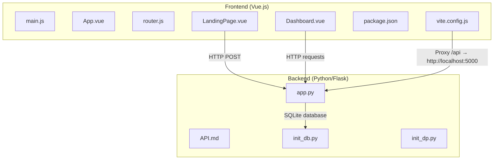

# Getting Started

<cite>
**Referenced Files in This Document**
- [README.md](file://nutricoach/README.md)
- [API.md](file://nutricoach/backend/API.md)
- [app.py](file://nutricoach/backend/app.py)
- [init_db.py](file://nutricoach/backend/init_db.py)
- [init_dp.py](file://nutricoach/backend/init_dp.py)
- [package.json](file://nutricoach/frontend/package.json)
- [vite.config.js](file://nutricoach/frontend/vite.config.js)
- [main.js](file://nutricoach/frontend/src/main.js)
- [router.js](file://nutricoach/frontend/src/router.js)
- [App.vue](file://nutricoach/frontend/src/App.vue)
- [LandingPage.vue](file://nutricoach/frontend/components/LandingPage.vue)
- [Dashboard.vue](file://nutricoach/frontend/components/Dashboard.vue)
</cite>

## Table of Contents
1. [Introduction](#introduction)
2. [Project Structure](#project-structure)
3. [Prerequisites](#prerequisites)
4. [Installation](#installation)
5. [Development Environment Setup](#development-environment-setup)
6. [Database Initialization](#database-initialization)
7. [First Run](#first-run)
8. [Verification Steps](#verification-steps)
9. [Troubleshooting Guide](#troubleshooting-guide)
10. [Conclusion](#conclusion)

## Introduction
NutriCoach AI is a personalized diet plan generator web application featuring a Vue.js frontend and a Python (Flask) backend with an SQLite database. This guide walks you through setting up the development environment, installing dependencies, initializing the database, and completing a first run that registers a user and demonstrates basic functionality.

## Project Structure
The project is organized into two primary areas:
- Frontend: Vue.js application configured with Vite, routing, and Axios for HTTP requests.
- Backend: Flask API exposing endpoints for user management, diet preferences, and meal plans, backed by SQLite.

**Diagram sources**
- [main.js:1-6](file://nutricoach/frontend/src/main.js#L1-L6)
- [App.vue:1-11](file://nutricoach/frontend/src/App.vue#L1-L11)
- [router.js:1-14](file://nutricoach/frontend/src/router.js#L1-L14)
- [LandingPage.vue:1-92](file://nutricoach/frontend/components/LandingPage.vue#L1-L92)
- [Dashboard.vue:1-46](file://nutricoach/frontend/components/Dashboard.vue#L1-L46)
- [package.json:1-19](file://nutricoach/frontend/package.json#L1-L19)
- [vite.config.js:1-17](file://nutricoach/frontend/vite.config.js#L1-L17)
- [app.py:1-31](file://nutricoach/backend/app.py#L1-L31)
- [API.md:1-59](file://nutricoach/backend/API.md#L1-L59)
- [init_db.py:1-47](file://nutricoach/backend/init_db.py#L1-L47)
- [init_dp.py:1-23](file://nutricoach/backend/init_dp.py#L1-L23)

**Section sources**
- [README.md:1-77](file://nutricoach/README.md#L1-L77)
- [package.json:1-19](file://nutricoach/frontend/package.json#L1-L19)
- [vite.config.js:1-17](file://nutricoach/frontend/vite.config.js#L1-L17)
- [app.py:1-31](file://nutricoach/backend/app.py#L1-L31)
- [API.md:1-59](file://nutricoach/backend/API.md#L1-L59)

## Prerequisites
Ensure your system meets the following requirements before proceeding:
- Node.js: v18 or higher
- Python: 3.11 or higher
- Docker: Optional (for deployment scenarios)

These prerequisites are required for local development and testing of the frontend and backend components.

**Section sources**
- [README.md:20-23](file://nutricoach/README.md#L20-L23)

## Installation
Follow these steps to install and prepare the application locally.

### Frontend Installation
1. Change to the frontend directory.
2. Install dependencies using npm.
3. Start the development server.

Expected outcomes:
- Dependencies are installed without errors.
- The development server starts and listens on the configured port.

Command summary:
- cd nutricoach/frontend
- npm install
- npm run dev

Notes:
- The development server runs on port 5173 and proxies API requests to the backend.

**Section sources**
- [README.md:27-32](file://nutricoach/README.md#L27-L32)
- [package.json:1-19](file://nutricoach/frontend/package.json#L1-L19)
- [vite.config.js:1-17](file://nutricoach/frontend/vite.config.js#L1-L17)

### Backend Installation
1. Change to the backend directory.
2. Create a Python virtual environment.
3. Activate the virtual environment.
4. Install Python dependencies.
5. Start the Flask API server.

Expected outcomes:
- Virtual environment is created.
- Dependencies are installed inside the virtual environment.
- The Flask server starts and listens on port 5000.

Command summary:
- cd nutricoach/backend
- python -m venv venv
- source venv/bin/activate (On Windows: venv\Scripts\activate)
- pip install -r requirements.txt
- python app.py

Notes:
- The backend exposes API endpoints under /api/v1.
- The server runs in debug mode by default.

**Section sources**
- [README.md:34-41](file://nutricoach/README.md#L34-L41)
- [app.py:1-31](file://nutricoach/backend/app.py#L1-L31)
- [API.md:1-59](file://nutricoach/backend/API.md#L1-L59)

## Development Environment Setup
Set up your development environment with the following steps:

1. Verify Node.js and Python versions meet the prerequisites.
2. Confirm the frontend and backend ports are free:
   - Frontend: 5173
   - Backend: 5000
3. Start the backend server in a terminal session.
4. Start the frontend development server in another terminal session.
5. Access the application at http://localhost:5173/.

Expected outputs:
- Backend terminal shows Flask running on 0.0.0.0:5000.
- Frontend terminal shows Vite serving at http://localhost:5173/.
- Browser loads the landing page and displays the form.

**Section sources**
- [README.md:68-75](file://nutricoach/README.md#L68-L75)
- [vite.config.js:7-15](file://nutricoach/frontend/vite.config.js#L7-L15)
- [app.py:30-31](file://nutricoach/backend/app.py#L30-L31)

## Database Initialization
Initialize the SQLite database and create the required tables.

Steps:
1. Change to the backend directory.
2. Run the database initialization script.

Command summary:
- cd nutricoach/backend
- python init_db.py

What happens:
- The script connects to a SQLite database file located in the backend directory.
- Creates tables for users, diet preferences, and meal plans.
- Prints a success message upon completion.

Notes:
- The script defines table schemas and foreign key relationships.
- Ensure the backend server is not running while initializing the database.

**Section sources**
- [README.md:43-47](file://nutricoach/README.md#L43-L47)
- [init_db.py:1-47](file://nutricoach/backend/init_db.py#L1-L47)

## First Run
Complete a full first run to register a user and observe basic functionality.

Steps:
1. Start the backend server in a terminal.
2. Start the frontend development server in another terminal.
3. Open the application in your browser at http://localhost:5173/.
4. Fill out the form on the landing page and submit.
5. Observe the browser console for the API response.

What happens:
- The frontend sends a POST request to the backend’s user creation endpoint.
- The backend inserts the user record into the database and responds with the new user ID.
- The frontend logs the response to the console.

Verification:
- Check the backend terminal for the incoming request and successful insertion.
- Confirm the frontend console shows a successful response.

**Section sources**
- [README.md:75-77](file://nutricoach/README.md#L75-L77)
- [LandingPage.vue:38-54](file://nutricoach/frontend/components/LandingPage.vue#L38-L54)
- [app.py:16-26](file://nutricoach/backend/app.py#L16-L26)

## Verification Steps
Confirm successful installation and basic functionality with the following checks:

- Backend reachable:
  - curl http://localhost:5000/api/v1/users (or use a client) to test the user creation endpoint.
- Frontend reachable:
  - Open http://localhost:5173/ in your browser and verify the landing page renders.
- Proxy working:
  - Submitting the form triggers a network request proxied to http://localhost:5000.
- Database initialized:
  - The database file exists and contains the expected tables after running the initialization script.

Optional: Use the API documentation to explore additional endpoints.

**Section sources**
- [API.md:1-59](file://nutricoach/backend/API.md#L1-L59)
- [vite.config.js:9-14](file://nutricoach/frontend/vite.config.js#L9-L14)
- [init_db.py:9-42](file://nutricoach/backend/init_db.py#L9-L42)

## Troubleshooting Guide
Common issues and resolutions during setup:

- Port conflicts
  - Symptom: Backend or frontend fails to start with a “port already in use” error.
  - Resolution: Stop the conflicting process or change the port in the configuration file.
  - References:
    - Frontend port: [vite.config.js](file://nutricoach/frontend/vite.config.js#L8)
    - Backend port: [app.py](file://nutricoach/backend/app.py#L30)

- Dependency errors (Node.js)
  - Symptom: npm install fails due to incompatible Node.js version or permission issues.
  - Resolution: Upgrade Node.js to v18+, clear the npm cache, and retry installation.
  - References:
    - Frontend scripts and dependencies: [package.json:1-19](file://nutricoach/frontend/package.json#L1-L19)

- Dependency errors (Python)
  - Symptom: pip install fails due to missing build tools or incompatible Python version.
  - Resolution: Install required build dependencies, upgrade Python to 3.11+, and retry.
  - References:
    - Backend server entry: [app.py:30-31](file://nutricoach/backend/app.py#L30-L31)

- Virtual environment activation problems
  - Symptom: Commands fail after attempting to activate the virtual environment.
  - Resolution: Use the appropriate activation command for your OS and shell.
  - References:
    - Activation instructions: [README.md:60-64](file://nutricoach/README.md#L60-L64)

- CORS errors
  - Symptom: Frontend cannot call backend endpoints due to CORS policy.
  - Resolution: Ensure CORS is enabled in the backend.
  - References:
    - CORS setup: [app.py:6-7](file://nutricoach/backend/app.py#L6-L7)

- Database connection issues
  - Symptom: Backend cannot connect to the SQLite database.
  - Resolution: Verify the database file path and permissions; re-run the initialization script.
  - References:
    - Database path and connection: [app.py:9-14](file://nutricoach/backend/app.py#L9-L14)
    - Initialization script: [init_db.py](file://nutricoach/backend/init_db.py#L5)

- Proxy misconfiguration
  - Symptom: Frontend requests to /api fail.
  - Resolution: Confirm the proxy target matches the backend address and port.
  - References:
    - Proxy configuration: [vite.config.js:9-14](file://nutricoach/frontend/vite.config.js#L9-L14)

**Section sources**
- [vite.config.js:7-15](file://nutricoach/frontend/vite.config.js#L7-L15)
- [app.py:6-14](file://nutricoach/backend/app.py#L6-L14)
- [README.md:60-64](file://nutricoach/README.md#L60-L64)
- [init_db.py](file://nutricoach/backend/init_db.py#L5)

## Conclusion
You have successfully installed the frontend and backend, initialized the database, and completed a first run that registers a user. The application is ready for further development, with the frontend running on port 5173 and the backend on port 5000. Use the troubleshooting guide to resolve common issues and consult the API documentation for advanced usage.