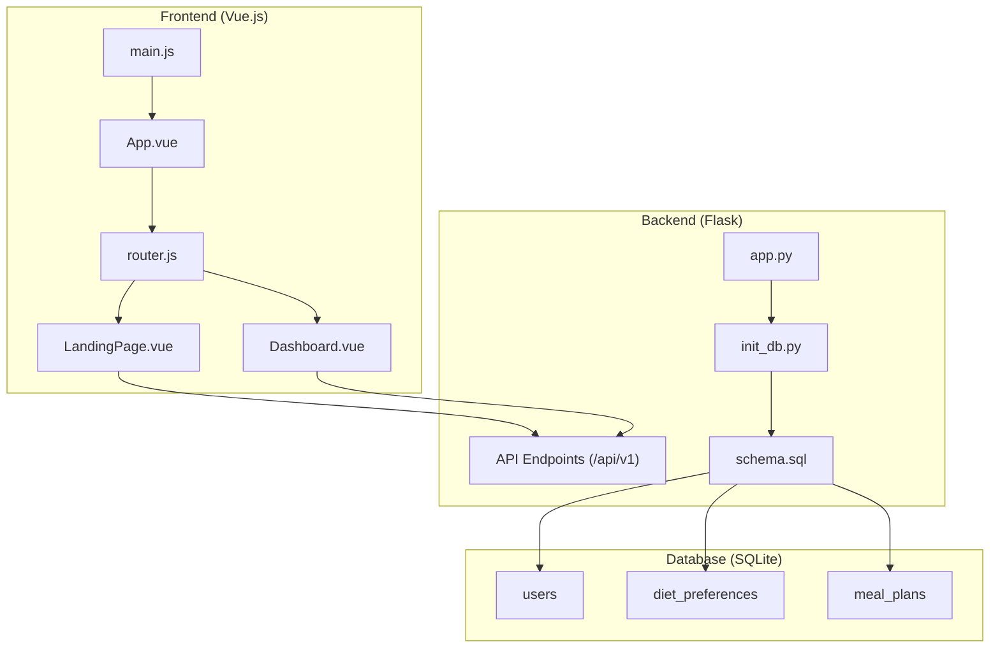
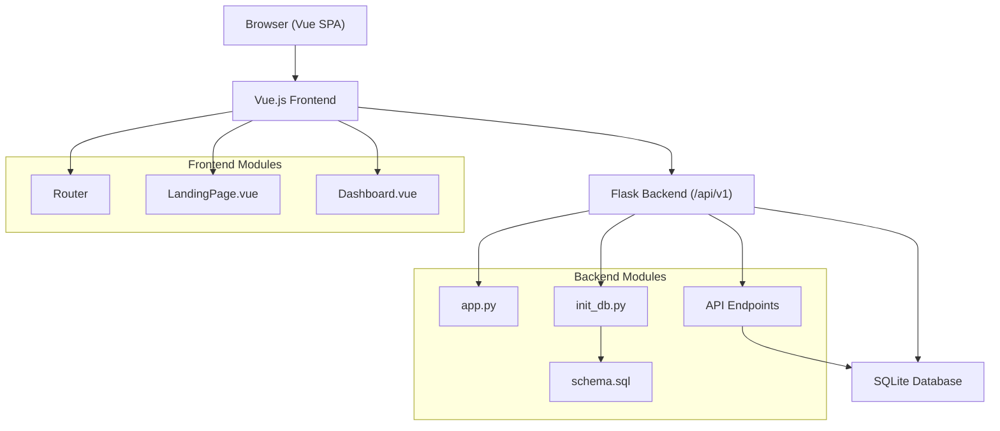
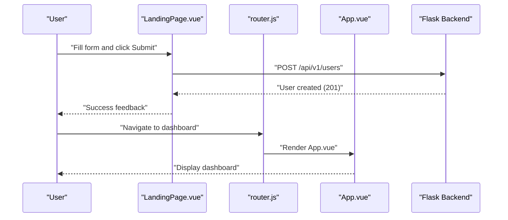
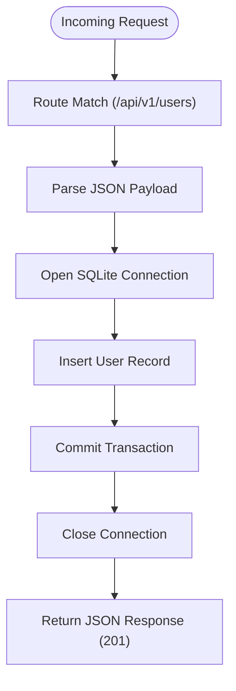
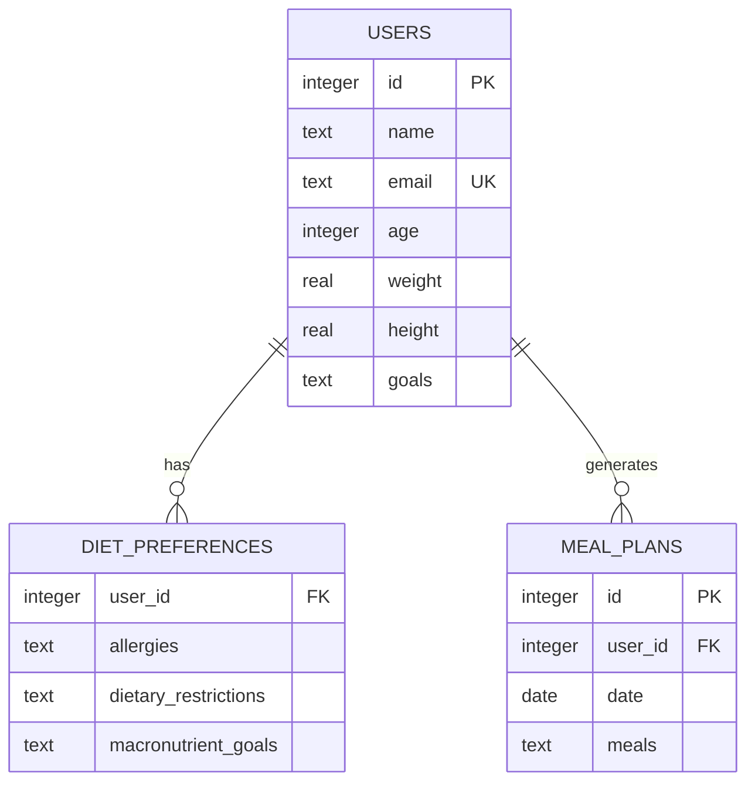
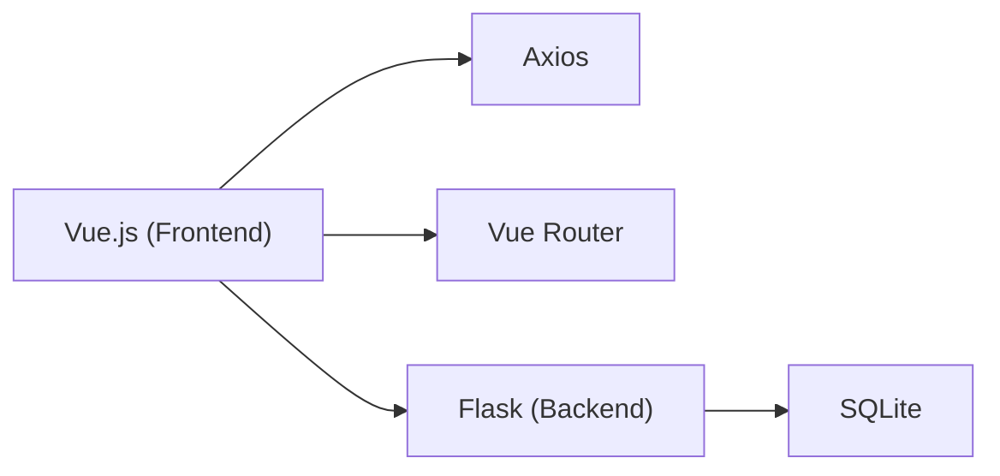

# Project Overview

<cite>
**Referenced Files in This Document**
- [README.md](file://nutricoach/README.md)
- [API.md](file://nutricoach/backend/API.md)
- [app.py](file://nutricoach/backend/app.py)
- [schema.sql](file://nutricoach/backend/schema.sql)
- [init_db.py](file://nutricoach/backend/init_db.py)
- [package.json](file://nutricoach/frontend/package.json)
- [main.js](file://nutricoach/frontend/src/main.js)
- [router.js](file://nutricoach/frontend/src/router.js)
- [App.vue](file://nutricoach/frontend/src/App.vue)
- [LandingPage.vue](file://nutricoach/frontend/components/LandingPage.vue)
- [Dashboard.vue](file://nutricoach/frontend/components/Dashboard.vue)
</cite>

## Table of Contents
1. [Introduction](#introduction)
2. [Project Structure](#project-structure)
3. [Core Components](#core-components)
4. [Architecture Overview](#architecture-overview)
5. [Detailed Component Analysis](#detailed-component-analysis)
6. [Dependency Analysis](#dependency-analysis)
7. [Performance Considerations](#performance-considerations)
8. [Troubleshooting Guide](#troubleshooting-guide)
9. [Conclusion](#conclusion)

## Introduction
NutriCoach AI is a personalized diet plan generator web platform designed to help health and fitness enthusiasts achieve their nutritional goals efficiently. The application streamlines the process of creating customized meal plans by combining user-provided health metrics and goals with intelligent AI-driven suggestions. Its core value proposition lies in simplifying diet planning—reducing the guesswork around food choices, portion sizes, and macro distribution—so users can focus on consistency and progress.

The platform solves several real-world problems:
- Time constraints: Traditional meal planning is labor-intensive and often inconsistent.
- Lack of personalization: Generic diet advice does not account for individual goals, restrictions, or preferences.
- Tracking difficulty: Many users struggle to monitor progress and adjust their plans accordingly.

By offering a streamlined user registration and authentication flow, dietary preference capture, AI-generated meal plans, and progress monitoring, NutriCoach AI empowers users to maintain healthy eating habits with confidence and clarity.

## Project Structure
The project follows a clear separation of concerns with a Vue.js frontend, a Flask backend, an SQLite database, and optional Docker deployment support. The frontend handles user interactions and displays data, while the backend exposes RESTful APIs for user management, dietary preferences, and meal plan generation. The database persists user profiles, preferences, and generated meal plans.

**Diagram sources**
- [main.js:1-6](file://nutricoach/frontend/src/main.js#L1-L6)
- [App.vue:1-11](file://nutricoach/frontend/src/App.vue#L1-L11)
- [router.js:1-14](file://nutricoach/frontend/src/router.js#L1-L14)
- [LandingPage.vue:1-92](file://nutricoach/frontend/components/LandingPage.vue#L1-L92)
- [Dashboard.vue:1-46](file://nutricoach/frontend/components/Dashboard.vue#L1-L46)
- [app.py:1-31](file://nutricoach/backend/app.py#L1-L31)
- [init_db.py:1-47](file://nutricoach/backend/init_db.py#L1-L47)
- [schema.sql:1-25](file://nutricoach/backend/schema.sql#L1-L25)

**Section sources**
- [README.md:1-77](file://nutricoach/README.md#L1-L77)
- [package.json:1-19](file://nutricoach/frontend/package.json#L1-L19)
- [main.js:1-6](file://nutricoach/frontend/src/main.js#L1-L6)
- [router.js:1-14](file://nutricoach/frontend/src/router.js#L1-L14)
- [App.vue:1-11](file://nutricoach/frontend/src/App.vue#L1-L11)
- [LandingPage.vue:1-92](file://nutricoach/frontend/components/LandingPage.vue#L1-L92)
- [Dashboard.vue:1-46](file://nutricoach/frontend/components/Dashboard.vue#L1-L46)
- [app.py:1-31](file://nutricoach/backend/app.py#L1-L31)
- [init_db.py:1-47](file://nutricoach/backend/init_db.py#L1-L47)
- [schema.sql:1-25](file://nutricoach/backend/schema.sql#L1-L25)

## Core Components
- User Registration and Authentication: The platform supports user creation and login flows, enabling secure access to personalized features. The API defines endpoints for user management and authentication.
- Dietary Preferences and Restrictions Tracking: Users can set allergies, dietary restrictions, and macronutrient goals, which inform AI-generated meal plans.
- AI-Generated Meal Plans: The dashboard allows users to generate and review daily meal plans tailored to their goals and preferences.
- Progress Monitoring: The dashboard includes a progress tracker to visualize trends and encourage consistency.
- Mobile-Responsive Design: The frontend implements responsive styles to ensure usability across devices.

Key features are backed by a relational SQLite schema with tables for users, diet preferences, and meal plans.

**Section sources**
- [README.md:5-16](file://nutricoach/README.md#L5-L16)
- [API.md:6-24](file://nutricoach/backend/API.md#L6-L24)
- [schema.sql:1-25](file://nutricoach/backend/schema.sql#L1-L25)
- [Dashboard.vue:1-46](file://nutricoach/frontend/components/Dashboard.vue#L1-L46)
- [LandingPage.vue:1-92](file://nutricoach/frontend/components/LandingPage.vue#L1-L92)

## Architecture Overview
NutriCoach AI follows a classic client-server architecture:
- The Vue.js frontend serves as the user interface, handling navigation, forms, and data presentation.
- The Flask backend exposes RESTful endpoints under a base path, managing requests, interacting with the database, and returning structured responses.
- The SQLite database stores user profiles, preferences, and generated meal plans.

**Diagram sources**
- [router.js:1-14](file://nutricoach/frontend/src/router.js#L1-L14)
- [LandingPage.vue:1-92](file://nutricoach/frontend/components/LandingPage.vue#L1-L92)
- [Dashboard.vue:1-46](file://nutricoach/frontend/components/Dashboard.vue#L1-L46)
- [app.py:1-31](file://nutricoach/backend/app.py#L1-L31)
- [init_db.py:1-47](file://nutricoach/backend/init_db.py#L1-L47)
- [schema.sql:1-25](file://nutricoach/backend/schema.sql#L1-L25)

## Detailed Component Analysis

### Frontend: Vue.js Application
The frontend is a single-page application bootstrapped with Vue 3 and Vue Router. It initializes the router and mounts the root component, which renders route views. The Landing Page captures user goals and submits them to the backend, while the Dashboard presents meal plans and progress tracking.

**Diagram sources**
- [LandingPage.vue:38-54](file://nutricoach/frontend/components/LandingPage.vue#L38-L54)
- [router.js:1-14](file://nutricoach/frontend/src/router.js#L1-L14)
- [App.vue:1-11](file://nutricoach/frontend/src/App.vue#L1-L11)
- [app.py:16-26](file://nutricoach/backend/app.py#L16-L26)

**Section sources**
- [package.json:10-18](file://nutricoach/frontend/package.json#L10-L18)
- [main.js:1-6](file://nutricoach/frontend/src/main.js#L1-L6)
- [router.js:1-14](file://nutricoach/frontend/src/router.js#L1-L14)
- [App.vue:1-11](file://nutricoach/frontend/src/App.vue#L1-L11)
- [LandingPage.vue:1-92](file://nutricoach/frontend/components/LandingPage.vue#L1-L92)

### Backend: Flask API and Data Access
The backend initializes a Flask application with CORS enabled and exposes endpoints under a base path. It connects to an SQLite database located alongside the backend module and provides a reusable connection factory. The current implementation includes a user creation endpoint, with additional endpoints defined in the API documentation.

**Diagram sources**
- [app.py:16-26](file://nutricoach/backend/app.py#L16-L26)

**Section sources**
- [app.py:1-31](file://nutricoach/backend/app.py#L1-L31)
- [API.md:3-24](file://nutricoach/backend/API.md#L3-L24)

### Database: Schema and Initialization
The database schema defines three core tables:
- users: Stores user profile data.
- diet_preferences: Captures allergies, restrictions, and macronutrient goals linked to users.
- meal_plans: Holds generated meal plans per user and date.

Initialization scripts create these tables if they do not exist, ensuring a clean setup for development and testing.

**Diagram sources**
- [schema.sql:1-25](file://nutricoach/backend/schema.sql#L1-L25)
- [init_db.py:9-42](file://nutricoach/backend/init_db.py#L9-L42)

**Section sources**
- [schema.sql:1-25](file://nutricoach/backend/schema.sql#L1-L25)
- [init_db.py:1-47](file://nutricoach/backend/init_db.py#L1-L47)

### API Endpoints Overview
The backend API organizes endpoints under a base path and covers:
- User Management: Create, retrieve, update, and delete users.
- Diet Preferences: Set or update user-specific preferences.
- Meal Plans: Generate and retrieve personalized meal plans, including history.
- Authentication: Register and login endpoints.

These endpoints define the contract between the frontend and backend, enabling seamless user interactions and data persistence.

**Section sources**
- [API.md:3-59](file://nutricoach/backend/API.md#L3-L59)

## Dependency Analysis
The application’s dependencies are straightforward and purpose-built:
- Frontend depends on Vue 3, Vue Router, and Axios for HTTP requests.
- Backend depends on Flask and SQLite for lightweight data persistence.
- The database schema enforces referential integrity between users, preferences, and meal plans.

**Diagram sources**
- [package.json:10-18](file://nutricoach/frontend/package.json#L10-L18)
- [app.py:1-7](file://nutricoach/backend/app.py#L1-L7)

**Section sources**
- [package.json:1-19](file://nutricoach/frontend/package.json#L1-L19)
- [app.py:1-31](file://nutricoach/backend/app.py#L1-L31)

## Performance Considerations
- Lightweight Stack: Vue.js and Flask offer fast startup times and minimal overhead, suitable for small to medium-scale usage.
- SQLite Efficiency: Local SQLite storage reduces external dependencies and simplifies deployment, but consider scaling strategies for concurrent writes and larger datasets.
- Network Calls: Minimize redundant API calls by caching user data and meal plans client-side where appropriate.
- Build Optimization: Use Vite’s production build for optimized assets and reduced bundle size.

## Troubleshooting Guide
Common setup and runtime issues:
- Port Conflicts: The backend runs on a specific port; ensure it is free or adjust the configuration accordingly.
- Database Path: Verify the database path resolution and permissions for the backend to connect successfully.
- CORS Errors: Confirm CORS is enabled for local development to allow frontend-backend communication.
- Missing Dependencies: Install frontend and backend dependencies as outlined in the project documentation.

**Section sources**
- [app.py:6-14](file://nutricoach/backend/app.py#L6-L14)
- [README.md:25-77](file://nutricoach/README.md#L25-L77)

## Conclusion
NutriCoach AI delivers a focused, efficient solution for personalized nutrition by combining a modern frontend with a robust backend and a simple yet effective database model. Its clear architecture, well-defined API, and responsive design position it as a practical tool for health and fitness enthusiasts seeking consistency and clarity in their diet plans. With room for expansion—such as implementing authentication endpoints and enhancing the AI meal plan generation—the platform provides a solid foundation for future growth.