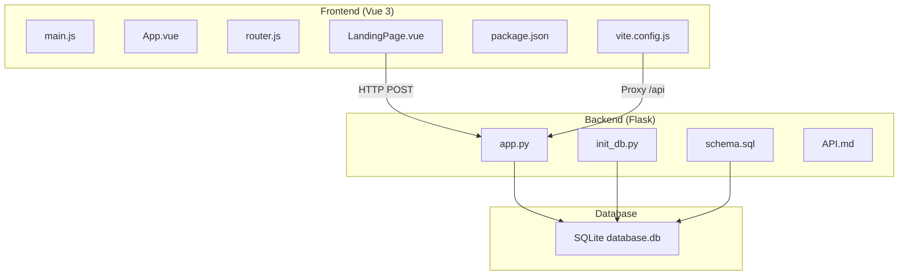
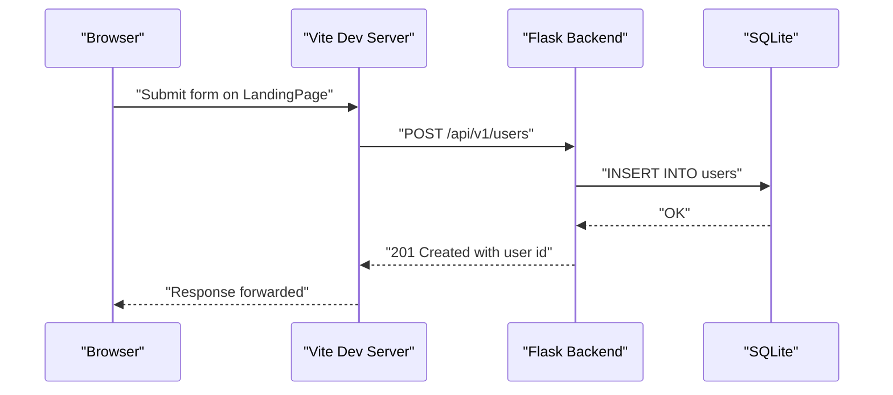
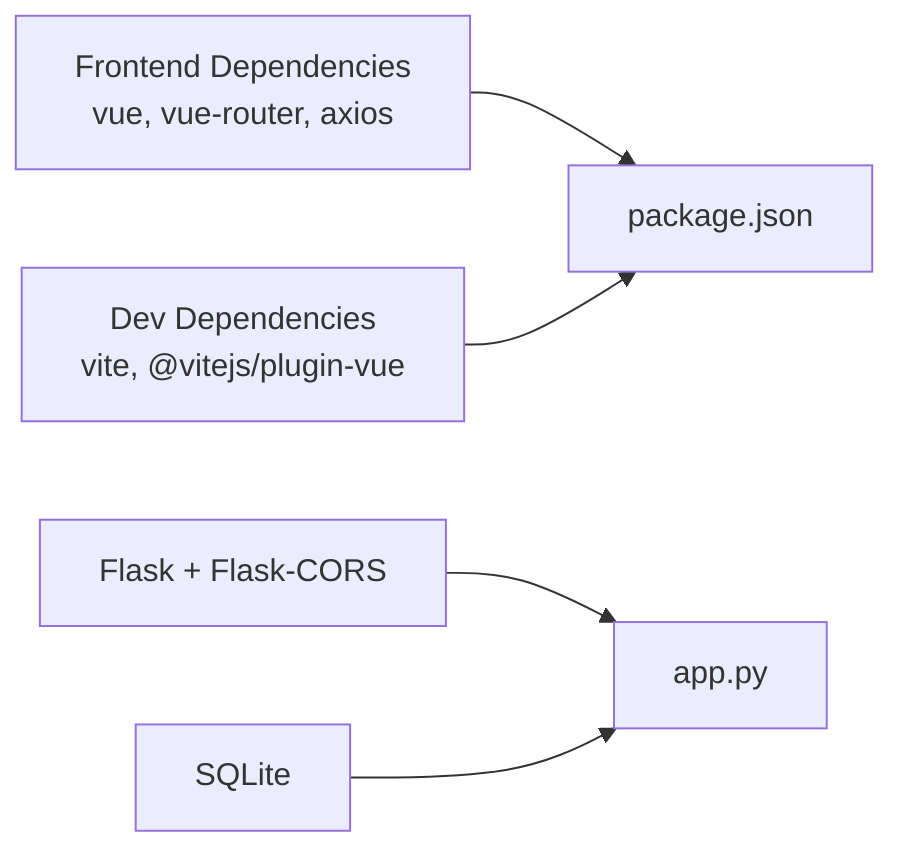

# Troubleshooting and FAQ

<cite>
**Referenced Files in This Document**
- [README.md](file://nutricoach/README.md)
- [API.md](file://nutricoach/backend/API.md)
- [app.py](file://nutricoach/backend/app.py)
- [vite.config.js](file://nutricoach/frontend/vite.config.js)
- [package.json](file://nutricoach/frontend/package.json)
- [main.js](file://nutricoach/frontend/src/main.js)
- [router.js](file://nutricoach/frontend/src/router.js)
- [App.vue](file://nutricoach/frontend/src/App.vue)
- [LandingPage.vue](file://nutricoach/frontend/components/LandingPage.vue)
- [init_db.py](file://nutricoach/backend/init_db.py)
- [schema.sql](file://nutricoach/backend/schema.sql)
</cite>

## Table of Contents
1. [Introduction](#introduction)
2. [Project Structure](#project-structure)
3. [Core Components](#core-components)
4. [Architecture Overview](#architecture-overview)
5. [Detailed Component Analysis](#detailed-component-analysis)
6. [Dependency Analysis](#dependency-analysis)
7. [Performance Considerations](#performance-considerations)
8. [Troubleshooting Guide](#troubleshooting-guide)
9. [FAQ](#faq)
10. [Conclusion](#conclusion)

## Introduction
This document provides a comprehensive troubleshooting and FAQ guide for NutriCoach AI. It covers common development environment issues, frontend-specific problems (Vite, CORS, builds), backend issues (Flask startup, database connectivity, API failures), debugging techniques for API integration and rendering issues, performance optimization strategies, cross-platform compatibility, and frequently asked questions with step-by-step solutions.

## Project Structure
NutriCoach AI follows a clear separation of concerns:
- Frontend: Vue 3 application using Vite for development and build.
- Backend: Python Flask server exposing REST endpoints under /api/v1.
- Database: SQLite managed via SQLAlchemy and initialized by scripts.

**Diagram sources**
- [main.js:1-6](file://nutricoach/frontend/src/main.js#L1-L6)
- [App.vue:1-11](file://nutricoach/frontend/src/App.vue#L1-L11)
- [router.js:1-14](file://nutricoach/frontend/src/router.js#L1-L14)
- [LandingPage.vue:1-92](file://nutricoach/frontend/components/LandingPage.vue#L1-L92)
- [package.json:1-19](file://nutricoach/frontend/package.json#L1-L19)
- [vite.config.js:1-17](file://nutricoach/frontend/vite.config.js#L1-L17)
- [app.py:1-31](file://nutricoach/backend/app.py#L1-L31)
- [init_db.py:1-47](file://nutricoach/backend/init_db.py#L1-L47)
- [schema.sql:1-25](file://nutricoach/backend/schema.sql#L1-L25)

**Section sources**
- [README.md:1-77](file://nutricoach/README.md#L1-L77)
- [package.json:1-19](file://nutricoach/frontend/package.json#L1-L19)
- [vite.config.js:1-17](file://nutricoach/frontend/vite.config.js#L1-L17)
- [app.py:1-31](file://nutricoach/backend/app.py#L1-L31)
- [init_db.py:1-47](file://nutricoach/backend/init_db.py#L1-L47)
- [schema.sql:1-25](file://nutricoach/backend/schema.sql#L1-L25)

## Core Components
- Frontend entrypoint initializes Vue app and router.
- Vite dev server proxies API requests to the backend.
- Backend exposes /api/v1 endpoints and enables CORS.
- Database initialization creates users, diet_preferences, and meal_plans tables.

Key implementation references:
- Frontend entrypoint and router: [main.js:1-6](file://nutricoach/frontend/src/main.js#L1-L6), [router.js:1-14](file://nutricoach/frontend/src/router.js#L1-L14)
- Vite configuration and proxy: [vite.config.js:1-17](file://nutricoach/frontend/vite.config.js#L1-L17)
- Flask app and CORS: [app.py:1-31](file://nutricoach/backend/app.py#L1-L31)
- Database initialization: [init_db.py:1-47](file://nutricoach/backend/init_db.py#L1-L47), [schema.sql:1-25](file://nutricoach/backend/schema.sql#L1-L25)

**Section sources**
- [main.js:1-6](file://nutricoach/frontend/src/main.js#L1-L6)
- [router.js:1-14](file://nutricoach/frontend/src/router.js#L1-L14)
- [vite.config.js:1-17](file://nutricoach/frontend/vite.config.js#L1-L17)
- [app.py:1-31](file://nutricoach/backend/app.py#L1-L31)
- [init_db.py:1-47](file://nutricoach/backend/init_db.py#L1-L47)
- [schema.sql:1-25](file://nutricoach/backend/schema.sql#L1-L25)

## Architecture Overview
The frontend communicates with the backend via HTTP requests. Vite’s proxy forwards /api requests to the Flask server. The backend persists data in SQLite.

**Diagram sources**
- [LandingPage.vue:1-92](file://nutricoach/frontend/components/LandingPage.vue#L1-L92)
- [vite.config.js:1-17](file://nutricoach/frontend/vite.config.js#L1-L17)
- [app.py:1-31](file://nutricoach/backend/app.py#L1-L31)

## Detailed Component Analysis

### Frontend: Vite Dev Server and Proxy
Common issues:
- Port conflicts on 5173
- Proxy misconfiguration leading to CORS or 404 errors
- Missing dependencies causing build failures

Recommended checks:
- Confirm Vite runs on port 5173 and proxy targets http://localhost:5000.
- Verify axios usage matches the configured base path.
- Ensure dependencies are installed before running dev/build.

**Section sources**
- [vite.config.js:1-17](file://nutricoach/frontend/vite.config.js#L1-L17)
- [package.json:1-19](file://nutricoach/frontend/package.json#L1-L19)
- [LandingPage.vue:1-92](file://nutricoach/frontend/components/LandingPage.vue#L1-L92)

### Frontend: Routing and Rendering
Common issues:
- Route not found or blank screen
- Router history mode requiring proper base configuration
- Missing route components

Checks:
- Confirm routes include the landing page and any additional pages.
- Ensure router is registered in the Vue app.

**Section sources**
- [router.js:1-14](file://nutricoach/frontend/src/router.js#L1-L14)
- [main.js:1-6](file://nutricoach/frontend/src/main.js#L1-L6)
- [App.vue:1-11](file://nutricoach/frontend/src/App.vue#L1-L11)

### Backend: Flask Server and CORS
Common issues:
- Port already in use (default 5000)
- Missing CORS headers causing browser errors
- Database path issues preventing connection

Checks:
- Run with host 0.0.0.0 and port 5000 as configured.
- Ensure CORS is enabled for development.
- Verify database path resolves correctly.

**Section sources**
- [app.py:1-31](file://nutricoach/backend/app.py#L1-L31)

### Backend: Database Initialization and Schema
Common issues:
- Database not initialized
- Missing tables or foreign keys
- Permission errors writing database file

Checks:
- Run the initialization script to create tables.
- Confirm schema matches expected models.
- Ensure write permissions in backend directory.

**Section sources**
- [init_db.py:1-47](file://nutricoach/backend/init_db.py#L1-L47)
- [schema.sql:1-25](file://nutricoach/backend/schema.sql#L1-L25)

### API Endpoints and Data Models
Common issues:
- Incorrect base URL or endpoint path
- Missing required fields in request payload
- Unexpected response formats

Checks:
- Use base URL /api/v1 as documented.
- Match data model fields for each endpoint.
- Validate payloads before sending.

**Section sources**
- [API.md:1-59](file://nutricoach/backend/API.md#L1-L59)

## Dependency Analysis
Frontend dependencies include Vue, Vue Router, and Axios. Vite and the Vue plugin are dev dependencies. Backend uses Flask and Flask-CORS with SQLite.

**Diagram sources**
- [package.json:1-19](file://nutricoach/frontend/package.json#L1-L19)
- [app.py:1-31](file://nutricoach/backend/app.py#L1-L31)

**Section sources**
- [package.json:1-19](file://nutricoach/frontend/package.json#L1-L19)
- [app.py:1-31](file://nutricoach/backend/app.py#L1-L31)

## Performance Considerations
- Minimize DOM updates by binding form inputs efficiently.
- Debounce API calls during rapid input changes.
- Use browser devtools to profile network requests and rendering.
- Keep database operations minimal in hot paths; batch writes when possible.
- Monitor SQLite file growth and vacuum periodically if needed.

[No sources needed since this section provides general guidance]

## Troubleshooting Guide

### Development Environment Setup
- Node.js/npm issues
  - Symptom: npm install fails or scripts not found.
  - Resolution: Ensure Node.js v18+ is installed. Clear cache if necessary and retry installation.
  - References: [README.md:20-23](file://nutricoach/README.md#L20-L23), [package.json:1-19](file://nutricoach/frontend/package.json#L1-L19)

- Python virtual environment
  - Symptom: Module not found or wrong interpreter.
  - Resolution: Create and activate a Python 3.11+ virtual environment. Install requirements.
  - References: [README.md:35-41](file://nutricoach/README.md#L35-L41), [README.md:57-67](file://nutricoach/README.md#L57-L67)

- Dependency conflicts
  - Symptom: Conflicting versions or missing packages.
  - Resolution: Use a clean virtual environment, install pinned dependencies, and rebuild frontend assets.
  - References: [package.json:1-19](file://nutricoach/frontend/package.json#L1-L19), [README.md:35-41](file://nutricoach/README.md#L35-L41)

### Frontend Issues
- Vite dev server errors
  - Symptom: Port in use or server fails to start.
  - Resolution: Change port in Vite config or kill the process using 5173. Restart dev server.
  - References: [vite.config.js:1-17](file://nutricoach/frontend/vite.config.js#L1-L17)

- CORS problems
  - Symptom: Preflight or blocked request errors.
  - Resolution: Confirm Flask CORS is enabled and Vite proxy targets the backend host/port.
  - References: [app.py:1-31](file://nutricoach/backend/app.py#L1-L31), [vite.config.js:1-17](file://nutricoach/frontend/vite.config.js#L1-L17)

- Build failures
  - Symptom: Build script errors or missing assets.
  - Resolution: Install dependencies, fix lint or type errors, and rerun build.
  - References: [package.json:1-19](file://nutricoach/frontend/package.json#L1-L19)

### Backend Issues
- Flask server startup problems
  - Symptom: Port already in use or debug server not reachable.
  - Resolution: Stop existing process on 5000, confirm host/port config, and restart.
  - References: [app.py:1-31](file://nutricoach/backend/app.py#L1-L31)

- Database connection errors
  - Symptom: OperationalError or inability to open database.
  - Resolution: Initialize database using the provided script and verify file permissions.
  - References: [init_db.py:1-47](file://nutricoach/backend/init_db.py#L1-L47), [app.py:1-31](file://nutricoach/backend/app.py#L1-L31)

- API endpoint failures
  - Symptom: 404 or 500 errors on /api/v1 endpoints.
  - Resolution: Verify base URL, method, and payload match API documentation; check server logs.
  - References: [API.md:1-59](file://nutricoach/backend/API.md#L1-L59), [app.py:1-31](file://nutricoach/backend/app.py#L1-L31)

### Debugging Techniques
- API integration problems
  - Use browser devtools Network tab to inspect requests/responses.
  - Log request payloads and status codes in frontend components.
  - Add backend logging around route handlers and database operations.

- Component rendering issues
  - Inspect Vue DevTools to verify component tree and props.
  - Check router history mode and base configuration.
  - Validate template bindings and event handlers.

- Data flow problems
  - Trace data from form inputs to API calls and back to UI.
  - Verify axios interceptors and error handling.
  - Confirm Vuex/Pinia stores (if added) are updating state correctly.

**Section sources**
- [vite.config.js:1-17](file://nutricoach/frontend/vite.config.js#L1-L17)
- [app.py:1-31](file://nutricoach/backend/app.py#L1-L31)
- [API.md:1-59](file://nutricoach/backend/API.md#L1-L59)
- [LandingPage.vue:1-92](file://nutricoach/frontend/components/LandingPage.vue#L1-L92)

### Cross-Platform Compatibility
- Windows activation command differs from Unix.
- Path separators differ; ensure paths use forward slashes or os.path.join.
- File permissions: ensure backend directory is writable for SQLite.

References:
- [README.md:35-41](file://nutricoach/README.md#L35-L41)
- [init_db.py:1-47](file://nutricoach/backend/init_db.py#L1-L47)

### Network Connectivity Challenges
- Proxy misconfiguration prevents API calls.
- Firewall or antivirus blocking localhost ports.
- Incorrect base URLs in frontend code.

Resolution steps:
- Confirm Vite proxy target matches backend host/port.
- Test backend endpoints directly with curl or Postman.
- Adjust firewall settings and retry.

**Section sources**
- [vite.config.js:1-17](file://nutricoach/frontend/vite.config.js#L1-L17)
- [app.py:1-31](file://nutricoach/backend/app.py#L1-L31)

## FAQ
- How do I start the frontend?
  - Navigate to the frontend directory, install dependencies, and run the dev script.
  - References: [README.md:27-32](file://nutricoach/README.md#L27-L32), [package.json:1-19](file://nutricoach/frontend/package.json#L1-L19)

- How do I start the backend?
  - Create and activate a virtual environment, install dependencies, initialize the database, and run the Flask app.
  - References: [README.md:35-47](file://nutricoach/README.md#L35-L47), [app.py:1-31](file://nutricoach/backend/app.py#L1-L31), [init_db.py:1-47](file://nutricoach/backend/init_db.py#L1-L47)

- Why does my browser show CORS errors?
  - Enable CORS in Flask and ensure Vite proxy targets the backend host/port.
  - References: [app.py:1-31](file://nutricoach/backend/app.py#L1-L31), [vite.config.js:1-17](file://nutricoach/frontend/vite.config.js#L1-L17)

- How do I test API endpoints?
  - Use the documented base URL and endpoints; validate payloads against data models.
  - References: [API.md:1-59](file://nutricoach/backend/API.md#L1-L59)

- How do I add new pages?
  - Define routes in the router configuration and register them in the Vue app.
  - References: [router.js:1-14](file://nutricoach/frontend/src/router.js#L1-L14), [main.js:1-6](file://nutricoach/frontend/src/main.js#L1-L6)

- How do I extend the backend?
  - Add new routes in the Flask app and ensure database schema supports new entities.
  - References: [app.py:1-31](file://nutricoach/backend/app.py#L1-L31), [schema.sql:1-25](file://nutricoach/backend/schema.sql#L1-L25)

- How do I handle form submissions?
  - Bind form fields to component data and send POST requests to the backend using axios.
  - References: [LandingPage.vue:1-92](file://nutricoach/frontend/components/LandingPage.vue#L1-L92)

- How do I resolve “port already in use”?
  - Change the port in Vite config or Flask app, or terminate the conflicting process.
  - References: [vite.config.js:1-17](file://nutricoach/frontend/vite.config.js#L1-L17), [app.py:1-31](file://nutricoach/backend/app.py#L1-L31)

- How do I initialize the database?
  - Run the initialization script to create tables and seed schema.
  - References: [init_db.py:1-47](file://nutricoach/backend/init_db.py#L1-L47), [schema.sql:1-25](file://nutricoach/backend/schema.sql#L1-L25)

- How do I deploy the application?
  - Follow Docker deployment instructions for production.
  - References: [README.md:16-16](file://nutricoach/README.md#L16-L16), [README.md:77-77](file://nutricoach/README.md#L77-L77)

**Section sources**
- [README.md:1-77](file://nutricoach/README.md#L1-L77)
- [API.md:1-59](file://nutricoach/backend/API.md#L1-L59)
- [package.json:1-19](file://nutricoach/frontend/package.json#L1-L19)
- [vite.config.js:1-17](file://nutricoach/frontend/vite.config.js#L1-L17)
- [app.py:1-31](file://nutricoach/backend/app.py#L1-L31)
- [init_db.py:1-47](file://nutricoach/backend/init_db.py#L1-L47)
- [schema.sql:1-25](file://nutricoach/backend/schema.sql#L1-L25)
- [router.js:1-14](file://nutricoach/frontend/src/router.js#L1-L14)
- [main.js:1-6](file://nutricoach/frontend/src/main.js#L1-L6)
- [LandingPage.vue:1-92](file://nutricoach/frontend/components/LandingPage.vue#L1-L92)

## Conclusion
By following the troubleshooting steps and FAQs above, most development and runtime issues in NutriCoach AI can be resolved quickly. Ensure environments are correctly set up, dependencies are installed, and the proxy and CORS configurations are aligned between frontend and backend. Use the debugging techniques to isolate API and rendering problems, and apply performance best practices for smoother operation.

[No sources needed since this section summarizes without analyzing specific files]